# Part 1: Introduction to Event-Driven Architecture - Building Your First Kafka Example

> **💻 Language Note:** All code examples in this post are written in **C#**. Python implementations will be added in the future following the same patterns and concepts demonstrated here.

## The Problem with Traditional Request-Response

Picture this: You're building an online store. When a customer places an order, your system needs to:
- Charge their credit card
- Update inventory
- Send a confirmation email
- Notify the warehouse
- Update analytics
- Award loyalty points

In a traditional system, your order service makes direct API calls to each of these services, one by one. If the email service is slow, your customer waits. If the warehouse system is down, the entire order might fail. Your order service needs to know about every single downstream service and how to call them.

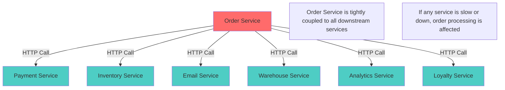

This is the synchronous, tightly-coupled approach. And it doesn't scale well.

### The Pain Points

**1. Tight Coupling** - Your order service must know about every downstream service. Adding new functionality requires modifying existing code.

**2. Cascading Failures** - If the email service times out, should the entire order fail? What about the payment that already went through?

**3. Scaling Challenges** - Black Friday overwhelms your email service, but you can't scale it independently. You're forced to scale the entire order service.

## Enter Event-Driven Architecture

Event-Driven Architecture flips this model. Instead of the order service telling everyone what to do, it simply announces: "Hey, an order was placed!" 

Each service that cares about orders listens for this announcement and takes its own action, independently. The email service sends an email. The warehouse service prepares shipping. The analytics service records the sale.

The order service doesn't know or care who's listening. It just publishes the fact that something happened.

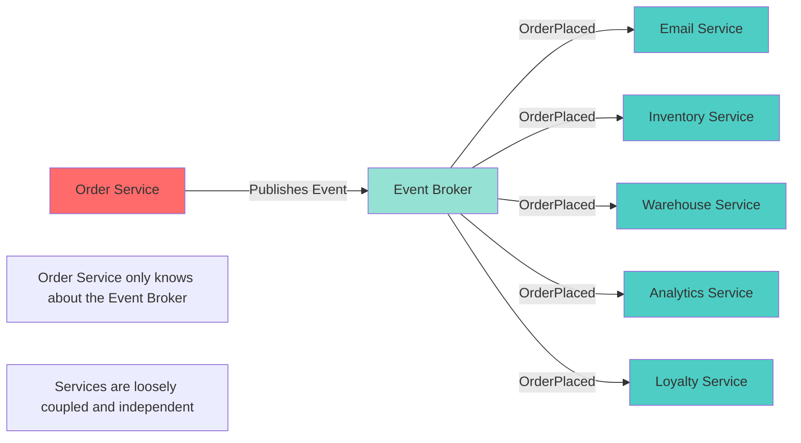

## What Is an Event?

An event is a record of something that happened in your system. Think of it as a notification that something meaningful occurred - a fact that other parts of your system might care about.

### Core Characteristics

**Immutable** - Once something happened, it happened. You can't change history. Events are never modified after they're created.

**Past tense** - Events describe what already occurred: "OrderPlaced", "PaymentProcessed", "UserRegistered". Never "PlaceOrder" or "ProcessPayment".

**Self-contained** - Events carry all the information needed to understand what happened, so consumers don't need to make additional calls to get context.

> 💡 **Deeper Dive:** For a more philosophical exploration of events as the foundation of system design, see [A Paradigm Shift: Events Before Models](/blog/part-06-advanced-patterns#a-paradigm-shift-events-before-models) in Part 6, where we discuss events as the primary source of truth and models as derived constructs.

### Events vs. Messages vs. Commands

It's important to distinguish between different types of messages in distributed systems:

<table style="width: 100%; border-collapse: separate; border-spacing: 0; margin: 24px 0; border-radius: 8px; overflow: hidden; box-shadow: 0 4px 6px rgba(0, 0, 0, 0.1), 0 2px 4px rgba(0, 0, 0, 0.06); background:rgb(184, 125, 125);">
<thead>
<tr style="background-color:rgb(183, 223, 8);">
<th style="padding: 16px 20px; text-align: left; font-weight: 700; font-size: 14px; text-transform: uppercase; letter-spacing: 0.5px; color: #2d2d2d; border: none; background-color:rgb(8, 198, 223); border-right: 1px solid rgba(45, 45, 45, 0.2); border-bottom: 2px solid rgba(45, 45, 45, 0.3);">Type</th>
<th style="padding: 16px 20px; text-align: left; font-weight: 700; font-size: 14px; text-transform: uppercase; letter-spacing: 0.5px; color: #2d2d2d; border: none; background-color:rgb(8, 198, 223); border-right: 1px solid rgba(45, 45, 45, 0.2); border-bottom: 2px solid rgba(45, 45, 45, 0.3);">Purpose</th>
<th style="padding: 16px 20px; text-align: left; font-weight: 700; font-size: 14px; text-transform: uppercase; letter-spacing: 0.5px; color: #2d2d2d; border: none; background-color:rgb(8, 198, 223); border-right: 1px solid rgba(45, 45, 45, 0.2); border-bottom: 2px solid rgba(45, 45, 45, 0.3);">Naming</th>
<th style="padding: 16px 20px; text-align: left; font-weight: 700; font-size: 14px; text-transform: uppercase; letter-spacing: 0.5px; color: #2d2d2d; border: none; background-color:rgb(8, 198, 223); border-right: 1px solid rgba(45, 45, 45, 0.2); border-bottom: 2px solid rgba(45, 45, 45, 0.3);">Example</th>
<th style="padding: 16px 20px; text-align: left; font-weight: 700; font-size: 14px; text-transform: uppercase; letter-spacing: 0.5px; color: #2d2d2d; border: none; background-color:rgb(8, 198, 223); border-bottom: 2px solid rgba(45, 45, 45, 0.3);">Direction</th>
</tr>
</thead>
<tbody>
<tr style="background-color: #1a1a2e; transition: background-color 0.2s ease;">
<td style="padding: 16px 20px; border-bottom: 1px solid rgba(255, 255, 255, 0.1); border-right: 1px solid rgba(255, 255, 255, 0.1); color: #ffffff;"><strong style="color: #f093fb;">Event</strong></td>
<td style="padding: 16px 20px; border-bottom: 1px solid rgba(255, 255, 255, 0.1); border-right: 1px solid rgba(255, 255, 255, 0.1); color: #e0e0e0;">Notify about past occurrence</td>
<td style="padding: 16px 20px; border-bottom: 1px solid rgba(255, 255, 255, 0.1); border-right: 1px solid rgba(255, 255, 255, 0.1); color: #e0e0e0;">Past tense</td>
<td style="padding: 16px 20px; border-bottom: 1px solid rgba(255, 255, 255, 0.1); border-right: 1px solid rgba(255, 255, 255, 0.1); color:rgb(178, 190, 8); font-family: 'Monaco', 'Menlo', 'Courier New', monospace; font-size: 13px;">OrderPlaced</td>
<td style="padding: 16px 20px; border-bottom: 1px solid rgba(255, 255, 255, 0.1); color: #e0e0e0;">Broadcast (1-to-many)</td>
</tr>
<tr style="background-color: #16213e; transition: background-color 0.2s ease;">
<td style="padding: 16px 20px; border-bottom: 1px solid rgba(255, 255, 255, 0.1); border-right: 1px solid rgba(255, 255, 255, 0.1); color: #ffffff;"><strong style="color: #f093fb;">Command</strong></td>
<td style="padding: 16px 20px; border-bottom: 1px solid rgba(255, 255, 255, 0.1); border-right: 1px solid rgba(255, 255, 255, 0.1); color: #e0e0e0;">Request an action</td>
<td style="padding: 16px 20px; border-bottom: 1px solid rgba(255, 255, 255, 0.1); border-right: 1px solid rgba(255, 255, 255, 0.1); color: #e0e0e0;">Imperative</td>
<td style="padding: 16px 20px; border-bottom: 1px solid rgba(255, 255, 255, 0.1); border-right: 1px solid rgba(255, 255, 255, 0.1); color:rgb(178, 190, 8); font-family: 'Monaco', 'Menlo', 'Courier New', monospace; font-size: 13px;">PlaceOrder</td>
<td style="padding: 16px 20px; border-bottom: 1px solid rgba(255, 255, 255, 0.1); color: #e0e0e0;">Direct (1-to-1)</td>
</tr>
<tr style="background-color: #1a1a2e; transition: background-color 0.2s ease;">
<td style="padding: 16px 20px; border-right: 1px solid rgba(255, 255, 255, 0.1); color: #ffffff;"><strong style="color: #f093fb;">Message</strong></td>
<td style="padding: 16px 20px; border-right: 1px solid rgba(255, 255, 255, 0.1); color: #e0e0e0;">Generic data transfer</td>
<td style="padding: 16px 20px; border-right: 1px solid rgba(255, 255, 255, 0.1); color: #e0e0e0;">Varies</td>
<td style="padding: 16px 20px; border-right: 1px solid rgba(255, 255, 255, 0.1); color:rgb(178, 190, 8); font-family: 'Monaco', 'Menlo', 'Courier New', monospace; font-size: 13px;">OrderData</td>
<td style="padding: 16px 20px; color: #e0e0e0;">Either</td>
</tr>
</tbody>
</table>

**Events** announce facts - "This happened." They're broadcast to anyone who cares. The producer doesn't know who's listening.

**Commands** request actions - "Do this." They're directed to a specific service. The sender knows the receiver.

In EDA, we primarily use events because they enable loose coupling. Services react to facts rather than being told what to do.

### Event Naming Conventions

Good event names are:
- **Domain-specific**: `OrderPlaced` not `DataCreated`
- **Past tense**: `PaymentProcessed` not `ProcessPayment`
- **Business-focused**: `CustomerRegistered` not `UserRowInserted`
- **Specific**: `OrderCancelled` not `OrderStatusChanged`

### Event Granularity: Finding the Right Level

**Too Fine-Grained** (Anti-pattern):
```json
// BAD: Separate events for each field change
{ "eventType": "OrderAddressStreetChanged" }
{ "eventType": "OrderAddressZipChanged" }
{ "eventType": "OrderAddressCityChanged" }
```

**Too Coarse-Grained** (Anti-pattern):
```json
// BAD: Single event for everything
{ "eventType": "OrderChanged", "changes": [...] }
```

**Just Right**:
```json
// GOOD: One event per meaningful business action
{ "eventType": "OrderShippingAddressUpdated" }
{ "eventType": "OrderPlaced" }
{ "eventType": "OrderCancelled" }
```

**Rule of thumb**: One event = one meaningful business fact that others might care about.

### Anatomy of a Well-Designed Event

```json
{
  "eventId": "evt_7a8b9c0d",
  "eventType": "OrderPlaced",
  "eventVersion": "1.0",
  "timestamp": "2025-11-01T10:30:00Z",
  "source": "order-service",
  "correlationId": "corr_12345",
  "data": {
    "orderId": "ORD-789",
    "customerId": "CUST-456",
    "customerEmail": "customer@example.com",
    "customerName": "Jane Smith",
    "totalAmount": 99.99,
    "currency": "USD",
    "items": [
      {
        "productId": "PROD-001",
        "productName": "Wireless Mouse",
        "quantity": 2,
        "unitPrice": 49.99,
        "totalPrice": 99.98
      }
    ],
    "shippingAddress": {
      "street": "123 Main St",
      "city": "Boston",
      "state": "MA",
      "zip": "02101",
      "country": "USA"
    },
    "paymentMethod": "credit_card",
    "paymentLast4": "4242"
  }
}
```

**Key Components Explained:**

1. **eventId** - Unique identifier for deduplication. Consumers use this to detect and skip duplicate messages.

2. **eventType** - What happened (in past tense). This is how consumers filter events they care about.

3. **eventVersion** - For schema evolution. When you need to change the event structure, increment this so consumers can handle multiple versions gracefully.

4. **timestamp** - When it happened (ISO 8601 format, UTC). Critical for event ordering and time-based processing.

5. **source** - Which service produced this event. Useful for debugging and understanding event flow.

6. **correlationId** - For distributed tracing. Links related events across services so you can trace a business transaction end-to-end.

7. **data** - The payload with all relevant information. Should be self-contained - consumers shouldn't need to call other services to understand this event.

### Fat Events vs. Thin Events

**Thin Events** (Anti-pattern for most cases):
```json
{
  "eventType": "OrderPlaced",
  "data": {
    "orderId": "ORD-789"
  }
}
// Consumers must call Order API to get details
```

**Fat Events** (Recommended):
```json
{
  "eventType": "OrderPlaced",
  "data": {
    "orderId": "ORD-789",
    "customerId": "CUST-456",
    "customerEmail": "customer@example.com",
    "items": [...],
    "totalAmount": 99.99
  }
}
// Consumers have everything they need
```

**Why fat events?** They reduce coupling. Consumers can react without calling back to the producer. The trade-off is larger message size, but the decoupling benefit usually outweighs this cost.

**Exception**: Use thin events when the data is very large (>1MB) or changes frequently. In these cases, include just enough information for consumers to decide if they care, then let them fetch details if needed.

### Event Ownership and Schema Management

**Who owns an event?** The service that publishes it. The Order Service owns the `OrderPlaced` event schema.

**What if multiple teams need different data?** 
- **Option 1**: Enrich the event with data all consumers need (preferred)
- **Option 2**: Publish multiple events for different audiences
- **Option 3**: Let consumers enrich events themselves (more coupling)

**Schema evolution best practices**:
- Never remove fields (only deprecate them)
- Always add new fields as optional
- Use `eventVersion` to signal breaking changes
- Maintain backward compatibility for at least 2-3 versions

## The Three Pillars of EDA

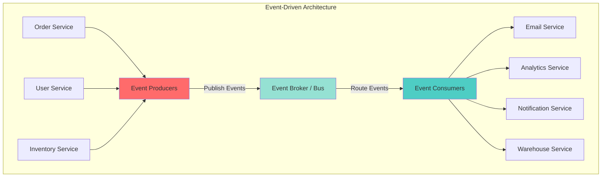

### 1. Event Producers

Services that publish events when something significant happens. Your order service is a producer when it publishes "OrderPlaced" events.
> 💡 **Pseudo code** - Simplified for illustration purposes
```csharp
public class OrderEventProducer
{
    private readonly IProducer<string, string> producer;

    public void PublishOrderPlaced(Order order)
    {
        var eventObj = new
        {
            eventId = Guid.NewGuid().ToString(),
            eventType = "OrderPlaced",
            timestamp = DateTime.UtcNow,
            data = new { orderId = order.Id, /* ... */ }
        };

        producer.Produce("orders", new Message<string, string> 
        { 
            Value = JsonSerializer.Serialize(eventObj) 
        });
    }
}
```

### 2. Event Broker (Event Bus)

The middleman that receives events from producers and delivers them to consumers. Think of it as a smart post office for events.

**Popular Event Brokers:**
- **Apache Kafka** - High throughput, distributed, event streaming
- **RabbitMQ** - Traditional message queue with routing
- **AWS EventBridge** - Managed serverless event bus
- **Azure Event Hubs** - Cloud-native event streaming
- **Google Cloud Pub/Sub** - Global event messaging

**What the broker provides:**
- **Durability** - Events are stored and won't be lost
- **Routing** - Deliver events to the right consumers
- **Scalability** - Handle millions of events per second
- **Replay** - Consumers can reprocess old events
- **Multiple consumers** - Same event to many services

### 3. Event Consumers

Services that subscribe to and react to events. Your email service consumes "OrderPlaced" events to send confirmations.
> 💡 **Pseudo code** - Simplified for illustration purposes
```csharp
public class EmailEventConsumer
{
    public void StartConsuming()
    {
        while (true)
        {
            var message = consumer.Consume();
            var eventObj = JsonSerializer.Deserialize<JsonElement>(message.Value);
            
            if (eventObj.GetProperty("eventType").GetString() == "OrderPlaced")
            {
                SendConfirmationEmail(eventObj.GetProperty("data"));
            }
        }
    }
}
```

## A Complete Flow Example

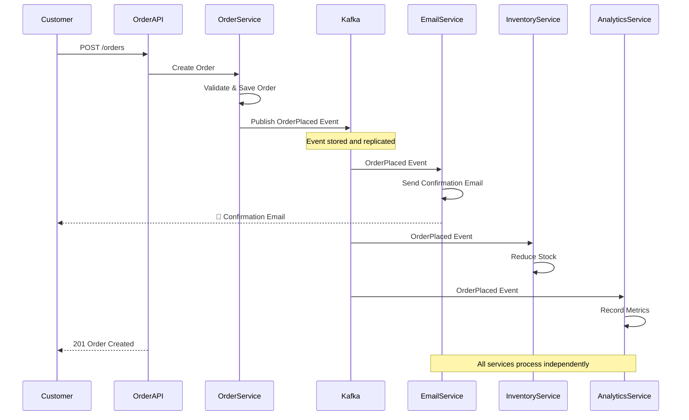

## Common Misconceptions

### Misconception 1: "EDA means no synchronous communication"

**Reality:** EDA and REST APIs can coexist. Use events for notifications and async workflows. Use APIs for queries and sync operations.
> 💡 **Pseudo code** - Simplified for illustration purposes
```csharp
// Query - Use REST API
GET /orders/ORD-123  // Synchronous, immediate response

// Command - Use Events
POST /orders  // Create order, publish event, let services react asynchronously
```

### Misconception 2: "EDA solves all problems"

**Reality:** EDA introduces complexity. Only use it when the benefits outweigh the costs.

### Misconception 3: "Events should be tiny"

**Reality:** Events should be self-contained with enough data for consumers to act without additional calls.

### Misconception 4: "EDA is only for big companies"

**Reality:** Even small applications can benefit from EDA's decoupling and flexibility.

## Key Benefits Illustrated

### 1. Loose Coupling

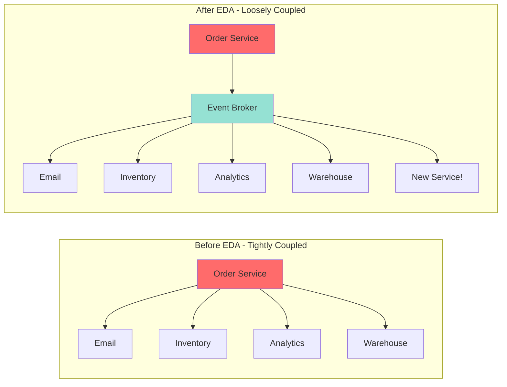

**Adding a new fraud detection service:**
> 💡 **Pseudo code** - Simplified for illustration purposes
Before EDA - Must modify OrderService code:
```csharp
// ADD THIS NEW LINE - requires code change!
fraud_detection_client.check_order(order_data);
```
> 💡 **Pseudo code** - Simplified for illustration purposes
After EDA - Just deploy a new consumer, NO changes to OrderService:
```csharp
// New service subscribes to existing events
public class FraudDetectionService
{
    public void run()
    {
        consumer.Subscribe("orders");
        // Process OrderPlaced events
    }
}
```

### 2. Independent Scaling

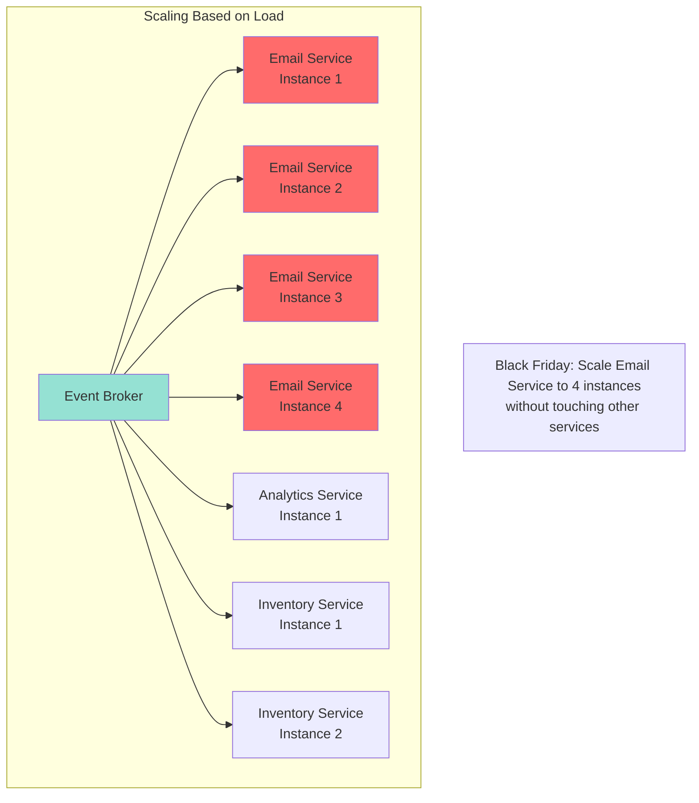

### 3. Resilience

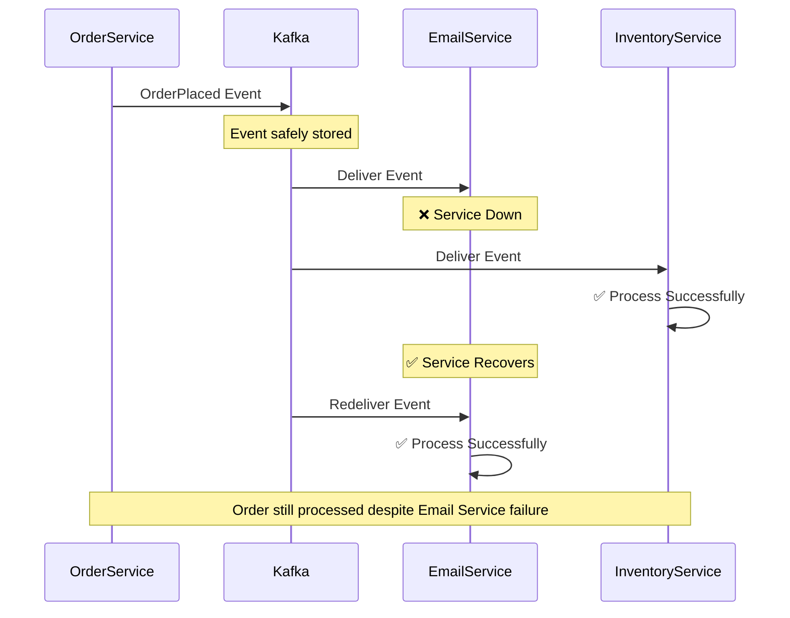

### 4. Flexibility and Evolution

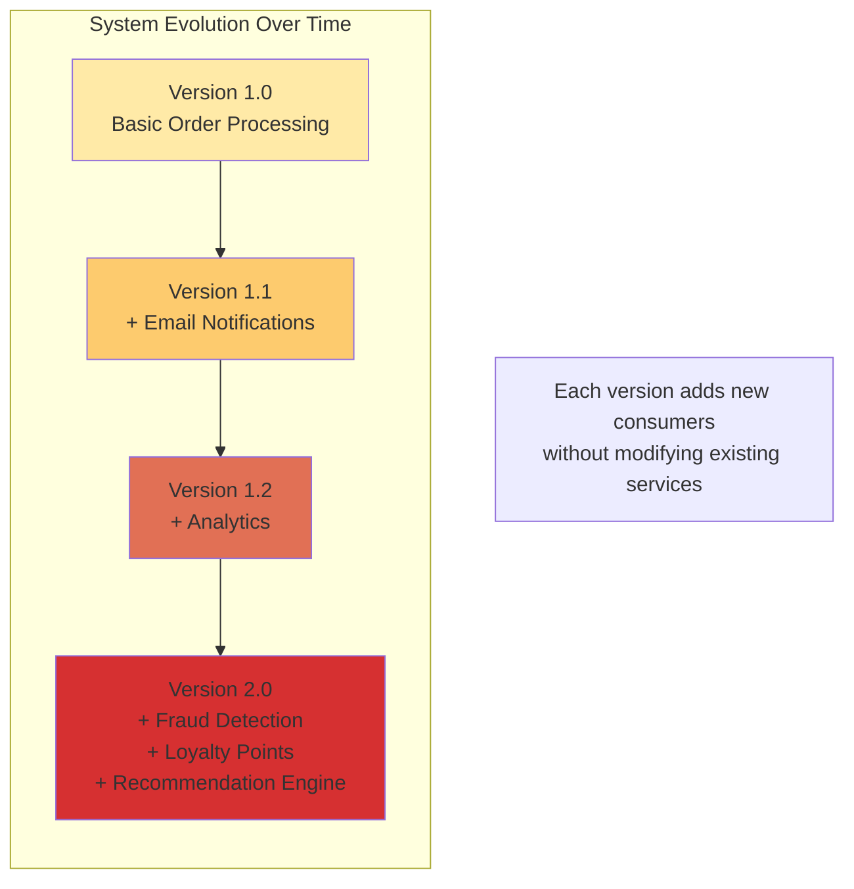

## Real-World Use Cases

### Use Case 1: E-Commerce Order Processing

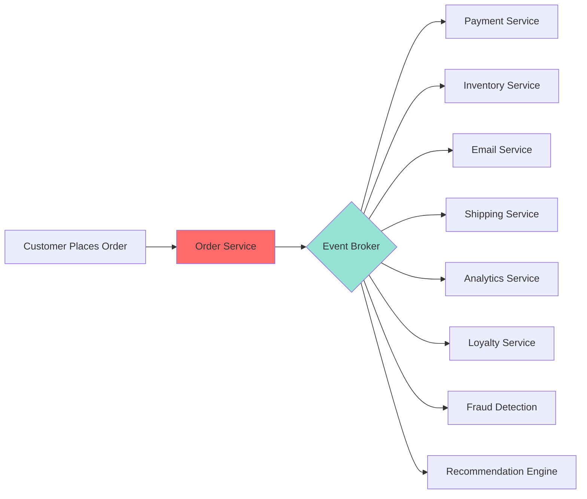

### Use Case 2: IoT Sensor Data Processing

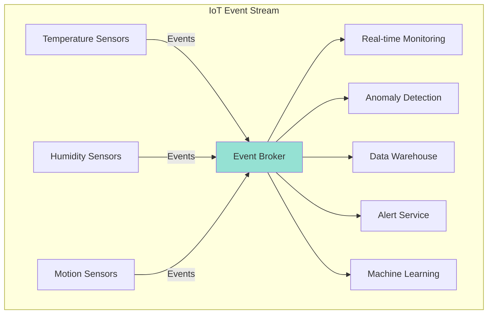

### Use Case 3: User Activity Tracking

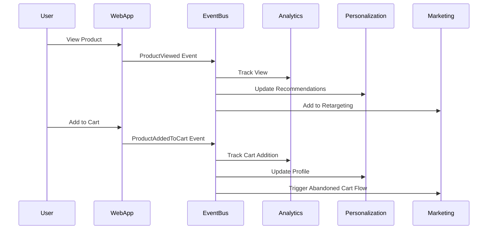

## When to Use EDA

Event-Driven Architecture shines when:

✅ **Multiple systems need to react to the same occurrence** - One order → email, inventory, shipping, analytics all react

✅ **Services need to operate independently** - Email service down shouldn't block order placement

✅ **You're building microservices** - EDA provides natural service boundaries and communication

✅ **Different parts need different scaling** - Scale email service separately from payment service

✅ **You want to add features without changing existing code** - New fraud detection? Just add a consumer

✅ **You need an audit trail** - Events provide natural history of what happened

✅ **Real-time data processing** - Process streams of events as they occur

## When NOT to Use EDA

EDA might be overkill for:

❌ **Simple CRUD applications** - If you're just reading and writing data, REST API might be simpler

❌ **Synchronous workflows requiring immediate responses** - "Process payment and immediately return success/failure"

❌ **Small teams without distributed systems experience** - EDA adds operational complexity

❌ **Systems requiring strong consistency** - EDA is eventually consistent by nature

❌ **Tight budget constraints** - Event brokers add infrastructure costs

---

<div class="try-it-yourself-section">

## Try It Yourself: Your First Event-Driven Application

Now that you understand the theory, let's see Event-Driven Architecture in action. We'll build a simple producer-consumer application that demonstrates the core concepts.

### What We'll Build

A simple message producer that sends events to Kafka, and a consumer that reads them. This demonstrates event production, consumption, decoupling, and asynchronous communication - the core principles of EDA.

### Prerequisites

- **Docker** installed (for running Kafka locally)
- **.NET 8.0 SDK**
- **Git** (to clone the repository)

<div class="try-it-yourself-links">

**📚 Resources:**
- **[GitHub Repository](https://github.com/tomakazoo/kafka-event-driven-architecture)** → `examples/01-fundamentals/` - Complete working code
- **[Complete Setup Guide](https://github.com/tomakazoo/kafka-event-driven-architecture/blob/release/docs/QUICKSTART.md)** - Detailed instructions

</div>

### Quick Setup

Get Kafka running locally with Docker Compose:

```bash
# Clone the repository
git clone https://github.com/tomakazoo/kafka-event-driven-architecture.git
cd kafka-event-driven-architecture

# Start Kafka infrastructure
./scripts/start-kafka.sh

# Verify everything is running
./scripts/verify-docker.sh
```

This starts Zookeeper, Kafka Broker (port 9092), Schema Registry, and Kafka UI (http://localhost:8080).

### Create a Producer
> 💡 **Simplified code** - [github - full BasicProducer](https://github.com/tomakazoo/kafka-event-driven-architecture/blob/release/examples/01-fundamentals/dotnet/BasicProducer.cs)
```csharp
using Confluent.Kafka;
using System.Text.Json;

class BasicProducer
{
    static async Task Main()
    {
        var config = new ProducerConfig { BootstrapServers = "localhost:9092" };
        using var producer = new ProducerBuilder<string, string>(config).Build();

        for (int i = 0; i < 5; i++)
        {
            var message = new { id = i, value = $"Message {i}" };
            await producer.ProduceAsync("my-topic", 
                new Message<string, string> { 
                    Key = $"key-{i}", 
                    Value = JsonSerializer.Serialize(message) 
                });
            Console.WriteLine($"✅ Delivered message {i}");
        }
    }
}
```

Run it:
```bash
cd examples/01-fundamentals/dotnet
dotnet run --project BasicProducer.csproj
```

### Create a Consumer
 💡 **Simplified code** - [github - full BasicConsumer](https://github.com/tomakazoo/kafka-event-driven-architecture/blob/release/examples/01-fundamentals/dotnet/BasicConsumer.cs)
```csharp
using Confluent.Kafka;

class BasicConsumer
{
    static void Main()
    {
        var config = new ConsumerConfig
        {
            BootstrapServers = "localhost:9092",
            GroupId = "dotnet-consumer-group",
            AutoOffsetReset = AutoOffsetReset.Earliest
        };

        using var consumer = new ConsumerBuilder<string, string>(config).Build();
        consumer.Subscribe("my-topic");

        while (true)
        {
            var result = consumer.Consume();
            Console.WriteLine($"Received: {result.Message.Value}");
        }
    }
}
```

Run it in a new terminal:
```bash
cd examples/01-fundamentals/dotnet
dotnet run --project BasicConsumer.csproj
```

### View Events in Kafka UI

Open http://localhost:8080 and navigate to Topics → my-topic → Messages to see all your events with timestamps, keys, and values.

### What You Just Learned

✅ **Events are immutable** - Once published, they're stored permanently in Kafka

✅ **Producers don't know consumers** - The producer just publishes events without knowing who's listening

✅ **Consumers react independently** - The consumer reads events at its own pace

✅ **Decoupling through events** - Producer and consumer only know about Kafka, not each other

✅ **Asynchronous by default** - Messages flow through Kafka without producers waiting for consumers

✅ **Events persist** - Messages are stored on disk and can be re-read

**Try experimenting:** Create multiple consumers in the same group, or different groups. Stop and restart consumers. Run the producer again while the consumer is watching.

[Full code examples available in the GitHub repository](https://github.com/tomakazoo/kafka-event-driven-architecture)

</div>

---

## Getting Started: A Practical Roadmap

### Phase 1: Start Small (Week 1-2)
1. Identify one workflow in your system
2. Set up a local Kafka instance
3. Create one producer and one consumer
4. Test with simple events

### Phase 2: Add Complexity (Week 3-4)
1. Add 2-3 more consumers
2. Implement proper error handling
3. Add monitoring and logging
4. Test failure scenarios

### Phase 3: Production Ready (Week 5-8)
1. Set up proper Kafka cluster
2. Implement schema versioning
3. Add comprehensive monitoring
4. Create runbooks for operations
5. Load test the system

### Phase 4: Scale and Optimize (Ongoing)
1. Tune Kafka configuration
2. Optimize consumer performance
3. Add more event-driven workflows
4. Refine based on learnings

## Next Steps

In Part 2, we'll dive deep into event design:
- Event notification vs. event-carried state transfer vs. event sourcing
- Designing events that stand the test of time
- Schema evolution strategies
- Granularity: fine vs. coarse events
- Common event design mistakes and how to avoid them

Event-Driven Architecture represents a fundamental shift in how we think about system design. Instead of orchestrating every action, we choreograph responses to events. It's the difference between a conductor directing every musician and musicians who know how to respond when they hear their cue.

Ready to design great events? Let's move on to  [Part 2](part-02-event-patterns-and-design) - Event Design! 🚀

---

**Key Takeaways:**
1. EDA decouples services through events
2. Producers publish events, brokers route them, consumers react
3. Benefits: loose coupling, scalability, resilience, flexibility
4. Use when multiple systems react to the same occurrence
5. Start small and iterate
