# Part 1: What Is Event-Driven Architecture? A Beginner's Guide

## The Problem with Traditional Request-Response

Picture this: You're building an online store. When a customer places an order, your system needs to:
- Charge their credit card
- Update inventory
- Send a confirmation email
- Notify the warehouse
- Update analytics
- Award loyalty points

In a traditional system, your order service makes direct API calls to each of these services, one by one. If the email service is slow, your customer waits. If the warehouse system is down, the entire order might fail. Your order service needs to know about every single downstream service and how to call them.

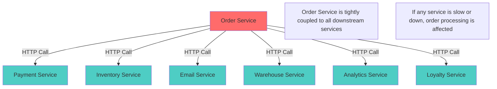

This is the synchronous, tightly-coupled approach. And it doesn't scale well.

### The Pain Points

**1. Tight Coupling**
```python
# Traditional approach - Order Service knows about everything
class OrderService:
    def __init__(self):
        self.payment_client = PaymentServiceClient()
        self.inventory_client = InventoryServiceClient()
        self.email_client = EmailServiceClient()
        self.warehouse_client = WarehouseServiceClient()
        self.analytics_client = AnalyticsServiceClient()
        self.loyalty_client = LoyaltyServiceClient()
    
    def place_order(self, order_data):
        # Must call each service
        payment = self.payment_client.charge(order_data.payment_info)
        self.inventory_client.update_stock(order_data.items)
        self.email_client.send_confirmation(order_data.customer_email)
        self.warehouse_client.notify(order_data)
        self.analytics_client.record_sale(order_data)
        self.loyalty_client.award_points(order_data.customer_id)
        
        # Order service needs to know EVERYTHING
        # Adding a new service? Modify this code!
```

**2. Cascading Failures**
```python
def place_order(self, order_data):
    try:
        payment = self.payment_client.charge(order_data.payment_info)
    except TimeoutError:
        # Payment service is slow - customer waits 30 seconds
        raise OrderProcessingError("Payment timeout")
    
    try:
        self.email_client.send_confirmation(order_data.customer_email)
    except ServiceUnavailableError:
        # Email service is down - should the order fail?
        # What about the payment that already went through?
        raise OrderProcessingError("Email service down")
```

**3. Scaling Challenges**
- Black Friday: Email service is overwhelmed
- Must scale the entire order service just to handle more emails
- Can't independently scale services based on their load

## Enter Event-Driven Architecture

Event-Driven Architecture flips this model. Instead of the order service telling everyone what to do, it simply announces: "Hey, an order was placed!" 

Each service that cares about orders listens for this announcement and takes its own action, independently. The email service sends an email. The warehouse service prepares shipping. The analytics service records the sale.

The order service doesn't know or care who's listening. It just publishes the fact that something happened.

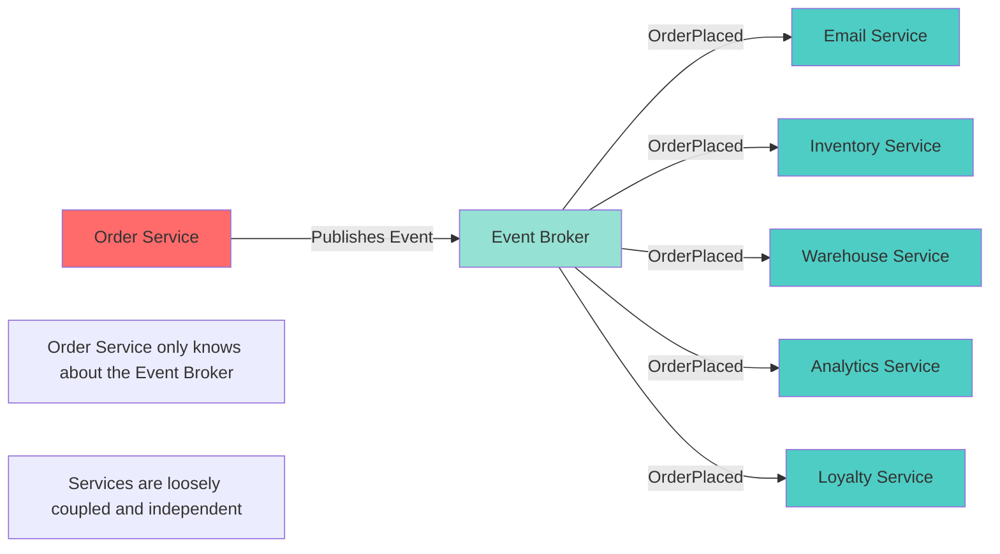

## What Is an Event?

An event is a record of something that happened in your system. Events are:

**Immutable** - Once something happened, it happened. You can't change history.

**Past tense** - Events describe what already occurred: "OrderPlaced", "PaymentProcessed", "UserRegistered".

**Self-contained** - Events carry all the information needed to understand what happened.

### Anatomy of a Well-Designed Event

```json
{
  "eventId": "evt_7a8b9c0d",
  "eventType": "OrderPlaced",
  "eventVersion": "1.0",
  "timestamp": "2025-11-01T10:30:00Z",
  "source": "order-service",
  "correlationId": "corr_12345",
  "data": {
    "orderId": "ORD-789",
    "customerId": "CUST-456",
    "customerEmail": "customer@example.com",
    "customerName": "Jane Smith",
    "totalAmount": 99.99,
    "currency": "USD",
    "items": [
      {
        "productId": "PROD-001",
        "productName": "Wireless Mouse",
        "quantity": 2,
        "unitPrice": 49.99,
        "totalPrice": 99.98
      }
    ],
    "shippingAddress": {
      "street": "123 Main St",
      "city": "Boston",
      "state": "MA",
      "zip": "02101",
      "country": "USA"
    },
    "paymentMethod": "credit_card",
    "paymentLast4": "4242"
  }
}
```

**Key Components:**

1. **eventId** - Unique identifier for deduplication
2. **eventType** - What happened (in past tense)
3. **eventVersion** - For schema evolution
4. **timestamp** - When it happened
5. **source** - Which service produced this event
6. **correlationId** - For distributed tracing
7. **data** - The payload with all relevant information

## The Three Pillars of EDA

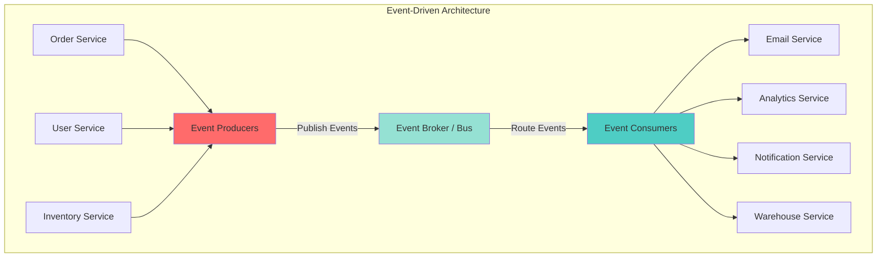

### 1. Event Producers

Services that publish events when something significant happens. Your order service is a producer when it publishes "OrderPlaced" events.

```python
from kafka import KafkaProducer
import json
from datetime import datetime
import uuid

class OrderEventProducer:
    def __init__(self):
        self.producer = KafkaProducer(
            bootstrap_servers=['localhost:9092'],
            value_serializer=lambda v: json.dumps(v).encode('utf-8')
        )
    
    def publish_order_placed(self, order):
        event = {
            'eventId': str(uuid.uuid4()),
            'eventType': 'OrderPlaced',
            'eventVersion': '1.0',
            'timestamp': datetime.utcnow().isoformat(),
            'source': 'order-service',
            'correlationId': order.correlation_id,
            'data': {
                'orderId': order.id,
                'customerId': order.customer_id,
                'customerEmail': order.customer_email,
                'totalAmount': order.total_amount,
                'items': [
                    {
                        'productId': item.product_id,
                        'quantity': item.quantity,
                        'price': item.price
                    } for item in order.items
                ]
            }
        }
        
        # Publish to Kafka topic
        self.producer.send('orders', value=event)
        self.producer.flush()
        
        print(f"✅ Published OrderPlaced event: {event['eventId']}")
```

### 2. Event Broker (Event Bus)

The middleman that receives events from producers and delivers them to consumers. Think of it as a smart post office for events.

**Popular Event Brokers:**
- **Apache Kafka** - High throughput, distributed, event streaming
- **RabbitMQ** - Traditional message queue with routing
- **AWS EventBridge** - Managed serverless event bus
- **Azure Event Hubs** - Cloud-native event streaming
- **Google Cloud Pub/Sub** - Global event messaging

**What the broker provides:**
- **Durability** - Events are stored and won't be lost
- **Routing** - Deliver events to the right consumers
- **Scalability** - Handle millions of events per second
- **Replay** - Consumers can reprocess old events
- **Multiple consumers** - Same event to many services

### 3. Event Consumers

Services that subscribe to and react to events. Your email service consumes "OrderPlaced" events to send confirmations.

```python
from kafka import KafkaConsumer
import json

class EmailEventConsumer:
    def __init__(self):
        self.consumer = KafkaConsumer(
            'orders',
            bootstrap_servers=['localhost:9092'],
            group_id='email-service',
            value_deserializer=lambda m: json.loads(m.decode('utf-8')),
            auto_offset_reset='earliest'
        )
    
    def start_consuming(self):
        print("📧 Email Service listening for order events...")
        
        for message in self.consumer:
            event = message.value
            
            if event['eventType'] == 'OrderPlaced':
                self.handle_order_placed(event)
    
    def handle_order_placed(self, event):
        order_data = event['data']
        
        print(f"📨 Sending confirmation email for order {order_data['orderId']}")
        print(f"   To: {order_data['customerEmail']}")
        print(f"   Amount: ${order_data['totalAmount']}")
        
        # Send email logic here
        self.send_email(
            to=order_data['customerEmail'],
            subject=f"Order Confirmation - {order_data['orderId']}",
            template='order_confirmation',
            data=order_data
        )
        
        print(f"✅ Email sent for order {order_data['orderId']}")
```

## A Complete Flow Example

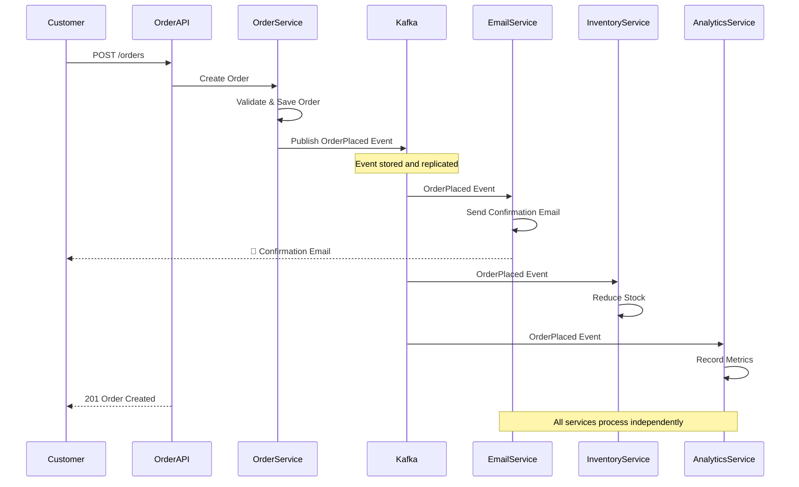

### Complete Working Example

```python
# === ORDER SERVICE (Producer) ===
class Order:
    def __init__(self, order_id, customer_id, customer_email, items):
        self.id = order_id
        self.customer_id = customer_id
        self.customer_email = customer_email
        self.items = items
        self.total_amount = sum(item['quantity'] * item['price'] for item in items)
        self.correlation_id = str(uuid.uuid4())

class OrderService:
    def __init__(self):
        self.event_producer = OrderEventProducer()
    
    def place_order(self, order_data):
        # 1. Create and save order
        order = Order(
            order_id=f"ORD-{uuid.uuid4().hex[:8]}",
            customer_id=order_data['customer_id'],
            customer_email=order_data['customer_email'],
            items=order_data['items']
        )
        
        # Save to database
        self.save_to_db(order)
        
        # 2. Publish event - that's it!
        self.event_producer.publish_order_placed(order)
        
        return order

# === EMAIL SERVICE (Consumer) ===
class EmailService:
    def __init__(self):
        self.consumer = EmailEventConsumer()
    
    def run(self):
        self.consumer.start_consuming()

# === INVENTORY SERVICE (Consumer) ===
class InventoryEventConsumer:
    def __init__(self):
        self.consumer = KafkaConsumer(
            'orders',
            group_id='inventory-service',
            bootstrap_servers=['localhost:9092'],
            value_deserializer=lambda m: json.loads(m.decode('utf-8'))
        )
    
    def start_consuming(self):
        print("📦 Inventory Service listening for order events...")
        
        for message in self.consumer:
            event = message.value
            
            if event['eventType'] == 'OrderPlaced':
                self.handle_order_placed(event)
    
    def handle_order_placed(self, event):
        order_data = event['data']
        
        print(f"📦 Updating inventory for order {order_data['orderId']}")
        
        for item in order_data['items']:
            self.reduce_stock(item['productId'], item['quantity'])
            print(f"   Reduced stock for {item['productId']}: -{item['quantity']}")
        
        print(f"✅ Inventory updated for order {order_data['orderId']}")

# === ANALYTICS SERVICE (Consumer) ===
class AnalyticsEventConsumer:
    def __init__(self):
        self.consumer = KafkaConsumer(
            'orders',
            group_id='analytics-service',
            bootstrap_servers=['localhost:9092'],
            value_deserializer=lambda m: json.loads(m.decode('utf-8'))
        )
        self.total_revenue = 0
        self.order_count = 0
    
    def start_consuming(self):
        print("📊 Analytics Service listening for order events...")
        
        for message in self.consumer:
            event = message.value
            
            if event['eventType'] == 'OrderPlaced':
                self.handle_order_placed(event)
    
    def handle_order_placed(self, event):
        order_data = event['data']
        
        self.order_count += 1
        self.total_revenue += order_data['totalAmount']
        
        print(f"📊 Analytics updated:")
        print(f"   Total Orders: {self.order_count}")
        print(f"   Total Revenue: ${self.total_revenue:.2f}")
        print(f"   Average Order Value: ${self.total_revenue/self.order_count:.2f}")

# === RUNNING THE SYSTEM ===
if __name__ == '__main__':
    import threading
    
    # Start consumers in separate threads
    email_service = EmailService()
    inventory_service = InventoryService()
    analytics_service = AnalyticsService()
    
    threading.Thread(target=email_service.run, daemon=True).start()
    threading.Thread(target=inventory_service.run, daemon=True).start()
    threading.Thread(target=analytics_service.run, daemon=True).start()
    
    # Give consumers time to start
    time.sleep(2)
    
    # Place some orders
    order_service = OrderService()
    
    order_service.place_order({
        'customer_id': 'CUST-001',
        'customer_email': 'john@example.com',
        'items': [
            {'productId': 'PROD-001', 'quantity': 2, 'price': 29.99},
            {'productId': 'PROD-002', 'quantity': 1, 'price': 49.99}
        ]
    })
    
    # Watch the magic happen across all services!
```

## Key Benefits Illustrated

### 1. Loose Coupling

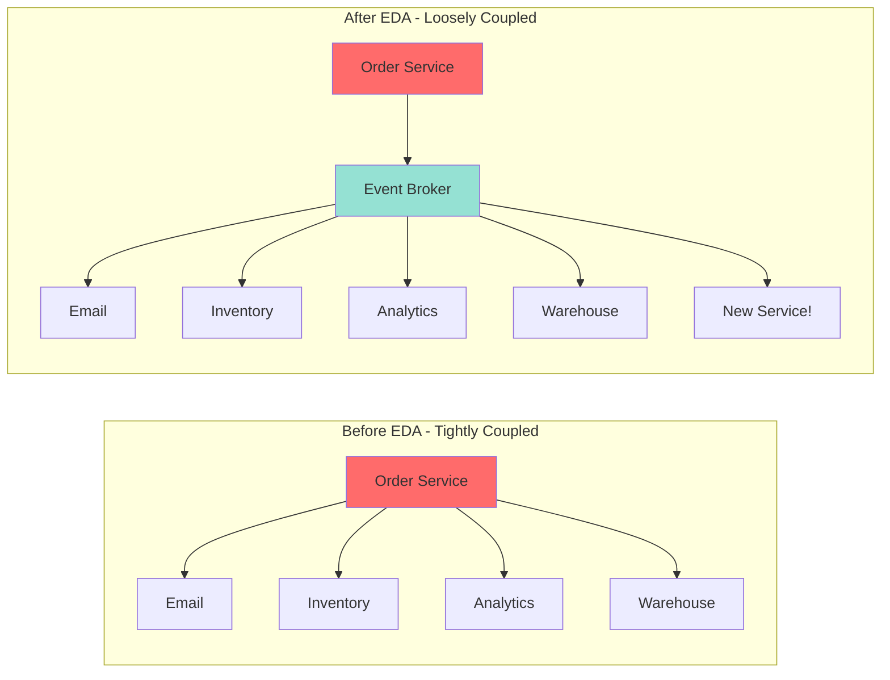

**Adding a new fraud detection service:**

Before EDA:
```python
# Must modify OrderService code
def place_order(self, order_data):
    payment = self.payment_client.charge(order_data.payment_info)
    self.inventory_client.update_stock(order_data.items)
    self.email_client.send_confirmation(order_data.customer_email)
    # ADD THIS NEW LINE - requires code change!
    self.fraud_detection_client.check_order(order_data)
```

After EDA:
```python
# Just deploy a new consumer - NO changes to OrderService!
class FraudDetectionService:
    def __init__(self):
        self.consumer = KafkaConsumer('orders', group_id='fraud-detection')
    
    def run(self):
        for message in self.consumer:
            event = message.value
            if event['eventType'] == 'OrderPlaced':
                self.check_for_fraud(event['data'])
```

### 2. Independent Scaling

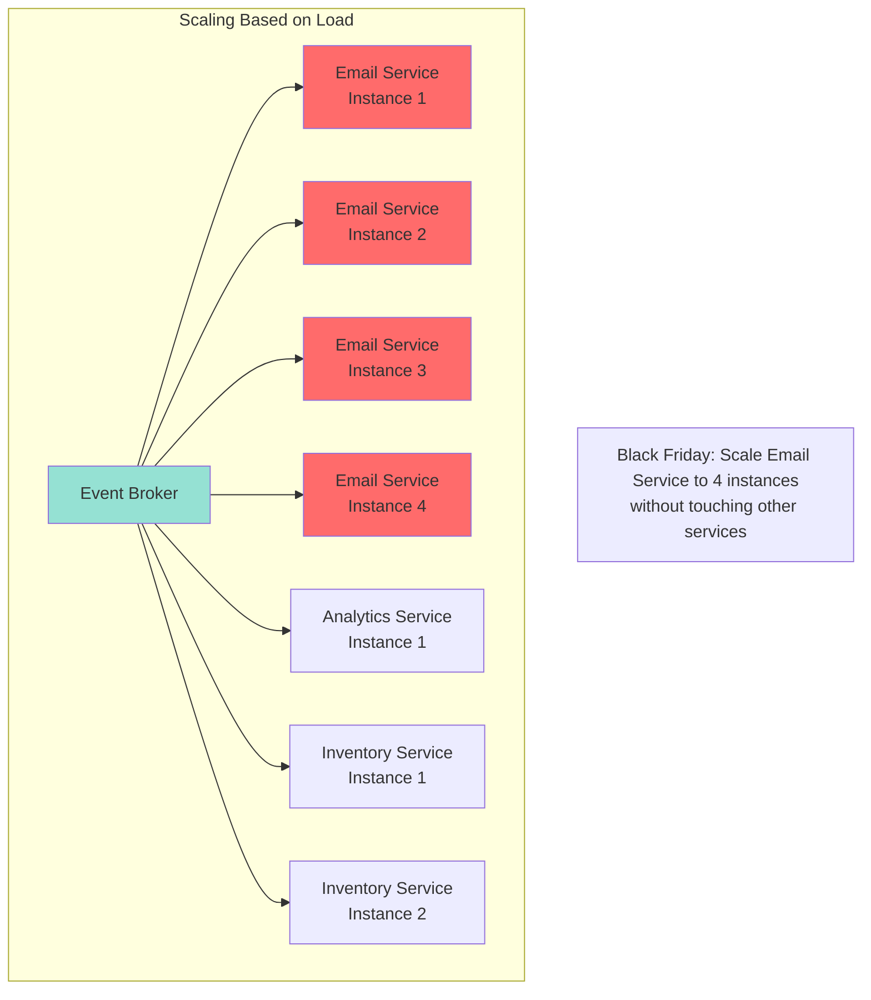

### 3. Resilience

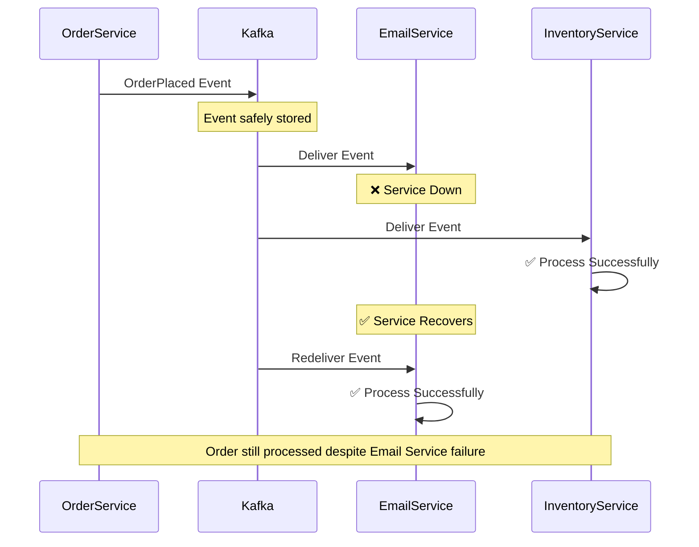

### 4. Flexibility and Evolution

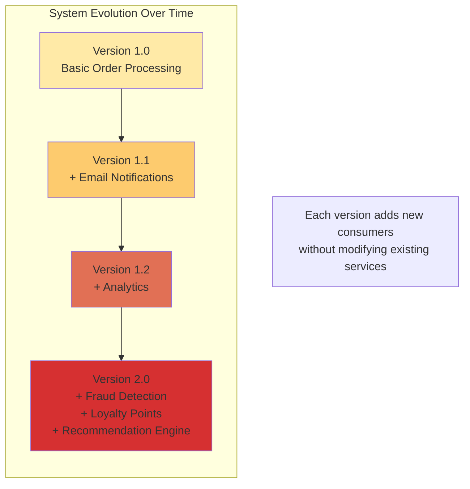

## Real-World Use Cases

### Use Case 1: E-Commerce Order Processing

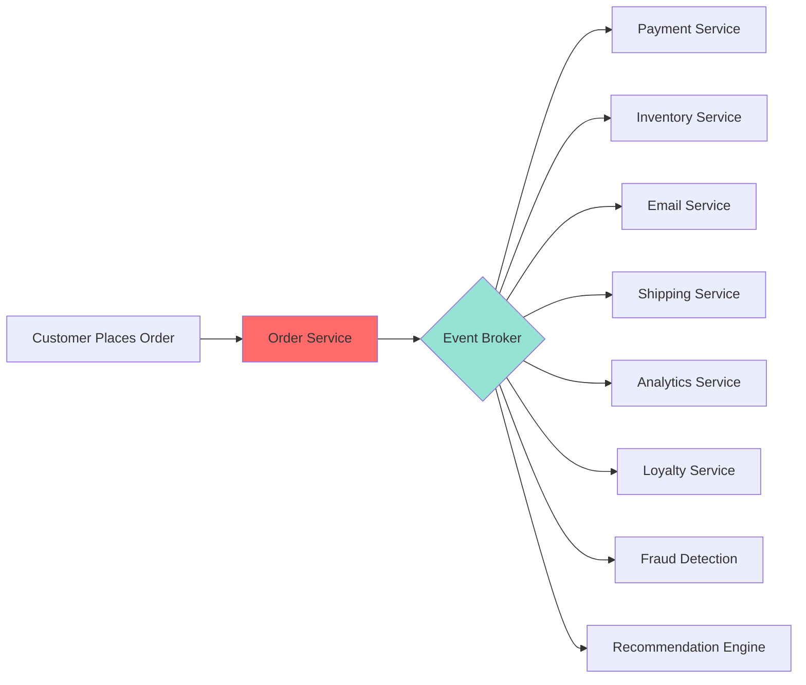

### Use Case 2: IoT Sensor Data Processing

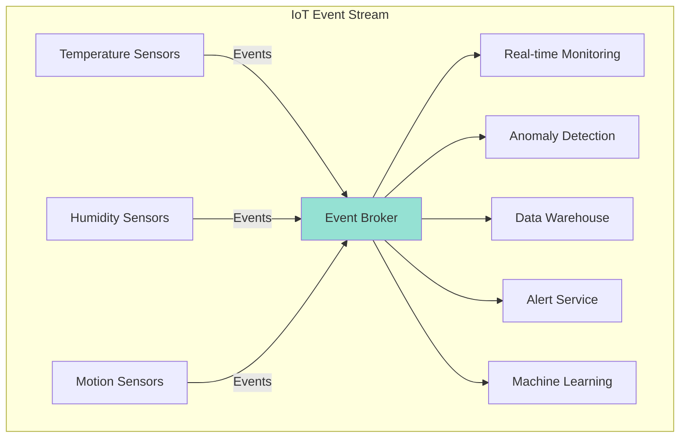

### Use Case 3: User Activity Tracking

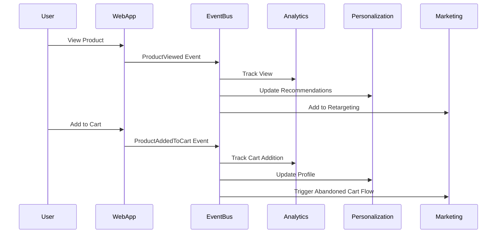

## When to Use EDA

Event-Driven Architecture shines when:

✅ **Multiple systems need to react to the same occurrence**
- One order → email, inventory, shipping, analytics all react

✅ **Services need to operate independently**
- Email service down shouldn't block order placement

✅ **You're building microservices**
- EDA provides natural service boundaries and communication

✅ **Different parts need different scaling**
- Scale email service separately from payment service

✅ **You want to add features without changing existing code**
- New fraud detection? Just add a consumer

✅ **You need an audit trail**
- Events provide natural history of what happened

✅ **Real-time data processing**
- Process streams of events as they occur

## When NOT to Use EDA

EDA might be overkill for:

❌ **Simple CRUD applications**
- If you're just reading and writing data, REST API might be simpler

❌ **Synchronous workflows requiring immediate responses**
- "Process payment and immediately return success/failure"

❌ **Small teams without distributed systems experience**
- EDA adds operational complexity

❌ **Systems requiring strong consistency**
- EDA is eventually consistent by nature

❌ **Tight budget constraints**
- Event brokers add infrastructure costs

## Getting Started: A Practical Roadmap

### Phase 1: Start Small (Week 1-2)
1. Identify one workflow in your system
2. Set up a local Kafka instance
3. Create one producer and one consumer
4. Test with simple events

### Phase 2: Add Complexity (Week 3-4)
1. Add 2-3 more consumers
2. Implement proper error handling
3. Add monitoring and logging
4. Test failure scenarios

### Phase 3: Production Ready (Week 5-8)
1. Set up proper Kafka cluster
2. Implement schema versioning
3. Add comprehensive monitoring
4. Create runbooks for operations
5. Load test the system

### Phase 4: Scale and Optimize (Ongoing)
1. Tune Kafka configuration
2. Optimize consumer performance
3. Add more event-driven workflows
4. Refine based on learnings

## Common Misconceptions

### Misconception 1: "EDA means no synchronous communication"

**Reality:** EDA and REST APIs can coexist. Use events for notifications and async workflows. Use APIs for queries and sync operations.

```python
# Query - Use REST API
GET /orders/ORD-123  # Synchronous, immediate response

# Command - Use Events
POST /orders  # Create order, publish event, let services react asynchronously
```

### Misconception 2: "EDA solves all problems"

**Reality:** EDA introduces complexity. Only use it when the benefits outweigh the costs.

### Misconception 3: "Events should be tiny"

**Reality:** Events should be self-contained with enough data for consumers to act without additional calls.

### Misconception 4: "EDA is only for big companies"

**Reality:** Even small applications can benefit from EDA's decoupling and flexibility.

## Next Steps

In Part 2, we'll dive deep into event design:
- Event notification vs. event-carried state transfer vs. event sourcing
- Designing events that stand the test of time
- Schema evolution strategies
- Granularity: fine vs. coarse events
- Common event design mistakes and how to avoid them

Event-Driven Architecture represents a fundamental shift in how we think about system design. Instead of orchestrating every action, we choreograph responses to events. It's the difference between a conductor directing every musician and musicians who know how to respond when they hear their cue.

Ready to design great events? Let's move on to Part 2! 🚀

---

**Key Takeaways:**
1. EDA decouples services through events
2. Producers publish events, brokers route them, consumers react
3. Benefits: loose coupling, scalability, resilience, flexibility
4. Use when multiple systems react to the same occurrence
5. Start small and iterate

