# Part 1: What Is Event-Driven Architecture? A Beginner's Guide

> **💻 Language Note:** All code examples in this post are written in **C#**. As I want to learn more Python, I will soon follow with similar examples in Python following the same patterns and concepts demonstrated here.

## The Problem with Traditional Request-Response

Picture this: You're building an online store. When a customer places an order, your system needs to:
- Charge their credit card
- Update inventory
- Send a confirmation email
- Notify the warehouse
- Update analytics
- Award loyalty points

In a traditional system, your order service makes direct API calls to each of these services, one by one. If the email service is slow, your customer waits. If the warehouse system is down, the entire order might fail. Your order service needs to know about every single downstream service and how to call them.

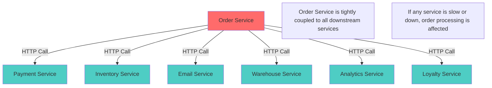

This is the synchronous, tightly-coupled approach. And it doesn't scale well.

### The Pain Points

**1. Tight Coupling**

> 💡 **Pseudo code** - Simplified for illustration purposes

```csharp
// Coupling
// Traditional approach - Order Service knows about everything
public class OrderService
{
    public OrderService()
    {
        payment_client = new PaymentServiceClient();
        inventory_client = new InventoryServiceClient();
        email_client = new EmailServiceClient();
        warehouse_client = new WarehouseServiceClient();
        analytics_client = new AnalyticsServiceClient();
        loyalty_client = new LoyaltyServiceClient();
    }
    
    public void place_order(object order_data)
    {
        // Must call each service
        var payment = payment_client.charge(order_data.payment_info);
        inventory_client.update_stock(order_data.items);
        email_client.send_confirmation(order_data.customer_email);
        warehouse_client.notify(order_data);
        analytics_client.record_sale(order_data);
        loyalty_client.award_points(order_data.customer_id);
        
        // Order service needs to know EVERYTHING
        // Adding a new service? Modify this code!
    }
    
    private PaymentServiceClient payment_client;
    private InventoryServiceClient inventory_client;
    private EmailServiceClient email_client;
    private WarehouseServiceClient warehouse_client;
    private AnalyticsServiceClient analytics_client;
    private LoyaltyServiceClient loyalty_client;
}
```

**2. Cascading Failures**

> 💡 **Pseudo code** - Simplified for illustration purposes

```csharp
public void place_order(object order_data)
{
    try
    {
        var payment = payment_client.charge(order_data.payment_info);
    }
    catch (TimeoutException)
    {
        // Payment service is slow - customer waits 30 seconds
        throw new OrderProcessingException("Payment timeout");
    }
    
    try
    {
        email_client.send_confirmation(order_data.customer_email);
    }
    catch (ServiceUnavailableException)
    {
        // Email service is down - should the order fail?
        // What about the payment that already went through?
        throw new OrderProcessingException("Email service down");
    }
}
```

**3. Scaling Challenges**
- Black Friday: Email service is overwhelmed
- Must scale the entire order service just to handle more emails
- Can't independently scale services based on their load

## Enter Event-Driven Architecture

Event-Driven Architecture flips this model. Instead of the order service telling everyone what to do, it simply announces: "Hey, an order was placed!" 

Each service that cares about orders listens for this announcement and takes its own action, independently. The email service sends an email. The warehouse service prepares shipping. The analytics service records the sale.

The order service doesn't know or care who's listening. It just publishes the fact that something happened.

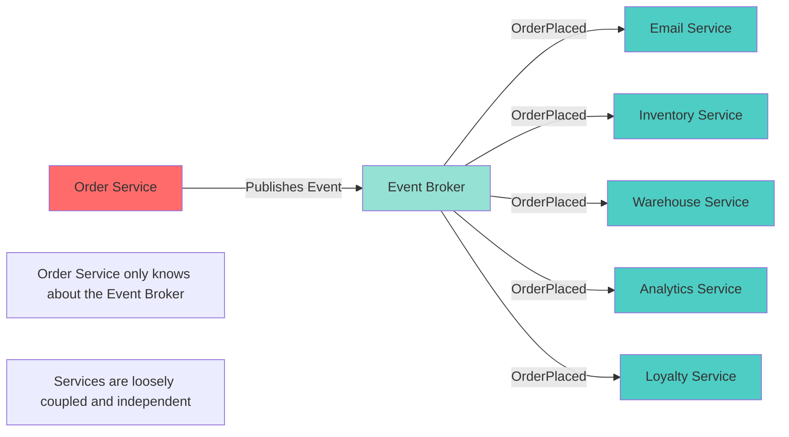

## What Is an Event?

An event is a record of something that happened in your system. Events are:

**Immutable** - Once something happened, it happened. You can't change history.

**Past tense** - Events describe what already occurred: "OrderPlaced", "PaymentProcessed", "UserRegistered".

**Self-contained** - Events carry all the information needed to understand what happened.

### Anatomy of a Well-Designed Event

```json
{
  "eventId": "evt_7a8b9c0d",
  "eventType": "OrderPlaced",
  "eventVersion": "1.0",
  "timestamp": "2025-11-01T10:30:00Z",
  "source": "order-service",
  "correlationId": "corr_12345",
  "data": {
    "orderId": "ORD-789",
    "customerId": "CUST-456",
    "customerEmail": "customer@example.com",
    "customerName": "Jane Smith",
    "totalAmount": 99.99,
    "currency": "USD",
    "items": [
      {
        "productId": "PROD-001",
        "productName": "Wireless Mouse",
        "quantity": 2,
        "unitPrice": 49.99,
        "totalPrice": 99.98
      }
    ],
    "shippingAddress": {
      "street": "123 Main St",
      "city": "Boston",
      "state": "MA",
      "zip": "02101",
      "country": "USA"
    },
    "paymentMethod": "credit_card",
    "paymentLast4": "4242"
  }
}
```

**Key Components:**

1. **eventId** - Unique identifier for deduplication
2. **eventType** - What happened (in past tense)
3. **eventVersion** - For schema evolution
4. **timestamp** - When it happened
5. **source** - Which service produced this event
6. **correlationId** - For distributed tracing
7. **data** - The payload with all relevant information

## The Three Pillars of EDA

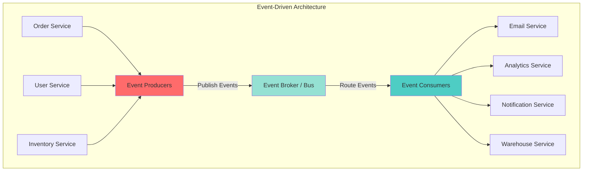

### 1. Event Producers

Services that publish events when something significant happens. Your order service is a producer when it publishes "OrderPlaced" events.

> 💡 **Pseudo code** - Simplified for illustration purposes

```csharp
using System;
using System.Collections.Generic;
using System.Text.Json;
using Confluent.Kafka;

public class OrderEventProducer
{
    private readonly IProducer<string, string> producer;

    public OrderEventProducer()
    {
        var config = new ProducerConfig { BootstrapServers = "localhost:9092" };
        producer = new ProducerBuilder<string, string>(config).Build();
    }

    public void PublishOrderPlaced(Order order)
    {
        var eventObj = new
        {
            eventId = Guid.NewGuid().ToString(),
            eventType = "OrderPlaced",
            eventVersion = "1.0",
            timestamp = DateTime.UtcNow.ToString("o"),
            source = "order-service",
            correlationId = order.CorrelationId,
            data = new
            {
                orderId = order.Id,
                customerId = order.CustomerId,
                customerEmail = order.CustomerEmail,
                totalAmount = order.TotalAmount,
                items = order.Items.ConvertAll(item => new {
                    productId = item.ProductId,
                    quantity = item.Quantity,
                    price = item.Price
                })
            }
        };

        var eventJson = JsonSerializer.Serialize(eventObj);
        producer.Produce("orders", new Message<string, string> { Value = eventJson });
        producer.Flush();

        Console.WriteLine($"✅ Published OrderPlaced event: {eventObj.eventId}");
    }
}

public class Order
{
    public string CorrelationId { get; set; }
    public string Id { get; set; }
    public string CustomerId { get; set; }
    public string CustomerEmail { get; set; }
    public decimal TotalAmount { get; set; }
    public List<OrderItem> Items { get; set; }
}

public class OrderItem
{
    public string ProductId { get; set; }
    public int Quantity { get; set; }
    public decimal Price { get; set; }
}
```

### 2. Event Broker (Event Bus)

The middleman that receives events from producers and delivers them to consumers. Think of it as a smart post office for events.

**Popular Event Brokers:**
- **Apache Kafka** - High throughput, distributed, event streaming
- **RabbitMQ** - Traditional message queue with routing
- **AWS EventBridge** - Managed serverless event bus
- **Azure Event Hubs** - Cloud-native event streaming
- **Google Cloud Pub/Sub** - Global event messaging

**What the broker provides:**
- **Durability** - Events are stored and won't be lost
- **Routing** - Deliver events to the right consumers
- **Scalability** - Handle millions of events per second
- **Replay** - Consumers can reprocess old events
- **Multiple consumers** - Same event to many services

### 3. Event Consumers

Services that subscribe to and react to events. Your email service consumes "OrderPlaced" events to send confirmations.

> 💡 **Pseudo code** - Simplified for illustration purposes

```csharp
using System;
using System.Text.Json;
using Confluent.Kafka;

public class EmailEventConsumer
{
    private readonly IConsumer<string, string> consumer;

    public EmailEventConsumer()
    {
        var config = new ConsumerConfig
        {
            BootstrapServers = "localhost:9092",
            GroupId = "email-service",
            AutoOffsetReset = AutoOffsetReset.Earliest
        };
        consumer = new ConsumerBuilder<string, string>(config).Build();
        consumer.Subscribe("orders");
    }
    
    public void StartConsuming()
    {
        Console.WriteLine("📧 Email Service listening for order events...");
        
        while (true)
        {
            var consumeResult = consumer.Consume();
            var eventObj = JsonSerializer.Deserialize<JsonElement>(consumeResult.Message.Value);
            
            if (eventObj.GetProperty("eventType").GetString() == "OrderPlaced")
            {
                handle_order_placed(eventObj);
            }
        }
    }
    
    private void handle_order_placed(JsonElement eventObj)
    {
        var order_data = eventObj.GetProperty("data");
        
        Console.WriteLine($"📨 Sending confirmation email for order {order_data.GetProperty("orderId").GetString()}");
        Console.WriteLine($"   To: {order_data.GetProperty("customerEmail").GetString()}");
        Console.WriteLine($"   Amount: ${order_data.GetProperty("totalAmount").GetString()}");
        
        // Send email logic here
        send_email(
            to: order_data.GetProperty("customerEmail").GetString(),
            subject: $"Order Confirmation - {order_data.GetProperty("orderId").GetString()}",
            template: "order_confirmation",
            data: order_data
        );
        
        Console.WriteLine($"✅ Email sent for order {order_data.GetProperty("orderId").GetString()}");
    }
    
    private void send_email(string to, string subject, string template, JsonElement data)
    {
        // Email implementation here
    }
}
```

## A Complete Flow Example

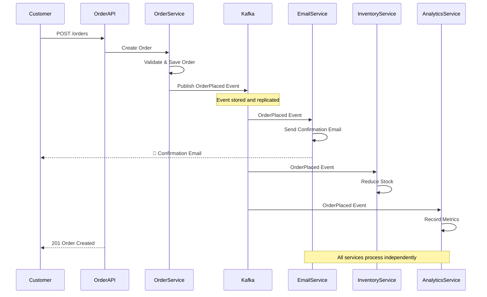

### Complete Working Example
> 💡 **Pseudo code** - Simplified for illustration purposes
```csharp
using System;
using System.Collections.Generic;
using System.Linq;
using System.Text.Json;
using System.Threading;
using Confluent.Kafka;

// === ORDER SERVICE (Producer) ===
public class Order
{
    public string id;
    public string customer_id;
    public string customer_email;
    public List<object> items;
    public decimal total_amount;
    public string correlation_id;

    public Order(string order_id, string customer_id, string customer_email, List<object> items)
    {
        this.id = order_id;
        this.customer_id = customer_id;
        this.customer_email = customer_email;
        this.items = items;
        this.total_amount = items.Cast<Dictionary<string, object>>().Sum(item => (decimal)item["quantity"] * (decimal)item["price"]);
        this.correlation_id = Guid.NewGuid().ToString();
    }
}

public class OrderService
{
    private OrderEventProducer event_producer;

    public OrderService()
    {
        event_producer = new OrderEventProducer();
    }

    public Order place_order(Dictionary<string, object> order_data)
    {
        // 1. Create and save order
        var order = new Order(
            $"ORD-{Guid.NewGuid().ToString("N")[0..8]}",
            (string)order_data["customer_id"],
            (string)order_data["customer_email"],
            (List<object>)order_data["items"]
        );

        // Save to database
        save_to_db(order);

        // 2. Publish event - that's it!
        event_producer.publish_order_placed(order);

        return order;
    }

    private void save_to_db(Order order)
    {
        // Database implementation here
    }
}

// === EMAIL SERVICE (Consumer) ===
public class EmailService
{
    private EmailEventConsumer consumer;

    public EmailService()
    {
        consumer = new EmailEventConsumer();
    }

    public void run()
    {
        consumer.start_consuming();
    }
}

// === INVENTORY SERVICE (Consumer) ===
public class InventoryEventConsumer
{
    private IConsumer<string, string> consumer;

    public InventoryEventConsumer()
    {
        var config = new ConsumerConfig
        {
            BootstrapServers = "localhost:9092",
            GroupId = "inventory-service"
        };
        consumer = new ConsumerBuilder<string, string>(config).Build();
        consumer.Subscribe("orders");
    }

    public void start_consuming()
    {
        Console.WriteLine("📦 Inventory Service listening for order events...");

        while (true)
        {
            var message = consumer.Consume();
            var eventObj = JsonSerializer.Deserialize<JsonElement>(message.Message.Value);

            if (eventObj.GetProperty("eventType").GetString() == "OrderPlaced")
            {
                handle_order_placed(eventObj);
            }
        }
    }

    private void handle_order_placed(JsonElement eventObj)
    {
        var order_data = eventObj.GetProperty("data");

        Console.WriteLine($"📦 Updating inventory for order {order_data.GetProperty("orderId").GetString()}");

        foreach (var item in order_data.GetProperty("items").EnumerateArray())
        {
            reduce_stock(item.GetProperty("productId").GetString(), (int)item.GetProperty("quantity").GetInt32());
            Console.WriteLine($"   Reduced stock for {item.GetProperty("productId").GetString()}: -{item.GetProperty("quantity").GetInt32()}");
        }

        Console.WriteLine($"✅ Inventory updated for order {order_data.GetProperty("orderId").GetString()}");
    }

    private void reduce_stock(string productId, int quantity)
    {
        // Inventory logic here
    }
}

// === ANALYTICS SERVICE (Consumer) ===
public class AnalyticsEventConsumer
{
    private IConsumer<string, string> consumer;
    private decimal total_revenue = 0;
    private int order_count = 0;

    public AnalyticsEventConsumer()
    {
        var config = new ConsumerConfig
        {
            BootstrapServers = "localhost:9092",
            GroupId = "analytics-service"
        };
        consumer = new ConsumerBuilder<string, string>(config).Build();
        consumer.Subscribe("orders");
    }

    public void start_consuming()
    {
        Console.WriteLine("📊 Analytics Service listening for order events...");

        while (true)
        {
            var message = consumer.Consume();
            var eventObj = JsonSerializer.Deserialize<JsonElement>(message.Message.Value);

            if (eventObj.GetProperty("eventType").GetString() == "OrderPlaced")
            {
                handle_order_placed(eventObj);
            }
        }
    }

    private void handle_order_placed(JsonElement eventObj)
    {
        var order_data = eventObj.GetProperty("data");

        order_count++;
        total_revenue += decimal.Parse(order_data.GetProperty("totalAmount").GetString());

        Console.WriteLine("📊 Analytics updated:");
        Console.WriteLine($"   Total Orders: {order_count}");
        Console.WriteLine($"   Total Revenue: ${total_revenue:F2}");
        Console.WriteLine($"   Average Order Value: ${total_revenue/order_count:F2}");
    }
}

// === RUNNING THE SYSTEM ===
class Program
{
    static void Main(string[] args)
    {
        // Start consumers in separate threads
        var email_service = new EmailService();
        var inventory_service = new InventoryService();  // Note: needs InventoryService class with run() method
        var analytics_service = new AnalyticsService();  // Note: needs AnalyticsService class with run() method

        var emailThread = new Thread(() => email_service.run(), true) { IsBackground = true };
        var inventoryThread = new Thread(() => inventory_service.run(), true) { IsBackground = true };
        var analyticsThread = new Thread(() => analytics_service.run(), true) { IsBackground = true };

        emailThread.Start();
        inventoryThread.Start();
        analyticsThread.Start();

        // Give consumers time to start
        Thread.Sleep(2000);

        // Place some orders
        var order_service = new OrderService();

        order_service.place_order(new Dictionary<string, object>
        {
            ["customer_id"] = "CUST-001",
            ["customer_email"] = "john@example.com",
            ["items"] = new List<object>
            {
                new Dictionary<string, object> { ["productId"] = "PROD-001", ["quantity"] = 2, ["price"] = 29.99m },
                new Dictionary<string, object> { ["productId"] = "PROD-002", ["quantity"] = 1, ["price"] = 49.99m }
            }
        });
    }
}
    // Watch the magic happen across all services!
```

## Key Benefits Illustrated

### 1. Loose Coupling

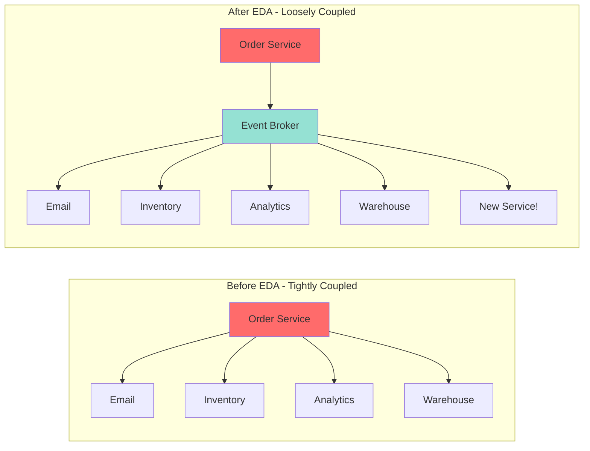

**Adding a new fraud detection service:**

Before EDA:

> 💡 **Pseudo code** - Simplified for illustration purposes

```csharp
// Must modify OrderService code
public void place_order(object order_data)
{
    var payment = payment_client.charge(order_data.payment_info);
    inventory_client.update_stock(order_data.items);
    email_client.send_confirmation(order_data.customer_email);
    // ADD THIS NEW LINE - requires code change!
    fraud_detection_client.check_order(order_data);
}

```

After EDA:

> 💡 **Pseudo code** - Simplified for illustration purposes

```csharp
// Just deploy a new consumer - NO changes to OrderService!
public class FraudDetectionService
{
    private IConsumer<string, string> consumer;

    public FraudDetectionService()
    {
        var config = new ConsumerConfig
        {
            BootstrapServers = "localhost:9092",
            GroupId = "fraud-detection"
        };
        consumer = new ConsumerBuilder<string, string>(config).Build();
        consumer.Subscribe("orders");
    }

    public void run()
    {
        while (true)
        {
            var message = consumer.Consume();
            var eventObj = JsonSerializer.Deserialize<JsonElement>(message.Message.Value);
            if (eventObj.GetProperty("eventType").GetString() == "OrderPlaced")
            {
                check_for_fraud(eventObj.GetProperty("data"));
            }
        }
    }

    private void check_for_fraud(JsonElement data)
    {
        // Fraud detection logic here
    }
}

```

### 2. Independent Scaling

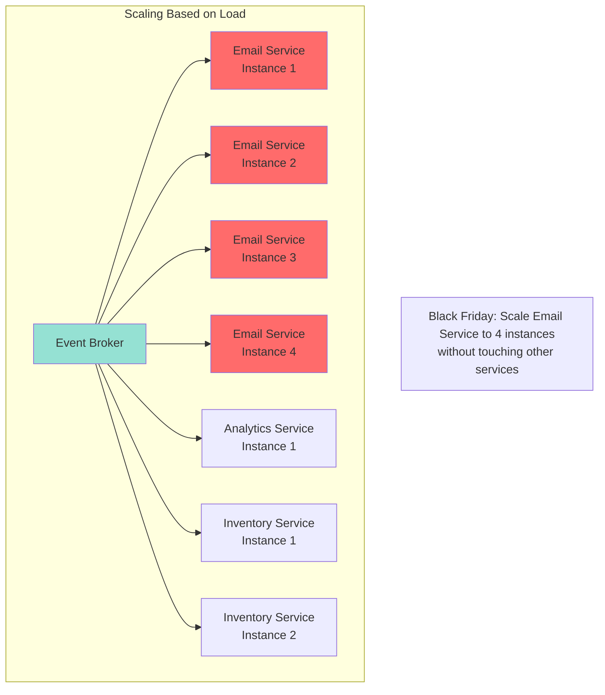

### 3. Resilience

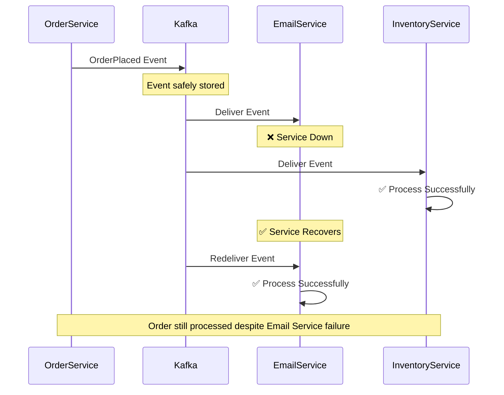

### 4. Flexibility and Evolution

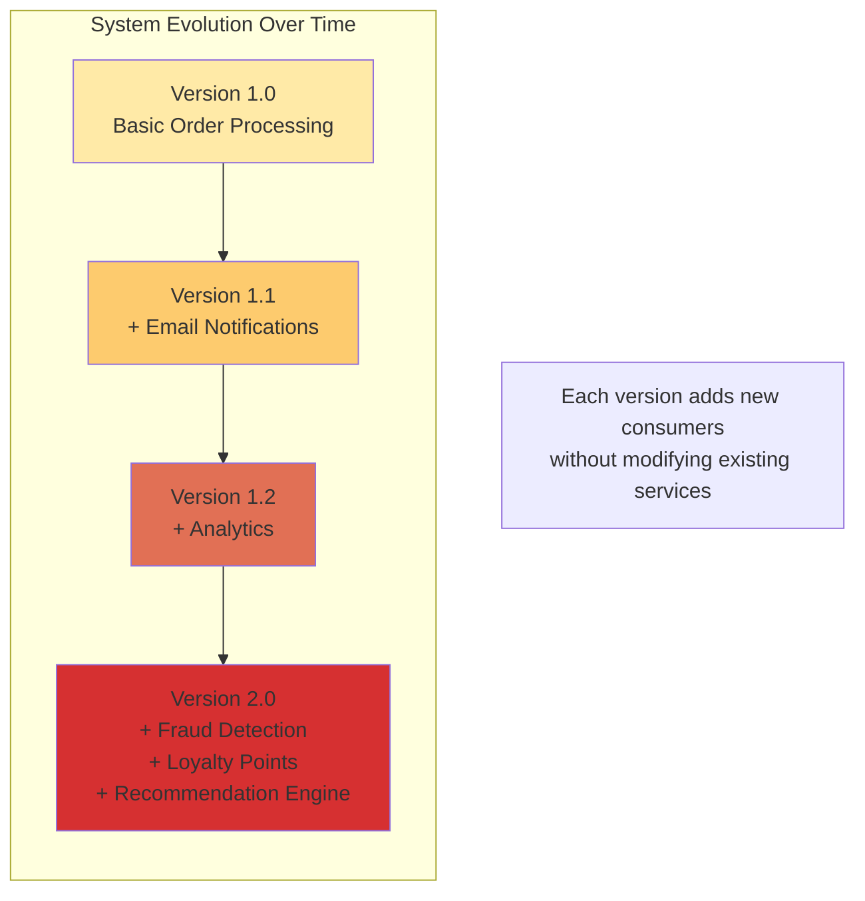

## Real-World Use Cases

### Use Case 1: E-Commerce Order Processing

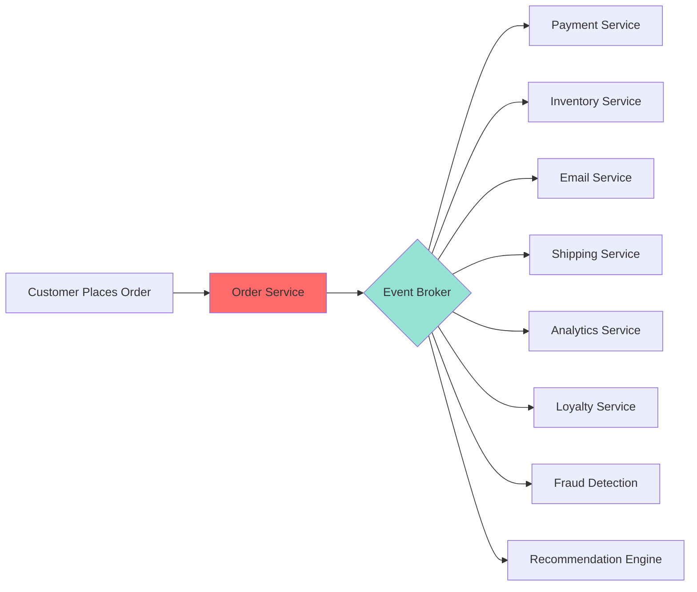

### Use Case 2: IoT Sensor Data Processing

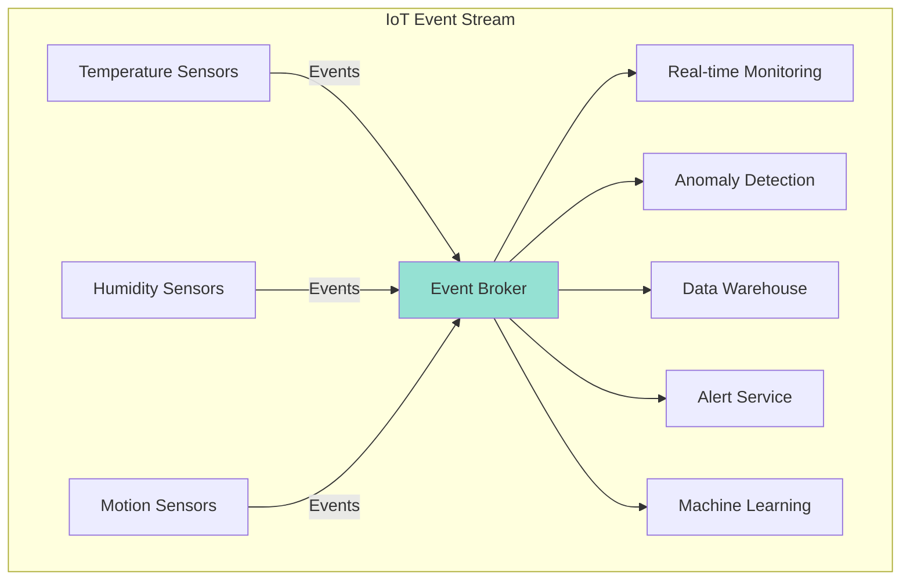

### Use Case 3: User Activity Tracking

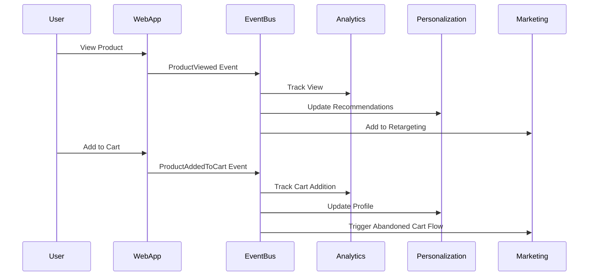

## When to Use EDA

Event-Driven Architecture shines when:

✅ **Multiple systems need to react to the same occurrence**
- One order → email, inventory, shipping, analytics all react

✅ **Services need to operate independently**
- Email service down shouldn't block order placement

✅ **You're building microservices**
- EDA provides natural service boundaries and communication

✅ **Different parts need different scaling**
- Scale email service separately from payment service

✅ **You want to add features without changing existing code**
- New fraud detection? Just add a consumer

✅ **You need an audit trail**
- Events provide natural history of what happened

✅ **Real-time data processing**
- Process streams of events as they occur

## When NOT to Use EDA

EDA might be overkill for:

❌ **Simple CRUD applications**
- If you're just reading and writing data, REST API might be simpler

❌ **Synchronous workflows requiring immediate responses**
- "Process payment and immediately return success/failure"

❌ **Small teams without distributed systems experience**
- EDA adds operational complexity

❌ **Systems requiring strong consistency**
- EDA is eventually consistent by nature

❌ **Tight budget constraints**
- Event brokers add infrastructure costs

---

<div class="try-it-yourself-section">

## Try It Yourself: Your First Event-Driven Application

Now that you understand the theory, let's see Event-Driven Architecture in action. We'll build a simple producer-consumer application that demonstrates the core concepts we've discussed.

### What We'll Build

A simple message producer that sends events to Kafka, and a consumer that reads them. This demonstrates:

- **Event Production** - Publishing events without knowing who consumes them
- **Event Consumption** - Reacting to events independently
- **Decoupling** - Producer and consumer don't know about each other
- **Asynchronous Communication** - Messages flow through Kafka broker

This is the simplest possible EDA example, perfect for understanding the fundamentals.

### Prerequisites

Before we start, make sure you have:

- **Docker** installed (for running Kafka locally)
- **.NET 8.0 SDK**
- **Git** (to clone the repository)

If you don't have Docker yet, don't worry - we'll guide you through the setup.

<div class="try-it-yourself-links">

**📚 Resources:**
- **[GitHub Repository](https://github.com/tomakazoo/kafka-event-driven-architecture) → `examples/01-fundamentals/`** - Complete working code examples
- **[Complete Setup Guide](https://github.com/tomakazoo/kafka-event-driven-architecture/blob/release/docs/QUICKSTART.md)** - Detailed setup instructions

</div>

### Step 1: Quick Setup

First, let's get Kafka running locally. We'll use Docker Compose to spin up a complete Kafka environment in minutes.

```bash
# Clone the repository
git clone https://github.com/tomakazoo/kafka-event-driven-architecture.git
cd kafka-event-driven-architecture

# Start Kafka infrastructure
./scripts/start-kafka.sh

# Verify everything is running
./scripts/verify-docker.sh
```

**What just happened?**

Docker Compose started four services:
- **Zookeeper** - Coordinates the Kafka cluster
- **Kafka Broker** - The event broker (port 9092)
- **Schema Registry** - Manages data schemas
- **Kafka UI** - Web interface at http://localhost:8080

Your Kafka cluster is now running locally! 🎉

### Step 2: Create a Producer

A producer publishes events to Kafka. Let's create a simple one in C#:

```csharp
using Confluent.Kafka;
using System.Text.Json;

class BasicProducer
{
    static async Task Main()
    {
        var config = new ProducerConfig
        {
            BootstrapServers = "localhost:9092"
        };

        using var producer = new ProducerBuilder<string, string>(config).Build();
        var topic = "my-topic";

        for (int i = 0; i < 5; i++)
        {
            var message = new { id = i, value = $"Message {i}" };
            var result = await producer.ProduceAsync(
                topic,
                new Message<string, string>
                {
                    Key = $"key-{i}",
                    Value = JsonSerializer.Serialize(message)
                });
            
            Console.WriteLine($"✅ Delivered to {result.TopicPartitionOffset}");
        }
        
        producer.Flush(TimeSpan.FromSeconds(5));
    }
}
```

**What this code does:**

1. Creates a producer connected to `localhost:9092`
2. Publishes 5 messages to topic `my-topic`
3. Each message has a key and JSON value
4. Kafka auto-creates the topic when the first message arrives

**Run it:**

```bash
cd examples/01-fundamentals/dotnet
dotnet run --project BasicProducer.csproj
```

**Expected output:**

```
🚀 Starting Kafka Producer...
📡 Connecting to: localhost:9092
✅ Producer created successfully
📤 Producing to topic: my-topic
✅ Delivered to my-topic [[0]] @0
✅ Delivered to my-topic [[0]] @1
✅ Delivered to my-topic [[0]] @2
✅ Delivered to my-topic [[0]] @3
✅ Delivered to my-topic [[0]] @4
✅ All messages delivered successfully!
```

**What happened?**

- The producer sent 5 messages to Kafka
- Kafka stored them in partition 0 of `my-topic`
- Each message got an offset (0, 1, 2, 3, 4)
- The messages are now **persisted** in Kafka, waiting to be consumed


*Producer successfully delivering messages to Kafka*

### Step 3: Create a Consumer

Now let's create a consumer that reads these messages:

```csharp
using Confluent.Kafka;

class BasicConsumer
{
    static void Main()
    {
        var config = new ConsumerConfig
        {
            BootstrapServers = "localhost:9092",
            GroupId = "dotnet-consumer-group",
            AutoOffsetReset = AutoOffsetReset.Earliest
        };

        using var consumer = new ConsumerBuilder<string, string>(config).Build();
        consumer.Subscribe("my-topic");

        var cts = new CancellationTokenSource();
        Console.CancelKeyPress += (_, e) =>
        {
            e.Cancel = true;
            cts.Cancel();
        };

        try
        {
            while (!cts.Token.IsCancellationRequested)
            {
                var result = consumer.Consume(cts.Token);
                Console.WriteLine($"Received: {result.Message.Value}");
            }
        }
        finally
        {
            consumer.Close();
        }
    }
}
```

**What this code does:**

1. Creates a consumer in group `dotnet-consumer-group`
2. Subscribes to `my-topic`
3. Reads from the **earliest** offset (gets all messages)
4. Continuously polls for new messages
5. Prints each message to console

**Run it:**

```bash
# In a new terminal
cd examples/01-fundamentals/dotnet
dotnet run --project BasicConsumer.csproj
```

**Expected output:**

```
Received: {"id":0,"value":"Message 0"}
Received: {"id":1,"value":"Message 1"}
Received: {"id":2,"value":"Message 2"}
Received: {"id":3,"value":"Message 3"}
Received: {"id":4,"value":"Message 4"}
(waiting for more messages...)
```

**What happened?**

- The consumer read all 5 messages we produced earlier
- Messages were delivered in order
- The consumer is now waiting for new messages
- Press Ctrl+C to stop it


*Consumer successfully receiving messages from Kafka*

### Step 4: View Events in Kafka UI

Kafka UI provides a visual interface to explore your events. Open **http://localhost:8080** in your browser.

**Navigate to:** Topics → my-topic → Messages


*Viewing messages in Kafka UI - showing all messages with keys, values, and timestamps*

**What you can see:**

- **All messages** with their keys and values
- **JSON formatted** nicely for readability
- **Timestamps** showing when each message was produced
- **Partition and offset** information
- **Message metadata** (headers, size, etc.)

**Try this:**

1. Keep the consumer running
2. Run the producer again in another terminal
3. Watch the consumer **immediately** display the new messages
4. See the new messages appear in Kafka UI

This demonstrates Kafka's **real-time streaming** capability!

### What You Just Learned

Congratulations! You've just built your first event-driven application. Here's what happened:

✅ **Events are immutable** - Once published, they're stored permanently in Kafka

✅ **Producers don't know consumers** - The producer just publishes events. It doesn't know who (or if anyone) is listening.

✅ **Consumers react independently** - The consumer reads events at its own pace, independently of the producer.

✅ **Decoupling through events** - Producer and consumer are completely decoupled. They only know about Kafka, not each other.

✅ **Asynchronous by default** - Messages flow through Kafka asynchronously. The producer doesn't wait for consumers.

✅ **Events persist** - Messages are stored on disk. Consumers can re-read them, and new consumers can read historical events.

This simple example demonstrates the core principles of Event-Driven Architecture. In Part 4, we'll build a complete microservices system with multiple services communicating through events.

### Next Steps with This Example

You've seen EDA in action! Here's what you can try next:

**Experiment with the code:**
- Modify the producer to send different messages
- Create multiple consumers in the same group
- Create consumers in different groups
- Try stopping and restarting consumers

**Explore the full example:**
- [GitHub Repository](https://github.com/tomakazoo/kafka-event-driven-architecture) → `examples/01-fundamentals/`
- [Complete Setup Guide](https://github.com/tomakazoo/kafka-event-driven-architecture/blob/release/docs/QUICKSTART.md)

</div>

---

## Getting Started: A Practical Roadmap

### Phase 1: Start Small (Week 1-2)
1. Identify one workflow in your system
2. Set up a local Kafka instance
3. Create one producer and one consumer
4. Test with simple events

### Phase 2: Add Complexity (Week 3-4)
1. Add 2-3 more consumers
2. Implement proper error handling
3. Add monitoring and logging
4. Test failure scenarios

### Phase 3: Production Ready (Week 5-8)
1. Set up proper Kafka cluster
2. Implement schema versioning
3. Add comprehensive monitoring
4. Create runbooks for operations
5. Load test the system

### Phase 4: Scale and Optimize (Ongoing)
1. Tune Kafka configuration
2. Optimize consumer performance
3. Add more event-driven workflows
4. Refine based on learnings

## Common Misconceptions

### Misconception 1: "EDA means no synchronous communication"

**Reality:** EDA and REST APIs can coexist. Use events for notifications and async workflows. Use APIs for queries and sync operations.

```csharp
// Query - Use REST API
GET /orders/ORD-123  // Synchronous, immediate response

// Command - Use Events
POST /orders  // Create order, publish event, let services react asynchronously
```

### Misconception 2: "EDA solves all problems"

**Reality:** EDA introduces complexity. Only use it when the benefits outweigh the costs.

### Misconception 3: "Events should be tiny"

**Reality:** Events should be self-contained with enough data for consumers to act without additional calls.

### Misconception 4: "EDA is only for big companies"

**Reality:** Even small applications can benefit from EDA's decoupling and flexibility.

## Next Steps

In Part 2, we'll dive deep into event design:
- Event notification vs. event-carried state transfer vs. event sourcing
- Designing events that stand the test of time
- Schema evolution strategies
- Granularity: fine vs. coarse events
- Common event design mistakes and how to avoid them

Event-Driven Architecture represents a fundamental shift in how we think about system design. Instead of orchestrating every action, we choreograph responses to events. It's the difference between a conductor directing every musician and musicians who know how to respond when they hear their cue.

Ready to design great events? Let's move on to Part 2! 🚀

---

**Key Takeaways:**
1. EDA decouples services through events
2. Producers publish events, brokers route them, consumers react
3. Benefits: loose coupling, scalability, resilience, flexibility
4. Use when multiple systems react to the same occurrence
5. Start small and iterate

