# Part 2: Designing Events - The Heart of Event-Driven Architecture

## Introduction

In Part 1, we learned the fundamentals of Event-Driven Architecture. Now comes the most critical aspect: **designing good events**. Poor event design leads to tight coupling, versioning nightmares, and systems that are hard to evolve.

Great event design creates flexible, maintainable systems that stand the test of time.

## The Three Fundamental Event Patterns

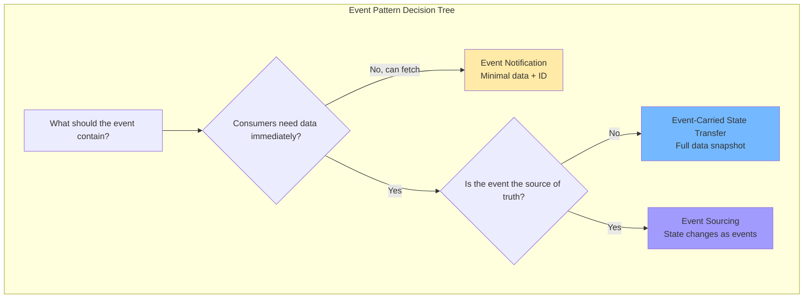

### Pattern 1: Event Notification

The simplest pattern. An event announces that something happened, with minimal data. Consumers that need more information fetch it via API.

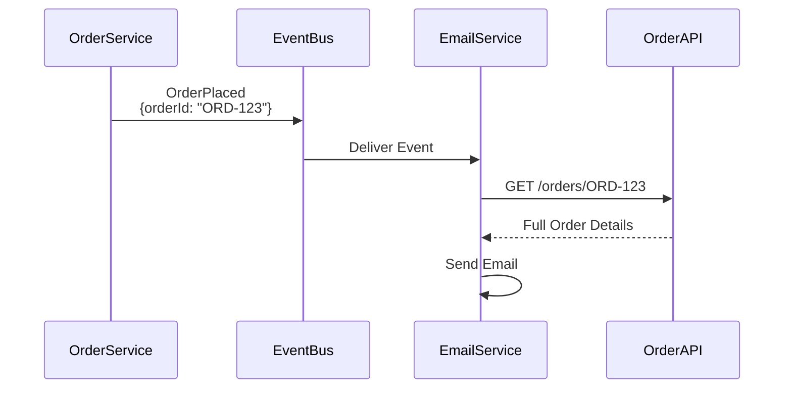

**The simplest pattern.** An event announces that something happened, with minimal data. Think of it as a ping: "Hey, something interesting just occurred!" Consumers that need more information fetch it via API.

**How it works:**
1. A service publishes a lightweight event containing just an ID and event type
2. Interested consumers receive the notification
3. If a consumer needs details, it calls back to the source service's API

**Example:** When an order is placed, the event just says "OrderPlaced with ID: ORD-123". An email service receives this, then fetches full order details from the Order API to send a confirmation email.

> 💡 **Working Example:** A complete implementation of this pattern can be found in the [kafka-event-driven-architecture repository](https://github.com/tomakazoo/kafka-event-driven-architecture/blob/release/examples/01-fundamentals/HOW-TO-RUN.md).

**Pros:**
- ✅ Lightweight events (low network overhead)
- ✅ Source of truth stays with owning service
- ✅ Easy to implement
- ✅ No data duplication

**Cons:**
- ❌ Consumers must make additional API calls (latency)
- ❌ Creates coupling to producer's API
- ❌ Consumers fail if producer API is down
- ❌ Higher total latency

**When to use:**
- Events happen frequently but consumers rarely need full details
- Data is large and shouldn't be duplicated
- Strong consistency is important
- Source service has good uptime SLA

**Real-world example:**
GitHub webhooks work this way. You get a notification that a pull request was opened with just the PR ID, then you fetch the full details via GitHub's API if needed.
> 💡 **Pseudo code** - Simplified for illustration purposes
```csharp
// GitHub webhook - minimal notification
{
    "eventType": "PullRequestOpened",
    "repositoryId": "repo-123",
    "pullRequestId": "pr-456",
    "timestamp": "2025-11-01T10:30:00Z"
}


// Consumer fetches details via GitHub API
pr_details = github_api.get_pull_request("repo-123", "pr-456");
```

### Pattern 2: Event-Carried State Transfer

The event carries all the data consumers need, eliminating additional API calls. This is the most common pattern in modern event-driven systems.

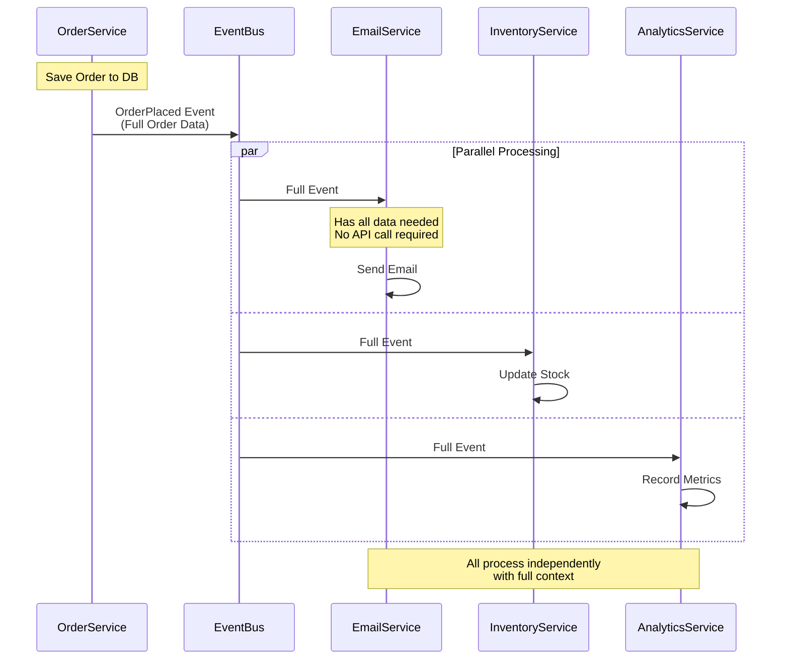
**The most common pattern in modern event-driven systems.** The event carries all the data consumers need, eliminating additional API calls. It's like sending a complete package rather than just a tracking number.

**How it works:**
1. A service publishes an event with full contextual data
2. Consumers receive everything they need to act immediately
3. No additional API calls required
4. Multiple consumers can process independently and in parallel

**Example:** When an order is placed, the event includes order ID, customer details, items purchased, shipping address, payment info - everything needed. The email service can immediately send a confirmation, the inventory service can update stock, and the analytics service can record metrics - all without calling back to the Order service.

> 💡 **Working Example:** A complete implementation of the Event-Carried State Transfer pattern can be found in the [kafka-event-driven-architecture repository](https://github.com/tomakazoo/kafka-event-driven-architecture/blob/release/examples/02-core-concepts/dotnet/event-carried-state-trf/HOW-TO-RUN.md). The example demonstrates how multiple services (Email, Inventory, and Analytics) process events autonomously with all necessary data included in the event payload.

**Pros:**
- ✅ Consumers are fully autonomous (no external dependencies)
- ✅ No coupling to producer APIs
- ✅ Better performance (no extra calls)
- ✅ Works even when producer service is down
- ✅ Lower total latency
- ✅ Can process events offline

**Cons:**
- ❌ Larger events (higher network overhead)
- ❌ Data duplication across services
- ❌ Consumers might have slightly stale data
- ❌ Schema evolution is more critical

**When to use:**
- Consumers need the data immediately
- Service autonomy is important
- The producer service might be unavailable
- Network calls between services are expensive
- Multiple consumers need the same data

**Size considerations:**
> 💡 **Pseudo code** - Simplified for illustration purposes
```csharp
using System.Text;
using System.Text.Json;

// Calculate event size
var eventObj = new { /* Your event */ };
var eventJson = JsonSerializer.Serialize(eventObj);
var eventSizeBytes = Encoding.UTF8.GetByteCount(eventJson);

Console.WriteLine($"Event size: {eventSizeBytes / 1024.0:F2} KB");

```

**Size considerations:**
* **< 10 KB:** Perfect for event-carried state transfer
* **10-100 KB:** Acceptable, consider compression
* **> 100 KB:** Consider event notification + API call
* **> 1 MB:** Definitely use event notification or store in S3/blob storage

**Handling large data:** For very large data like images or documents, include a reference URL (e.g., S3 link) in the event rather than the actual content. Consumers can download from the external storage only if needed.

---

### Pattern 3: Event Sourcing

**The most advanced pattern.** Instead of storing current state, you store every event that ever happened. Current state is derived by replaying events. Think of it as keeping a complete ledger of all transactions rather than just the current account balance.

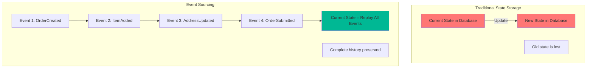
**How it works:**
1. Every state change is captured as an immutable event
2. Events are stored in an append-only log (Event Store)
3. Current state is rebuilt by replaying all events from the beginning
4. You can see what the state was at any point in history

**Example:** For a bank account, instead of storing just the current balance, you store every transaction: AccountOpened, MoneyDeposited, MoneyWithdrawn, InterestCredited. To know the current balance, you replay all these events. To know the balance last month, you replay events up to that date.

**The key concepts:**

**Commands produce events:**
- `CreateOrder()` → produces `OrderCreated` event
- `AddItem()` → produces `ItemAdded` event
- `Submit()` → produces `OrderSubmitted` event

**Events rebuild state:**
When you need to work with an order, you load all its events from the Event Store and replay them to reconstruct the current state. Each event modifies the state in memory.

**Time travel:**
Want to know what an order looked like yesterday? Just replay events up to yesterday's timestamp. This is impossible with traditional databases where you only store current state.

**Performance optimization with snapshots:**
Instead of replaying thousands of events every time, you can create snapshots. A snapshot is like a saved game - you store the state at event 1000, then only need to replay events 1001-2000 to get current state. This dramatically improves performance for long-lived entities.

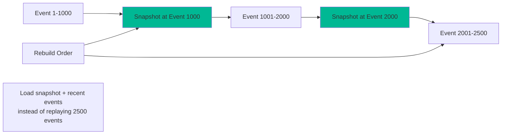
**For a complete working example of Event Sourcing in C#, check out the [Event Sourcing example](https://github.com/tomakazoo/kafka-event-driven-architecture/tree/release/examples/06-event-sourcing/dotnet) in my GitHub repository.**

**Pros:**
- ✅ Complete audit trail (compliance, debugging)
- ✅ Time travel (see state at any point in history)
- ✅ Rebuild state from events (disaster recovery)
- ✅ Business insights from event history
- ✅ Support for temporal queries
- ✅ Can add new projections from historical events

**Cons:**
- ❌ Significant complexity
- ❌ Event schema evolution is critical
- ❌ Replaying thousands of events is slow (need snapshots)
- ❌ Eventually consistent
- ❌ Steeper learning curve

**When to use:**
- Audit trail is critical (finance, healthcare, legal)
- Need to reconstruct historical state
- Complex business logic that benefits from event-driven modeling
- Compliance requirements for data retention
- Domain is naturally event-driven (banking transactions, medical records)

**Real-world examples:**
- **Banking:** Every transaction (deposit, withdrawal, interest) is an event. Current balance is derived by replaying all transactions. Complete audit trail for regulatory compliance.
- **Medical records:** Patient admissions, prescriptions, lab tests, and discharges are all events. Complete medical history preserved for HIPAA compliance and medical research.
> 💡 **Pseudo code** - Simplified for illustration purposes
```csharp
// Banking - Perfect for event sourcing
var events = new List<object>
{
    new AccountOpened { AccountId = "ACC-123", InitialBalance = 1000 },
    new MoneyDeposited { AccountId = "ACC-123", Amount = 500 },
    new MoneyWithdrawn { AccountId = "ACC-123", Amount = 200 },
    new InterestCredited { AccountId = "ACC-123", Amount = 2.50m }
};
// Current balance = replay events = 1302.50
// Complete audit trail of every transaction

// Medical records - Event sourcing for compliance
var medicalEvents = new List<object>
{
    new PatientAdmitted { PatientId = "PAT-789", Diagnosis = "..." },
    new MedicationPrescribed { PatientId = "PAT-789", Medication = "..." },
    new LabTestOrdered { PatientId = "PAT-789", Test = "..." },
    new LabResultsRecorded { PatientId = "PAT-789", Results = "..." },
    new PatientDischarged { PatientId = "PAT-789" }
};
// Complete medical history, HIPAA compliant audit trail
```

## Event Design Principles

### Principle 1: Events Should Be Self-Contained

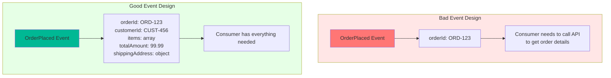

**Bad:**
```json
{
  "eventType": "OrderPlaced",
  "orderId": "ORD-123"
}
```

Consumer must call API: "What's in this order? Who's the customer? Where to ship?"

**Good:**
```json
{
  "eventType": "OrderPlaced",
  "eventId": "evt_7a8b9c",
  "timestamp": "2025-11-01T10:30:00Z",
  "data": {
    "orderId": "ORD-123",
    "customerId": "CUST-456",
    "customerEmail": "customer@example.com",
    "totalAmount": 99.99,
    "items": [
      {
        "productId": "PROD-001",
        "quantity": 2,
        "price": 49.99
      }
    ],
    "shippingAddress": {
      "street": "123 Main St",
      "city": "Boston",
      "state": "MA",
      "zip": "02101"
    }
  }
}
```

Consumer has everything needed to act immediately.

### Principle 2: Use Past Tense for Event Names

Events are facts about what happened, not commands about what to do.

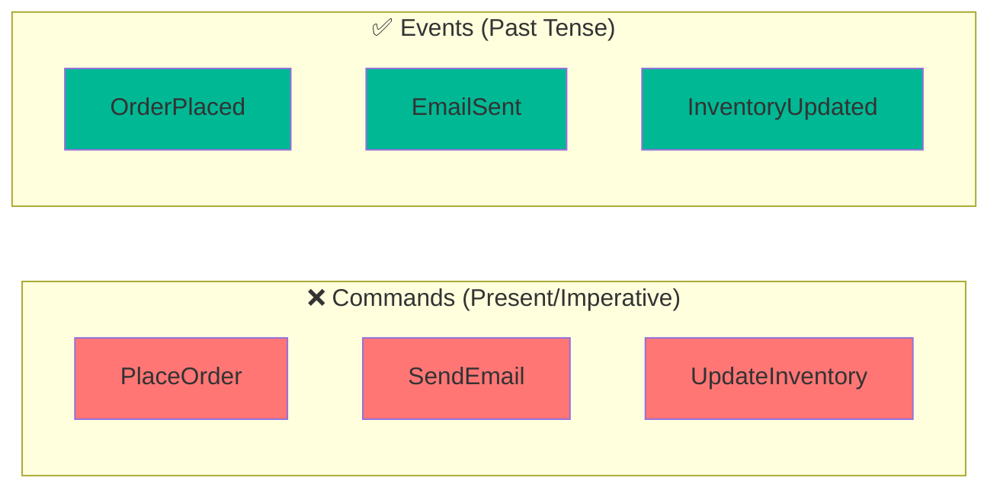

**Bad (Commands):**
- `PlaceOrder` - Tells what to do
- `SendConfirmationEmail` - Directive
- `UpdateInventory` - Imperative

**Good (Events):**
- `OrderPlaced` - States what happened
- `ConfirmationEmailSent` - Past tense
- `InventoryUpdated` - Fact

**Why it matters:**
> 💡 **Pseudo code** - Simplified for illustration purposes
```csharp
// Command - prescriptive
var commandEvent = new { eventType = "SendEmail", to = "customer@example.com" };
// This tells consumers what to do. Only email service should react.

// Event - descriptive
var eventObj = new { eventType = "OrderPlaced", orderId = "ORD-123", /* ... */ };
// This states what happened. Multiple services can decide how to react:
// - Email service: "I'll send an email"
// - SMS service: "I'll send an SMS"
// - Push notification service: "I'll send a push notification"
```

### Principle 3: Include Essential Metadata

Every event should include metadata that helps with debugging, tracing, and versioning:

**Identity:**
- `eventId`: Unique ID for deduplication
- `eventType`: What happened
- `eventVersion`: Schema version

**Timing:**
- `timestamp`: When it happened

**Tracing:**
- `correlationId`: Groups related events across services
- `causationId`: The event that caused this one

**Source:**
- `source`: Which service produced this
- `sourceVersion`: Version of producing service

**Actor (for audit):**
- `userId`: Who triggered this
- `userAgent`: How they triggered it

```csharp
var eventObj = new
{
    // Identity
    eventId = "evt_7a8b9c0d", // Unique ID for deduplication
    eventType = "OrderPlaced", // What happened
    eventVersion = "1.0", // Schema version
    
    // Timing
    timestamp = "2025-11-01T10:30:00Z", // When it happened
    
    // Tracing
    correlationId = "corr_12345", // Groups related events
    causationId = "evt_previous", // The event that caused this one
    
    // Source
    source = "order-service", // Which service produced this
    sourceVersion = "2.3.1", // Version of producing service
    
    // Actor (for audit)
    userId = "user-789", // Who triggered this
    userAgent = "Mozilla/5.0...", // How they triggered it
    
    // Data
    data = new
    {
        // Event payload
    }
};
```

**Correlation ID for distributed tracing:** When a user places an order, that single action triggers a cascade of events across multiple services. By including the same `correlationId` in all related events (OrderPlaced, EmailSent, InventoryReserved, ShipmentScheduled), you can trace the entire flow through your system logs.

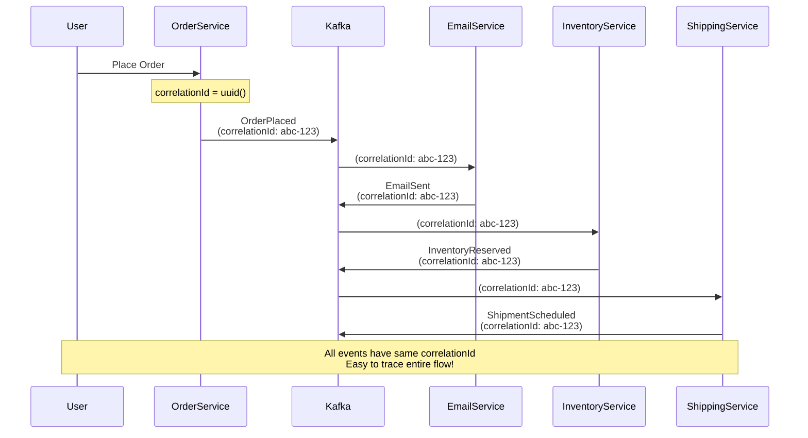

### Principle 4: Design for Evolution

Events live forever in your system. You need to design them to evolve gracefully.

**Adding fields (backward compatible):**
Start with version 1.0, then add optional fields in version 1.1:
- Old consumers ignore fields they don't understand ✅
- New consumers handle both versions ✅

**Breaking changes (carefully managed):**
If you need to fundamentally change the structure (version 2.0), you must:
1. Keep producing both versions for a transition period
2. Update all consumers to handle both versions
3. Only after all consumers are updated, stop producing the old version
4. Eventually remove old version handling code

```csharp
// Version 1.0
var eventV1 = new
{
    eventVersion = "1.0",
    eventType = "OrderPlaced",
    data = new
    {
        orderId = "ORD-123",
        customerId = "CUST-456",
        totalAmount = 99.99
    }
};

// Version 1.1 - Adding optional fields (backward compatible)
var eventV1_1 = new
{
    eventVersion = "1.1",
    eventType = "OrderPlaced",
    data = new
    {
        orderId = "ORD-123",
        customerId = "CUST-456",
        totalAmount = 99.99,
        currency = "USD", // New field with default
        taxAmount = 8.50  // New field with default
    }
};

// Old consumers ignore new fields ✅
// New consumers handle both versions ✅

// Version 2.0 - Breaking change (carefully managed)
var eventV2 = new
{
    eventVersion = "2.0",
    eventType = "OrderPlaced",
    data = new
    {
        orderId = "ORD-123",
        customer = new // Changed: nested object instead of just ID
        {
            id = "CUST-456",
            email = "customer@example.com",
            name = "Jane Smith"
        },
        totalAmount = 99.99
    }
};
```

**Schema evolution strategy:**
1. Version 1.0 released
2. Add v1.1 producer (old consumers still work)
3. Update consumers to handle both v1.0 and v1.1
4. Once all consumers updated, stop producing v1.0
5. Eventually remove v1.0 handling code

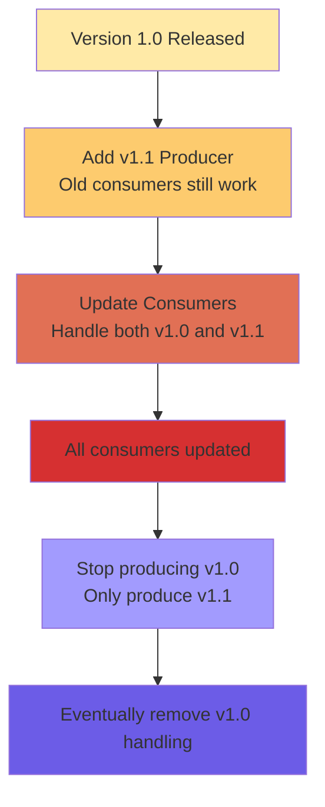

### Principle 5: Keep Events at the Right Granularity

```mermaid
graph TB
    subgraph "Too Fine-Grained ❌"
        A1[UserStartedTyping]
        A1 --> A2[UserTypedCharacter: 'H']
        A2 --> A3[UserTypedCharacter: 'e']
        A3 --> A4[UserTypedCharacter: 'l']
        A4 --> A5[UserTypedCharacter: 'l']
        A5 --> A6[UserTypedCharacter: 'o']
        A6 --> A7[UserStoppedTyping]
    end
    
    subgraph "Too Coarse-Grained ❌"
        B1[UserCompletedEntireWorkflow]
        Note1[Loses important details]
    end
    
    subgraph "Just Right ✅"
        C1[FormStarted]
        C1 --> C2[FieldCompleted: Name]
        C2 --> C3[FieldCompleted: Email]
        C3 --> C4[FormSubmitted]
    end
    
    style A1 fill:#ff7675
    style B1 fill:#ff7675
    style C1 fill:#00b894
```

**Finding the right granularity:**
**Too fine-grained:** Events like `UserTypedCharacter: 'H'`, `UserTypedCharacter: 'e'` create excessive noise and eventual consistency issues.

**Too coarse-grained:** A single event like `UserCompletedEntireWorkflow` loses important lifecycle details.

**Just right:** Events like `FormStarted`, `FieldCompleted: Name`, `FieldCompleted: Email`, `FormSubmitted` capture meaningful stages without being chatty.

**Order example - finding the right granularity:**

**Too fine:** OrderCreated, Item1Added, Item2Added, Item1QuantityIncreased, Item3Added, Item2Removed, ShippingAddressLineOneSet, ShippingAddressCitySet... (Too chatty!)

**Too coarse:** OrderCompleted (Loses important lifecycle stages)

**Just right:** OrderPlaced, PaymentReceived, OrderShipped, OrderDelivered (Clear lifecycle, meaningful stages)

```csharp
// Order example - granularity options

// Option 1: Too fine-grained ❌
var fineGrainedEvents = new[]
{
    "OrderCreated",
    "Item1Added",
    "Item2Added",
    "Item1QuantityIncreased",
    "Item3Added",
    "Item2Removed",
    "ShippingAddressLineOneSet",
    "ShippingAddressCitySet",
    "ShippingAddressStateSet",
    "PaymentMethodSet",
    "OrderSubmitted"
};
// Too chatty, eventual consistency issues

// Option 2: Too coarse-grained ❌
var coarseGrainedEvents = new[]
{
    "OrderCompleted" // Everything in one event
};
// Loses important lifecycle stages

// Option 3: Just right ✅
var justRightEvents = new[]
{
    "OrderPlaced",      // Order submitted with all items
    "PaymentReceived",  // Payment processed
    "OrderShipped",     // Warehouse shipped it
    "OrderDelivered"    // Customer received it
};
// Clear lifecycle, meaningful stages
```

## Event Schema Evolution

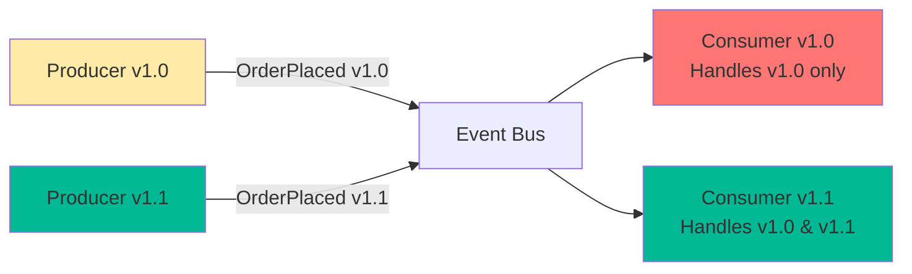
Your event schemas will evolve. Here's how to handle it safely:

### Strategy 1: Backward Compatibility (Safe)

New producers can be consumed by old consumers.
**Example:** You add an optional "currency" field to version 1.1 of OrderPlaced. Old consumers (version 1.0) simply ignore this field they don't know about. Everything continues working.

> 💡 **Pseudo code** - Simplified for illustration purposes
```csharp
// Old consumer (v1.0)
public void HandleOrderPlaced(Dictionary<string, object> eventObj)
{
    var data = (Dictionary<string, object>)eventObj["data"];
    var orderId = data["orderId"].ToString();
    var amount = (double)data["totalAmount"];
    // Ignores any new fields it doesn't know about ✅
}

// New event (v1.1) adds optional field
var newEvent = new
{
    eventVersion = "1.1",
    data = new
    {
        orderId = "ORD-123",
        totalAmount = 99.99,
        currency = "USD" // New field
    }
};
// Old consumer still works! ✅
```

### Strategy 2: Forward Compatibility (Harder)

Old producers can be consumed by new consumers.
**Example:** Your new consumer (version 1.1) expects a "currency" field. When it receives an old event (version 1.0) without this field, it uses a sensible default like "USD". This requires defensive programming.

> 💡 **Pseudo code** - Simplified for illustration purposes
```csharp
// New consumer (v1.1) expects currency field
public void HandleOrderPlaced(Dictionary<string, object> eventObj)
{
    var data = (Dictionary<string, object>)eventObj["data"];
    var orderId = data["orderId"].ToString();
    var amount = (double)data["totalAmount"];
    var currency = data.ContainsKey("currency") ? data["currency"].ToString() : "USD"; // Default if missing ✅
}

// Old event (v1.0) without currency field
var oldEvent = new
{
    eventVersion = "1.0",
    data = new
    {
        orderId = "ORD-123",
        totalAmount = 99.99
        // No currency field
    }
};
// New consumer handles it with default ✅
```

### Schema Registry Integration
For production systems, use a Schema Registry (like Confluent Schema Registry with Kafka) to:
- Automatically version your schemas
- Enforce compatibility rules
- Validate events at runtime
- Provide a central catalog of all event schemas
> 💡 **Pseudo code** - Simplified for illustration purposes
```csharp
using Confluent.Kafka;
using Confluent.SchemaRegistry;
using Confluent.SchemaRegistry.Serdes;

// Define schema in Avro (JSON format)
var valueSchemaStr = @"
{
   ""type"": ""record"",
   ""name"": ""Order"",
   ""namespace"": ""com.example.ecommerce"",
   ""fields"": [
       {""name"": ""orderId"", ""type"": ""string""},
       {""name"": ""customerId"", ""type"": ""string""},
       {""name"": ""totalAmount"", ""type"": ""double""},
       {""name"": ""currency"", ""type"": ""string"", ""default"": ""USD""}
   ]
}";

var schemaRegistryConfig = new SchemaRegistryConfig
{
    Url = "http://localhost:8081"
};

var producerConfig = new ProducerConfig
{
    BootstrapServers = "localhost:9092"
};

using var schemaRegistry = new CachedSchemaRegistryClient(schemaRegistryConfig);
using var producer = new ProducerBuilder<string, Order>(producerConfig)
    .SetValueSerializer(new AvroSerializer<Order>(schemaRegistry))
    .Build();

// Schema automatically registered and versioned
var order = new Order
{
    OrderId = "ORD-123",
    CustomerId = "CUST-456",
    TotalAmount = 99.99,
    Currency = "USD"
};

await producer.ProduceAsync("orders", new Message<string, Order>
{
    Key = order.OrderId,
    Value = order
});
```

## Common Event Design Mistakes

### Mistake 1: Treating Events as Commands
**Bad:** `SendConfirmationEmail` (Imperative - telling what to do)
**Good:** `OrderPlaced` (Declarative - stating what happened). Let consumers decide to send email.

> 💡 **Pseudo code** - Simplified for illustration purposes
```csharp
// ❌ Bad: Command disguised as event
var badEvent = new
{
    eventType = "SendConfirmationEmail", // Imperative
    orderId = "ORD-123"
};

// ✅ Good: Event describing what happened
var goodEvent = new
{
    eventType = "OrderPlaced", // Past tense
    orderId = "ORD-123",
    customerEmail = "customer@example.com"
};
// Let consumers decide to send email
```

### Mistake 2: Including Too Much Data
**Bad:** Dumping the entire database - order object, full customer history, all products with reviews and inventory, all related orders, company metadata. Event becomes 500 KB!
**Good:** Just what consumers need - order ID, customer email, items in THIS order, total amount, shipping address. Event is 5 KB.

> 💡 **Pseudo code** - Simplified for illustration purposes
```csharp
// ❌ Bad: Dumping entire database
var badEvent = new
{
    eventType = "OrderPlaced",
    data = new
    {
        order = new { /* Entire order object */ },
        customer = new { /* Entire customer object with all history */ },
        products = new[] { /* All product details, reviews, inventory */ },
        allRelatedOrders = new[] { /* Why include this? */ },
        companyMetadata = new { /* Unnecessary */ }
    }
};
// Event is 500 KB!

// ✅ Good: Just what consumers need
var goodEvent = new
{
    eventType = "OrderPlaced",
    data = new
    {
        orderId = "ORD-123",
        customerId = "CUST-456",
        customerEmail = "customer@example.com",
        items = new[] { /* Only items in THIS order */ },
        totalAmount = 99.99,
        shippingAddress = new { /* ... */ }
    }
};
// Event is 5 KB
```

### Mistake 3: Including Too Little Data
**Bad:** Just the order ID. Every consumer must call GET /orders/ORD-123.
**Good:** Self-contained for common use cases. 80% of consumers have what they need without additional calls.

> 💡 **Pseudo code** - Simplified for illustration purposes
```csharp
// ❌ Bad: Forces consumers to make API calls
var badEvent = new
{
    eventType = "OrderPlaced",
    orderId = "ORD-123"
};
// Every consumer must call: GET /orders/ORD-123

// ✅ Good: Self-contained for common use cases
var goodEvent = new
{
    eventType = "OrderPlaced",
    data = new
    {
        orderId = "ORD-123",
        customerId = "CUST-456",
        customerEmail = "customer@example.com",
        totalAmount = 99.99,
        items = new[] { /* ... */ }
    }
};
// 80% of consumers have what they need
```

### Mistake 4: No Versioning
**Bad:** No version information. How do consumers know what schema to expect?
**Good:** Always include `eventVersion: "1.2"`. Consumers can handle different versions gracefully.

> 💡 **Pseudo code** - Simplified for illustration purposes
```csharp
// ❌ Bad: No version info
var badEvent = new
{
    eventType = "OrderPlaced",
    data = new { /* ... */ }
};
// How do consumers know what schema to expect?

// ✅ Good: Always version
var goodEvent = new
{
    eventType = "OrderPlaced",
    eventVersion = "1.2",
    data = new { /* ... */ }
};
// Consumers can handle different versions gracefully
```

### Mistake 5: Mutable Events
**Bad:** Updating events in the store. Events are history - you can't change the past!
**Good:** Compensating events. Original event stays, new event corrects it. Example: `OrderCorrected` event references original `OrderPlaced` event and provides corrections.

> 💡 **Pseudo code** - Simplified for illustration purposes
```csharp
// ❌ Bad: Updating events
_eventStore.UpdateEvent(eventId, new { status = "corrected" });
// Events are history - you can't change the past!

// ✅ Good: Compensating events
// Original event stays, new event corrects it
var correctionEvent = new
{
    eventType = "OrderCorrected",
    originalEventId = "evt_123",
    corrections = new
    {
        totalAmount = 89.99 // Was 99.99, corrected to 89.99
    }
};
```

## Practical Event Design Workshop

Let's design events for a real-world scenario: A ride-sharing application.

### Scenario: Ride Lifecycle

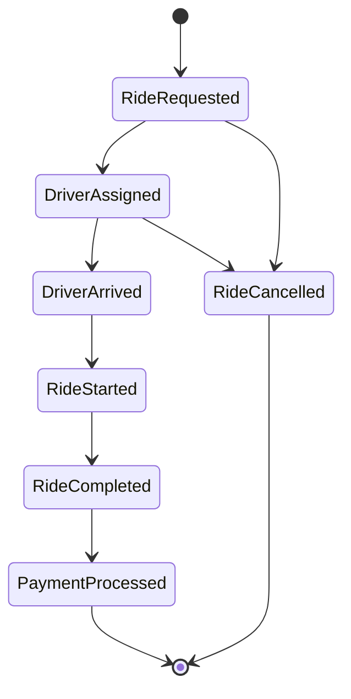
### The Ride Lifecycle:

1. **RideRequested** → Customer requests a ride
2. **DriverAssigned** → System assigns a driver
3. **DriverArrived** → Driver reaches pickup location
4. **RideStarted** → Customer gets in, ride begins
5. **RideCompleted** → Customer reaches destination
6. **PaymentProcessed** → Payment is charged
7. *(Alternative: RideCancelled at any point before ride starts)*

### Event 1: RideRequested

Contains everything needed to match a driver and start the ride:
- Ride ID and passenger details (name, phone, rating)
- Pickup location (GPS coordinates + address)
- Dropoff location
- Estimated distance and duration
- Ride type (standard, premium, shared)
- Timestamp

### Event 2: DriverAssigned

Contains all driver and vehicle information passengers need:
- Ride ID (links to original request)
- Driver details (name, phone, rating)
- Vehicle info (make, model, color, license plate)
- Driver's current location
- Estimated arrival time
- Correlation ID (same as RideRequested for tracing)
- Causation ID (references the RideRequested event)

### Event 3: RideStarted

Captures the actual start of the ride:
- Ride ID
- Start location (actual GPS coordinates)
- Start odometer reading
- Timestamp

### Event 4: RideCompleted

Contains all information needed for payment and analytics:
- Ride ID
- End location (actual GPS coordinates)
- End odometer reading
- Actual distance and duration traveled
- Fare amount and detailed breakdown (base fare, distance fare, time fare)
- Timestamp

### Who Consumes These Events:

**Notification Service:** 
- Consumes `DriverAssigned` to send push notification to passenger: "Your driver John is arriving in 5 minutes in a Black Toyota"

**Analytics Service:**
- Consumes `RideCompleted` to track metrics: ride distance, duration, revenue, customer behavior

**Payment Service:**
- Consumes `RideCompleted` to charge the passenger the calculated fare

**Driver Commission Service:**
- Consumes `RideCompleted` to calculate driver earnings (e.g., 75% of fare) and credit their account

**All these services work autonomously** with the data in the events. No service needs to call back to the Ride service to get additional information.

---


## Next Steps

In [Part 3](part-03-introduction-to-kafka), we'll dive into Apache Kafka:
- What makes Kafka special for event streaming
- Core concepts: topics, partitions, offsets, consumer groups
- Kafka's architecture and guarantees
- When to use Kafka vs. other message brokers

Understanding event design is crucial for building robust event-driven systems. With these patterns and principles, you're ready to design events that will serve your system well for years to come.

**Key Takeaways:**
1. Choose the right pattern: notification, state transfer, or sourcing
2. Events should be self-contained and use past tense
3. Include essential metadata for tracing and debugging
4. Design for schema evolution from day one
5. Find the right granularity - not too fine, not too coarse
6. Version your events and handle evolution gracefully

Next up: Let's explore Apache Kafka! 🚀
