# Part 2: Designing Events - The Heart of Event-Driven Architecture

## Introduction

In Part 1, we learned the fundamentals of Event-Driven Architecture. Now comes the most critical aspect: **designing good events**. Poor event design leads to tight coupling, versioning nightmares, and systems that are hard to evolve.

Great event design creates flexible, maintainable systems that stand the test of time.

## The Three Fundamental Event Patterns

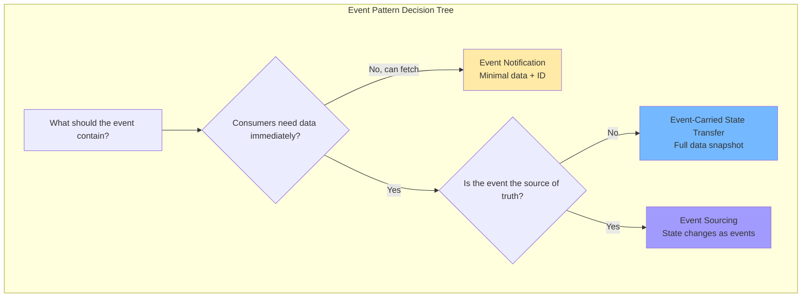

### Pattern 1: Event Notification

The simplest pattern. An event announces that something happened, with minimal data. Consumers that need more information fetch it via API.

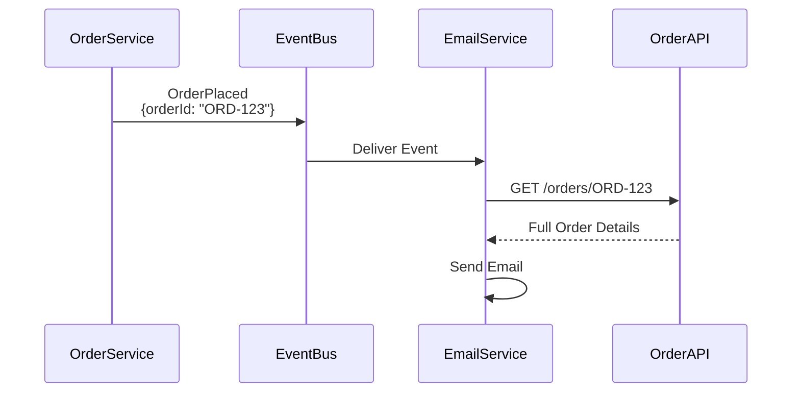

**Implementation:**
> 💡 **Pseudo code** - Simplified for illustration purposes
```csharp
using System;
using System.Collections.Generic;
// Producer - Minimal event
public class OrderService
{
    private IDatabase db;
    private IEventPublisher eventPublisher;

    public OrderService(IDatabase database, IEventPublisher publisher)
    {
        db = database;
        eventPublisher = publisher;
    }

    public void PlaceOrder(Order order)
    {
        // Save order to database
        db.Save(order);

        // Publish lightweight event
        var eventPayload = new Dictionary<string, object>
        {
            ["eventType"] = "OrderPlaced",
            ["eventId"] = Guid.NewGuid().ToString(),
            ["timestamp"] = DateTime.UtcNow.ToString("o"),
            ["data"] = new Dictionary<string, object>
            {
                ["orderId"] = order.Id,
                ["customerId"] = order.CustomerId
                // Minimal data - just identifiers
            }
        };

        eventPublisher.Publish("orders", eventPayload);
    }
}
// Consumer - Fetches full details
public class EmailService
{
    private IOrderApiClient orderApiClient;

    public EmailService(IOrderApiClient apiClient)
    {
        orderApiClient = apiClient;
    }

    public void HandleOrderPlaced(Dictionary<string, object> eventPayload)
    {
        var data = (Dictionary<string, object>)eventPayload["data"];
        string orderId = data["orderId"].ToString();

        // Fetch full order details via API
        var orderDetails = orderApiClient.GetOrder(orderId);

        // Now send email with full details
        SendConfirmationEmail(
            to: orderDetails["customerEmail"].ToString(),
            order: orderDetails
        );
    }

    private void SendConfirmationEmail(string to, Dictionary<string, object> order)
    {
        // Implementation to send email
    }
}

// Supporting interface and class definitions are assumed here
// such as IDatabase, IEventPublisher, IOrderApiClient, and Order class.
```

**Pros:**
- ✅ Lightweight events (low network overhead)
- ✅ Source of truth stays with owning service
- ✅ Easy to implement
- ✅ No data duplication

**Cons:**
- ❌ Consumers must make additional API calls (latency)
- ❌ Creates coupling to producer's API
- ❌ Consumers fail if producer API is down
- ❌ Higher total latency

**When to use:**
- Events happen frequently but consumers rarely need full details
- Data is large and shouldn't be duplicated
- Strong consistency is important
- Source service has good uptime SLA

**Real-world example:**
> 💡 **Pseudo code** - Simplified for illustration purposes
```csharp
// GitHub webhook - minimal notification
{
    "eventType": "PullRequestOpened",
    "repositoryId": "repo-123",
    "pullRequestId": "pr-456",
    "timestamp": "2025-11-01T10:30:00Z"
}


// Consumer fetches details via GitHub API
pr_details = github_api.get_pull_request("repo-123", "pr-456");
```

### Pattern 2: Event-Carried State Transfer

The event carries all the data consumers need, eliminating additional API calls. This is the most common pattern in modern event-driven systems.

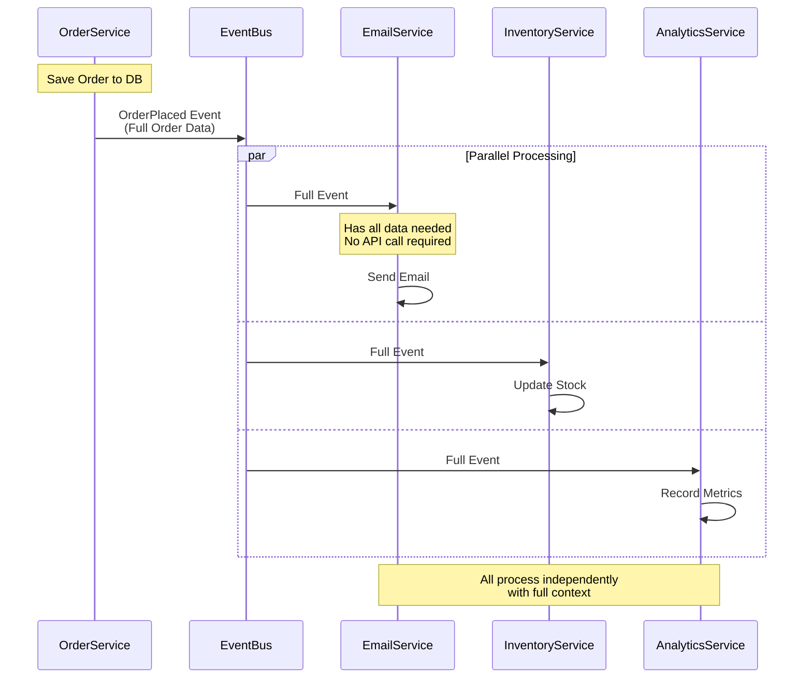

**Implementation:**
> 💡 **Pseudo code** - Simplified for illustration purposes
```csharp
using System;
using System.Collections.Generic;
using System.Linq;

// Producer - Full data in event
public class OrderService
{
    private IDatabase _db;
    private IEventPublisher _eventPublisher;

    public OrderService(IDatabase db, IEventPublisher eventPublisher)
    {
        _db = db;
        _eventPublisher = eventPublisher;
    }

    public void PlaceOrder(Order order)
    {
        // Save order to database
        _db.Save(order);
        
        // Publish event with ALL necessary data
        var eventObj = new
        {
            eventType = "OrderPlaced",
            eventId = Guid.NewGuid().ToString(),
            eventVersion = "1.0",
            timestamp = DateTime.UtcNow.ToString("o"),
            source = "order-service",
            correlationId = Guid.NewGuid().ToString(),
            data = new
            {
                // Identifiers
                orderId = order.Id,
                customerId = order.CustomerId,
                
                // Customer info (denormalized)
                customer = new
                {
                    id = order.Customer.Id,
                    email = order.Customer.Email,
                    name = order.Customer.Name,
                    phone = order.Customer.Phone
                },
                
                // Order details
                orderDate = order.CreatedAt.ToString("o"),
                totalAmount = (double)order.TotalAmount,
                currency = order.Currency,
                status = order.Status,
                
                // Line items (complete info)
                items = order.Items.Select(item => new
                {
                    productId = item.ProductId,
                    productName = item.ProductName,
                    productSku = item.ProductSku,
                    quantity = item.Quantity,
                    unitPrice = (double)item.UnitPrice,
                    totalPrice = (double)item.TotalPrice,
                    imageUrl = item.ProductImageUrl
                }).ToArray(),
                
                // Shipping info
                shippingAddress = new
                {
                    street = order.ShippingAddress.Street,
                    city = order.ShippingAddress.City,
                    state = order.ShippingAddress.State,
                    postalCode = order.ShippingAddress.PostalCode,
                    country = order.ShippingAddress.Country
                },
                
                // Payment info (safe subset)
                payment = new
                {
                    method = order.PaymentMethod,
                    last4 = order.PaymentLast4,
                    status = "completed"
                }
            }
        };
        
        _eventPublisher.Publish("orders", eventObj);
    }
}

// Consumer - Fully autonomous
public class EmailService
{
    public void HandleOrderPlaced(Dictionary<string, object> eventObj)
    {
        var data = (Dictionary<string, object>)eventObj["data"];
        var orderData = data;
        
        // All data is in the event - NO API call needed!
        var emailContent = RenderEmailTemplate(
            template: "order_confirmation",
            customerName: ((Dictionary<string, object>)orderData["customer"])["name"].ToString(),
            orderId: orderData["orderId"].ToString(),
            items: (List<object>)orderData["items"],
            total: (double)orderData["totalAmount"],
            shippingAddress: (Dictionary<string, object>)orderData["shippingAddress"]
        );
        
        SendEmail(
            to: ((Dictionary<string, object>)orderData["customer"])["email"].ToString(),
            subject: $"Order Confirmation - {orderData["orderId"]}",
            content: emailContent
        );
        
        // Service is fully autonomous!
    }
    
    private string RenderEmailTemplate(string template, string customerName, string orderId, List<object> items, double total, Dictionary<string, object> shippingAddress)
    {
        // Email template rendering logic
        return "";
    }
    
    private void SendEmail(string to, string subject, string content)
    {
        // Email sending logic
    }
}

public class InventoryService
{
    public void HandleOrderPlaced(Dictionary<string, object> eventObj)
    {
        var data = (Dictionary<string, object>)eventObj["data"];
        var orderData = data;
        var items = (List<object>)orderData["items"];
        
        // Reduce stock for each item - all data is here
        foreach (var itemObj in items)
        {
            var item = (Dictionary<string, object>)itemObj;
            ReduceStock(
                productId: item["productId"].ToString(),
                quantity: (int)item["quantity"],
                orderId: orderData["orderId"].ToString()
            );
        }
        
        Console.WriteLine($"✅ Inventory updated for order {orderData["orderId"]}");
    }
    
    private void ReduceStock(string productId, int quantity, string orderId)
    {
        // Inventory reduction logic
    }
}

public class AnalyticsService
{
    public void HandleOrderPlaced(Dictionary<string, object> eventObj)
    {
        var data = (Dictionary<string, object>)eventObj["data"];
        var orderData = data;
        var items = (List<object>)orderData["items"];
        
        // Record comprehensive analytics - all data available
        RecordMetrics(new
        {
            event_type = "order_placed",
            order_id = orderData["orderId"].ToString(),
            customer_id = orderData["customerId"].ToString(),
            amount = (double)orderData["totalAmount"],
            currency = orderData["currency"].ToString(),
            item_count = items.Count,
            country = ((Dictionary<string, object>)orderData["shippingAddress"])["country"].ToString(),
            timestamp = eventObj["timestamp"].ToString()
        });
    }
    
    private void RecordMetrics(object metrics)
    {
        // Metrics recording logic
    }
}
```

**Pros:**
- ✅ Consumers are fully autonomous (no external dependencies)
- ✅ No coupling to producer APIs
- ✅ Better performance (no extra calls)
- ✅ Works even when producer service is down
- ✅ Lower total latency
- ✅ Can process events offline

**Cons:**
- ❌ Larger events (higher network overhead)
- ❌ Data duplication across services
- ❌ Consumers might have slightly stale data
- ❌ Schema evolution is more critical

**When to use:**
- Consumers need the data immediately
- Service autonomy is important
- The producer service might be unavailable
- Network calls between services are expensive
- Multiple consumers need the same data

**Size considerations:**
> 💡 **Pseudo code** - Simplified for illustration purposes
```csharp
using System.Text;
using System.Text.Json;

// Calculate event size
var eventObj = new { /* Your event */ };
var eventJson = JsonSerializer.Serialize(eventObj);
var eventSizeBytes = Encoding.UTF8.GetByteCount(eventJson);

Console.WriteLine($"Event size: {eventSizeBytes / 1024.0:F2} KB");

// Rule of thumb:
// < 10 KB: Perfect for event-carried state transfer
// 10-100 KB: Acceptable, consider compression
// > 100 KB: Consider event notification + API call
// > 1 MB: Definitely use event notification or store in S3/blob storage
```

**Handling large data:**
> 💡 **Pseudo code** - Simplified for illustration purposes
```csharp
// For very large data (images, documents)
var eventObj = new
{
    eventType = "DocumentUploaded",
    data = new
    {
        documentId = "doc-123",
        documentUrl = "s3://bucket/documents/doc-123.pdf", // Reference, not content
        documentSize = 5242880, // 5 MB
        mimeType = "application/pdf",
        metadata = new
        {
            filename = "contract.pdf",
            uploadedBy = "user-456"
        }
    }
};

// Consumers download from S3 if needed
public class DocumentProcessorService
{
    public void HandleDocumentUploaded(Dictionary<string, object> eventObj)
    {
        var data = (Dictionary<string, object>)eventObj["data"];
        var docUrl = data["documentUrl"].ToString();
        
        // Download only if needed
        if (data["mimeType"].ToString() == "application/pdf")
        {
            var docContent = _s3Client.Download(docUrl);
            ProcessPdf(docContent);
        }
    }
    
    private void ProcessPdf(byte[] content)
    {
        // PDF processing logic
    }
}
```

### Pattern 3: Event Sourcing

Instead of storing current state, you store every event that ever happened. Current state is derived by replaying events. This is the most advanced pattern.

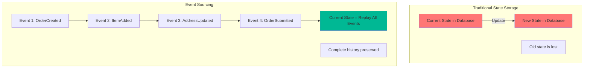

**Traditional vs. Event Sourcing:**
> 💡 **Pseudo code** - Simplified for illustration purposes
```csharp
using System;
using System.Collections.Generic;
using System.Linq;

// === TRADITIONAL APPROACH ===
public class OrderRepository
{
    public void UpdateOrder(string orderId, Dictionary<string, object> updates)
    {
        // Current state is overwritten
        _db.Update("orders", new { id = orderId }, updates);
        // History is lost!
    }
}

// Database state:
// orders table: {id: 'ORD-123', status: 'SHIPPED', total: 99.99}
// We don't know:
// - When was it created?
// - What was the original total?
// - When did status change?
// - Who changed it?

// === EVENT SOURCING APPROACH ===
public class Order
{
    public string Id { get; set; }
    public string CustomerId { get; set; }
    public List<OrderItem> Items { get; set; } = new List<OrderItem>();
    public ShippingAddress ShippingAddress { get; set; }
    public string Status { get; set; }
    public List<object> UncommittedEvents { get; set; } = new List<object>();
    
    // Commands that produce events
    public void Create(string orderId, string customerId)
    {
        var @event = new OrderCreated
        {
            OrderId = orderId,
            CustomerId = customerId,
            Timestamp = DateTime.UtcNow
        };
        Apply(@event);
        UncommittedEvents.Add(@event);
    }
    
    public void AddItem(string productId, int quantity, decimal price)
    {
        var @event = new ItemAdded
        {
            OrderId = Id,
            ProductId = productId,
            Quantity = quantity,
            Price = price,
            Timestamp = DateTime.UtcNow
        };
        Apply(@event);
        UncommittedEvents.Add(@event);
    }
    
    public void SetShippingAddress(ShippingAddress address)
    {
        var @event = new ShippingAddressSet
        {
            OrderId = Id,
            Address = address,
            Timestamp = DateTime.UtcNow
        };
        Apply(@event);
        UncommittedEvents.Add(@event);
    }
    
    public void Submit()
    {
        if (Items.Count == 0)
            throw new InvalidOperationException("Cannot submit order without items");
        if (ShippingAddress == null)
            throw new InvalidOperationException("Cannot submit order without shipping address");
        
        var @event = new OrderSubmitted
        {
            OrderId = Id,
            Timestamp = DateTime.UtcNow
        };
        Apply(@event);
        UncommittedEvents.Add(@event);
    }
    
    // Apply events to rebuild state
    public void Apply(object @event)
    {
        switch (@event)
        {
            case OrderCreated created:
                Id = created.OrderId;
                CustomerId = created.CustomerId;
                Status = "CREATED";
                break;
            
            case ItemAdded itemAdded:
                Items.Add(new OrderItem
                {
                    ProductId = itemAdded.ProductId,
                    Quantity = itemAdded.Quantity,
                    Price = itemAdded.Price
                });
                break;
            
            case ShippingAddressSet addressSet:
                ShippingAddress = addressSet.Address;
                break;
            
            case OrderSubmitted submitted:
                Status = "SUBMITTED";
                break;
        }
    }
}

// Event Store
public class EventStore
{
    private Dictionary<string, List<object>> _events = new Dictionary<string, List<object>>();
    private IEventBus _eventBus;
    
    public EventStore(IEventBus eventBus)
    {
        _eventBus = eventBus;
    }
    
    public void SaveEvents(string aggregateId, List<object> events, int? expectedVersion = null)
    {
        // Optimistic locking
        if (expectedVersion.HasValue)
        {
            var currentVersion = _events.ContainsKey(aggregateId) ? _events[aggregateId].Count : 0;
            if (currentVersion != expectedVersion.Value)
                throw new InvalidOperationException("Version mismatch");
        }
        
        if (!_events.ContainsKey(aggregateId))
            _events[aggregateId] = new List<object>();
        
        // Append events (never update)
        _events[aggregateId].AddRange(events);
        
        // Publish to event bus
        foreach (var @event in events)
            _eventBus.Publish(@event);
    }
    
    public List<object> GetEvents(string aggregateId, int fromVersion = 0)
    {
        if (!_events.ContainsKey(aggregateId))
            return new List<object>();
        
        return _events[aggregateId].Skip(fromVersion).ToList();
    }
}

// Repository
public class OrderRepository
{
    private EventStore _eventStore;
    
    public OrderRepository(EventStore eventStore)
    {
        _eventStore = eventStore;
    }
    
    public void Save(Order order, int? expectedVersion = null)
    {
        _eventStore.SaveEvents(
            order.Id,
            order.UncommittedEvents,
            expectedVersion
        );
        order.UncommittedEvents = new List<object>();
    }
    
    public Order Get(string orderId)
    {
        // Rebuild order by replaying events
        var events = _eventStore.GetEvents(orderId);
        
        var order = new Order();
        foreach (var @event in events)
            order.Apply(@event);
        
        return order;
    }
}

// Using it
var order = new Order();
order.Create("ORD-123", "CUST-456");
order.AddItem("PROD-001", 2, 29.99m);
order.AddItem("PROD-002", 1, 49.99m);
order.SetShippingAddress(new ShippingAddress
{
    Street = "123 Main St",
    City = "Boston",
    State = "MA",
    Zip = "02101"
});
order.Submit();

repository.Save(order);

// Event store now contains:
// Event 1: OrderCreated(orderId: 'ORD-123', customerId: 'CUST-456')
// Event 2: ItemAdded(productId: 'PROD-001', quantity: 2, price: 29.99)
// Event 3: ItemAdded(productId: 'PROD-002', quantity: 1, price: 49.99)
// Event 4: ShippingAddressSet(address: {...})
// Event 5: OrderSubmitted(orderId: 'ORD-123')

// Later, retrieve the order
order = repository.Get("ORD-123"); // Replays all 5 events
Console.WriteLine(order.Status); // 'SUBMITTED'
Console.WriteLine(order.Items.Count); // 2
```

**Time Travel - See State at Any Point:**
> 💡 **Pseudo code** - Simplified for illustration purposes
```csharp
public Order GetOrderAtTimestamp(string orderId, DateTime timestamp)
{
    var events = _eventStore.GetEvents(orderId);
    
    // Filter events before timestamp
    var historicalEvents = events
        .Where(e => GetEventTimestamp(e) <= timestamp)
        .ToList();
    
    // Replay to get historical state
    var order = new Order();
    foreach (var @event in historicalEvents)
        order.Apply(@event);
    
    return order;
}

private DateTime GetEventTimestamp(object @event)
{
    // Extract timestamp from event based on event type
    return @event switch
    {
        OrderCreated created => created.Timestamp,
        ItemAdded added => added.Timestamp,
        ShippingAddressSet addressSet => addressSet.Timestamp,
        OrderSubmitted submitted => submitted.Timestamp,
        _ => DateTime.MinValue
    };
}

// What did the order look like yesterday?
var orderYesterday = GetOrderAtTimestamp("ORD-123", yesterday);
```

**Snapshots for Performance:**

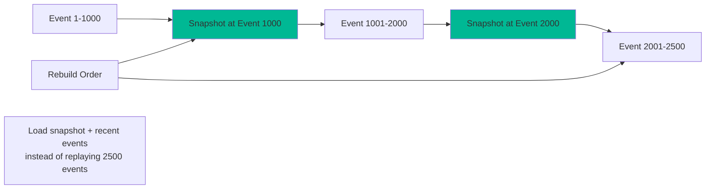
> 💡 **Pseudo code** - Simplified for illustration purposes
```csharp
public class EventStore
{
    private Dictionary<string, Snapshot> _snapshots = new Dictionary<string, Snapshot>();
    
    public void SaveSnapshot(string aggregateId, object state, int version)
    {
        _snapshots[aggregateId] = new Snapshot
        {
            State = state,
            Version = version,
            Timestamp = DateTime.UtcNow
        };
    }
    
    public Order LoadFromSnapshot(string aggregateId)
    {
        if (_snapshots.TryGetValue(aggregateId, out var snapshot))
        {
            var order = new Order();
            // Restore state from snapshot (simplified)
            // In real implementation, you'd deserialize the state
            // order = JsonSerializer.Deserialize<Order>(snapshot.State);
            
            // Load events after snapshot
            var events = GetEvents(aggregateId, fromVersion: snapshot.Version);
            foreach (var @event in events)
                order.Apply(@event);
            
            return order;
        }
        else
        {
            // No snapshot, replay all events
            return LoadFromEvents(aggregateId);
        }
    }
}

// Save snapshot every 100 events
if (events.Count % 100 == 0)
{
    eventStore.SaveSnapshot(
        order.Id,
        order, // In practice, serialize to JSON/bytes
        version: events.Count
    );
}
```

**Pros:**
- ✅ Complete audit trail (compliance, debugging)
- ✅ Time travel (see state at any point in history)
- ✅ Rebuild state from events (disaster recovery)
- ✅ Business insights from event history
- ✅ Support for temporal queries
- ✅ Can add new projections from historical events

**Cons:**
- ❌ Significant complexity
- ❌ Event schema evolution is critical
- ❌ Replaying thousands of events is slow (need snapshots)
- ❌ Eventually consistent
- ❌ Steeper learning curve

**When to use:**
- Audit trail is critical (finance, healthcare, legal)
- Need to reconstruct historical state
- Complex business logic that benefits from event-driven modeling
- Compliance requirements for data retention
- Domain is naturally event-driven (banking transactions, medical records)

**Real-world examples:**
> 💡 **Pseudo code** - Simplified for illustration purposes
```csharp
// Banking - Perfect for event sourcing
var events = new List<object>
{
    new AccountOpened { AccountId = "ACC-123", InitialBalance = 1000 },
    new MoneyDeposited { AccountId = "ACC-123", Amount = 500 },
    new MoneyWithdrawn { AccountId = "ACC-123", Amount = 200 },
    new InterestCredited { AccountId = "ACC-123", Amount = 2.50m }
};
// Current balance = replay events = 1302.50
// Complete audit trail of every transaction

// Medical records - Event sourcing for compliance
var medicalEvents = new List<object>
{
    new PatientAdmitted { PatientId = "PAT-789", Diagnosis = "..." },
    new MedicationPrescribed { PatientId = "PAT-789", Medication = "..." },
    new LabTestOrdered { PatientId = "PAT-789", Test = "..." },
    new LabResultsRecorded { PatientId = "PAT-789", Results = "..." },
    new PatientDischarged { PatientId = "PAT-789" }
};
// Complete medical history, HIPAA compliant audit trail
```

## Event Design Principles

### Principle 1: Events Should Be Self-Contained

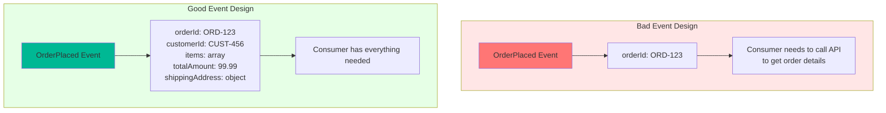

**Bad:**
```json
{
  "eventType": "OrderPlaced",
  "orderId": "ORD-123"
}
```

Consumer must call API: "What's in this order? Who's the customer? Where to ship?"

**Good:**
```json
{
  "eventType": "OrderPlaced",
  "eventId": "evt_7a8b9c",
  "timestamp": "2025-11-01T10:30:00Z",
  "data": {
    "orderId": "ORD-123",
    "customerId": "CUST-456",
    "customerEmail": "customer@example.com",
    "totalAmount": 99.99,
    "items": [
      {
        "productId": "PROD-001",
        "quantity": 2,
        "price": 49.99
      }
    ],
    "shippingAddress": {
      "street": "123 Main St",
      "city": "Boston",
      "state": "MA",
      "zip": "02101"
    }
  }
}
```

Consumer has everything needed to act immediately.

### Principle 2: Use Past Tense for Event Names

Events are facts about what happened, not commands about what to do.

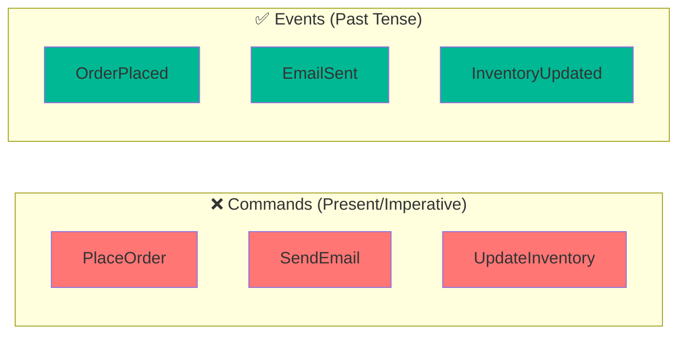

**Bad (Commands):**
- `PlaceOrder` - Tells what to do
- `SendConfirmationEmail` - Directive
- `UpdateInventory` - Imperative

**Good (Events):**
- `OrderPlaced` - States what happened
- `ConfirmationEmailSent` - Past tense
- `InventoryUpdated` - Fact

**Why it matters:**
> 💡 **Pseudo code** - Simplified for illustration purposes
```csharp
// Command - prescriptive
var commandEvent = new { eventType = "SendEmail", to = "customer@example.com" };
// This tells consumers what to do. Only email service should react.

// Event - descriptive
var eventObj = new { eventType = "OrderPlaced", orderId = "ORD-123", /* ... */ };
// This states what happened. Multiple services can decide how to react:
// - Email service: "I'll send an email"
// - SMS service: "I'll send an SMS"
// - Push notification service: "I'll send a push notification"
```

### Principle 3: Include Essential Metadata

```csharp
var eventObj = new
{
    // Identity
    eventId = "evt_7a8b9c0d", // Unique ID for deduplication
    eventType = "OrderPlaced", // What happened
    eventVersion = "1.0", // Schema version
    
    // Timing
    timestamp = "2025-11-01T10:30:00Z", // When it happened
    
    // Tracing
    correlationId = "corr_12345", // Groups related events
    causationId = "evt_previous", // The event that caused this one
    
    // Source
    source = "order-service", // Which service produced this
    sourceVersion = "2.3.1", // Version of producing service
    
    // Actor (for audit)
    userId = "user-789", // Who triggered this
    userAgent = "Mozilla/5.0...", // How they triggered it
    
    // Data
    data = new
    {
        // Event payload
    }
};
```

**Correlation ID for distributed tracing:**

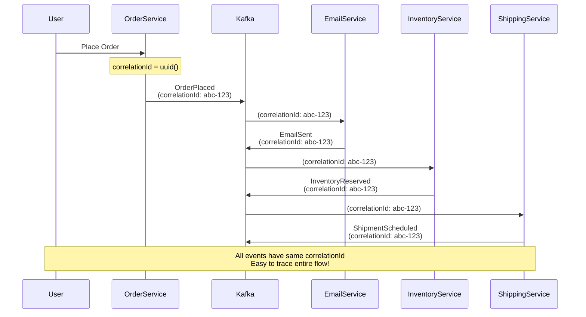

### Principle 4: Design for Evolution

```csharp
// Version 1.0
var eventV1 = new
{
    eventVersion = "1.0",
    eventType = "OrderPlaced",
    data = new
    {
        orderId = "ORD-123",
        customerId = "CUST-456",
        totalAmount = 99.99
    }
};

// Version 1.1 - Adding optional fields (backward compatible)
var eventV1_1 = new
{
    eventVersion = "1.1",
    eventType = "OrderPlaced",
    data = new
    {
        orderId = "ORD-123",
        customerId = "CUST-456",
        totalAmount = 99.99,
        currency = "USD", // New field with default
        taxAmount = 8.50  // New field with default
    }
};

// Old consumers ignore new fields ✅
// New consumers handle both versions ✅

// Version 2.0 - Breaking change (carefully managed)
var eventV2 = new
{
    eventVersion = "2.0",
    eventType = "OrderPlaced",
    data = new
    {
        orderId = "ORD-123",
        customer = new // Changed: nested object instead of just ID
        {
            id = "CUST-456",
            email = "customer@example.com",
            name = "Jane Smith"
        },
        totalAmount = 99.99
    }
};
```

**Schema evolution strategy:**

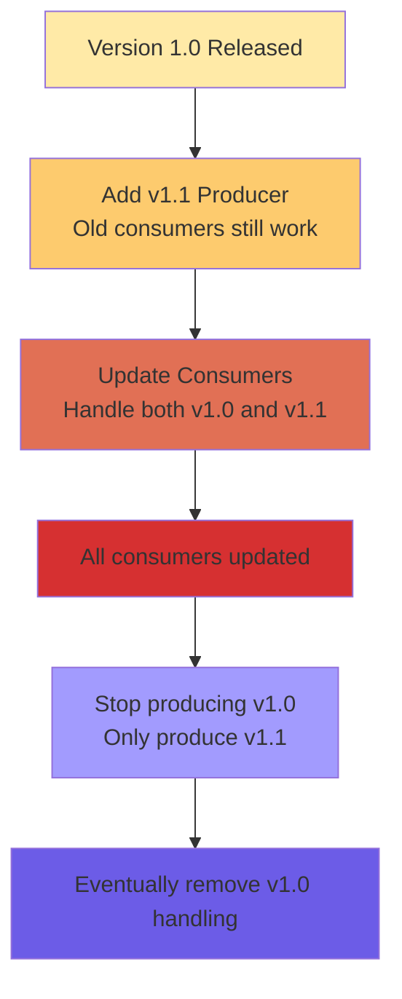

### Principle 5: Keep Events at the Right Granularity

```mermaid
graph TB
    subgraph "Too Fine-Grained ❌"
        A1[UserStartedTyping]
        A1 --> A2[UserTypedCharacter: 'H']
        A2 --> A3[UserTypedCharacter: 'e']
        A3 --> A4[UserTypedCharacter: 'l']
        A4 --> A5[UserTypedCharacter: 'l']
        A5 --> A6[UserTypedCharacter: 'o']
        A6 --> A7[UserStoppedTyping]
    end
    
    subgraph "Too Coarse-Grained ❌"
        B1[UserCompletedEntireWorkflow]
        Note1[Loses important details]
    end
    
    subgraph "Just Right ✅"
        C1[FormStarted]
        C1 --> C2[FieldCompleted: Name]
        C2 --> C3[FieldCompleted: Email]
        C3 --> C4[FormSubmitted]
    end
    
    style A1 fill:#ff7675
    style B1 fill:#ff7675
    style C1 fill:#00b894
```

**Finding the right granularity:**

```csharp
// Order example - granularity options

// Option 1: Too fine-grained ❌
var fineGrainedEvents = new[]
{
    "OrderCreated",
    "Item1Added",
    "Item2Added",
    "Item1QuantityIncreased",
    "Item3Added",
    "Item2Removed",
    "ShippingAddressLineOneSet",
    "ShippingAddressCitySet",
    "ShippingAddressStateSet",
    "PaymentMethodSet",
    "OrderSubmitted"
};
// Too chatty, eventual consistency issues

// Option 2: Too coarse-grained ❌
var coarseGrainedEvents = new[]
{
    "OrderCompleted" // Everything in one event
};
// Loses important lifecycle stages

// Option 3: Just right ✅
var justRightEvents = new[]
{
    "OrderPlaced",      // Order submitted with all items
    "PaymentReceived",  // Payment processed
    "OrderShipped",     // Warehouse shipped it
    "OrderDelivered"    // Customer received it
};
// Clear lifecycle, meaningful stages
```

## Event Schema Evolution

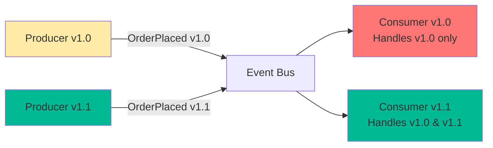

### Strategy 1: Backward Compatibility (Safe)

New producers can be consumed by old consumers.
> 💡 **Pseudo code** - Simplified for illustration purposes
```csharp
// Old consumer (v1.0)
public void HandleOrderPlaced(Dictionary<string, object> eventObj)
{
    var data = (Dictionary<string, object>)eventObj["data"];
    var orderId = data["orderId"].ToString();
    var amount = (double)data["totalAmount"];
    // Ignores any new fields it doesn't know about ✅
}

// New event (v1.1) adds optional field
var newEvent = new
{
    eventVersion = "1.1",
    data = new
    {
        orderId = "ORD-123",
        totalAmount = 99.99,
        currency = "USD" // New field
    }
};
// Old consumer still works! ✅
```

### Strategy 2: Forward Compatibility (Harder)

Old producers can be consumed by new consumers.
> 💡 **Pseudo code** - Simplified for illustration purposes
```csharp
// New consumer (v1.1) expects currency field
public void HandleOrderPlaced(Dictionary<string, object> eventObj)
{
    var data = (Dictionary<string, object>)eventObj["data"];
    var orderId = data["orderId"].ToString();
    var amount = (double)data["totalAmount"];
    var currency = data.ContainsKey("currency") ? data["currency"].ToString() : "USD"; // Default if missing ✅
}

// Old event (v1.0) without currency field
var oldEvent = new
{
    eventVersion = "1.0",
    data = new
    {
        orderId = "ORD-123",
        totalAmount = 99.99
        // No currency field
    }
};
// New consumer handles it with default ✅
```

### Schema Registry Integration
> 💡 **Pseudo code** - Simplified for illustration purposes
```csharp
using Confluent.Kafka;
using Confluent.SchemaRegistry;
using Confluent.SchemaRegistry.Serdes;

// Define schema in Avro (JSON format)
var valueSchemaStr = @"
{
   ""type"": ""record"",
   ""name"": ""Order"",
   ""namespace"": ""com.example.ecommerce"",
   ""fields"": [
       {""name"": ""orderId"", ""type"": ""string""},
       {""name"": ""customerId"", ""type"": ""string""},
       {""name"": ""totalAmount"", ""type"": ""double""},
       {""name"": ""currency"", ""type"": ""string"", ""default"": ""USD""}
   ]
}";

var schemaRegistryConfig = new SchemaRegistryConfig
{
    Url = "http://localhost:8081"
};

var producerConfig = new ProducerConfig
{
    BootstrapServers = "localhost:9092"
};

using var schemaRegistry = new CachedSchemaRegistryClient(schemaRegistryConfig);
using var producer = new ProducerBuilder<string, Order>(producerConfig)
    .SetValueSerializer(new AvroSerializer<Order>(schemaRegistry))
    .Build();

// Schema automatically registered and versioned
var order = new Order
{
    OrderId = "ORD-123",
    CustomerId = "CUST-456",
    TotalAmount = 99.99,
    Currency = "USD"
};

await producer.ProduceAsync("orders", new Message<string, Order>
{
    Key = order.OrderId,
    Value = order
});
```

## Common Event Design Mistakes

### Mistake 1: Treating Events as Commands
> 💡 **Pseudo code** - Simplified for illustration purposes
```csharp
// ❌ Bad: Command disguised as event
var badEvent = new
{
    eventType = "SendConfirmationEmail", // Imperative
    orderId = "ORD-123"
};

// ✅ Good: Event describing what happened
var goodEvent = new
{
    eventType = "OrderPlaced", // Past tense
    orderId = "ORD-123",
    customerEmail = "customer@example.com"
};
// Let consumers decide to send email
```

### Mistake 2: Including Too Much Data
> 💡 **Pseudo code** - Simplified for illustration purposes
```csharp
// ❌ Bad: Dumping entire database
var badEvent = new
{
    eventType = "OrderPlaced",
    data = new
    {
        order = new { /* Entire order object */ },
        customer = new { /* Entire customer object with all history */ },
        products = new[] { /* All product details, reviews, inventory */ },
        allRelatedOrders = new[] { /* Why include this? */ },
        companyMetadata = new { /* Unnecessary */ }
    }
};
// Event is 500 KB!

// ✅ Good: Just what consumers need
var goodEvent = new
{
    eventType = "OrderPlaced",
    data = new
    {
        orderId = "ORD-123",
        customerId = "CUST-456",
        customerEmail = "customer@example.com",
        items = new[] { /* Only items in THIS order */ },
        totalAmount = 99.99,
        shippingAddress = new { /* ... */ }
    }
};
// Event is 5 KB
```

### Mistake 3: Including Too Little Data
> 💡 **Pseudo code** - Simplified for illustration purposes
```csharp
// ❌ Bad: Forces consumers to make API calls
var badEvent = new
{
    eventType = "OrderPlaced",
    orderId = "ORD-123"
};
// Every consumer must call: GET /orders/ORD-123

// ✅ Good: Self-contained for common use cases
var goodEvent = new
{
    eventType = "OrderPlaced",
    data = new
    {
        orderId = "ORD-123",
        customerId = "CUST-456",
        customerEmail = "customer@example.com",
        totalAmount = 99.99,
        items = new[] { /* ... */ }
    }
};
// 80% of consumers have what they need
```

### Mistake 4: No Versioning
> 💡 **Pseudo code** - Simplified for illustration purposes
```csharp
// ❌ Bad: No version info
var badEvent = new
{
    eventType = "OrderPlaced",
    data = new { /* ... */ }
};
// How do consumers know what schema to expect?

// ✅ Good: Always version
var goodEvent = new
{
    eventType = "OrderPlaced",
    eventVersion = "1.2",
    data = new { /* ... */ }
};
// Consumers can handle different versions gracefully
```

### Mistake 5: Mutable Events
> 💡 **Pseudo code** - Simplified for illustration purposes
```csharp
// ❌ Bad: Updating events
_eventStore.UpdateEvent(eventId, new { status = "corrected" });
// Events are history - you can't change the past!

// ✅ Good: Compensating events
// Original event stays, new event corrects it
var correctionEvent = new
{
    eventType = "OrderCorrected",
    originalEventId = "evt_123",
    corrections = new
    {
        totalAmount = 89.99 // Was 99.99, corrected to 89.99
    }
};
```

## Practical Event Design Workshop

Let's design events for a real-world scenario: A ride-sharing application.

### Scenario: Ride Lifecycle

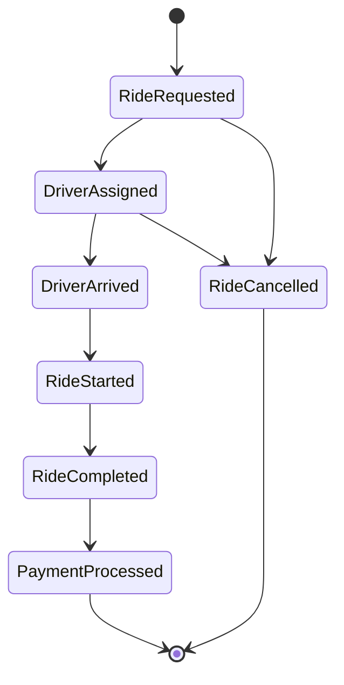

### Event Design:
> 💡 **Pseudo code** - Simplified for illustration purposes
```json
// Event 1: RideRequested
{
    "eventId": "evt_abc123",
    "eventType": "RideRequested",
    "eventVersion": "1.0",
    "timestamp": "2025-11-01T14:30:00Z",
    "source": "ride-service",
    "correlationId": "ride_xyz789",
    "data": {
        "rideId": "RIDE-001",
        "passengerId": "PASS-123",
        "passengerName": "Jane Smith",
        "passengerPhone": "+1-555-0123",
        "passengerRating": 4.8,
        "pickupLocation": {
            "latitude": 42.3601,
            "longitude": -71.0589,
            "address": "123 Main St, Boston, MA"
        },
        "dropoffLocation": {
            "latitude": 42.3584,
            "longitude": -71.0598,
            "address": "456 Park Ave, Boston, MA"
        },
        "estimatedDistance": 2.5,
        "estimatedDuration": 10,
        "rideType": "STANDARD",
        "requestedAt": "2025-11-01T14:30:00Z"
    }
}

// Event 2: DriverAssigned
{
    "eventId": "evt_def456",
    "eventType": "DriverAssigned",
    "eventVersion": "1.0",
    "timestamp": "2025-11-01T14:30:15Z",
    "correlationId": "ride_xyz789",
    "causationId": "evt_abc123",
    "data": {
        "rideId": "RIDE-001",
        "driverId": "DRV-789",
        "driverName": "John Doe",
        "driverPhone": "+1-555-0456",
        "driverRating": 4.9,
        "vehicleInfo": {
            "make": "Toyota",
            "model": "Camry",
            "color": "Black",
            "licensePlate": "ABC-123"
        },
        "driverLocation": {
            "latitude": 42.3605,
            "longitude": -71.0585
        },
        "estimatedArrival": "2025-11-01T14:35:00Z",
        "assignedAt": "2025-11-01T14:30:15Z"
    }
}

// Event 3: RideStarted
{
    "eventId": "evt_ghi789",
    "eventType": "RideStarted",
    "eventVersion": "1.0",
    "timestamp": "2025-11-01T14:35:30Z",
    "correlationId": "ride_xyz789",
    "causationId": "evt_def456",
    "data": {
        "rideId": "RIDE-001",
        "startLocation": {
            "latitude": 42.3601,
            "longitude": -71.0589
        },
        "startOdometer": 45123.5,
        "startedAt": "2025-11-01T14:35:30Z"
    }
}

// Event 4: RideCompleted
{
    "eventId": "evt_jkl012",
    "eventType": "RideCompleted",
    "eventVersion": "1.0",
    "timestamp": "2025-11-01T14:45:30Z",
    "correlationId": "ride_xyz789",
    "causationId": "evt_ghi789",
    "data": {
        "rideId": "RIDE-001",
        "endLocation": {
            "latitude": 42.3584,
            "longitude": -71.0598
        },
        "endOdometer": 45126.2,
        "actualDistance": 2.7,
        "actualDuration": 10,
        "fareAmount": 15.50,
        "fareBreakdown": {
            "baseFare": 5.00,
            "distanceFare": 8.50,
            "timeFare": 2.00
        },
        "completedAt": "2025-11-01T14:45:30Z"
    }
}
```

### Services Consuming These Events:
> 💡 **Pseudo code** - Simplified for illustration purposes
```csharp
using System.Collections.Generic;

// Notification Service - Sends updates to passenger
public class NotificationService
{
    public void HandleDriverAssigned(Dictionary<string, object> eventObj)
    {
        var data = (Dictionary<string, object>)eventObj["data"];
        var vehicleInfo = (Dictionary<string, object>)data["vehicleInfo"];
        
        SendPushNotification(
            passengerId: data["passengerId"].ToString(),
            message: $"Your driver {data["driverName"]} is arriving in 5 minutes",
            metadata: new Dictionary<string, object>
            {
                ["driver_name"] = data["driverName"],
                ["vehicle"] = $"{vehicleInfo["color"]} {vehicleInfo["make"]}"
            }
        );
    }
    
    private void SendPushNotification(string passengerId, string message, Dictionary<string, object> metadata)
    {
        // Push notification logic
    }
}

// Analytics Service - Tracks metrics
public class AnalyticsService
{
    public void HandleRideCompleted(Dictionary<string, object> eventObj)
    {
        var data = (Dictionary<string, object>)eventObj["data"];
        
        RecordMetrics(new
        {
            @event = "ride_completed",
            distance = (double)data["actualDistance"],
            duration = (int)data["actualDuration"],
            fare = (decimal)data["fareAmount"],
            ride_type = "STANDARD"
        });
    }
    
    private void RecordMetrics(object metrics)
    {
        // Metrics recording logic
    }
}

// Payment Service - Processes payment
public class PaymentService
{
    public void HandleRideCompleted(Dictionary<string, object> eventObj)
    {
        var data = (Dictionary<string, object>)eventObj["data"];
        var fareBreakdown = (Dictionary<string, object>)data["fareBreakdown"];
        
        ChargePassenger(
            rideId: data["rideId"].ToString(),
            amount: (decimal)data["fareAmount"],
            breakdown: fareBreakdown
        );
    }
    
    private void ChargePassenger(string rideId, decimal amount, Dictionary<string, object> breakdown)
    {
        // Payment processing logic
    }
}

// Driver Commission Service - Calculates driver earnings
public class DriverCommissionService
{
    public void HandleRideCompleted(Dictionary<string, object> eventObj)
    {
        var data = (Dictionary<string, object>)eventObj["data"];
        var fareAmount = (decimal)data["fareAmount"];
        var driverEarning = fareAmount * 0.75m; // 75% to driver
        
        CreditDriver(
            driverId: data["driverId"].ToString(),
            amount: driverEarning,
            rideId: data["rideId"].ToString()
        );
    }
    
    private void CreditDriver(string driverId, decimal amount, string rideId)
    {
        // Driver commission logic
    }
}
```

## Next Steps

In Part 3, we'll dive into Apache Kafka:
- What makes Kafka special for event streaming
- Core concepts: topics, partitions, offsets, consumer groups
- Kafka's architecture and guarantees
- When to use Kafka vs. other message brokers

Understanding event design is crucial for building robust event-driven systems. With these patterns and principles, you're ready to design events that will serve your system well for years to come.

**Key Takeaways:**
1. Choose the right pattern: notification, state transfer, or sourcing
2. Events should be self-contained and use past tense
3. Include essential metadata for tracing and debugging
4. Design for schema evolution from day one
5. Find the right granularity - not too fine, not too coarse
6. Version your events and handle evolution gracefully

Next up: Let's explore Apache Kafka! 🚀
