# Part 2: Designing Events - The Heart of Event-Driven Architecture

## Introduction

In Part 1, we learned the fundamentals of Event-Driven Architecture. Now comes the most critical aspect: **designing good events**. Poor event design leads to tight coupling, versioning nightmares, and systems that are hard to evolve.

Great event design creates flexible, maintainable systems that stand the test of time.

## The Three Fundamental Event Patterns

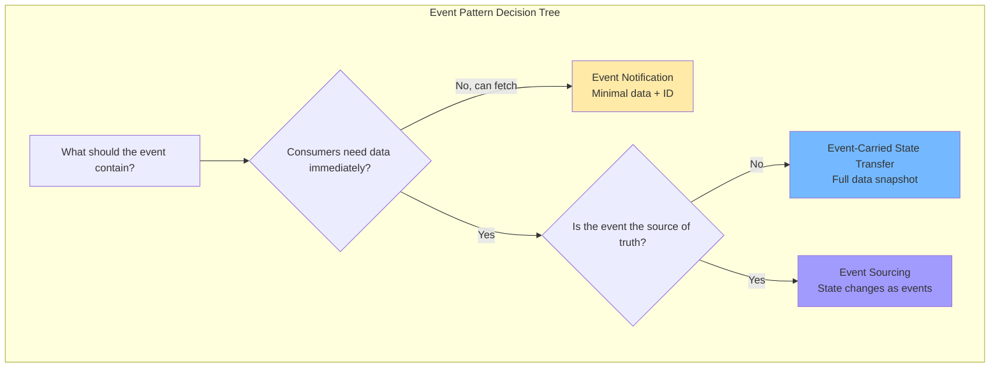

### Pattern 1: Event Notification

The simplest pattern. An event announces that something happened, with minimal data. Consumers that need more information fetch it via API.

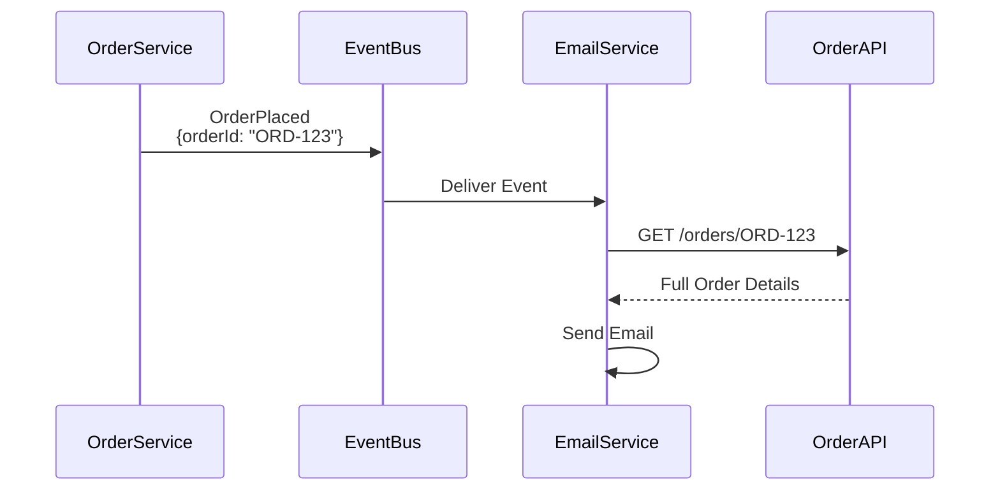

**Implementation:**

```python
# Producer - Minimal event
class OrderService:
    def place_order(self, order):
        # Save order to database
        self.db.save(order)
        
        # Publish lightweight event
        event = {
            'eventType': 'OrderPlaced',
            'eventId': str(uuid.uuid4()),
            'timestamp': datetime.utcnow().isoformat(),
            'data': {
                'orderId': order.id,
                'customerId': order.customer_id,
                # Minimal data - just identifiers
            }
        }
        
        self.event_publisher.publish('orders', event)

# Consumer - Fetches full details
class EmailService:
    def handle_order_placed(self, event):
        order_id = event['data']['orderId']
        
        # Fetch full order details via API
        order_details = self.order_api_client.get_order(order_id)
        
        # Now send email with full details
        self.send_confirmation_email(
            to=order_details['customerEmail'],
            order=order_details
        )
```

**Pros:**
- ✅ Lightweight events (low network overhead)
- ✅ Source of truth stays with owning service
- ✅ Easy to implement
- ✅ No data duplication

**Cons:**
- ❌ Consumers must make additional API calls (latency)
- ❌ Creates coupling to producer's API
- ❌ Consumers fail if producer API is down
- ❌ Higher total latency

**When to use:**
- Events happen frequently but consumers rarely need full details
- Data is large and shouldn't be duplicated
- Strong consistency is important
- Source service has good uptime SLA

**Real-world example:**

```python
# GitHub webhook - minimal notification
{
    "eventType": "PullRequestOpened",
    "repositoryId": "repo-123",
    "pullRequestId": "pr-456",
    "timestamp": "2025-11-01T10:30:00Z"
}

# Consumer fetches details via GitHub API
pr_details = github_api.get_pull_request("repo-123", "pr-456")
```

### Pattern 2: Event-Carried State Transfer

The event carries all the data consumers need, eliminating additional API calls. This is the most common pattern in modern event-driven systems.

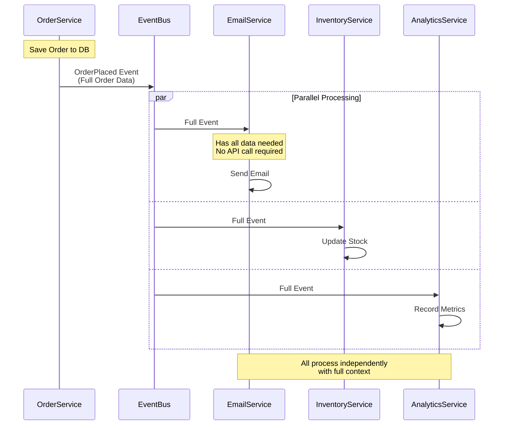

**Implementation:**

```python
# Producer - Full data in event
class OrderService:
    def place_order(self, order):
        # Save order to database
        self.db.save(order)
        
        # Publish event with ALL necessary data
        event = {
            'eventType': 'OrderPlaced',
            'eventId': str(uuid.uuid4()),
            'eventVersion': '1.0',
            'timestamp': datetime.utcnow().isoformat(),
            'source': 'order-service',
            'correlationId': str(uuid.uuid4()),
            'data': {
                # Identifiers
                'orderId': order.id,
                'customerId': order.customer_id,
                
                # Customer info (denormalized)
                'customer': {
                    'id': order.customer.id,
                    'email': order.customer.email,
                    'name': order.customer.name,
                    'phone': order.customer.phone
                },
                
                # Order details
                'orderDate': order.created_at.isoformat(),
                'totalAmount': float(order.total_amount),
                'currency': order.currency,
                'status': order.status,
                
                # Line items (complete info)
                'items': [
                    {
                        'productId': item.product_id,
                        'productName': item.product_name,
                        'productSku': item.product_sku,
                        'quantity': item.quantity,
                        'unitPrice': float(item.unit_price),
                        'totalPrice': float(item.total_price),
                        'imageUrl': item.product_image_url
                    } for item in order.items
                ],
                
                # Shipping info
                'shippingAddress': {
                    'street': order.shipping_address.street,
                    'city': order.shipping_address.city,
                    'state': order.shipping_address.state,
                    'postalCode': order.shipping_address.postal_code,
                    'country': order.shipping_address.country
                },
                
                # Payment info (safe subset)
                'payment': {
                    'method': order.payment_method,
                    'last4': order.payment_last4,
                    'status': 'completed'
                }
            }
        }
        
        self.event_publisher.publish('orders', event)

# Consumer - Fully autonomous
class EmailService:
    def handle_order_placed(self, event):
        order_data = event['data']
        
        # All data is in the event - NO API call needed!
        email_content = self.render_email_template(
            template='order_confirmation',
            customer_name=order_data['customer']['name'],
            order_id=order_data['orderId'],
            items=order_data['items'],
            total=order_data['totalAmount'],
            shipping_address=order_data['shippingAddress']
        )
        
        self.send_email(
            to=order_data['customer']['email'],
            subject=f"Order Confirmation - {order_data['orderId']}",
            content=email_content
        )
        
        # Service is fully autonomous!

class InventoryService:
    def handle_order_placed(self, event):
        order_data = event['data']
        
        # Reduce stock for each item - all data is here
        for item in order_data['items']:
            self.reduce_stock(
                product_id=item['productId'],
                quantity=item['quantity'],
                order_id=order_data['orderId']
            )
        
        print(f"✅ Inventory updated for order {order_data['orderId']}")

class AnalyticsService:
    def handle_order_placed(self, event):
        order_data = event['data']
        
        # Record comprehensive analytics - all data available
        self.record_metrics({
            'event_type': 'order_placed',
            'order_id': order_data['orderId'],
            'customer_id': order_data['customerId'],
            'amount': order_data['totalAmount'],
            'currency': order_data['currency'],
            'item_count': len(order_data['items']),
            'country': order_data['shippingAddress']['country'],
            'timestamp': event['timestamp']
        })
```

**Pros:**
- ✅ Consumers are fully autonomous (no external dependencies)
- ✅ No coupling to producer APIs
- ✅ Better performance (no extra calls)
- ✅ Works even when producer service is down
- ✅ Lower total latency
- ✅ Can process events offline

**Cons:**
- ❌ Larger events (higher network overhead)
- ❌ Data duplication across services
- ❌ Consumers might have slightly stale data
- ❌ Schema evolution is more critical

**When to use:**
- Consumers need the data immediately
- Service autonomy is important
- The producer service might be unavailable
- Network calls between services are expensive
- Multiple consumers need the same data

**Size considerations:**

```python
# Calculate event size
import sys

event = {...}  # Your event
event_size_bytes = sys.getsizeof(json.dumps(event))

print(f"Event size: {event_size_bytes / 1024:.2f} KB")

# Rule of thumb:
# < 10 KB: Perfect for event-carried state transfer
# 10-100 KB: Acceptable, consider compression
# > 100 KB: Consider event notification + API call
# > 1 MB: Definitely use event notification or store in S3/blob storage
```

**Handling large data:**

```python
# For very large data (images, documents)
event = {
    'eventType': 'DocumentUploaded',
    'data': {
        'documentId': 'doc-123',
        'documentUrl': 's3://bucket/documents/doc-123.pdf',  # Reference, not content
        'documentSize': 5242880,  # 5 MB
        'mimeType': 'application/pdf',
        'metadata': {
            'filename': 'contract.pdf',
            'uploadedBy': 'user-456'
        }
    }
}

# Consumers download from S3 if needed
class DocumentProcessorService:
    def handle_document_uploaded(self, event):
        doc_url = event['data']['documentUrl']
        
        # Download only if needed
        if event['data']['mimeType'] == 'application/pdf':
            doc_content = self.s3_client.download(doc_url)
            self.process_pdf(doc_content)
```

### Pattern 3: Event Sourcing

Instead of storing current state, you store every event that ever happened. Current state is derived by replaying events. This is the most advanced pattern.

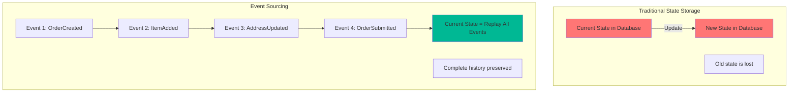

**Traditional vs. Event Sourcing:**

```python
# === TRADITIONAL APPROACH ===
class OrderRepository:
    def update_order(self, order_id, updates):
        # Current state is overwritten
        self.db.update('orders', {'id': order_id}, updates)
        # History is lost!

# Database state:
# orders table: {id: 'ORD-123', status: 'SHIPPED', total: 99.99}
# We don't know:
# - When was it created?
# - What was the original total?
# - When did status change?
# - Who changed it?

# === EVENT SOURCING APPROACH ===
class Order:
    def __init__(self):
        self.id = None
        self.customer_id = None
        self.items = []
        self.shipping_address = None
        self.status = None
        self.uncommitted_events = []
    
    # Commands that produce events
    def create(self, order_id, customer_id):
        event = OrderCreated(
            order_id=order_id,
            customer_id=customer_id,
            timestamp=datetime.utcnow()
        )
        self.apply(event)
        self.uncommitted_events.append(event)
    
    def add_item(self, product_id, quantity, price):
        event = ItemAdded(
            order_id=self.id,
            product_id=product_id,
            quantity=quantity,
            price=price,
            timestamp=datetime.utcnow()
        )
        self.apply(event)
        self.uncommitted_events.append(event)
    
    def set_shipping_address(self, address):
        event = ShippingAddressSet(
            order_id=self.id,
            address=address,
            timestamp=datetime.utcnow()
        )
        self.apply(event)
        self.uncommitted_events.append(event)
    
    def submit(self):
        if not self.items:
            raise ValueError("Cannot submit order without items")
        if not self.shipping_address:
            raise ValueError("Cannot submit order without shipping address")
        
        event = OrderSubmitted(
            order_id=self.id,
            timestamp=datetime.utcnow()
        )
        self.apply(event)
        self.uncommitted_events.append(event)
    
    # Apply events to rebuild state
    def apply(self, event):
        if isinstance(event, OrderCreated):
            self.id = event.order_id
            self.customer_id = event.customer_id
            self.status = 'CREATED'
        
        elif isinstance(event, ItemAdded):
            self.items.append({
                'product_id': event.product_id,
                'quantity': event.quantity,
                'price': event.price
            })
        
        elif isinstance(event, ShippingAddressSet):
            self.shipping_address = event.address
        
        elif isinstance(event, OrderSubmitted):
            self.status = 'SUBMITTED'

# Event Store
class EventStore:
    def __init__(self):
        self.events = {}  # {aggregate_id: [events]}
    
    def save_events(self, aggregate_id, events, expected_version=None):
        # Optimistic locking
        if expected_version is not None:
            current_version = len(self.events.get(aggregate_id, []))
            if current_version != expected_version:
                raise ConcurrencyError("Version mismatch")
        
        if aggregate_id not in self.events:
            self.events[aggregate_id] = []
        
        # Append events (never update)
        self.events[aggregate_id].extend(events)
        
        # Publish to event bus
        for event in events:
            self.event_bus.publish(event)
    
    def get_events(self, aggregate_id, from_version=0):
        return self.events.get(aggregate_id, [])[from_version:]

# Repository
class OrderRepository:
    def __init__(self, event_store):
        self.event_store = event_store
    
    def save(self, order, expected_version=None):
        self.event_store.save_events(
            order.id,
            order.uncommitted_events,
            expected_version
        )
        order.uncommitted_events = []
    
    def get(self, order_id):
        # Rebuild order by replaying events
        events = self.event_store.get_events(order_id)
        
        order = Order()
        for event in events:
            order.apply(event)
        
        return order

# Using it
order = Order()
order.create('ORD-123', 'CUST-456')
order.add_item('PROD-001', 2, 29.99)
order.add_item('PROD-002', 1, 49.99)
order.set_shipping_address({
    'street': '123 Main St',
    'city': 'Boston',
    'state': 'MA',
    'zip': '02101'
})
order.submit()

repository.save(order)

# Event store now contains:
# Event 1: OrderCreated(order_id='ORD-123', customer_id='CUST-456')
# Event 2: ItemAdded(product_id='PROD-001', quantity=2, price=29.99)
# Event 3: ItemAdded(product_id='PROD-002', quantity=1, price=49.99)
# Event 4: ShippingAddressSet(address={...})
# Event 5: OrderSubmitted(order_id='ORD-123')

# Later, retrieve the order
order = repository.get('ORD-123')  # Replays all 5 events
print(order.status)  # 'SUBMITTED'
print(len(order.items))  # 2
```

**Time Travel - See State at Any Point:**

```python
def get_order_at_timestamp(order_id, timestamp):
    events = event_store.get_events(order_id)
    
    # Filter events before timestamp
    historical_events = [e for e in events if e.timestamp <= timestamp]
    
    # Replay to get historical state
    order = Order()
    for event in historical_events:
        order.apply(event)
    
    return order

# What did the order look like yesterday?
order_yesterday = get_order_at_timestamp('ORD-123', yesterday)
```

**Snapshots for Performance:**

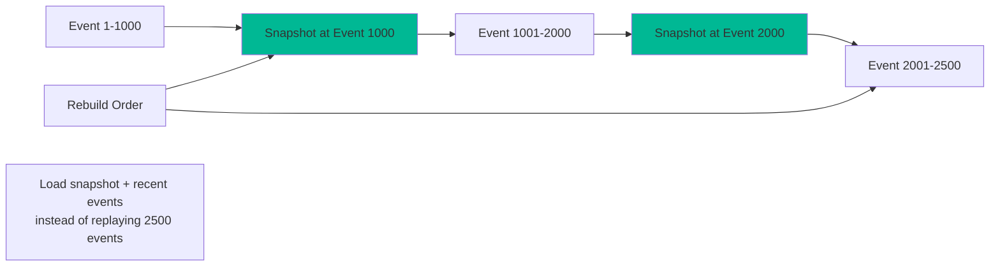

```python
class EventStore:
    def save_snapshot(self, aggregate_id, state, version):
        self.snapshots[aggregate_id] = {
            'state': state,
            'version': version,
            'timestamp': datetime.utcnow()
        }
    
    def load_from_snapshot(self, aggregate_id):
        snapshot = self.snapshots.get(aggregate_id)
        
        if snapshot:
            order = Order()
            order.__dict__.update(snapshot['state'])
            
            # Load events after snapshot
            events = self.get_events(aggregate_id, from_version=snapshot['version'])
            for event in events:
                order.apply(event)
            
            return order
        else:
            # No snapshot, replay all events
            return self.load_from_events(aggregate_id)

# Save snapshot every 100 events
if len(events) % 100 == 0:
    event_store.save_snapshot(
        order.id,
        order.__dict__,
        version=len(events)
    )
```

**Pros:**
- ✅ Complete audit trail (compliance, debugging)
- ✅ Time travel (see state at any point in history)
- ✅ Rebuild state from events (disaster recovery)
- ✅ Business insights from event history
- ✅ Support for temporal queries
- ✅ Can add new projections from historical events

**Cons:**
- ❌ Significant complexity
- ❌ Event schema evolution is critical
- ❌ Replaying thousands of events is slow (need snapshots)
- ❌ Eventually consistent
- ❌ Steeper learning curve

**When to use:**
- Audit trail is critical (finance, healthcare, legal)
- Need to reconstruct historical state
- Complex business logic that benefits from event-driven modeling
- Compliance requirements for data retention
- Domain is naturally event-driven (banking transactions, medical records)

**Real-world examples:**

```python
# Banking - Perfect for event sourcing
events = [
    AccountOpened(account_id='ACC-123', initial_balance=1000),
    MoneyDeposited(account_id='ACC-123', amount=500),
    MoneyWithdrawn(account_id='ACC-123', amount=200),
    InterestCredited(account_id='ACC-123', amount=2.50)
]
# Current balance = replay events = 1302.50
# Complete audit trail of every transaction

# Medical records - Event sourcing for compliance
events = [
    PatientAdmitted(patient_id='PAT-789', diagnosis='...'),
    MedicationPrescribed(patient_id='PAT-789', medication='...'),
    LabTestOrdered(patient_id='PAT-789', test='...'),
    LabResultsRecorded(patient_id='PAT-789', results='...'),
    PatientDischarged(patient_id='PAT-789')
]
# Complete medical history, HIPAA compliant audit trail
```

## Event Design Principles

### Principle 1: Events Should Be Self-Contained

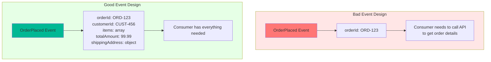

**Bad:**
```json
{
  "eventType": "OrderPlaced",
  "orderId": "ORD-123"
}
```

Consumer must call API: "What's in this order? Who's the customer? Where to ship?"

**Good:**
```json
{
  "eventType": "OrderPlaced",
  "eventId": "evt_7a8b9c",
  "timestamp": "2025-11-01T10:30:00Z",
  "data": {
    "orderId": "ORD-123",
    "customerId": "CUST-456",
    "customerEmail": "customer@example.com",
    "totalAmount": 99.99,
    "items": [
      {
        "productId": "PROD-001",
        "quantity": 2,
        "price": 49.99
      }
    ],
    "shippingAddress": {
      "street": "123 Main St",
      "city": "Boston",
      "state": "MA",
      "zip": "02101"
    }
  }
}
```

Consumer has everything needed to act immediately.

### Principle 2: Use Past Tense for Event Names

Events are facts about what happened, not commands about what to do.

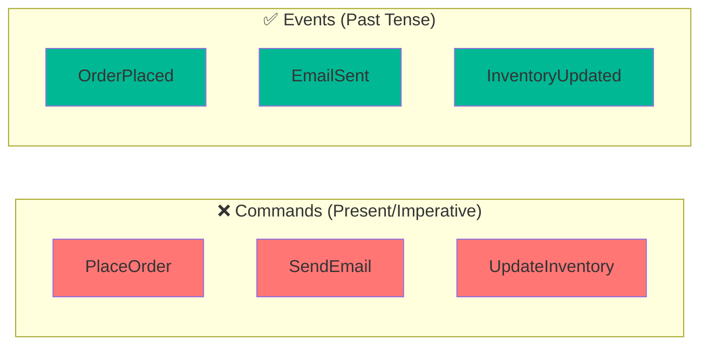

**Bad (Commands):**
- `PlaceOrder` - Tells what to do
- `SendConfirmationEmail` - Directive
- `UpdateInventory` - Imperative

**Good (Events):**
- `OrderPlaced` - States what happened
- `ConfirmationEmailSent` - Past tense
- `InventoryUpdated` - Fact

**Why it matters:**

```python
# Command - prescriptive
event = {'eventType': 'SendEmail', 'to': 'customer@example.com'}
# This tells consumers what to do. Only email service should react.

# Event - descriptive
event = {'eventType': 'OrderPlaced', 'orderId': 'ORD-123', ...}
# This states what happened. Multiple services can decide how to react:
# - Email service: "I'll send an email"
# - SMS service: "I'll send an SMS"
# - Push notification service: "I'll send a push notification"
```

### Principle 3: Include Essential Metadata

```python
{
    # Identity
    "eventId": "evt_7a8b9c0d",  # Unique ID for deduplication
    "eventType": "OrderPlaced",  # What happened
    "eventVersion": "1.0",  # Schema version
    
    # Timing
    "timestamp": "2025-11-01T10:30:00Z",  # When it happened
    
    # Tracing
    "correlationId": "corr_12345",  # Groups related events
    "causationId": "evt_previous",  # The event that caused this one
    
    # Source
    "source": "order-service",  # Which service produced this
    "sourceVersion": "2.3.1",  # Version of producing service
    
    # Actor (for audit)
    "userId": "user-789",  # Who triggered this
    "userAgent": "Mozilla/5.0...",  # How they triggered it
    
    # Data
    "data": {
        // Event payload
    }
}
```

**Correlation ID for distributed tracing:**

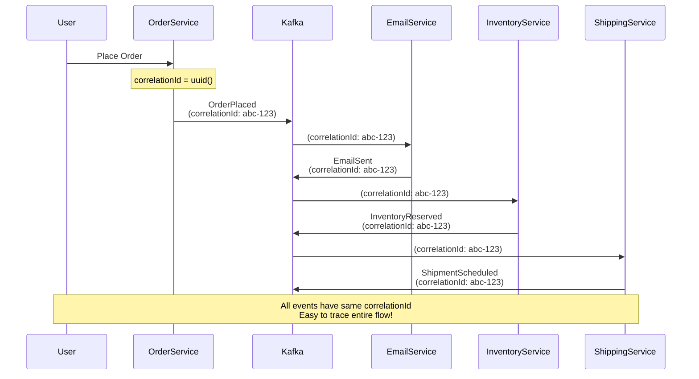

### Principle 4: Design for Evolution

```python
# Version 1.0
{
    "eventVersion": "1.0",
    "eventType": "OrderPlaced",
    "data": {
        "orderId": "ORD-123",
        "customerId": "CUST-456",
        "totalAmount": 99.99
    }
}

# Version 1.1 - Adding optional fields (backward compatible)
{
    "eventVersion": "1.1",
    "eventType": "OrderPlaced",
    "data": {
        "orderId": "ORD-123",
        "customerId": "CUST-456",
        "totalAmount": 99.99,
        "currency": "USD",  # New field with default
        "taxAmount": 8.50   # New field with default
    }
}

# Old consumers ignore new fields ✅
# New consumers handle both versions ✅

# Version 2.0 - Breaking change (carefully managed)
{
    "eventVersion": "2.0",
    "eventType": "OrderPlaced",
    "data": {
        "orderId": "ORD-123",
        "customer": {  # Changed: nested object instead of just ID
            "id": "CUST-456",
            "email": "customer@example.com",
            "name": "Jane Smith"
        },
        "totalAmount": 99.99
    }
}
```

**Schema evolution strategy:**

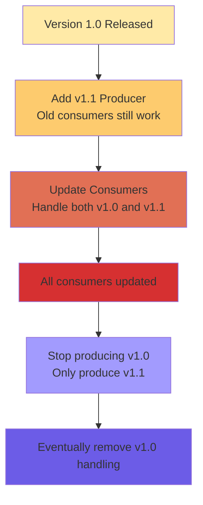

### Principle 5: Keep Events at the Right Granularity

```mermaid
graph TB
    subgraph "Too Fine-Grained ❌"
        A1[UserStartedTyping]
        A1 --> A2[UserTypedCharacter: 'H']
        A2 --> A3[UserTypedCharacter: 'e']
        A3 --> A4[UserTypedCharacter: 'l']
        A4 --> A5[UserTypedCharacter: 'l']
        A5 --> A6[UserTypedCharacter: 'o']
        A6 --> A7[UserStoppedTyping]
    end
    
    subgraph "Too Coarse-Grained ❌"
        B1[UserCompletedEntireWorkflow]
        Note1[Loses important details]
    end
    
    subgraph "Just Right ✅"
        C1[FormStarted]
        C1 --> C2[FieldCompleted: Name]
        C2 --> C3[FieldCompleted: Email]
        C3 --> C4[FormSubmitted]
    end
    
    style A1 fill:#ff7675
    style B1 fill:#ff7675
    style C1 fill:#00b894
```

**Finding the right granularity:**

```python
# Order example - granularity options

# Option 1: Too fine-grained ❌
events = [
    'OrderCreated',
    'Item1Added',
    'Item2Added',
    'Item1QuantityIncreased',
    'Item3Added',
    'Item2Removed',
    'ShippingAddressLineOneSet',
    'ShippingAddressCitySet',
    'ShippingAddressStateSet',
    'PaymentMethodSet',
    'OrderSubmitted'
]
# Too chatty, eventual consistency issues

# Option 2: Too coarse-grained ❌
events = [
    'OrderCompleted'  # Everything in one event
]
# Loses important lifecycle stages

# Option 3: Just right ✅
events = [
    'OrderPlaced',      # Order submitted with all items
    'PaymentReceived',  # Payment processed
    'OrderShipped',     # Warehouse shipped it
    'OrderDelivered'    # Customer received it
]
# Clear lifecycle, meaningful stages
```

## Event Schema Evolution

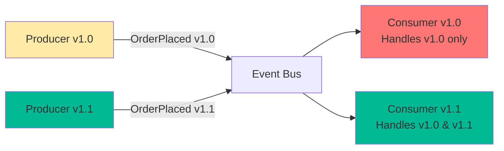

### Strategy 1: Backward Compatibility (Safe)

New producers can be consumed by old consumers.

```python
# Old consumer (v1.0)
def handle_order_placed(event):
    order_id = event['data']['orderId']
    amount = event['data']['totalAmount']
    # Ignores any new fields it doesn't know about ✅

# New event (v1.1) adds optional field
{
    "eventVersion": "1.1",
    "data": {
        "orderId": "ORD-123",
        "totalAmount": 99.99,
        "currency": "USD"  # New field
    }
}
# Old consumer still works! ✅
```

### Strategy 2: Forward Compatibility (Harder)

Old producers can be consumed by new consumers.

```python
# New consumer (v1.1) expects currency field
def handle_order_placed(event):
    order_id = event['data']['orderId']
    amount = event['data']['totalAmount']
    currency = event['data'].get('currency', 'USD')  # Default if missing ✅

# Old event (v1.0) without currency field
{
    "eventVersion": "1.0",
    "data": {
        "orderId": "ORD-123",
        "totalAmount": 99.99
        # No currency field
    }
}
# New consumer handles it with default ✅
```

### Schema Registry Integration

```python
from confluent_kafka import avro
from confluent_kafka.avro import AvroProducer

# Define schema in Avro
value_schema_str = """
{
   "type": "record",
   "name": "Order",
   "namespace": "com.example.ecommerce",
   "fields": [
       {"name": "orderId", "type": "string"},
       {"name": "customerId", "type": "string"},
       {"name": "totalAmount", "type": "double"},
       {"name": "currency", "type": "string", "default": "USD"}
   ]
}
"""

value_schema = avro.loads(value_schema_str)

producer = AvroProducer({
    'bootstrap.servers': 'localhost:9092',
    'schema.registry.url': 'http://localhost:8081'
}, default_value_schema=value_schema)

# Schema automatically registered and versioned
producer.produce(topic='orders', value={
    'orderId': 'ORD-123',
    'customerId': 'CUST-456',
    'totalAmount': 99.99,
    'currency': 'USD'
})
```

## Common Event Design Mistakes

### Mistake 1: Treating Events as Commands

```python
# ❌ Bad: Command disguised as event
{
    "eventType": "SendConfirmationEmail",  # Imperative
    "orderId": "ORD-123"
}

# ✅ Good: Event describing what happened
{
    "eventType": "OrderPlaced",  # Past tense
    "orderId": "ORD-123",
    "customerEmail": "customer@example.com"
}
# Let consumers decide to send email
```

### Mistake 2: Including Too Much Data

```python
# ❌ Bad: Dumping entire database
{
    "eventType": "OrderPlaced",
    "data": {
        "order": {...},  # Entire order object
        "customer": {...},  # Entire customer object with all history
        "products": [...],  # All product details, reviews, inventory
        "allRelatedOrders": [...],  # Why include this?
        "companyMetadata": {...}  # Unnecessary
    }
}
# Event is 500 KB!

# ✅ Good: Just what consumers need
{
    "eventType": "OrderPlaced",
    "data": {
        "orderId": "ORD-123",
        "customerId": "CUST-456",
        "customerEmail": "customer@example.com",
        "items": [...],  # Only items in THIS order
        "totalAmount": 99.99,
        "shippingAddress": {...}
    }
}
# Event is 5 KB
```

### Mistake 3: Including Too Little Data

```python
# ❌ Bad: Forces consumers to make API calls
{
    "eventType": "OrderPlaced",
    "orderId": "ORD-123"
}
# Every consumer must call: GET /orders/ORD-123

# ✅ Good: Self-contained for common use cases
{
    "eventType": "OrderPlaced",
    "data": {
        "orderId": "ORD-123",
        "customerId": "CUST-456",
        "customerEmail": "customer@example.com",
        "totalAmount": 99.99,
        "items": [...]
    }
}
# 80% of consumers have what they need
```

### Mistake 4: No Versioning

```python
# ❌ Bad: No version info
{
    "eventType": "OrderPlaced",
    "data": {...}
}
# How do consumers know what schema to expect?

# ✅ Good: Always version
{
    "eventType": "OrderPlaced",
    "eventVersion": "1.2",
    "data": {...}
}
# Consumers can handle different versions gracefully
```

### Mistake 5: Mutable Events

```python
# ❌ Bad: Updating events
event_store.update_event(event_id, {'status': 'corrected'})
# Events are history - you can't change the past!

# ✅ Good: Compensating events
# Original event stays, new event corrects it
{
    "eventType": "OrderCorrected",
    "originalEventId": "evt_123",
    "corrections": {
        "totalAmount": 89.99  # Was 99.99, corrected to 89.99
    }
}
```

## Practical Event Design Workshop

Let's design events for a real-world scenario: A ride-sharing application.

### Scenario: Ride Lifecycle

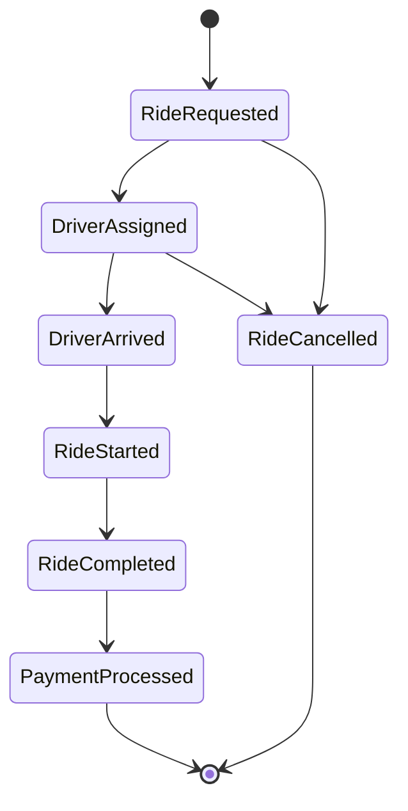

### Event Design:

```python
# Event 1: RideRequested
{
    "eventId": "evt_abc123",
    "eventType": "RideRequested",
    "eventVersion": "1.0",
    "timestamp": "2025-11-01T14:30:00Z",
    "source": "ride-service",
    "correlationId": "ride_xyz789",
    "data": {
        "rideId": "RIDE-001",
        "passengerId": "PASS-123",
        "passengerName": "Jane Smith",
        "passengerPhone": "+1-555-0123",
        "passengerRating": 4.8,
        "pickupLocation": {
            "latitude": 42.3601,
            "longitude": -71.0589,
            "address": "123 Main St, Boston, MA"
        },
        "dropoffLocation": {
            "latitude": 42.3584,
            "longitude": -71.0598,
            "address": "456 Park Ave, Boston, MA"
        },
        "estimatedDistance": 2.5,
        "estimatedDuration": 10,
        "rideType": "STANDARD",
        "requestedAt": "2025-11-01T14:30:00Z"
    }
}

# Event 2: DriverAssigned
{
    "eventId": "evt_def456",
    "eventType": "DriverAssigned",
    "eventVersion": "1.0",
    "timestamp": "2025-11-01T14:30:15Z",
    "correlationId": "ride_xyz789",
    "causationId": "evt_abc123",
    "data": {
        "rideId": "RIDE-001",
        "driverId": "DRV-789",
        "driverName": "John Doe",
        "driverPhone": "+1-555-0456",
        "driverRating": 4.9,
        "vehicleInfo": {
            "make": "Toyota",
            "model": "Camry",
            "color": "Black",
            "licensePlate": "ABC-123"
        },
        "driverLocation": {
            "latitude": 42.3605,
            "longitude": -71.0585
        },
        "estimatedArrival": "2025-11-01T14:35:00Z",
        "assignedAt": "2025-11-01T14:30:15Z"
    }
}

# Event 3: RideStarted
{
    "eventId": "evt_ghi789",
    "eventType": "RideStarted",
    "eventVersion": "1.0",
    "timestamp": "2025-11-01T14:35:30Z",
    "correlationId": "ride_xyz789",
    "causationId": "evt_def456",
    "data": {
        "rideId": "RIDE-001",
        "startLocation": {
            "latitude": 42.3601,
            "longitude": -71.0589
        },
        "startOdometer": 45123.5,
        "startedAt": "2025-11-01T14:35:30Z"
    }
}

# Event 4: RideCompleted
{
    "eventId": "evt_jkl012",
    "eventType": "RideCompleted",
    "eventVersion": "1.0",
    "timestamp": "2025-11-01T14:45:30Z",
    "correlationId": "ride_xyz789",
    "causationId": "evt_ghi789",
    "data": {
        "rideId": "RIDE-001",
        "endLocation": {
            "latitude": 42.3584,
            "longitude": -71.0598
        },
        "endOdometer": 45126.2,
        "actualDistance": 2.7,
        "actualDuration": 10,
        "fareAmount": 15.50,
        "fareBreakdown": {
            "baseFare": 5.00,
            "distanceFare": 8.50,
            "timeFare": 2.00
        },
        "completedAt": "2025-11-01T14:45:30Z"
    }
}
```

### Services Consuming These Events:

```python
# Notification Service - Sends updates to passenger
class NotificationService:
    def handle_driver_assigned(self, event):
        send_push_notification(
            passenger_id=event['data']['passengerId'],
            message=f"Your driver {event['data']['driverName']} is arriving in 5 minutes",
            metadata={
                'driver_name': event['data']['driverName'],
                'vehicle': f"{event['data']['vehicleInfo']['color']} {event['data']['vehicleInfo']['make']}"
            }
        )

# Analytics Service - Tracks metrics
class AnalyticsService:
    def handle_ride_completed(self, event):
        self.record_metrics({
            'event': 'ride_completed',
            'distance': event['data']['actualDistance'],
            'duration': event['data']['actualDuration'],
            'fare': event['data']['fareAmount'],
            'ride_type': 'STANDARD'
        })

# Payment Service - Processes payment
class PaymentService:
    def handle_ride_completed(self, event):
        self.charge_passenger(
            ride_id=event['data']['rideId'],
            amount=event['data']['fareAmount'],
            breakdown=event['data']['fareBreakdown']
        )

# Driver Commission Service - Calculates driver earnings
class DriverCommissionService:
    def handle_ride_completed(self, event):
        driver_earning = event['data']['fareAmount'] * 0.75  # 75% to driver
        self.credit_driver(
            driver_id=event['data']['driverId'],
            amount=driver_earning,
            ride_id=event['data']['rideId']
        )
```

## Next Steps

In Part 3, we'll dive into Apache Kafka:
- What makes Kafka special for event streaming
- Core concepts: topics, partitions, offsets, consumer groups
- Kafka's architecture and guarantees
- When to use Kafka vs. other message brokers

Understanding event design is crucial for building robust event-driven systems. With these patterns and principles, you're ready to design events that will serve your system well for years to come.

**Key Takeaways:**
1. Choose the right pattern: notification, state transfer, or sourcing
2. Events should be self-contained and use past tense
3. Include essential metadata for tracing and debugging
4. Design for schema evolution from day one
5. Find the right granularity - not too fine, not too coarse
6. Version your events and handle evolution gracefully

Next up: Let's explore Apache Kafka! 🚀
