# Part 3: Introduction to Apache Kafka - The Event Streaming Platform

## The Event Streaming Challenge

You've designed beautiful events in Part 2. Your services are ready to produce and consume them. Now you need infrastructure that can handle:

- ✅ **Millions of events per second**
- ✅ **Multiple consumers for the same event**
- ✅ **Event replay** (reprocess old events)
- ✅ **Durability** (don't lose events)
- ✅ **Ordering guarantees**
- ✅ **Horizontal scaling**
- ✅ **Fault tolerance**

This is where traditional message queues fall short, and where Apache Kafka excels.

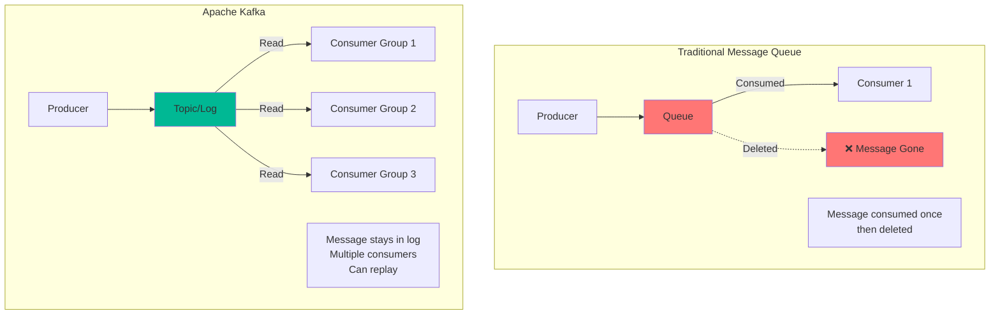
```mermaid
graph TB
    subgraph "Traditional Message Queue"
        A1[Producer] --> B1[Queue]
        B1 -->|Consumed| C1[Consumer 1]
        B1 -.->|Deleted| X1[❌ Message Gone]
        
        Note1[Message consumed once<br/>then deleted]
    end
    
    subgraph "Apache Kafka"
        A2[Producer] --> B2[Topic/Log]
        B2 -->|Read| C2[Consumer Group 1]
        B2 -->|Read| C3[Consumer Group 2]
        B2 -->|Read| C4[Consumer Group 3]
        
        Note2[Message stays in log<br/>Multiple consumers<br/>Can replay]
    end
    
    style B1 fill:#ff7675
    style X1 fill:#ff7675
    style B2 fill:#00b894
```

## What Is Apache Kafka?

Apache Kafka is a **distributed event streaming platform**. Think of it as a distributed, fault-tolerant, append-only log that multiple services can write to and read from.

### The Origin Story

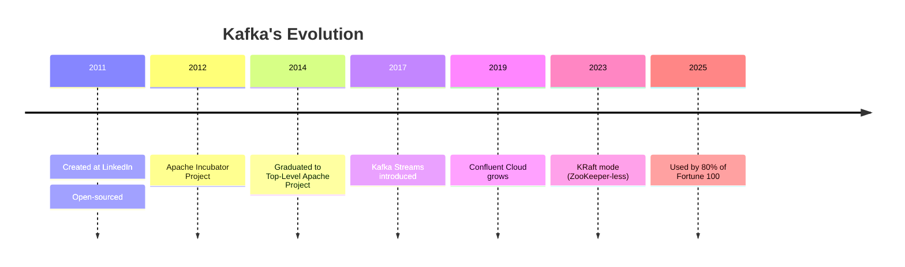
```mermaid
timeline
    title Kafka's Evolution
    2011 : Created at LinkedIn
         : Open-sourced
    2012 : Apache Incubator Project
    2014 : Graduated to Top-Level Apache Project
    2017 : Kafka Streams introduced
    2019 : Confluent Cloud grows
    2023 : KRaft mode (ZooKeeper-less)
    2025 : Used by 80% of Fortune 100
```

**Why LinkedIn built Kafka:**
- Needed to handle massive data pipeline (user activities, metrics, logs)
- Traditional messaging couldn't scale
- Required pub/sub + messaging queue + storage
- Built Kafka: a hybrid that excels at all three

**Today, Kafka powers:**
- 🎬 Netflix - Content recommendations in real-time
- 🚗 Uber - Trip events, driver locations, surge pricing
- 💳 Goldman Sachs - Trading platforms
- 🏦 Banks - Fraud detection, transactions
- 🛒 E-commerce - Order processing, inventory
- 📱 Social media - Activity streams, notifications

## Kafka vs. Traditional Message Queues

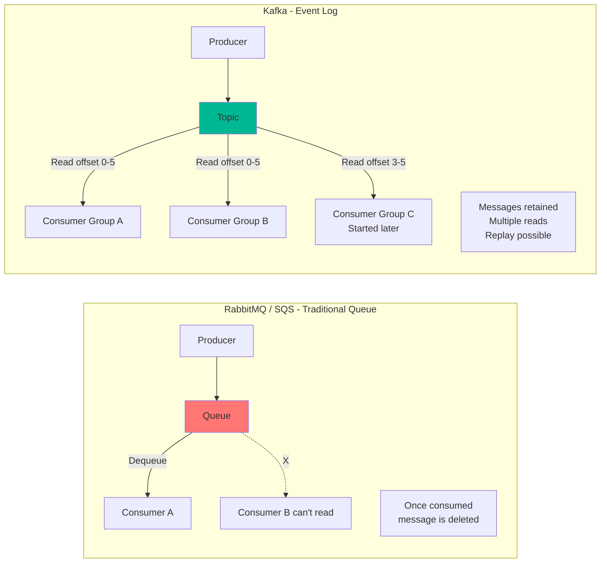
```mermaid
graph LR
    subgraph "RabbitMQ / SQS - Traditional Queue"
        A1[Producer] --> B1[Queue]
        B1 -->|Dequeue| C1[Consumer A]
        B1 -.X.-> C2[Consumer B can't read]
        
        D1[Once consumed<br/>message is deleted]
    end
    
    subgraph "Kafka - Event Log"
        A2[Producer] --> B2[Topic]
        B2 -->|Read offset 0-5| C3[Consumer Group A]
        B2 -->|Read offset 0-5| C4[Consumer Group B]
        B2 -->|Read offset 3-5| C5[Consumer Group C<br/>Started later]
        
        D2[Messages retained<br/>Multiple reads<br/>Replay possible]
    end
    
    style B1 fill:#ff7675
    style B2 fill:#00b894
```

| Feature | Traditional Queue | Kafka |
|---------|------------------|-------|
| **Message Retention** | Deleted after consumption | Retained (configurable: hours to forever) |
| **Consumers** | One per message (competing consumers) | Multiple consumer groups, each gets all messages |
| **Ordering** | Limited | Strong ordering within partition |
| **Throughput** | Moderate (thousands/sec) | Extreme (millions/sec) |
| **Use Case** | Task distribution, work queues | Event streaming, data pipelines, event sourcing |
| **Replay** | ❌ No | ✅ Yes |
| **Storage** | Temporary | Can be permanent |

**Think of it this way:**

- **Message Queue**: Task list where each task is claimed and crossed off
- **Kafka**: Shared append-only log book that everyone can read

## Core Kafka Concepts

### 1. Topics

A **topic** is a category or feed name to which events are published. Like channels, folders, or feeds.

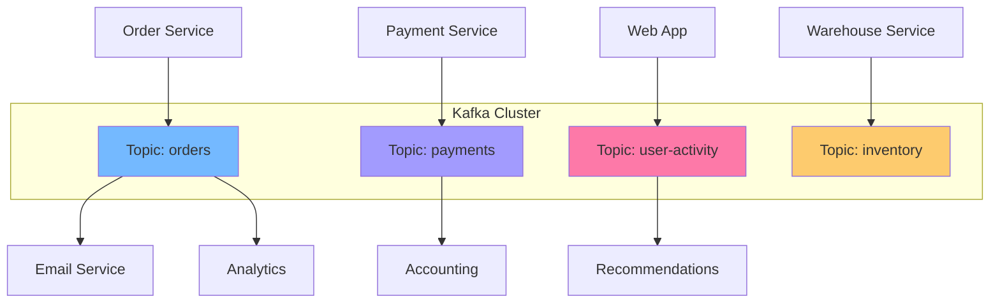
```mermaid
graph TB
    subgraph "Kafka Cluster"
        T1[Topic: orders]
        T2[Topic: payments]
        T3[Topic: user-activity]
        T4[Topic: inventory]
    end
    
    P1[Order Service] --> T1
    P2[Payment Service] --> T2
    P3[Web App] --> T3
    P4[Warehouse Service] --> T4
    
    T1 --> C1[Email Service]
    T1 --> C2[Analytics]
    T2 --> C3[Accounting]
    T3 --> C4[Recommendations]
    
    style T1 fill:#74b9ff
    style T2 fill:#a29bfe
    style T3 fill:#fd79a8
    style T4 fill:#fdcb6e
```

**Examples of topic names:**
- `orders` - All order-related events
- `user-registrations` - User signup events
- `payment-transactions` - Payment events
- `sensor-readings` - IoT sensor data
- `application-logs` - Log aggregation

### 2. Partitions

Each topic is divided into **partitions** for parallelism and scalability.

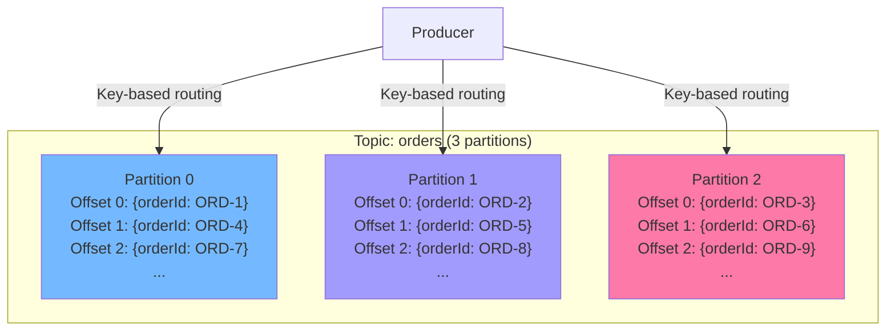
```mermaid
graph TB
    subgraph "Topic: orders (3 partitions)"
        P0["Partition 0<br/>Offset 0: {orderId: ORD-1}<br/>Offset 1: {orderId: ORD-4}<br/>Offset 2: {orderId: ORD-7}<br/>..."]
        
        P1["Partition 1<br/>Offset 0: {orderId: ORD-2}<br/>Offset 1: {orderId: ORD-5}<br/>Offset 2: {orderId: ORD-8}<br/>..."]
        
        P2["Partition 2<br/>Offset 0: {orderId: ORD-3}<br/>Offset 1: {orderId: ORD-6}<br/>Offset 2: {orderId: ORD-9}<br/>..."]
    end
    
    A[Producer] -->|Key-based routing| P0
    A -->|Key-based routing| P1
    A -->|Key-based routing| P2
    
    style P0 fill:#74b9ff
    style P1 fill:#a29bfe
    style P2 fill:#fd79a8
```

**Why partitions?**

1. **Scalability** - Different partitions can be on different brokers
2. **Parallelism** - Multiple consumers can read different partitions simultaneously
3. **Ordering** - Messages within a partition are strictly ordered

**Key insight:** Kafka guarantees ordering **within a partition**, but NOT across partitions.

```python
# Example: Partition assignment

# Producer sends with key
producer.send(
    topic='orders',
    key='customer-123',  # Same key → same partition
    value=order_event
)

# Messages with the same key always go to the same partition
# This ensures ordering for that customer's events

# Without key - round-robin distribution
producer.send(
    topic='orders',
    value=order_event  # No key → distributed across partitions
)
```

### 3. Offsets

Each message in a partition gets a sequential ID called an **offset**.

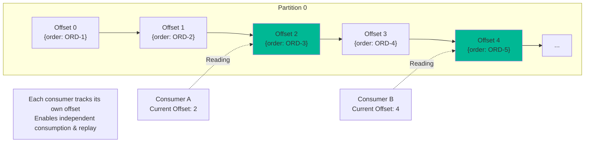
```mermaid
graph LR
    subgraph "Partition 0"
        O0["Offset 0<br/>{order: ORD-1}"]
        O1["Offset 1<br/>{order: ORD-2}"]
        O2["Offset 2<br/>{order: ORD-3}"]
        O3["Offset 3<br/>{order: ORD-4}"]
        O4["Offset 4<br/>{order: ORD-5}"]
        O5["..."]
        
        O0 --> O1 --> O2 --> O3 --> O4 --> O5
    end
    
    C[Consumer A<br/>Current Offset: 2]
    C -.->|Reading| O2
    
    C2[Consumer B<br/>Current Offset: 4]
    C2 -.->|Reading| O4
    
    Note[Each consumer tracks its own offset<br/>Enables independent consumption & replay]
    
    style O2 fill:#00b894
    style O4 fill:#00b894
```

**Offsets enable:**
- **Independent consumption** - Each consumer group tracks its own position
- **Replay** - Reset offset to reprocess old messages
- **Resume** - Consumer crashes? Resume from last committed offset
- **Monitoring** - Track consumer lag (current offset vs. latest offset)

### 4. Brokers

A **broker** is a Kafka server. A production Kafka cluster typically has 3+ brokers for fault tolerance.

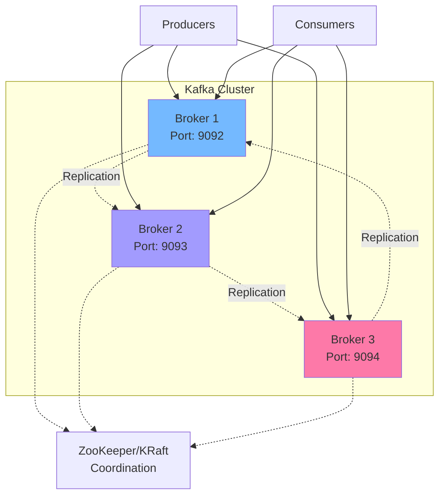
```mermaid
graph TB
    subgraph "Kafka Cluster"
        B1[Broker 1<br/>Port: 9092]
        B2[Broker 2<br/>Port: 9093]
        B3[Broker 3<br/>Port: 9094]
        
        B1 -.->|Replication| B2
        B2 -.->|Replication| B3
        B3 -.->|Replication| B1
    end
    
    P[Producers] --> B1
    P --> B2
    P --> B3
    
    C[Consumers] --> B1
    C --> B2
    C --> B3
    
    Z[ZooKeeper/KRaft<br/>Coordination]
    
    B1 -.-> Z
    B2 -.-> Z
    B3 -.-> Z
    
    style B1 fill:#74b9ff
    style B2 fill:#a29bfe
    style B3 fill:#fd79a8
```

**Broker responsibilities:**
- Store partition data on disk
- Serve produce requests from producers
- Serve fetch requests from consumers
- Participate in replication
- Manage partition leadership

### 5. Replication

Partitions are replicated across brokers for **fault tolerance**.

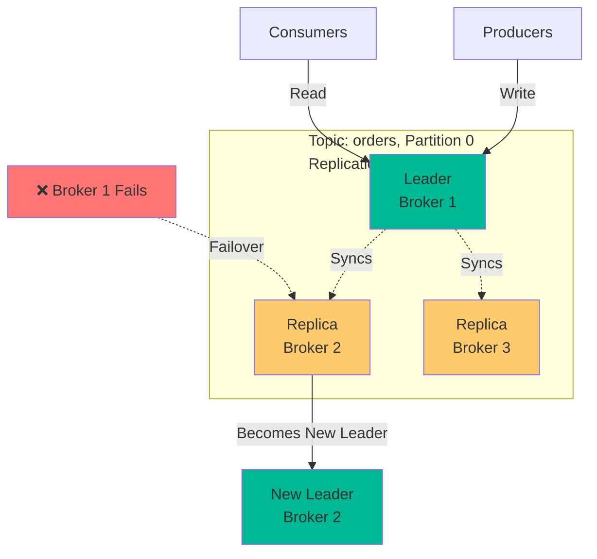
```mermaid
graph TB
    subgraph "Topic: orders, Partition 0<br/>Replication Factor: 3"
        L[Leader<br/>Broker 1]
        R1[Replica<br/>Broker 2]
        R2[Replica<br/>Broker 3]
        
        L -.->|Syncs| R1
        L -.->|Syncs| R2
    end
    
    P[Producers] -->|Write| L
    C[Consumers] -->|Read| L
    
    X[❌ Broker 1 Fails]
    X -.->|Failover| R1
    R1 -->|Becomes New Leader| NL[New Leader<br/>Broker 2]
    
    style L fill:#00b894
    style R1 fill:#fdcb6e
    style R2 fill:#fdcb6e
    style NL fill:#00b894
    style X fill:#ff7675
```

**Replication concepts:**

- **Replication Factor** - How many copies of each partition (typically 3)
- **Leader** - One replica handles all reads/writes
- **Followers (ISR)** - In-Sync Replicas that stay up-to-date
- **Failover** - If leader fails, a follower becomes the new leader

```bash
# Create topic with replication
kafka-topics --create \
  --bootstrap-server localhost:9092 \
  --topic orders \
  --partitions 3 \
  --replication-factor 3

# Topic: orders
# Partition 0: Leader=Broker1, Replicas=[Broker1, Broker2, Broker3]
# Partition 1: Leader=Broker2, Replicas=[Broker2, Broker3, Broker1]
# Partition 2: Leader=Broker3, Replicas=[Broker3, Broker1, Broker2]
```

### 6. Producers

Applications that publish events to Kafka topics.

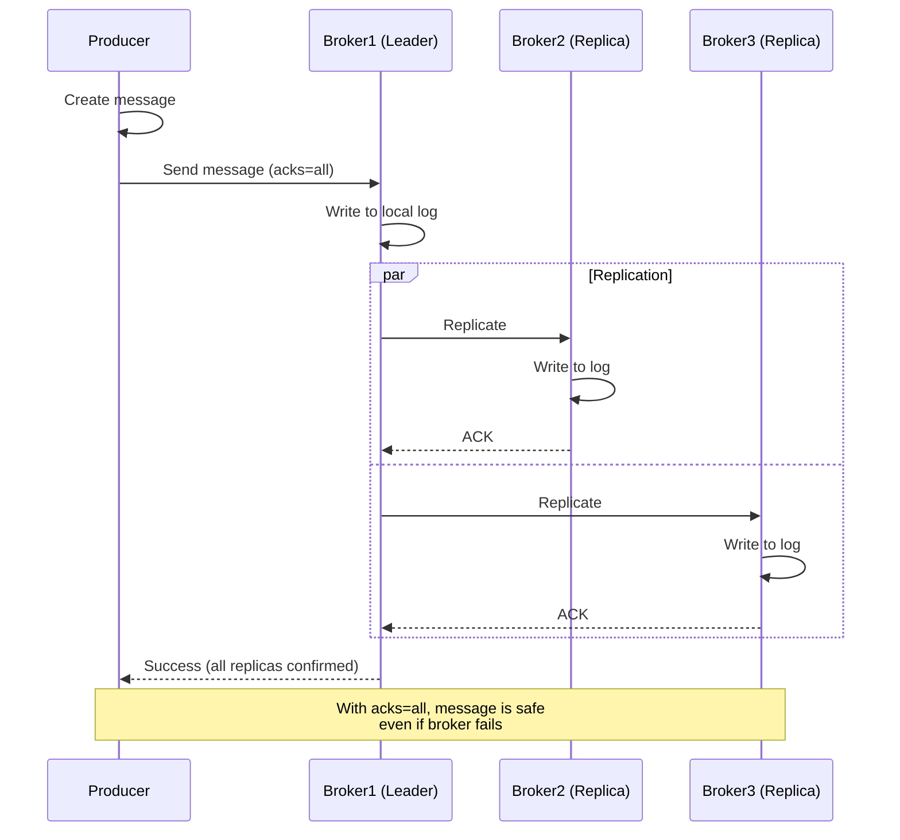
```mermaid
sequenceDiagram
    participant Producer
    participant Broker1 (Leader)
    participant Broker2 (Replica)
    participant Broker3 (Replica)
    
    Producer->>Producer: Create message
    Producer->>Broker1 (Leader): Send message (acks=all)
    Broker1 (Leader)->>Broker1 (Leader): Write to local log
    
    par Replication
        Broker1 (Leader)->>Broker2 (Replica): Replicate
        Broker2 (Replica)->>Broker2 (Replica): Write to log
        Broker2 (Replica)-->>Broker1 (Leader): ACK
    and
        Broker1 (Leader)->>Broker3 (Replica): Replicate
        Broker3 (Replica)->>Broker3 (Replica): Write to log
        Broker3 (Replica)-->>Broker1 (Leader): ACK
    end
    
    Broker1 (Leader)-->>Producer: Success (all replicas confirmed)
    
    Note over Producer,Broker3 (Replica): With acks=all, message is safe<br/>even if broker fails
```

**Producer configuration:**

```python
from kafka import KafkaProducer
import json

producer = KafkaProducer(
    # Broker addresses
    bootstrap_servers=['localhost:9092', 'localhost:9093', 'localhost:9094'],
    
    # Serialization
    value_serializer=lambda v: json.dumps(v).encode('utf-8'),
    key_serializer=lambda k: k.encode('utf-8') if k else None,
    
    # Reliability
    acks='all',  # Wait for all replicas (most reliable)
    retries=3,   # Retry on failure
    max_in_flight_requests_per_connection=5,
    
    # Performance
    batch_size=16384,  # Batch messages for efficiency
    linger_ms=10,      # Wait up to 10ms to batch messages
    compression_type='snappy',  # Compress for network efficiency
    
    # Idempotence (exactly-once)
    enable_idempotence=True
)

# Send a message
future = producer.send(
    topic='orders',
    key='customer-123',  # Ensures ordering for this customer
    value={
        'eventType': 'OrderPlaced',
        'orderId': 'ORD-789',
        'amount': 99.99
    }
)

# Wait for confirmation
record_metadata = future.get(timeout=10)
print(f"Message sent to partition {record_metadata.partition} at offset {record_metadata.offset}")
```

### 7. Consumers and Consumer Groups

Consumers read events from topics. **Consumer groups** enable parallel processing while maintaining ordering.

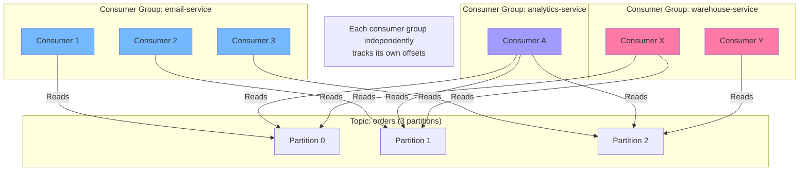
```mermaid
graph TB
    subgraph "Topic: orders (3 partitions)"
        P0[Partition 0]
        P1[Partition 1]
        P2[Partition 2]
    end
    
    subgraph "Consumer Group: email-service"
        C1[Consumer 1] -->|Reads| P0
        C2[Consumer 2] -->|Reads| P1
        C3[Consumer 3] -->|Reads| P2
    end
    
    subgraph "Consumer Group: analytics-service"
        C4[Consumer A] -->|Reads| P0
        C4 -->|Reads| P1
        C4 -->|Reads| P2
    end
    
    subgraph "Consumer Group: warehouse-service"
        C5[Consumer X] -->|Reads| P0
        C5 -->|Reads| P1
        C6[Consumer Y] -->|Reads| P2
    end
    
    Note[Each consumer group independently<br/>tracks its own offsets]
    
    style C1 fill:#74b9ff
    style C2 fill:#74b9ff
    style C3 fill:#74b9ff
    style C4 fill:#a29bfe
    style C5 fill:#fd79a8
    style C6 fill:#fd79a8
```

**Key principles:**

1. **Each partition is consumed by only ONE consumer in a group**
2. **Multiple consumer groups can consume the same topic**
3. **Adding consumers (up to # of partitions) increases parallelism**
4. **Each group tracks its own offsets independently**

```python
from kafka import KafkaConsumer

# Consumer in a group
consumer = KafkaConsumer(
    'orders',  # Topic to consume
    
    # Consumer group
    group_id='email-service',  # Multiple consumers with same group_id work together
    
    # Broker addresses
    bootstrap_servers=['localhost:9092'],
    
    # Deserialization
    value_deserializer=lambda m: json.loads(m.decode('utf-8')),
    
    # Offset management
    auto_offset_reset='earliest',  # Start from beginning if no offset stored
    enable_auto_commit=True,       # Auto-commit offsets
    auto_commit_interval_ms=5000,  # Commit every 5 seconds
    
    # Consumer behavior
    max_poll_records=500,  # Fetch up to 500 records per poll
    session_timeout_ms=10000  # 10 second timeout before rebalance
)

print("Consumer started. Waiting for messages...")

for message in consumer:
    event = message.value
    
    print(f"Received message:")
    print(f"  Partition: {message.partition}")
    print(f"  Offset: {message.offset}")
    print(f"  Key: {message.key}")
    print(f"  Event Type: {event['eventType']}")
    
    # Process the event
    process_event(event)
    
    # Offset is auto-committed
```

### Consumer Group Scaling Example

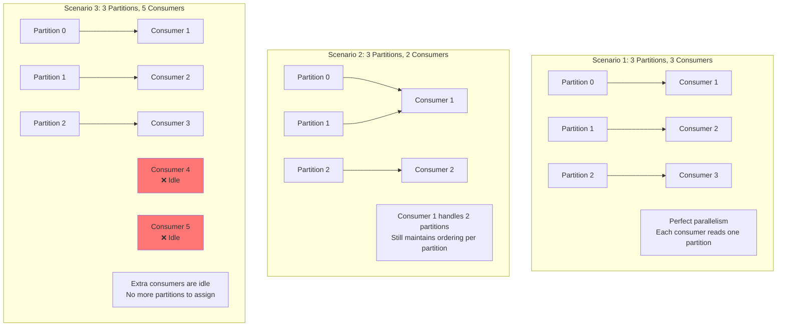
```mermaid
graph TB
    subgraph "Scenario 1: 3 Partitions, 3 Consumers"
        P1A[Partition 0] --> C1A[Consumer 1]
        P1B[Partition 1] --> C1B[Consumer 2]
        P1C[Partition 2] --> C1C[Consumer 3]
        
        Note1[Perfect parallelism<br/>Each consumer reads one partition]
    end
    
    subgraph "Scenario 2: 3 Partitions, 2 Consumers"
        P2A[Partition 0] --> C2A[Consumer 1]
        P2B[Partition 1] --> C2A
        P2C[Partition 2] --> C2B[Consumer 2]
        
        Note2[Consumer 1 handles 2 partitions<br/>Still maintains ordering per partition]
    end
    
    subgraph "Scenario 3: 3 Partitions, 5 Consumers"
        P3A[Partition 0] --> C3A[Consumer 1]
        P3B[Partition 1] --> C3B[Consumer 2]
        P3C[Partition 2] --> C3C[Consumer 3]
        C3D[Consumer 4<br/>❌ Idle]
        C3E[Consumer 5<br/>❌ Idle]
        
        Note3[Extra consumers are idle<br/>No more partitions to assign]
    end
    
    style C3D fill:#ff7675
    style C3E fill:#ff7675
```

## How Kafka Achieves High Performance

### 1. Sequential I/O

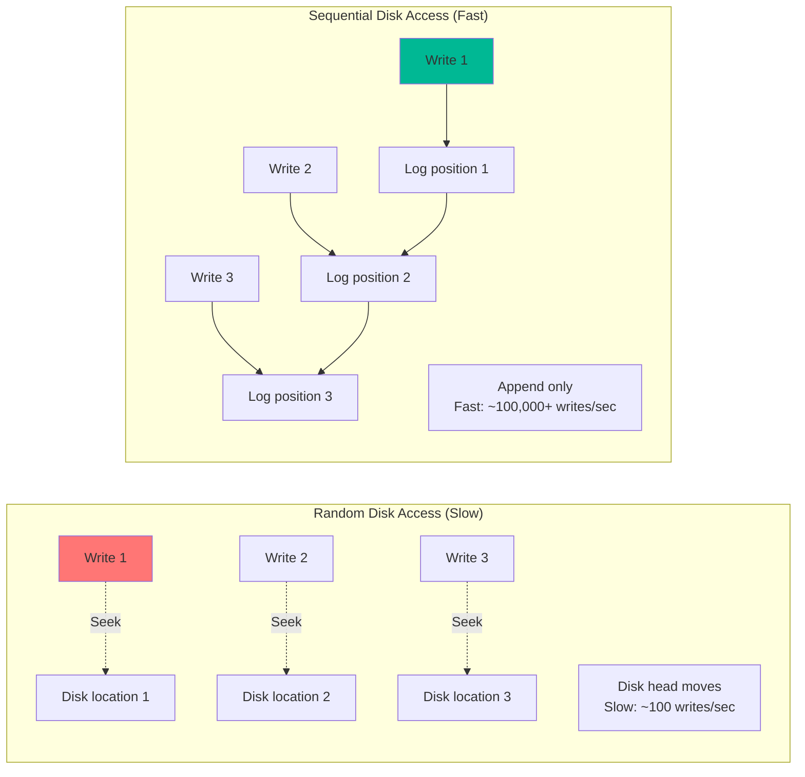
```mermaid
graph LR
    subgraph "Random Disk Access (Slow)"
        A1[Write 1] -.->|Seek| D1[Disk location 1]
        A2[Write 2] -.->|Seek| D2[Disk location 2]
        A3[Write 3] -.->|Seek| D3[Disk location 3]
        
        Note1[Disk head moves<br/>Slow: ~100 writes/sec]
    end
    
    subgraph "Sequential Disk Access (Fast)"
        B1[Write 1] --> L1[Log position 1]
        B2[Write 2] --> L2[Log position 2]
        B3[Write 3] --> L3[Log position 3]
        L1 --> L2 --> L3
        
        Note2[Append only<br/>Fast: ~100,000+ writes/sec]
    end
    
    style A1 fill:#ff7675
    style B1 fill:#00b894
```

Kafka writes to disk **sequentially** (appending to a log). Sequential writes are incredibly fast—often faster than random memory access!

### 2. Zero-Copy

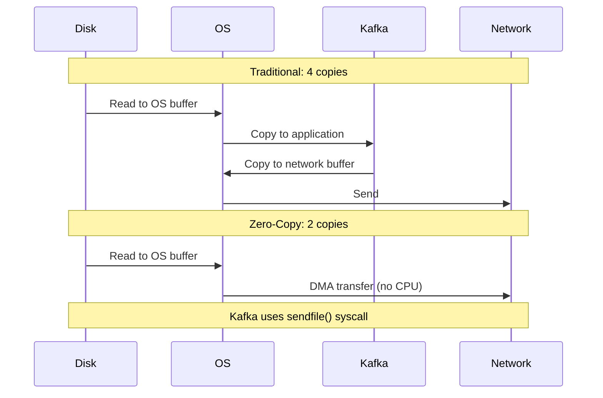
```mermaid
sequenceDiagram
    participant Disk
    participant OS
    participant Kafka
    participant Network
    
    Note over Disk,Network: Traditional: 4 copies
    Disk->>OS: Read to OS buffer
    OS->>Kafka: Copy to application
    Kafka->>OS: Copy to network buffer
    OS->>Network: Send
    
    Note over Disk,Network: Zero-Copy: 2 copies
    Disk->>OS: Read to OS buffer
    OS->>Network: DMA transfer (no CPU)
    
    Note over Disk,Network: Kafka uses sendfile() syscall
```

Kafka uses OS-level **zero-copy** to transfer data from disk to network without going through application memory. Huge performance win!

### 3. Batching

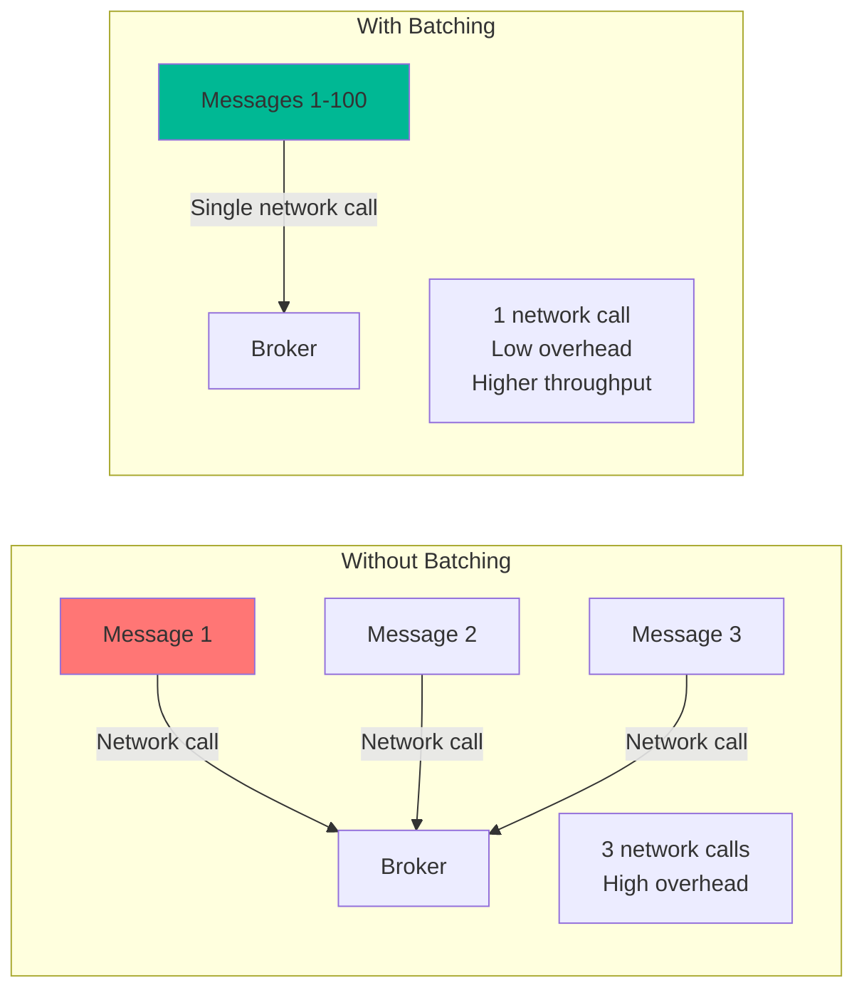
```mermaid
graph LR
    subgraph "Without Batching"
        A1[Message 1] -->|Network call| B1[Broker]
        A2[Message 2] -->|Network call| B1
        A3[Message 3] -->|Network call| B1
        
        Note1[3 network calls<br/>High overhead]
    end
    
    subgraph "With Batching"
        C1[Messages 1-100] -->|Single network call| D1[Broker]
        
        Note2[1 network call<br/>Low overhead<br/>Higher throughput]
    end
    
    style A1 fill:#ff7675
    style C1 fill:#00b894
```

Producers and consumers **batch messages**, reducing network overhead dramatically.

### 4. Compression

```python
# Producer with compression
producer = KafkaProducer(
    compression_type='snappy',  # or 'gzip', 'lz4', 'zstd'
    bootstrap_servers=['localhost:9092']
)

# Compression reduces:
# - Network bandwidth (smaller messages)
# - Disk space (stored compressed)
# - Network latency (fewer bytes to transfer)

# Compression ratio example:
# Original: 1000 bytes
# Snappy:    400 bytes (60% compression)
# Gzip:      300 bytes (70% compression, slower)
```

### 5. Page Cache

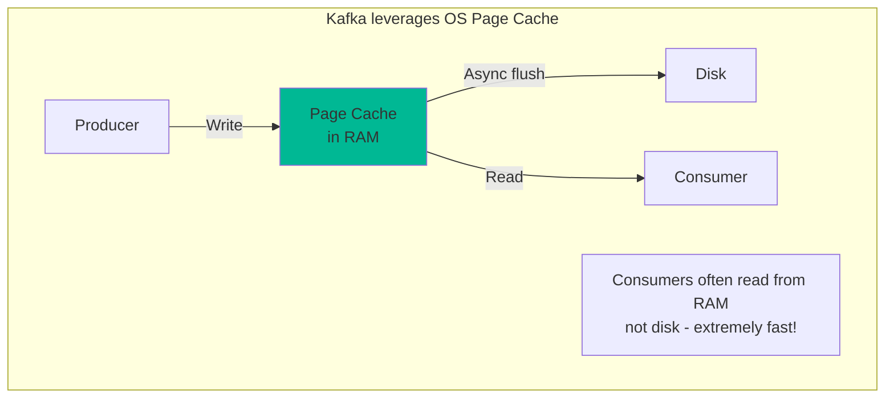
```mermaid
graph TB
    subgraph "Kafka leverages OS Page Cache"
        P[Producer] -->|Write| PC[Page Cache<br/>in RAM]
        PC -->|Async flush| D[Disk]
        PC -->|Read| C[Consumer]
        
        Note1[Consumers often read from RAM<br/>not disk - extremely fast!]
    end
    
    style PC fill:#00b894
```

Kafka relies heavily on the OS **page cache**. Recent messages are in RAM, making reads extremely fast.

## Kafka's Guarantees

### Message Delivery Semantics

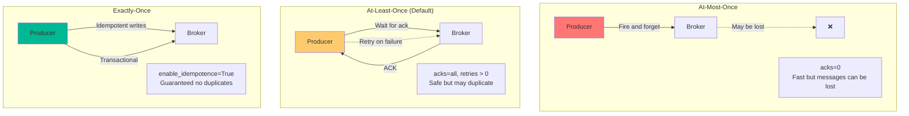
```mermaid
graph TB
    subgraph "At-Most-Once"
        A1[Producer] -->|Fire and forget| B1[Broker]
        B1 -.->|May be lost| X1[❌]
        
        Note1[acks=0<br/>Fast but messages can be lost]
    end
    
    subgraph "At-Least-Once (Default)"
        A2[Producer] -->|Wait for ack| B2[Broker]
        B2 -->|ACK| A2
        A2 -.->|Retry on failure| B2
        
        Note2[acks=all, retries > 0<br/>Safe but may duplicate]
    end
    
    subgraph "Exactly-Once"
        A3[Producer] -->|Idempotent writes| B3[Broker]
        A3 -->|Transactional| B3
        
        Note3[enable_idempotence=True<br/>Guaranteed no duplicates]
    end
    
    style A1 fill:#ff7675
    style A2 fill:#fdcb6e
    style A3 fill:#00b894
```

**At-Most-Once:**
```python
producer = KafkaProducer(acks=0)  # Don't wait for acknowledgment
# Fast, but messages might be lost
```

**At-Least-Once (Default):**
```python
producer = KafkaProducer(
    acks='all',  # Wait for all replicas
    retries=3    # Retry on failure
)
# Messages never lost, but might be delivered twice
```

**Exactly-Once:**
```python
producer = KafkaProducer(
    enable_idempotence=True,  # Prevents duplicates
    acks='all',
    retries=Integer.MAX_VALUE
)
# Messages delivered exactly once (most expensive)
```

### Ordering Guarantees

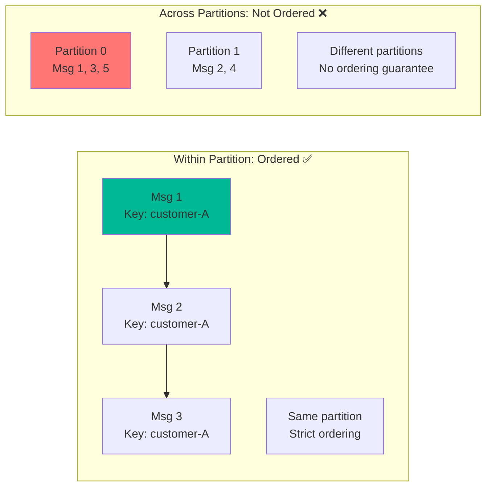
```mermaid
graph LR
    subgraph "Within Partition: Ordered ✅"
        P1[Msg 1<br/>Key: customer-A] --> P2[Msg 2<br/>Key: customer-A]
        P2 --> P3[Msg 3<br/>Key: customer-A]
        
        Note1[Same partition<br/>Strict ordering]
    end
    
    subgraph "Across Partitions: Not Ordered ❌"
        PA[Partition 0<br/>Msg 1, 3, 5]
        PB[Partition 1<br/>Msg 2, 4]
        
        Note2[Different partitions<br/>No ordering guarantee]
    end
    
    style P1 fill:#00b894
    style PA fill:#ff7675
```

**Key point:** Use message keys to ensure related events go to the same partition and maintain ordering.

```python
# Ensure ordering for specific customer
producer.send(
    'orders',
    key='customer-123',  # All events for customer-123 go to same partition
    value=order_event
)
```

## When to Use Kafka

### ✅ Perfect for Kafka:

1. **High-throughput event streaming**
   - Processing millions of events per second
   - Real-time data pipelines

2. **Event sourcing architectures**
   - Storing events as source of truth
   - Replaying events to rebuild state

3. **Log aggregation**
   - Collecting logs from multiple services
   - Centralizing for analysis

4. **Metrics collection**
   - Real-time metrics from distributed systems
   - Time-series data

5. **Change Data Capture (CDC)**
   - Capturing database changes as events
   - Streaming data to other systems

6. **Microservices communication**
   - Decoupled, asynchronous communication
   - Multiple services reacting to same events

### ❌ Not ideal for Kafka:

1. **Simple request-response patterns**
   - Synchronous RPC better with REST/gRPC

2. **Low-volume messaging (<1000 msgs/day)**
   - Kafka overhead not worth it
   - Use SQS or simple database

3. **Complex routing logic**
   - "Send message to service X if condition Y"
   - Better with RabbitMQ exchanges

4. **Small teams without distributed systems experience**
   - Operational complexity
   - Learning curve

5. **Transactional message processing**
   - Need guaranteed ordering across topics
   - Traditional queues better

## Kafka Ecosystem

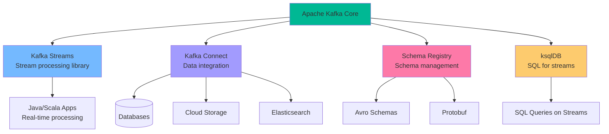
```mermaid
graph TB
    K[Apache Kafka Core]
    
    K --> KS[Kafka Streams<br/>Stream processing library]
    K --> KC[Kafka Connect<br/>Data integration]
    K --> SR[Schema Registry<br/>Schema management]
    K --> KSQL[ksqlDB<br/>SQL for streams]
    
    KS --> APP1[Java/Scala Apps<br/>Real-time processing]
    KC --> DB[(Databases)]
    KC --> S3[Cloud Storage]
    KC --> ES[Elasticsearch]
    SR --> AVRO[Avro Schemas]
    SR --> PROTO[Protobuf]
    KSQL --> SQL[SQL Queries on Streams]
    
    style K fill:#00b894
    style KS fill:#74b9ff
    style KC fill:#a29bfe
    style SR fill:#fd79a8
    style KSQL fill:#fdcb6e
```

### Kafka Streams
```java
// Stream processing directly on Kafka
StreamsBuilder builder = new StreamsBuilder();
KStream<String, Order> orders = builder.stream("orders");

// Transform stream
orders
    .filter((key, order) -> order.getAmount() > 1000)
    .mapValues(order -> enrichOrder(order))
    .to("high-value-orders");
```

### Kafka Connect
```json
{
  "name": "postgres-source",
  "connector.class": "io.debezium.connector.postgresql.PostgresConnector",
  "database.hostname": "localhost",
  "database.port": "5432",
  "database.dbname": "mydb",
  "table.include.list": "public.orders"
}
```
Every database change becomes a Kafka event automatically!

### Schema Registry
```python
from confluent_kafka import avro
from confluent_kafka.avro import AvroProducer

# Schemas are versioned and validated
producer = AvroProducer({
    'bootstrap.servers': 'localhost:9092',
    'schema.registry.url': 'http://localhost:8081'
}, default_value_schema=value_schema)
```

## Kafka Architecture Deep Dive

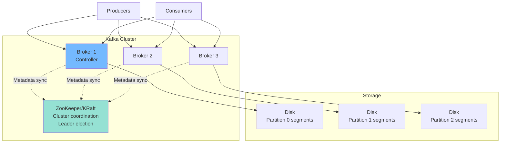
```mermaid
graph TB
    subgraph "Kafka Cluster"
        ZK[ZooKeeper/KRaft<br/>Cluster coordination<br/>Leader election]
        
        B1[Broker 1<br/>Controller]
        B2[Broker 2]
        B3[Broker 3]
        
        B1 -.->|Metadata sync| ZK
        B2 -.->|Metadata sync| ZK
        B3 -.->|Metadata sync| ZK
    end
    
    subgraph "Storage"
        S1[Disk<br/>Partition 0 segments]
        S2[Disk<br/>Partition 1 segments]
        S3[Disk<br/>Partition 2 segments]
    end
    
    B1 --> S1
    B2 --> S2
    B3 --> S3
    
    P[Producers] --> B1
    P --> B2
    P --> B3
    
    C[Consumers] --> B1
    C --> B2
    C --> B3
    
    style ZK fill:#95e1d3
    style B1 fill:#74b9ff
```

### Log Segments

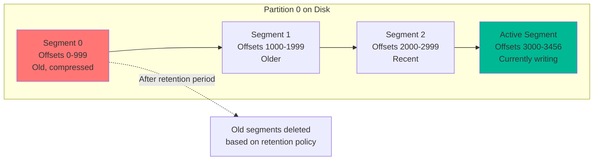
```mermaid
graph LR
    subgraph "Partition 0 on Disk"
        S1["Segment 0<br/>Offsets 0-999<br/>Old, compressed"]
        S2["Segment 1<br/>Offsets 1000-1999<br/>Older"]
        S3["Segment 2<br/>Offsets 2000-2999<br/>Recent"]
        S4["Active Segment<br/>Offsets 3000-3456<br/>Currently writing"]
        
        S1 --> S2 --> S3 --> S4
    end
    
    DEL[Old segments deleted<br/>based on retention policy]
    S1 -.->|After retention period| DEL
    
    style S4 fill:#00b894
    style S1 fill:#ff7675
```

Messages are stored in **log segments**:
- Active segment receives new writes
- Closed segments are immutable
- Old segments deleted per retention policy

## Performance Characteristics

```mermaid
graph TB
    subgraph "Kafka Performance"
        T1[Throughput<br/>Millions msgs/sec]
        T2[Latency<br/>2-3ms p99]
        T3[Scalability<br/>Horizontal]
        T4[Durability<br/>Replicated storage]
    end
    
    Note[Real-world benchmarks:<br/>2M msgs/sec on 3 brokers<br/>Sub-millisecond latency<br/>99.9% durability]
    
    style T1 fill:#00b894
    style T2 fill:#00b894
    style T3 fill:#00b894
    style T4 fill:#00b894
```

**Real-world numbers:**
- **Throughput**: 2M+ messages/second per cluster
- **Latency**: <10ms end-to-end at p99
- **Storage**: Petabytes of data
- **Retention**: Days to years
- **Consumers**: Thousands per cluster

## Getting Started Checklist

Before diving into hands-on (Part 4), understand:

✅ **Topics** - Categories for events  
✅ **Partitions** - Scaling and ordering  
✅ **Offsets** - Position in partition  
✅ **Brokers** - Kafka servers  
✅ **Replication** - Fault tolerance  
✅ **Producers** - Write events  
✅ **Consumers** - Read events  
✅ **Consumer Groups** - Parallel processing  

## Next Steps

In Part 4, we'll get hands-on:
- Setting up Kafka locally (Docker)
- Creating topics and partitions
- Writing a producer to send events
- Writing consumers to process events
- Building a complete event-driven application
- Understanding consumer groups in action

You now understand what Kafka is and why it's powerful. Time to write some code! 🚀

**Key Takeaways:**
1. Kafka is a distributed, fault-tolerant event log
2. Topics have partitions for scalability
3. Partitions provide ordering guarantees
4. Consumer groups enable parallel processing
5. Replication ensures fault tolerance
6. High performance through sequential I/O, zero-copy, and batching
7. Perfect for high-throughput event streaming

Next: Let's build something with Kafka!
