# Part 4: Hands-On Kafka - Building Your First Event-Driven Application

## Introduction

Theory is great, but nothing beats hands-on experience. In this part, we'll build a complete event-driven e-commerce system using Kafka. You'll learn by doing.

**What we'll build:**

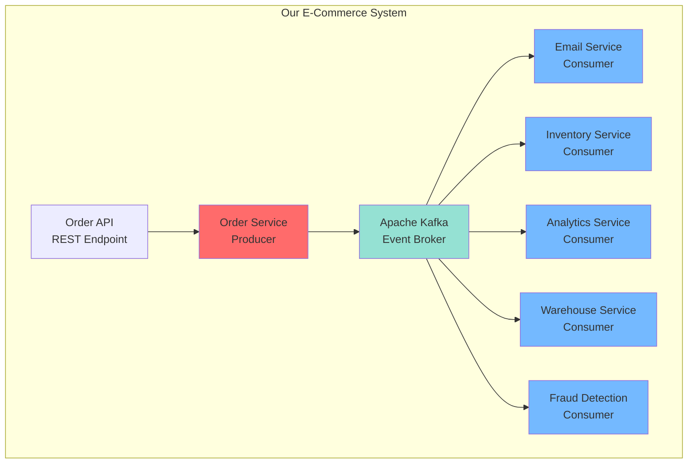

## Step 1: Setting Up Kafka Locally

### Option 1: Docker Compose (Recommended)

Create a file `docker-compose.yml`:

```yaml
version: '3.8'

services:
  # ZooKeeper - Manages Kafka cluster coordination
  zookeeper:
    image: confluentinc/cp-zookeeper:7.5.0
    hostname: zookeeper
    container_name: zookeeper
    ports:
      - "2181:2181"
    environment:
      ZOOKEEPER_CLIENT_PORT: 2181
      ZOOKEEPER_TICK_TIME: 2000
    volumes:
      - zookeeper-data:/var/lib/zookeeper/data
      - zookeeper-logs:/var/lib/zookeeper/log

  # Kafka Broker 1
  kafka-1:
    image: confluentinc/cp-kafka:7.5.0
    hostname: kafka-1
    container_name: kafka-1
    depends_on:
      - zookeeper
    ports:
      - "9092:9092"
      - "19092:19092"
    environment:
      KAFKA_BROKER_ID: 1
      KAFKA_ZOOKEEPER_CONNECT: 'zookeeper:2181'
      KAFKA_LISTENER_SECURITY_PROTOCOL_MAP: PLAINTEXT:PLAINTEXT,PLAINTEXT_HOST:PLAINTEXT
      KAFKA_ADVERTISED_LISTENERS: PLAINTEXT://kafka-1:29092,PLAINTEXT_HOST://localhost:9092
      KAFKA_OFFSETS_TOPIC_REPLICATION_FACTOR: 3
      KAFKA_TRANSACTION_STATE_LOG_MIN_ISR: 2
      KAFKA_TRANSACTION_STATE_LOG_REPLICATION_FACTOR: 3
      KAFKA_GROUP_INITIAL_REBALANCE_DELAY_MS: 0
      KAFKA_JMX_PORT: 19092
      KAFKA_JMX_HOSTNAME: localhost
    volumes:
      - kafka-1-data:/var/lib/kafka/data

  # Kafka Broker 2
  kafka-2:
    image: confluentinc/cp-kafka:7.5.0
    hostname: kafka-2
    container_name: kafka-2
    depends_on:
      - zookeeper
    ports:
      - "9093:9093"
      - "19093:19093"
    environment:
      KAFKA_BROKER_ID: 2
      KAFKA_ZOOKEEPER_CONNECT: 'zookeeper:2181'
      KAFKA_LISTENER_SECURITY_PROTOCOL_MAP: PLAINTEXT:PLAINTEXT,PLAINTEXT_HOST:PLAINTEXT
      KAFKA_ADVERTISED_LISTENERS: PLAINTEXT://kafka-2:29093,PLAINTEXT_HOST://localhost:9093
      KAFKA_OFFSETS_TOPIC_REPLICATION_FACTOR: 3
      KAFKA_TRANSACTION_STATE_LOG_MIN_ISR: 2
      KAFKA_TRANSACTION_STATE_LOG_REPLICATION_FACTOR: 3
      KAFKA_GROUP_INITIAL_REBALANCE_DELAY_MS: 0
      KAFKA_JMX_PORT: 19093
      KAFKA_JMX_HOSTNAME: localhost
    volumes:
      - kafka-2-data:/var/lib/kafka/data

  # Kafka Broker 3
  kafka-3:
    image: confluentinc/cp-kafka:7.5.0
    hostname: kafka-3
    container_name: kafka-3
    depends_on:
      - zookeeper
    ports:
      - "9094:9094"
      - "19094:19094"
    environment:
      KAFKA_BROKER_ID: 3
      KAFKA_ZOOKEEPER_CONNECT: 'zookeeper:2181'
      KAFKA_LISTENER_SECURITY_PROTOCOL_MAP: PLAINTEXT:PLAINTEXT,PLAINTEXT_HOST:PLAINTEXT
      KAFKA_ADVERTISED_LISTENERS: PLAINTEXT://kafka-3:29094,PLAINTEXT_HOST://localhost:9094
      KAFKA_OFFSETS_TOPIC_REPLICATION_FACTOR: 3
      KAFKA_TRANSACTION_STATE_LOG_MIN_ISR: 2
      KAFKA_TRANSACTION_STATE_LOG_REPLICATION_FACTOR: 3
      KAFKA_GROUP_INITIAL_REBALANCE_DELAY_MS: 0
      KAFKA_JMX_PORT: 19094
      KAFKA_JMX_HOSTNAME: localhost
    volumes:
      - kafka-3-data:/var/lib/kafka/data

  # Kafka UI for visualization
  kafka-ui:
    image: provectuslabs/kafka-ui:latest
    container_name: kafka-ui
    depends_on:
      - kafka-1
      - kafka-2
      - kafka-3
    ports:
      - "8080:8080"
    environment:
      KAFKA_CLUSTERS_0_NAME: local
      KAFKA_CLUSTERS_0_BOOTSTRAPSERVERS: kafka-1:29092,kafka-2:29093,kafka-3:29094
      KAFKA_CLUSTERS_0_ZOOKEEPER: zookeeper:2181

volumes:
  zookeeper-data:
  zookeeper-logs:
  kafka-1-data:
  kafka-2-data:
  kafka-3-data:
```

**Start the cluster:**

```bash
docker-compose up -d

# Check status
docker-compose ps

# View logs
docker-compose logs -f kafka-1
```

**Access Kafka UI:** Open `http://localhost:8080` in your browser

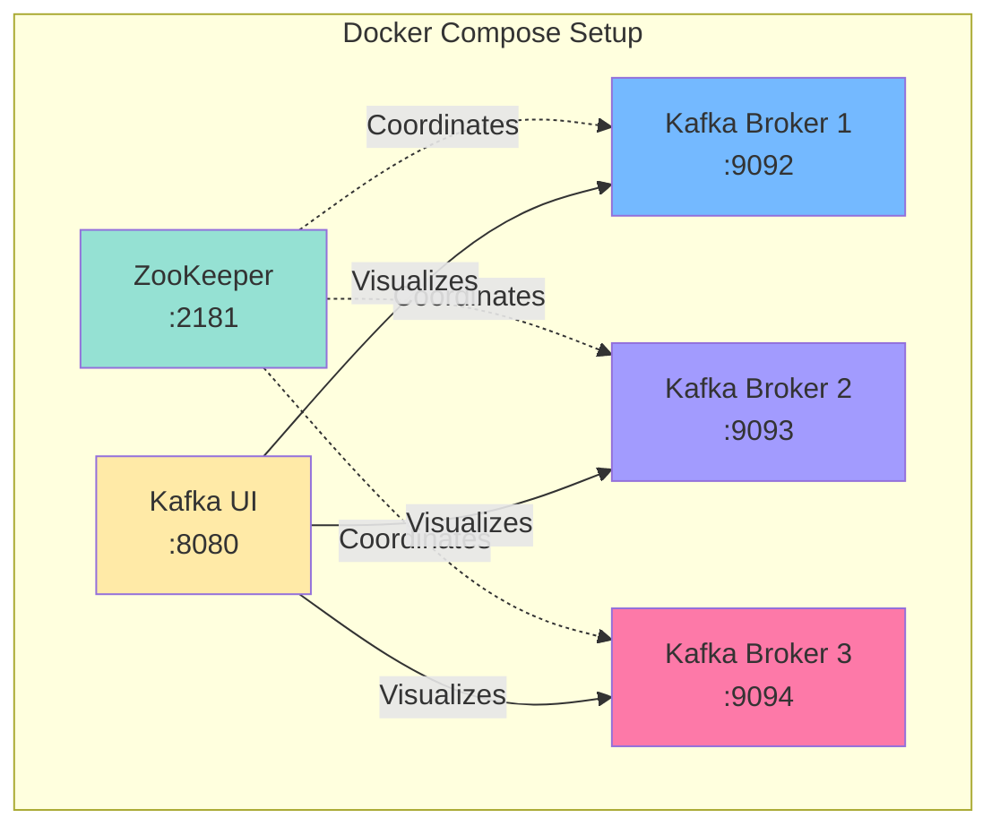

### Option 2: Local Installation

For macOS:
```bash
brew install kafka

# Start ZooKeeper
zookeeper-server-start /usr/local/etc/kafka/zookeeper.properties

# Start Kafka
kafka-server-start /usr/local/etc/kafka/server.properties
```

For Linux:
```bash
# Download Kafka
wget https://downloads.apache.org/kafka/3.5.1/kafka_2.13-3.5.1.tgz
tar -xzf kafka_2.13-3.5.1.tgz
cd kafka_2.13-3.5.1

# Start ZooKeeper
bin/zookeeper-server-start.sh config/zookeeper.properties

# Start Kafka
bin/kafka-server-start.sh config/server.properties
```

## Step 2: Creating Topics

### Using Kafka CLI

```bash
# Create orders topic with 3 partitions
kafka-topics --create \
  --bootstrap-server localhost:9092 \
  --topic orders \
  --partitions 3 \
  --replication-factor 3 \
  --config retention.ms=604800000 \
  --config segment.ms=86400000

# Create additional topics
kafka-topics --create \
  --bootstrap-server localhost:9092 \
  --topic order-confirmations \
  --partitions 3 \
  --replication-factor 3

kafka-topics --create \
  --bootstrap-server localhost:9092 \
  --topic inventory-updates \
  --partitions 3 \
  --replication-factor 3

kafka-topics --create \
  --bootstrap-server localhost:9092 \
  --topic fraud-alerts \
  --partitions 3 \
  --replication-factor 3

# List all topics
kafka-topics --list --bootstrap-server localhost:9092

# Describe a topic
kafka-topics --describe --topic orders --bootstrap-server localhost:9092
```

**Output:**
```
Topic: orders   PartitionCount: 3   ReplicationFactor: 3
    Topic: orders   Partition: 0    Leader: 1   Replicas: 1,2,3 Isr: 1,2,3
    Topic: orders   Partition: 1    Leader: 2   Replicas: 2,3,1 Isr: 2,3,1
    Topic: orders   Partition: 2    Leader: 3   Replicas: 3,1,2 Isr: 3,1,2
```

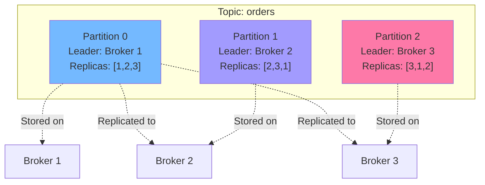

### Using Python (kafka-python)

```python
from kafka.admin import KafkaAdminClient, NewTopic

admin_client = KafkaAdminClient(
    bootstrap_servers=['localhost:9092', 'localhost:9093', 'localhost:9094']
)

topics = [
    NewTopic(
        name='orders',
        num_partitions=3,
        replication_factor=3,
        topic_configs={
            'retention.ms': '604800000',  # 7 days
            'segment.ms': '86400000'      # 1 day
        }
    ),
    NewTopic(name='order-confirmations', num_partitions=3, replication_factor=3),
    NewTopic(name='inventory-updates', num_partitions=3, replication_factor=3),
    NewTopic(name='fraud-alerts', num_partitions=3, replication_factor=3)
]

admin_client.create_topics(new_topics=topics, validate_only=False)
print("Topics created successfully!")
```

## Step 3: Testing with Console Producer/Consumer

Before writing code, let's verify Kafka works:

**Terminal 1 - Producer:**
```bash
kafka-console-producer \
  --bootstrap-server localhost:9092 \
  --topic orders \
  --property "parse.key=true" \
  --property "key.separator=:"
```

Type messages (key:value):
```
customer-1:{"orderId": "ORD-001", "amount": 99.99}
customer-2:{"orderId": "ORD-002", "amount": 149.99}
customer-1:{"orderId": "ORD-003", "amount": 79.99}
```

**Terminal 2 - Consumer:**
```bash
kafka-console-consumer \
  --bootstrap-server localhost:9092 \
  --topic orders \
  --from-beginning \
  --property print.key=true \
  --property key.separator=" : "
```

**Terminal 3 - Consumer Group:**
```bash
kafka-console-consumer \
  --bootstrap-server localhost:9092 \
  --topic orders \
  --group my-consumer-group \
  --from-beginning \
  --property print.key=true
```

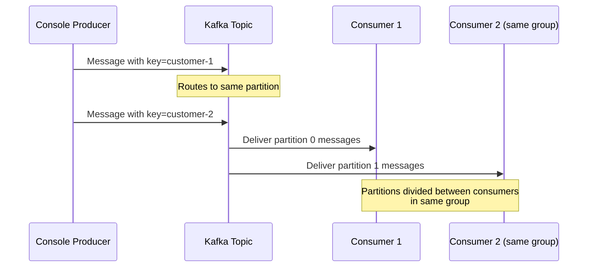

## Step 4: Building the Order Service (Producer)

### Project Structure

```
order-service/
├── requirements.txt
├── config.py
├── models.py
├── event_producer.py
├── order_service.py
└── api.py
```

### requirements.txt

```txt
kafka-python==2.0.2
flask==3.0.0
pydantic==2.0.0
python-json-logger==2.0.7
```

### config.py

```python
import os
from typing import List

class KafkaConfig:
    BOOTSTRAP_SERVERS: List[str] = [
        os.getenv('KAFKA_BOOTSTRAP_SERVERS', 'localhost:9092,localhost:9093,localhost:9094')
    ]
    TOPICS = {
        'ORDERS': 'orders',
        'ORDER_CONFIRMATIONS': 'order-confirmations',
        'INVENTORY': 'inventory-updates',
        'FRAUD': 'fraud-alerts'
    }
    
    # Producer settings
    PRODUCER_CONFIG = {
        'acks': 'all',  # Wait for all replicas
        'retries': 3,
        'max_in_flight_requests_per_connection': 5,
        'compression_type': 'snappy',
        'linger_ms': 10,
        'batch_size': 16384,
        'enable_idempotence': True
    }
```

### models.py

```python
from pydantic import BaseModel, EmailStr, Field
from typing import List, Optional
from datetime import datetime
from enum import Enum
import uuid

class OrderStatus(str, Enum):
    PENDING = "PENDING"
    CONFIRMED = "CONFIRMED"
    PROCESSING = "PROCESSING"
    SHIPPED = "SHIPPED"
    DELIVERED = "DELIVERED"
    CANCELLED = "CANCELLED"

class Address(BaseModel):
    street: str
    city: str
    state: str
    postal_code: str
    country: str

class OrderItem(BaseModel):
    product_id: str
    product_name: str
    quantity: int = Field(gt=0)
    unit_price: float = Field(gt=0)
    
    @property
    def total_price(self) -> float:
        return self.quantity * self.unit_price

class Order(BaseModel):
    order_id: str = Field(default_factory=lambda: f"ORD-{uuid.uuid4().hex[:8]}")
    customer_id: str
    customer_email: EmailStr
    customer_name: str
    items: List[OrderItem]
    shipping_address: Address
    status: OrderStatus = OrderStatus.PENDING
    created_at: datetime = Field(default_factory=datetime.utcnow)
    
    @property
    def total_amount(self) -> float:
        return sum(item.total_price for item in self.items)
    
    @property
    def total_items(self) -> int:
        return sum(item.quantity for item in self.items)

class OrderPlacedEvent(BaseModel):
    event_id: str = Field(default_factory=lambda: f"evt_{uuid.uuid4().hex}")
    event_type: str = "OrderPlaced"
    event_version: str = "1.0"
    timestamp: datetime = Field(default_factory=datetime.utcnow)
    source: str = "order-service"
    correlation_id: str
    
    # Event payload
    order_id: str
    customer_id: str
    customer_email: str
    customer_name: str
    items: List[dict]
    shipping_address: dict
    total_amount: float
    total_items: int
    order_date: datetime
    
    class Config:
        json_encoders = {
            datetime: lambda v: v.isoformat()
        }
```

### event_producer.py

```python
from kafka import KafkaProducer
from kafka.errors import KafkaError
import json
import logging
from typing import Dict, Any
from config import KafkaConfig
from models import Order, OrderPlacedEvent

logging.basicConfig(level=logging.INFO)
logger = logging.getLogger(__name__)

class EventProducer:
    def __init__(self):
        self.config = KafkaConfig()
        self.producer = KafkaProducer(
            bootstrap_servers=self.config.BOOTSTRAP_SERVERS,
            value_serializer=lambda v: json.dumps(v, default=str).encode('utf-8'),
            key_serializer=lambda k: k.encode('utf-8') if k else None,
            **self.config.PRODUCER_CONFIG
        )
        logger.info("✅ Kafka Producer initialized successfully")
    
    def publish_order_placed(self, order: Order, correlation_id: str) -> bool:
        """
        Publish OrderPlaced event to Kafka
        Uses customer_id as key to ensure ordering per customer
        """
        try:
            # Create event
            event = OrderPlacedEvent(
                correlation_id=correlation_id,
                order_id=order.order_id,
                customer_id=order.customer_id,
                customer_email=order.customer_email,
                customer_name=order.customer_name,
                items=[item.dict() for item in order.items],
                shipping_address=order.shipping_address.dict(),
                total_amount=order.total_amount,
                total_items=order.total_items,
                order_date=order.created_at
            )
            
            # Publish to Kafka
            future = self.producer.send(
                topic=self.config.TOPICS['ORDERS'],
                key=order.customer_id,  # Partition by customer
                value=event.dict(),
                headers=[
                    ('event_type', b'OrderPlaced'),
                    ('event_version', b'1.0'),
                    ('correlation_id', correlation_id.encode('utf-8'))
                ]
            )
            
            # Block for confirmation
            record_metadata = future.get(timeout=10)
            
            logger.info(
                f"✅ OrderPlaced event published",
                extra={
                    'event_id': event.event_id,
                    'order_id': order.order_id,
                    'partition': record_metadata.partition,
                    'offset': record_metadata.offset,
                    'timestamp': record_metadata.timestamp
                }
            )
            
            return True
            
        except KafkaError as e:
            logger.error(
                f"❌ Failed to publish OrderPlaced event: {e}",
                extra={'order_id': order.order_id}
            )
            return False
    
    def close(self):
        """Gracefully close the producer"""
        self.producer.flush()
        self.producer.close()
        logger.info("Producer closed")
```

### order_service.py

```python
import logging
from typing import Optional
from models import Order, OrderStatus
from event_producer import EventProducer
import uuid

logger = logging.getLogger(__name__)

class OrderService:
    def __init__(self):
        self.event_producer = EventProducer()
        self.orders_db = {}  # In-memory store for demo
    
    def place_order(self, order: Order) -> Optional[Order]:
        """
        Place a new order
        1. Validate order
        2. Save to database
        3. Publish OrderPlaced event
        """
        try:
            # Generate correlation ID for tracing
            correlation_id = str(uuid.uuid4())
            
            logger.info(
                f"📦 Placing order",
                extra={
                    'order_id': order.order_id,
                    'customer_id': order.customer_id,
                    'correlation_id': correlation_id,
                    'total_amount': order.total_amount
                }
            )
            
            # Validate order
            self._validate_order(order)
            
            # Save to database
            self.orders_db[order.order_id] = order
            logger.info(f"💾 Order saved to database: {order.order_id}")
            
            # Publish event
            success = self.event_producer.publish_order_placed(order, correlation_id)
            
            if not success:
                logger.error(f"Failed to publish event for order {order.order_id}")
                # In production, you'd handle this with outbox pattern
                return None
            
            return order
            
        except Exception as e:
            logger.error(f"Error placing order: {e}")
            raise
    
    def _validate_order(self, order: Order):
        """Validate order business rules"""
        if not order.items:
            raise ValueError("Order must have at least one item")
        
        if order.total_amount <= 0:
            raise ValueError("Order total must be greater than 0")
        
        # Add more validation as needed
    
    def get_order(self, order_id: str) -> Optional[Order]:
        """Retrieve an order by ID"""
        return self.orders_db.get(order_id)
    
    def shutdown(self):
        """Graceful shutdown"""
        self.event_producer.close()
```

### api.py (Flask REST API)

```python
from flask import Flask, request, jsonify
from order_service import OrderService
from models import Order, OrderItem, Address
import logging

logging.basicConfig(
    level=logging.INFO,
    format='%(asctime)s - %(name)s - %(levelname)s - %(message)s'
)

app = Flask(__name__)
order_service = OrderService()

@app.route('/health', methods=['GET'])
def health_check():
    return jsonify({'status': 'healthy', 'service': 'order-service'})

@app.route('/orders', methods=['POST'])
def create_order():
    """
    Create a new order
    
    Request body:
    {
        "customer_id": "CUST-123",
        "customer_email": "customer@example.com",
        "customer_name": "John Doe",
        "items": [
            {
                "product_id": "PROD-001",
                "product_name": "Wireless Mouse",
                "quantity": 2,
                "unit_price": 29.99
            }
        ],
        "shipping_address": {
            "street": "123 Main St",
            "city": "Boston",
            "state": "MA",
            "postal_code": "02101",
            "country": "USA"
        }
    }
    """
    try:
        data = request.json
        
        # Parse request
        order = Order(
            customer_id=data['customer_id'],
            customer_email=data['customer_email'],
            customer_name=data['customer_name'],
            items=[OrderItem(**item) for item in data['items']],
            shipping_address=Address(**data['shipping_address'])
        )
        
        # Place order
        created_order = order_service.place_order(order)
        
        if not created_order:
            return jsonify({'error': 'Failed to create order'}), 500
        
        return jsonify({
            'order_id': created_order.order_id,
            'status': created_order.status,
            'total_amount': created_order.total_amount,
            'message': 'Order placed successfully'
        }), 201
        
    except Exception as e:
        return jsonify({'error': str(e)}), 400

@app.route('/orders/<order_id>', methods=['GET'])
def get_order(order_id: str):
    """Get order by ID"""
    order = order_service.get_order(order_id)
    
    if not order:
        return jsonify({'error': 'Order not found'}), 404
    
    return jsonify(order.dict())

if __name__ == '__main__':
    app.run(host='0.0.0.0', port=5000, debug=True)
```

**Run the Order Service:**

```bash
# Install dependencies
pip install -r requirements.txt

# Run the API
python api.py
```

**Test it:**

```bash
curl -X POST http://localhost:5000/orders \
  -H "Content-Type: application/json" \
  -d '{
    "customer_id": "CUST-001",
    "customer_email": "john@example.com",
    "customer_name": "John Doe",
    "items": [
      {
        "product_id": "PROD-001",
        "product_name": "Wireless Mouse",
        "quantity": 2,
        "unit_price": 29.99
      },
      {
        "product_id": "PROD-002",
        "product_name": "Keyboard",
        "quantity": 1,
        "unit_price": 79.99
      }
    ],
    "shipping_address": {
      "street": "123 Main St",
      "city": "Boston",
      "state": "MA",
      "postal_code": "02101",
      "country": "USA"
    }
  }'
```

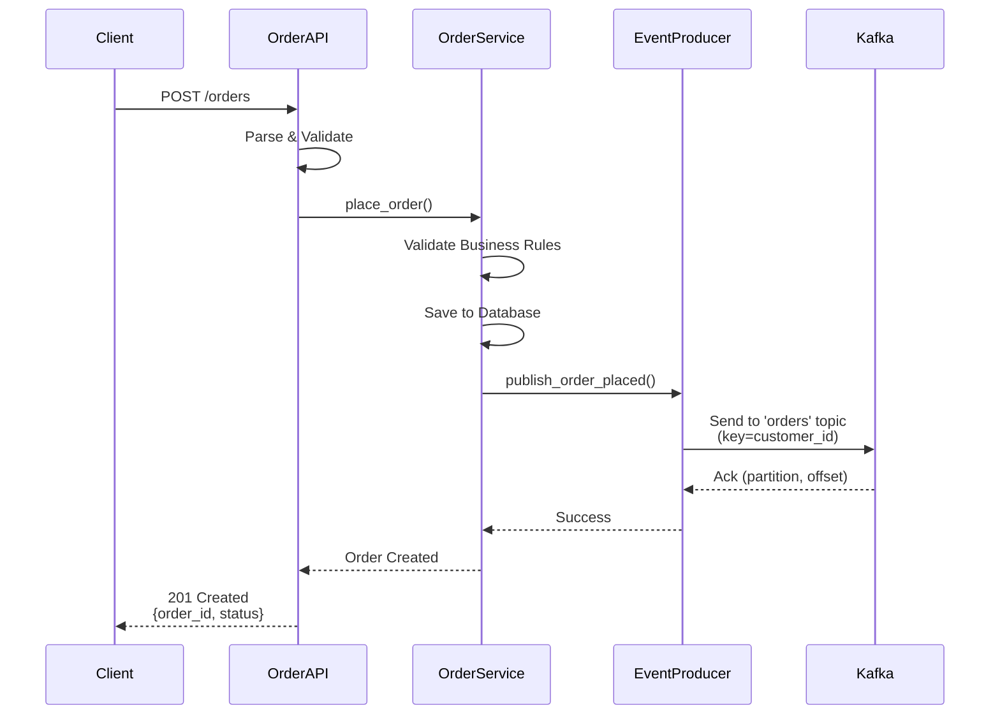

## Step 5: Building Consumer Services

### Email Service (Consumer)

```python
# email_service.py
from kafka import KafkaConsumer
import json
import logging
from typing import Dict, Any
import time

logging.basicConfig(
    level=logging.INFO,
    format='%(asctime)s - %(name)s - %(levelname)s - %(message)s'
)
logger = logging.getLogger(__name__)

class EmailService:
    def __init__(self):
        self.consumer = KafkaConsumer(
            'orders',
            bootstrap_servers=['localhost:9092', 'localhost:9093', 'localhost:9094'],
            group_id='email-service',
            auto_offset_reset='earliest',
            enable_auto_commit=True,
            auto_commit_interval_ms=5000,
            value_deserializer=lambda m: json.loads(m.decode('utf-8')),
            key_deserializer=lambda k: k.decode('utf-8') if k else None
        )
        logger.info("📧 Email Service started")
    
    def start(self):
        """Start consuming messages"""
        logger.info("Listening for order events...")
        
        try:
            for message in self.consumer:
                self.process_message(message)
        except KeyboardInterrupt:
            logger.info("Shutting down...")
        finally:
            self.consumer.close()
    
    def process_message(self, message):
        """Process a single message"""
        event = message.value
        
        logger.info(
            f"📨 Received event",
            extra={
                'partition': message.partition,
                'offset': message.offset,
                'key': message.key,
                'event_type': event.get('event_type')
            }
        )
        
        if event.get('event_type') == 'OrderPlaced':
            self.handle_order_placed(event)
    
    def handle_order_placed(self, event: Dict[str, Any]):
        """Handle OrderPlaced event"""
        order_id = event['order_id']
        customer_email = event['customer_email']
        customer_name = event['customer_name']
        total_amount = event['total_amount']
        items = event['items']
        
        logger.info(f"📧 Sending confirmation email for order {order_id}")
        
        # Simulate email sending
        email_content = self.generate_email_content(
            customer_name, order_id, items, total_amount
        )
        
        # In production, use SendGrid, AWS SES, etc.
        self.send_email(customer_email, "Order Confirmation", email_content)
        
        logger.info(
            f"✅ Confirmation email sent",
            extra={
                'order_id': order_id,
                'email': customer_email
            }
        )
    
    def generate_email_content(self, name, order_id, items, total):
        """Generate email HTML content"""
        items_html = "\n".join([
            f"<li>{item['product_name']} - Qty: {item['quantity']} - ${item['unit_price'] * item['quantity']:.2f}</li>"
            for item in items
        ])
        
        return f"""
        <html>
        <body>
            <h2>Order Confirmation</h2>
            <p>Dear {name},</p>
            <p>Thank you for your order! Your order has been confirmed.</p>
            <p><strong>Order ID:</strong> {order_id}</p>
            <h3>Order Details:</h3>
            <ul>
                {items_html}
            </ul>
            <p><strong>Total:</strong> ${total:.2f}</p>
            <p>We'll send you another email when your order ships.</p>
        </body>
        </html>
        """
    
    def send_email(self, to: str, subject: str, content: str):
        """Send email (simulated)"""
        # Simulate email sending delay
        time.sleep(0.1)
        logger.info(f"  → Email sent to {to}")

if __name__ == '__main__':
    service = EmailService()
    service.start()
```

### Inventory Service (Consumer)

```python
# inventory_service.py
from kafka import KafkaConsumer
import json
import logging
from typing import Dict, Any
from collections import defaultdict

logging.basicConfig(
    level=logging.INFO,
    format='%(asctime)s - %(name)s - %(levelname)s - %(message)s'
)
logger = logging.getLogger(__name__)

class InventoryService:
    def __init__(self):
        # Simulated inventory database
        self.inventory = defaultdict(lambda: {'quantity': 1000, 'reserved': 0})
        
        self.consumer = KafkaConsumer(
            'orders',
            bootstrap_servers=['localhost:9092', 'localhost:9093', 'localhost:9094'],
            group_id='inventory-service',
            auto_offset_reset='earliest',
            enable_auto_commit=True,
            auto_commit_interval_ms=5000,
            value_deserializer=lambda m: json.loads(m.decode('utf-8')),
            key_deserializer=lambda k: k.decode('utf-8') if k else None
        )
        logger.info("📦 Inventory Service started")
    
    def start(self):
        """Start consuming messages"""
        logger.info("Listening for order events...")
        
        try:
            for message in self.consumer:
                self.process_message(message)
        except KeyboardInterrupt:
            logger.info("Shutting down...")
        finally:
            self.consumer.close()
    
    def process_message(self, message):
        """Process a single message"""
        event = message.value
        
        logger.info(
            f"📦 Received event",
            extra={
                'partition': message.partition,
                'offset': message.offset,
                'event_type': event.get('event_type')
            }
        )
        
        if event.get('event_type') == 'OrderPlaced':
            self.handle_order_placed(event)
    
    def handle_order_placed(self, event: Dict[str, Any]):
        """Handle OrderPlaced event"""
        order_id = event['order_id']
        items = event['items']
        
        logger.info(f"📦 Processing inventory for order {order_id}")
        
        # Reserve inventory for each item
        for item in items:
            product_id = item['product_id']
            quantity = item['quantity']
            
            self.reserve_inventory(product_id, quantity, order_id)
        
        logger.info(
            f"✅ Inventory reserved",
            extra={'order_id': order_id}
        )
    
    def reserve_inventory(self, product_id: str, quantity: int, order_id: str):
        """Reserve inventory for an order"""
        current = self.inventory[product_id]
        
        if current['quantity'] - current['reserved'] >= quantity:
            current['reserved'] += quantity
            logger.info(
                f"  → Reserved {quantity} units of {product_id}",
                extra={
                    'product_id': product_id,
                    'available': current['quantity'] - current['reserved'],
                    'order_id': order_id
                }
            )
        else:
            logger.warning(
                f"  ⚠️  Insufficient inventory for {product_id}",
                extra={
                    'product_id': product_id,
                    'requested': quantity,
                    'available': current['quantity'] - current['reserved']
                }
            )
    
    def get_inventory_status(self, product_id: str) -> Dict[str, int]:
        """Get current inventory status"""
        inv = self.inventory[product_id]
        return {
            'quantity': inv['quantity'],
            'reserved': inv['reserved'],
            'available': inv['quantity'] - inv['reserved']
        }

if __name__ == '__main__':
    service = InventoryService()
    service.start()
```

### Analytics Service (Consumer)

```python
# analytics_service.py
from kafka import KafkaConsumer
import json
import logging
from typing import Dict, Any
from collections import defaultdict
from datetime import datetime

logging.basicConfig(
    level=logging.INFO,
    format='%(asctime)s - %(name)s - %(levelname)s - %(message)s'
)
logger = logging.getLogger(__name__)

class AnalyticsService:
    def __init__(self):
        self.metrics = {
            'total_orders': 0,
            'total_revenue': 0.0,
            'orders_by_customer': defaultdict(int),
            'revenue_by_customer': defaultdict(float),
            'orders_by_product': defaultdict(int),
            'revenue_by_product': defaultdict(float)
        }
        
        self.consumer = KafkaConsumer(
            'orders',
            bootstrap_servers=['localhost:9092', 'localhost:9093', 'localhost:9094'],
            group_id='analytics-service',
            auto_offset_reset='earliest',
            enable_auto_commit=True,
            auto_commit_interval_ms=5000,
            value_deserializer=lambda m: json.loads(m.decode('utf-8')),
            key_deserializer=lambda k: k.decode('utf-8') if k else None
        )
        logger.info("📊 Analytics Service started")
    
    def start(self):
        """Start consuming messages"""
        logger.info("Listening for order events...")
        
        try:
            for message in self.consumer:
                self.process_message(message)
        except KeyboardInterrupt:
            logger.info("Shutting down...")
        finally:
            self.consumer.close()
    
    def process_message(self, message):
        """Process a single message"""
        event = message.value
        
        if event.get('event_type') == 'OrderPlaced':
            self.handle_order_placed(event)
            self.print_dashboard()
    
    def handle_order_placed(self, event: Dict[str, Any]):
        """Handle OrderPlaced event"""
        order_id = event['order_id']
        customer_id = event['customer_id']
        total_amount = event['total_amount']
        items = event['items']
        
        # Update metrics
        self.metrics['total_orders'] += 1
        self.metrics['total_revenue'] += total_amount
        self.metrics['orders_by_customer'][customer_id] += 1
        self.metrics['revenue_by_customer'][customer_id] += total_amount
        
        # Update product metrics
        for item in items:
            product_id = item['product_id']
            self.metrics['orders_by_product'][product_id] += 1
            self.metrics['revenue_by_product'][product_id] += item['unit_price'] * item['quantity']
        
        logger.info(f"📊 Analytics updated for order {order_id}")
    
    def print_dashboard(self):
        """Print analytics dashboard"""
        print("\n" + "="*60)
        print("📊 REAL-TIME ANALYTICS DASHBOARD")
        print("="*60)
        print(f"Total Orders: {self.metrics['total_orders']}")
        print(f"Total Revenue: ${self.metrics['total_revenue']:.2f}")
        print(f"Average Order Value: ${self.metrics['total_revenue'] / max(self.metrics['total_orders'], 1):.2f}")
        
        print("\n--- Top Customers ---")
        top_customers = sorted(
            self.metrics['revenue_by_customer'].items(),
            key=lambda x: x[1],
            reverse=True
        )[:5]
        for customer_id, revenue in top_customers:
            orders = self.metrics['orders_by_customer'][customer_id]
            print(f"  {customer_id}: {orders} orders, ${revenue:.2f}")
        
        print("\n--- Top Products ---")
        top_products = sorted(
            self.metrics['revenue_by_product'].items(),
            key=lambda x: x[1],
            reverse=True
        )[:5]
        for product_id, revenue in top_products:
            orders = self.metrics['orders_by_product'][product_id]
            print(f"  {product_id}: {orders} orders, ${revenue:.2f}")
        
        print("="*60 + "\n")

if __name__ == '__main__':
    service = AnalyticsService()
    service.start()
```

## Step 6: Running the Complete System

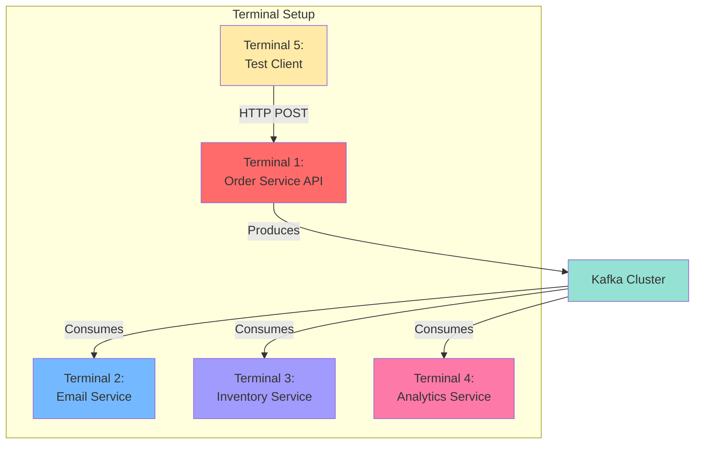

**Terminal 1 - Order Service:**
```bash
python api.py
```

**Terminal 2 - Email Service:**
```bash
python email_service.py
```

**Terminal 3 - Inventory Service:**
```bash
python inventory_service.py
```

**Terminal 4 - Analytics Service:**
```bash
python analytics_service.py
```

**Terminal 5 - Place Orders:**
```bash
# Order 1
curl -X POST http://localhost:5000/orders \
  -H "Content-Type: application/json" \
  -d '{
    "customer_id": "CUST-001",
    "customer_email": "alice@example.com",
    "customer_name": "Alice Smith",
    "items": [
      {"product_id": "PROD-001", "product_name": "Laptop", "quantity": 1, "unit_price": 999.99}
    ],
    "shipping_address": {
      "street": "123 Main St", "city": "Boston", "state": "MA",
      "postal_code": "02101", "country": "USA"
    }
  }'

# Order 2
curl -X POST http://localhost:5000/orders \
  -H "Content-Type: application/json" \
  -d '{
    "customer_id": "CUST-002",
    "customer_email": "bob@example.com",
    "customer_name": "Bob Johnson",
    "items": [
      {"product_id": "PROD-002", "product_name": "Mouse", "quantity": 2, "unit_price": 29.99},
      {"product_id": "PROD-003", "product_name": "Keyboard", "quantity": 1, "unit_price": 79.99}
    ],
    "shipping_address": {
      "street": "456 Park Ave", "city": "New York", "state": "NY",
      "postal_code": "10001", "country": "USA"
    }
  }'
```

**Watch the magic happen!**

```
Terminal 1 (Order Service):
📦 Placing order ORD-a1b2c3d4 for customer CUST-001
💾 Order saved to database
✅ OrderPlaced event published to partition 1 at offset 5

Terminal 2 (Email Service):
📨 Received event from partition 1, offset 5
📧 Sending confirmation email for order ORD-a1b2c3d4
✅ Confirmation email sent to alice@example.com

Terminal 3 (Inventory Service):
📦 Received event from partition 1, offset 5
→ Reserved 1 units of PROD-001 (Available: 999)
✅ Inventory reserved for order ORD-a1b2c3d4

Terminal 4 (Analytics Service):
📊 Analytics updated for order ORD-a1b2c3d4
===========================================================
📊 REAL-TIME ANALYTICS DASHBOARD
===========================================================
Total Orders: 1
Total Revenue: $999.99
Average Order Value: $999.99
-----------------------------------------------------------
```

## Step 7: Understanding Consumer Groups

Let's explore how consumer groups enable parallel processing:

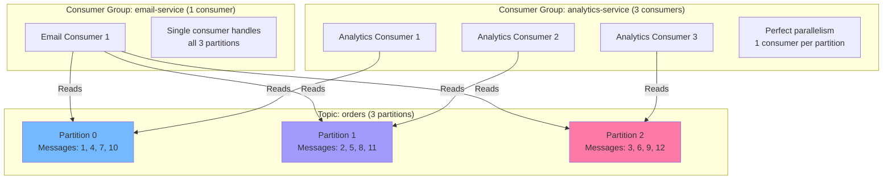

### Experiment: Add More Consumers

**Start 3 Email Service instances:**

```bash
# Terminal 2a
python email_service.py

# Terminal 2b (same group_id)
python email_service.py

# Terminal 2c (same group_id)
python email_service.py
```

**Observe rebalancing:**

```
Email Service 1: Assigned partitions: [0]
Email Service 2: Assigned partitions: [1]
Email Service 3: Assigned partitions: [2]
```

Now place orders and watch how messages are distributed!

### Check Consumer Group Status

```bash
# List consumer groups
kafka-consumer-groups --bootstrap-server localhost:9092 --list

# Describe email-service group
kafka-consumer-groups --bootstrap-server localhost:9092 \
  --group email-service --describe
```

**Output:**
```
GROUP           TOPIC     PARTITION  CURRENT-OFFSET  LOG-END-OFFSET  LAG  CONSUMER-ID
email-service   orders    0          15              15              0    consumer-1-...
email-service   orders    1          18              18              0    consumer-2-...
email-service   orders    2          12              12              0    consumer-3-...
```

**LAG = 0** means consumers are caught up! 🎉

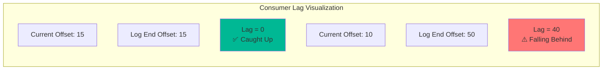

## Step 8: Testing Failure Scenarios

### Scenario 1: Consumer Crashes

**Simulate crash:**
1. Start 2 email consumers
2. Kill one consumer (Ctrl+C)
3. Watch Kafka **rebalance** partitions
4. Place orders - they're still processed!

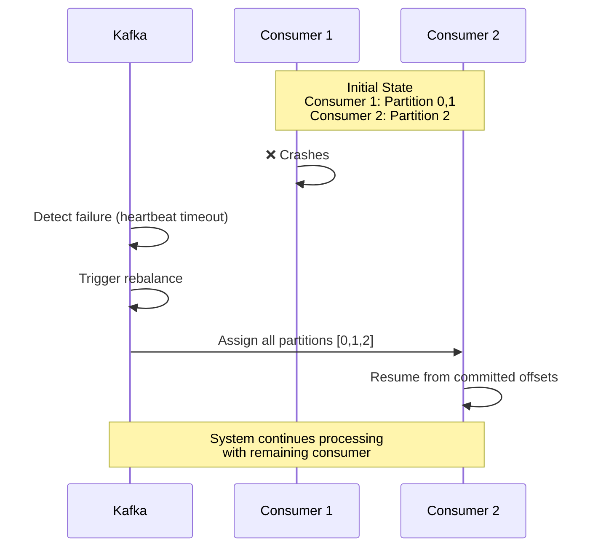

### Scenario 2: Slow Consumer

**Simulate slow processing:**

```python
# In email_service.py, add delay
def handle_order_placed(self, event):
    time.sleep(5)  # Simulate slow email sending
    # ... rest of code
```

**Observe:**
- Consumer lag increases
- Messages pile up
- Other services (inventory, analytics) unaffected!

**Check lag:**
```bash
kafka-consumer-groups --bootstrap-server localhost:9092 \
  --group email-service --describe
```

```
GROUP           TOPIC     PARTITION  CURRENT-OFFSET  LOG-END-OFFSET  LAG
email-service   orders    0          10              50              40  ⚠️
email-service   orders    1          15              48              33  ⚠️
email-service   orders    2          12              45              33  ⚠️
```

**Solution: Scale out!**
```bash
# Add more email service instances
python email_service.py  # Instance 2
python email_service.py  # Instance 3
```

Lag goes down as work is distributed! 📈→📉

### Scenario 3: Broker Failure

```bash
# Kill one Kafka broker
docker-compose stop kafka-2
```

**What happens:**
1. Leader election for affected partitions
2. Producers/consumers temporarily pause
3. System recovers automatically!
4. Messages safe due to replication

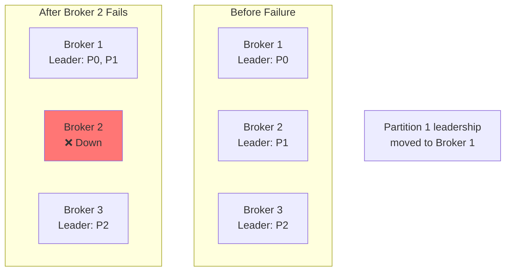

**Restart broker:**
```bash
docker-compose start kafka-2
```

System rebalances and returns to normal!

### Scenario 4: Event Replay

Want to reprocess old events?

```bash
# Reset offsets to beginning
kafka-consumer-groups --bootstrap-server localhost:9092 \
  --group analytics-service \
  --reset-offsets \
  --to-earliest \
  --topic orders \
  --execute
```

Or reset to specific offset:
```bash
kafka-consumer-groups --bootstrap-server localhost:9092 \
  --group analytics-service \
  --reset-offsets \
  --to-offset 10 \
  --topic orders:0 \
  --execute
```

**Restart the analytics service** - it replays events from the new offset!

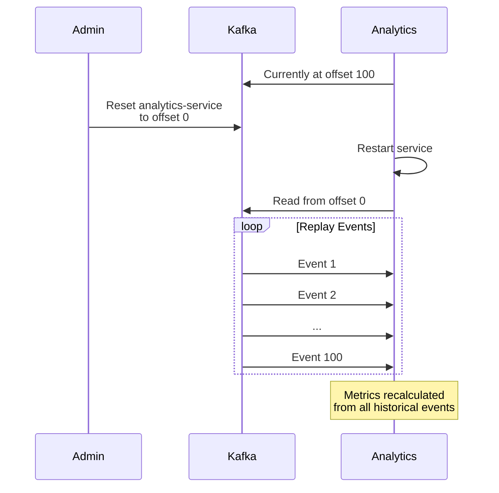

## Step 9: Monitoring

### View Topics in Kafka UI

Open `http://localhost:8080` to see:
- Topics and their configurations
- Partitions and replicas
- Consumer groups and their lag
- Message browser
- Broker health

### Python Monitoring Script

```python
# monitor.py
from kafka import KafkaAdminClient, KafkaConsumer
from kafka.structs import TopicPartition
import time

def monitor_consumer_groups():
    admin = KafkaAdminClient(bootstrap_servers='localhost:9092')
    
    groups = admin.list_consumer_groups()
    
    for group_id, _ in groups:
        print(f"\n{'='*60}")
        print(f"Consumer Group: {group_id}")
        print(f"{'='*60}")
        
        # Get group details
        try:
            metadata = admin.describe_consumer_groups([group_id])[0]
            
            print(f"State: {metadata.state}")
            print(f"Members: {len(metadata.members)}")
            
            # Calculate lag for each partition
            consumer = KafkaConsumer(
                bootstrap_servers='localhost:9092',
                group_id=group_id
            )
            
            partitions = consumer.assignment()
            
            for partition in partitions:
                committed = consumer.committed(partition)
                position = consumer.position(partition)
                end_offsets = consumer.end_offsets([partition])
                
                lag = end_offsets[partition] - (committed or 0)
                
                print(f"  Partition {partition.partition}:")
                print(f"    Committed: {committed}")
                print(f"    Current: {position}")
                print(f"    End: {end_offsets[partition]}")
                print(f"    Lag: {lag}")
            
            consumer.close()
            
        except Exception as e:
            print(f"Error: {e}")

if __name__ == '__main__':
    while True:
        monitor_consumer_groups()
        time.sleep(10)
```

## Performance Testing

### Load Test Script

```python
# load_test.py
import requests
import concurrent.futures
import time
from faker import Faker
import random

fake = Faker()

def create_order():
    """Create a random order"""
    order = {
        "customer_id": f"CUST-{random.randint(1, 100):03d}",
        "customer_email": fake.email(),
        "customer_name": fake.name(),
        "items": [
            {
                "product_id": f"PROD-{random.randint(1, 50):03d}",
                "product_name": fake.word(),
                "quantity": random.randint(1, 5),
                "unit_price": round(random.uniform(10, 500), 2)
            }
            for _ in range(random.randint(1, 5))
        ],
        "shipping_address": {
            "street": fake.street_address(),
            "city": fake.city(),
            "state": fake.state_abbr(),
            "postal_code": fake.postcode(),
            "country": "USA"
        }
    }
    
    response = requests.post(
        'http://localhost:5000/orders',
        json=order
    )
    
    return response.status_code == 201

def load_test(num_orders=100, num_workers=10):
    """Run load test"""
    print(f"🚀 Starting load test: {num_orders} orders with {num_workers} workers")
    
    start_time = time.time()
    success_count = 0
    
    with concurrent.futures.ThreadPoolExecutor(max_workers=num_workers) as executor:
        futures = [executor.submit(create_order) for _ in range(num_orders)]
        
        for future in concurrent.futures.as_completed(futures):
            if future.result():
                success_count += 1
                if success_count % 10 == 0:
                    print(f"  ✅ {success_count} orders placed...")
    
    duration = time.time() - start_time
    
    print(f"\n{'='*60}")
    print(f"📊 Load Test Results")
    print(f"{'='*60}")
    print(f"Total Orders: {num_orders}")
    print(f"Successful: {success_count}")
    print(f"Failed: {num_orders - success_count}")
    print(f"Duration: {duration:.2f}s")
    print(f"Throughput: {num_orders / duration:.2f} orders/sec")
    print(f"{'='*60}")

if __name__ == '__main__':
    # Install: pip install faker
    load_test(num_orders=1000, num_workers=20)
```

**Run the load test:**
```bash
python load_test.py
```

Watch as:
- Orders are created rapidly
- Events flow through Kafka
- All consumers process in parallel
- Analytics dashboard updates in real-time

## Key Takeaways

✅ **Set up a 3-broker Kafka cluster with Docker**  
✅ **Created topics with partitions and replication**  
✅ **Built a producer (Order Service) publishing events**  
✅ **Built multiple consumers processing the same events**  
✅ **Understood consumer groups and partitioning**  
✅ **Tested failure scenarios and recovery**  
✅ **Monitored consumer lag and system health**  
✅ **Performed load testing**  

## Next Steps

In Part 5, we'll dive into advanced Kafka concepts:
- Exactly-once semantics
- Log compaction for state management
- Kafka Streams for real-time processing
- Schema Registry and evolution
- Performance tuning
- Security

You now have a working, production-like Kafka application! 🎉

**Practice exercises:**
1. Add a new consumer (shipping service)
2. Implement idempotency in consumers
3. Add error handling and dead letter queues
4. Implement the outbox pattern
5. Add distributed tracing with correlation IDs

Ready for advanced patterns? Let's continue to Part 5! 🚀
