# Part 4: Hands-On Kafka - Building Your First Event-Driven Application

## Introduction

Theory is great, but nothing beats hands-on experience. In this part, we'll build a complete event-driven e-commerce order processing system using Kafka. You'll learn by doing.

> **📦 Complete Implementation:** The full working example with C# implementations is available in the [GitHub repository](https://github.com/tomakazoo/kafka-event-driven-architecture/tree/release/examples/04-build-e-commerce). This blog post explains the architecture and concepts. Follow the [README.md](https://github.com/tomakazoo/kafka-event-driven-architecture/tree/release/examples/04-build-e-commerce/README.md) and the [detailed blog documentation](https://github.com/tomakazoo/kafka-event-driven-architecture/blob/release/docs/BLOG-PART4-ORDER-SYSTEM.md) for step-by-step instructions and complete C# code examples.

**What we'll build:**

A simplified e-commerce order system with four microservices that communicate through Kafka events:

1. **Order Service** - Creates orders and publishes `orders-created` events
2. **Customer Service** - Validates customers and publishes `orders-validated` or `orders-rejected` events
3. **Inventory Service** - Reserves inventory and publishes `inventory-reserved` or `inventory-insufficient` events
4. **Shipping Service** - Creates shipments when orders are validated AND inventory is reserved, publishes `orders-shipped` events

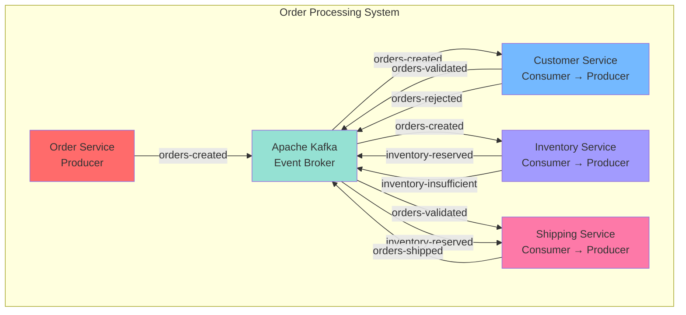

**Event Flow:**
1. Order is created → `orders-created` event published
2. Customer Service validates customer → publishes `orders-validated` or `orders-rejected`
3. Inventory Service reserves stock → publishes `inventory-reserved` or `inventory-insufficient`
4. Shipping Service waits for BOTH validation AND inventory → publishes `orders-shipped`

## Step 1: Setting Up Kafka Locally

### Option 1: Docker Compose (Recommended)

Create a file `docker-compose.yml` using the configuration from the [GitHub repository](https://github.com/tomakazoo/kafka-event-driven-architecture/blob/release/docker-compose.yml):

```yaml
services:

  zookeeper:
    image: confluentinc/cp-zookeeper:7.5.0
    environment:
      ZOOKEEPER_CLIENT_PORT: 2181
      ZOOKEEPER_TICK_TIME: 2000
    ports:
      - "2181:2181"

  kafka:
    image: confluentinc/cp-kafka:7.5.0
    depends_on:
      - zookeeper
    ports:
      - "9092:9092"
    environment:
      KAFKA_BROKER_ID: 1
      KAFKA_ZOOKEEPER_CONNECT: zookeeper:2181
      KAFKA_ADVERTISED_LISTENERS: PLAINTEXT://kafka:29092,PLAINTEXT_HOST://localhost:9092
      KAFKA_LISTENER_SECURITY_PROTOCOL_MAP: PLAINTEXT:PLAINTEXT,PLAINTEXT_HOST:PLAINTEXT
      KAFKA_INTER_BROKER_LISTENER_NAME: PLAINTEXT
      KAFKA_OFFSETS_TOPIC_REPLICATION_FACTOR: 1
      KAFKA_AUTO_CREATE_TOPICS_ENABLE: 'true'
    volumes:
      - ./kafka-data:/var/lib/kafka/data

  schema-registry:
    image: confluentinc/cp-schema-registry:7.5.0
    depends_on:
      - kafka
    ports:
      - "8081:8081"
    environment:
      SCHEMA_REGISTRY_HOST_NAME: schema-registry
      SCHEMA_REGISTRY_KAFKASTORE_BOOTSTRAP_SERVERS: kafka:29092

  kafka-ui:
    image: provectuslabs/kafka-ui:latest
    depends_on:
      - kafka
    ports:
      - "8080:8080"
    environment:
      KAFKA_CLUSTERS_0_NAME: local
      KAFKA_CLUSTERS_0_BOOTSTRAPSERVERS: kafka:29092
      KAFKA_CLUSTERS_0_SCHEMAREGISTRY: http://schema-registry:8081
```

**What's included:**
- **Zookeeper** - Manages Kafka cluster coordination (port 2181)
- **Kafka Broker** - Single broker setup (port 9092 for external access, 29092 for internal)
- **Schema Registry** - For schema management (port 8081)
- **Kafka UI** - Web interface for monitoring (port 8080)

**Configuration details:**
- Auto-create topics enabled (`KAFKA_AUTO_CREATE_TOPICS_ENABLE: 'true'`)
- Replication factor: 1 (single broker setup, suitable for development)
- Persistent volumes for Kafka data (`./kafka-data`)

**Start the cluster:**

```bash
docker-compose up -d

# Check status
docker-compose ps

# View logs
docker-compose logs -f kafka-1
```

**Access Kafka UI:** Open `http://localhost:8080` in your browser

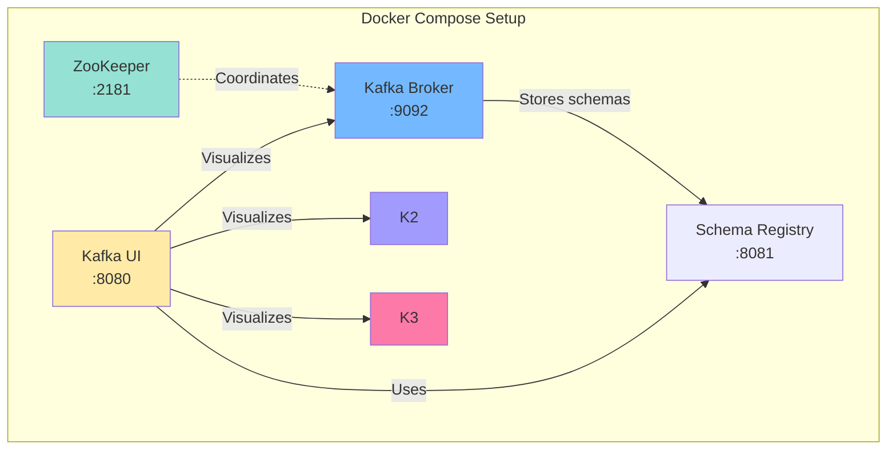

### Option 2: Local Installation

> ⚠️ **Warning:** This option is not tested or verified with this example. The examples in this blog post and the GitHub repository use Docker Compose (Option 1). If you choose to use local installation, you may encounter compatibility issues or need to adjust configuration. We recommend using **Option 1: Docker Compose** for the best experience.

For macOS:
```bash
brew install kafka

# Start ZooKeeper
zookeeper-server-start /usr/local/etc/kafka/zookeeper.properties

# Start Kafka
kafka-server-start /usr/local/etc/kafka/server.properties
```

For Linux:
```bash
# Download Kafka
wget https://downloads.apache.org/kafka/3.5.1/kafka_2.13-3.5.1.tgz
tar -xzf kafka_2.13-3.5.1.tgz
cd kafka_2.13-3.5.1

# Start ZooKeeper
bin/zookeeper-server-start.sh config/zookeeper.properties

# Start Kafka
bin/kafka-server-start.sh config/server.properties
```

## Step 2: Creating Topics

### Using Kafka CLI

We need to create the following topics for our order processing system:

- `orders-created` - New orders created
- `orders-validated` - Orders with valid customers
- `orders-rejected` - Orders with invalid/inactive customers
- `inventory-reserved` - Orders with reserved inventory
- `inventory-insufficient` - Orders that couldn't reserve inventory
- `orders-shipped` - Orders that have been shipped

```bash
# Create orders-created topic
kafka-topics --create \
  --bootstrap-server localhost:9092 \
  --topic orders-created \
  --partitions 3 \
  --replication-factor 1 \
  --config retention.ms=604800000 \
  --config segment.ms=86400000

# Create orders-validated topic
kafka-topics --create \
  --bootstrap-server localhost:9092 \
  --topic orders-validated \
  --partitions 3 \
  --replication-factor 1

# Create orders-rejected topic
kafka-topics --create \
  --bootstrap-server localhost:9092 \
  --topic orders-rejected \
  --partitions 3 \
  --replication-factor 1

# Create inventory-reserved topic
kafka-topics --create \
  --bootstrap-server localhost:9092 \
  --topic inventory-reserved \
  --partitions 3 \
  --replication-factor 1

# Create inventory-insufficient topic
kafka-topics --create \
  --bootstrap-server localhost:9092 \
  --topic inventory-insufficient \
  --partitions 3 \
  --replication-factor 1

# Create orders-shipped topic
kafka-topics --create \
  --bootstrap-server localhost:9092 \
  --topic orders-shipped \
  --partitions 3 \
  --replication-factor 1

# List all topics
kafka-topics --list --bootstrap-server localhost:9092

# Describe a topic
kafka-topics --describe --topic orders-created --bootstrap-server localhost:9092
```

**Note:** Topics can also be auto-created when producers first publish to them (configured in `docker-compose.yml`). However, manually creating topics is recommended for production to set specific partition and replication settings.

**Output:**
```
Topic: orders-created   PartitionCount: 3   ReplicationFactor: 1
    Topic: orders-created   Partition: 0    Leader: 1   Replicas: 1 Isr: 1
    Topic: orders-created   Partition: 1    Leader: 1   Replicas: 1 Isr: 1
    Topic: orders-created   Partition: 2    Leader: 1   Replicas: 1 Isr: 1
```

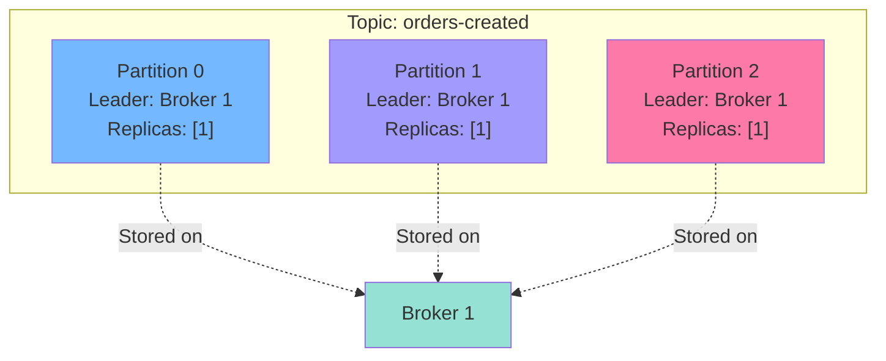

**Note:** This setup uses a single broker for development. In production, you would use multiple brokers with replication-factor 3 or higher for high availability.

### Using C# (Confluent.Kafka)

The complete C# implementation for creating topics programmatically can be found in the [GitHub repository](https://github.com/tomakazoo/kafka-event-driven-architecture/tree/release/examples/04-build-e-commerce). The implementation uses the Confluent.Kafka.Admin library to create topics with the same configuration.

**Reference:** See the topic creation code in the repository's infrastructure setup scripts.

## Step 3: Testing with Console Producer/Consumer

Before writing code, let's verify Kafka works:

**Terminal 1 - Producer:**
```bash
kafka-console-producer \
  --bootstrap-server localhost:9092 \
  --topic orders-created \
  --property "parse.key=true" \
  --property "key.separator=:"
```

Type messages (key:value):
```
CUST-001:{"orderId": "ORD-001", "customerId": "CUST-001", "amount": 99.99}
CUST-002:{"orderId": "ORD-002", "customerId": "CUST-002", "amount": 149.99}
CUST-001:{"orderId": "ORD-003", "customerId": "CUST-001", "amount": 79.99}
```

**Terminal 2 - Consumer:**
```bash
kafka-console-consumer \
  --bootstrap-server localhost:9092 \
  --topic orders-created \
  --from-beginning \
  --property print.key=true \
  --property key.separator=" : "
```

**Terminal 3 - Consumer Group:**
```bash
kafka-console-consumer \
  --bootstrap-server localhost:9092 \
  --topic orders-created \
  --group customer-service \
  --from-beginning \
  --property print.key=true
```

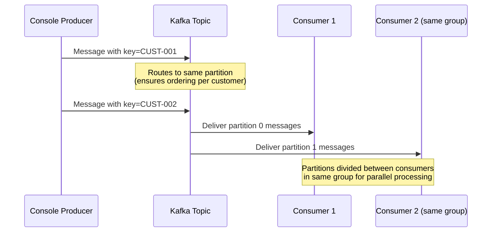

## Step 4: Building the Order Service (Producer)

The Order Service is an ASP.NET Core Web API that creates orders and publishes `orders-created` events to Kafka.

**Key Components:**
- **Kafka Producer** - Publishes events using Confluent.Kafka library
- **Event Models** - OrderPlacedEvent with proper structure
- **REST API** - Endpoints for creating and retrieving orders
- **Error Handling** - Proper error handling and logging

**Complete Implementation:**

The full C# implementation of the Order Service can be found in the [GitHub repository](https://github.com/tomakazoo/kafka-event-driven-architecture/tree/release/examples/04-build-e-commerce/src/OrderService). The implementation includes:

- ASP.NET Core Web API with controllers
- Kafka producer configuration and implementation
- Event models and serialization
- Dependency injection setup
- Logging and error handling

**Key Concepts:**

1. **Event Publishing** - Uses `customer_id` as the message key to ensure ordering per customer
2. **Producer Configuration** - Configured with `acks=all`, idempotence enabled, and retries
3. **Correlation IDs** - Each event includes a correlation ID for distributed tracing
4. **Event Structure** - Follows the event design patterns from Part 2

**Test it:**

```bash
curl -X POST http://localhost:5000/orders \
  -H "Content-Type: application/json" \
  -d '{
    "customer_id": "CUST-001",
    "customer_email": "john@example.com",
    "customer_name": "John Doe",
    "items": [
      {
        "product_id": "PROD-001",
        "product_name": "Wireless Mouse",
        "quantity": 2,
        "unit_price": 29.99
      },
      {
        "product_id": "PROD-002",
        "product_name": "Keyboard",
        "quantity": 1,
        "unit_price": 79.99
      }
    ],
    "shipping_address": {
      "street": "123 Main St",
      "city": "Boston",
      "state": "MA",
      "postal_code": "02101",
      "country": "USA"
    }
  }'
```

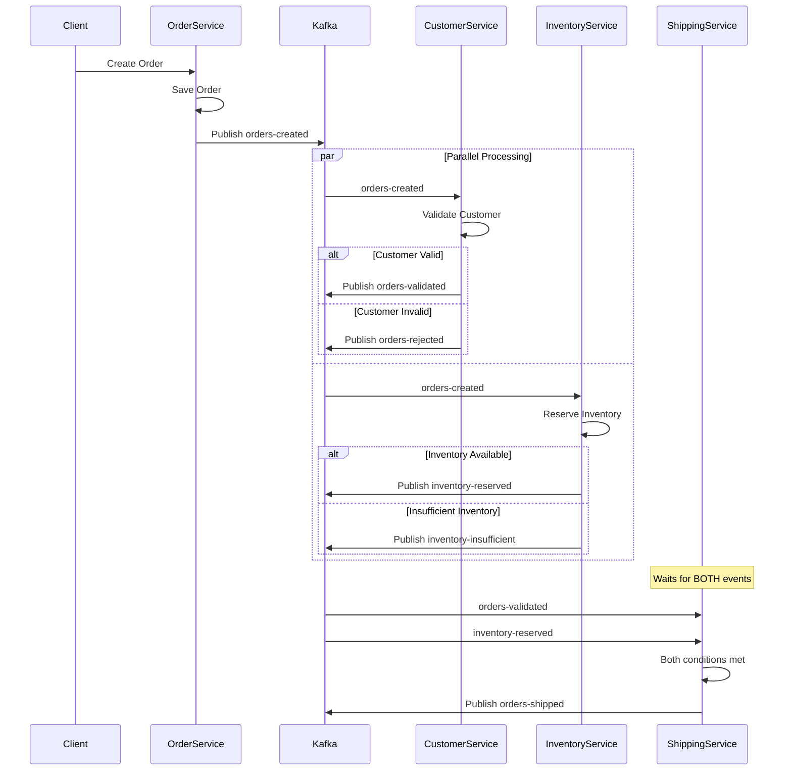

## Step 5: Building Consumer Services

### Customer Service (Consumer → Producer)

The Customer Service consumes `orders-created` events, validates customers, and publishes validation results (`orders-validated` or `orders-rejected`).

**Key Features:**
- Consumes from `orders-created` topic
- Validates customer existence and active status
- Publishes to `orders-validated` or `orders-rejected` topics
- Acts as both consumer and producer (event chain pattern)

**Complete Implementation:**

The full C# implementation can be found in the [GitHub repository](https://github.com/tomakazoo/kafka-event-driven-architecture/tree/release/examples/04-build-e-commerce/src/CustomerService). The service is implemented as a .NET Background Service that:

- Subscribes to `orders-created` topic
- Validates customers from an in-memory database (simulated)
- Publishes validation results based on customer status
- Handles errors and logs processing details

### Inventory Service (Consumer → Producer)

The Inventory Service consumes `orders-created` events, reserves inventory, and publishes reservation results (`inventory-reserved` or `inventory-insufficient`).

**Key Features:**
- Consumes from `orders-created` topic
- Reserves inventory for each order item
- Publishes success (`inventory-reserved`) or failure (`inventory-insufficient`) events
- Acts as both consumer and producer (event chain pattern)

**Complete Implementation:**

The full C# implementation can be found in the [GitHub repository](https://github.com/tomakazoo/kafka-event-driven-architecture/tree/release/examples/04-build-e-commerce/src/InventoryService). The service is implemented as a .NET Background Service that:

- Subscribes to `orders-created` topic
- Maintains inventory state (simulated database)
- Attempts to reserve all items for an order atomically
- Publishes appropriate events based on reservation success

### Shipping Service (Consumer → Producer)

The Shipping Service is the most interesting - it consumes from TWO topics (`orders-validated` and `inventory-reserved`) and only ships when BOTH conditions are met. This demonstrates event dependencies and coordination in event-driven architectures.

**Key Features:**
- Consumes from TWO topics simultaneously (`orders-validated` and `inventory-reserved`)
- Maintains in-memory state to track which orders have been validated and which have inventory reserved
- Only ships when BOTH conditions are met
- Publishes `orders-shipped` events when orders are ready to ship
- Demonstrates event coordination without orchestration

**Complete Implementation:**

The full C# implementation can be found in the [GitHub repository](https://github.com/tomakazoo/kafka-event-driven-architecture/tree/release/examples/04-build-e-commerce/src/ShippingService). The service is implemented as a .NET Background Service that:

- Subscribes to multiple topics using Confluent.Kafka's multi-topic consumer capability
- Maintains dictionaries to track order state (validations and inventory reservations)
- Implements a coordination pattern to wait for both events before shipping
- Creates shipping labels and publishes shipping events

## Step 6: Running the Complete System

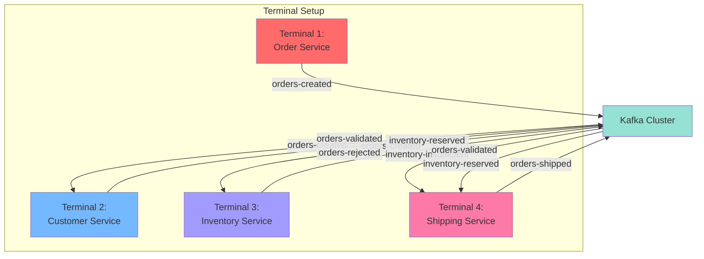

**Running the Services:**

Follow the [README.md](https://github.com/tomakazoo/kafka-event-driven-architecture/tree/release/examples/04-build-e-commerce/README.md) in the GitHub repository for detailed instructions on running all services. The services are .NET applications that can be run from Visual Studio, Rider, or the command line.

**Quick Start:**

1. **Clone the repository** and navigate to the example directory
2. **Start Kafka** using the provided docker-compose.yml
3. **Run each service** using `dotnet run` from their respective project directories
4. **Use the API** to create orders via the Order Service REST endpoint

**Placing Orders:**

Use the Order Service REST API to create orders. See the [GitHub repository documentation](https://github.com/tomakazoo/kafka-event-driven-architecture/blob/release/docs/BLOG-PART4-ORDER-SYSTEM.md) for the exact API endpoint and request format.

**Example Request:**
```bash
curl -X POST http://localhost:5000/api/orders \
  -H "Content-Type: application/json" \
  -d '{
    "customerId": "CUST-001",
    "customerEmail": "alice@example.com",
    "customerName": "Alice Smith",
    "items": [
      {"productId": "PROD-001", "productName": "Laptop", "quantity": 1, "unitPrice": 999.99}
    ],
    "shippingAddress": {
      "street": "123 Main St", "city": "Boston", "state": "MA",
      "postalCode": "02101", "country": "USA"
    }
  }'
```

**Watch the event flow!**

```
Terminal 1 (Order Service):
📦 Placing order ORD-a1b2c3d4 for customer CUST-001
💾 Order saved to database
✅ OrderPlaced event published to orders-created topic

Terminal 2 (Customer Service):
📨 Received order-created event
🔍 Validating customer CUST-001 for order ORD-a1b2c3d4
✅ Customer CUST-001 validated
✅ Published OrderValidated event

Terminal 3 (Inventory Service):
📦 Received order-created event
📦 Processing inventory reservation for order ORD-a1b2c3d4
→ Reserved 1 units of PROD-001
✅ All inventory reserved for order ORD-a1b2c3d4
✅ Published InventoryReserved event

Terminal 4 (Shipping Service):
📨 Received OrderValidated event for order ORD-a1b2c3d4
✅ Order ORD-a1b2c3d4 validated (waiting for inventory)
📨 Received InventoryReserved event for order ORD-a1b2c3d4
✅ Order ORD-a1b2c3d4 inventory reserved (waiting for validation)
🚀 Both conditions met for order ORD-a1b2c3d4 - creating shipment
📦 Published OrderShipped event (Tracking: TRACK-abc123def456)

For Order 3 (CUST-003):
Terminal 2 (Customer Service):
❌ Customer CUST-003 is inactive
❌ Published OrderRejected event
(Shipping service never receives both events, so order is not shipped)
```

## Step 7: Understanding Consumer Groups

Let's explore how consumer groups enable parallel processing:

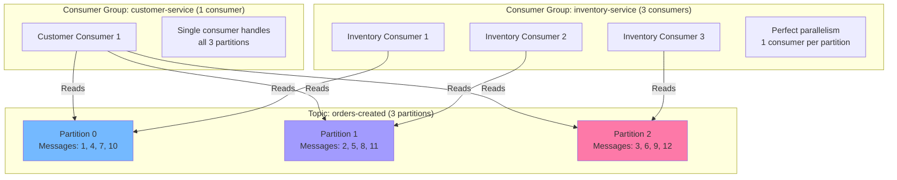

### Experiment: Add More Consumers

**Start multiple Customer Service instances:**

Run multiple instances of the Customer Service (each with the same consumer group ID). The services will automatically rebalance partitions between them. See the [GitHub repository](https://github.com/tomakazoo/kafka-event-driven-architecture/tree/release/examples/04-build-e-commerce) for instructions on running multiple instances.

**Observe rebalancing:**

```
Customer Service 1: Assigned partitions: [0]
Customer Service 2: Assigned partitions: [1]
Customer Service 3: Assigned partitions: [2]
```

Now place orders and watch how messages are distributed!

### Check Consumer Group Status

```bash
# List consumer groups
kafka-consumer-groups --bootstrap-server localhost:9092 --list

# Describe customer-service group
kafka-consumer-groups --bootstrap-server localhost:9092 \
  --group customer-service --describe
```

**Output:**
```
GROUP                TOPIC            PARTITION  CURRENT-OFFSET  LOG-END-OFFSET  LAG  CONSUMER-ID
customer-service     orders-created   0          15              15              0    consumer-1-...
customer-service     orders-created   1          18              18              0    consumer-2-...
customer-service     orders-created   2          12              12              0    consumer-3-...
```

**LAG = 0** means consumers are caught up! 🎉

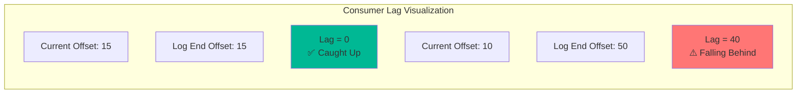

## Step 8: Testing Failure Scenarios

### Scenario 1: Consumer Crashes

**Simulate crash:**
1. Start 2 email consumers
2. Kill one consumer (Ctrl+C)
3. Watch Kafka **rebalance** partitions
4. Place orders - they're still processed!

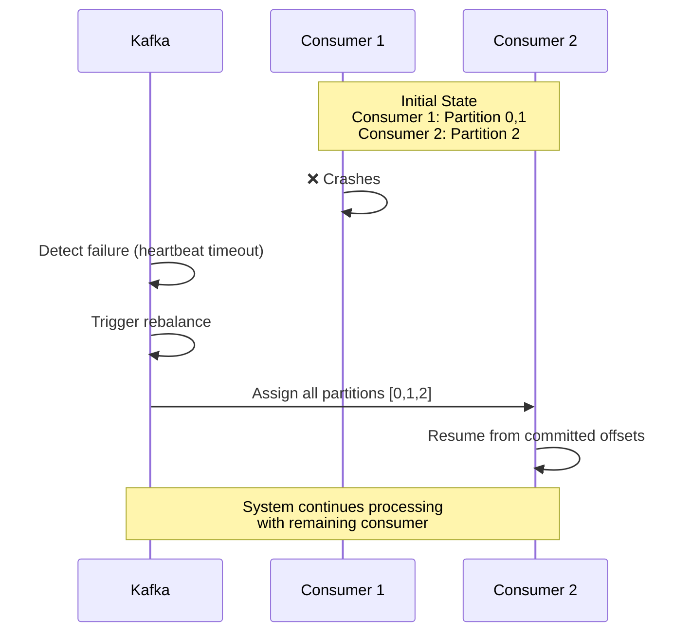

### Scenario 2: Slow Consumer

**Simulate slow processing:**

Add artificial delay in the Customer Service processing logic (e.g., `Thread.Sleep(5000)` in C#) to simulate slow customer validation.

**Observe:**
- Consumer lag increases
- Messages pile up in Kafka
- Other services (inventory, shipping) continue processing unaffected!

**Check lag:**
```bash
kafka-consumer-groups --bootstrap-server localhost:9092 \
  --group customer-service --describe
```

```
GROUP                TOPIC            PARTITION  CURRENT-OFFSET  LOG-END-OFFSET  LAG
customer-service     orders-created   0          10              50              40  ⚠️
customer-service     orders-created   1          15              48              33  ⚠️
customer-service     orders-created   2          12              45              33  ⚠️
```

**Solution: Scale out!**

Start additional Customer Service instances. Kafka will automatically rebalance partitions between all instances in the same consumer group.

Lag goes down as work is distributed! 📈→📉

### Scenario 3: Broker Failure

> **Note:** This scenario demonstrates broker failure in a production multi-broker setup. With a single-broker development setup, if the broker fails, all processing stops until it's restarted.

**In a production setup with multiple brokers:**

```bash
# Kill one Kafka broker (production scenario with 3+ brokers)
docker-compose stop kafka-2
```

**What happens in a multi-broker cluster:**
1. Leader election for affected partitions
2. Partitions are rebalanced to remaining brokers
3. Producers/consumers temporarily pause during rebalancing
4. System recovers automatically!
5. Messages remain safe due to replication

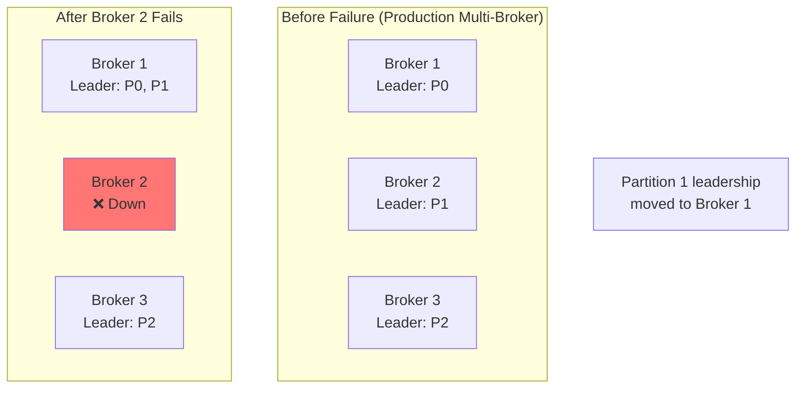

**For single-broker development setup:**
```bash
# Restart the Kafka broker
docker-compose restart kafka
```

The broker will resume processing from where it left off (if data was persisted).

### Scenario 4: Event Replay

Want to reprocess old events?

```bash
# Reset offsets to beginning
kafka-consumer-groups --bootstrap-server localhost:9092 \
  --group shipping-service \
  --reset-offsets \
  --to-earliest \
  --topic orders-validated \
  --execute

kafka-consumer-groups --bootstrap-server localhost:9092 \
  --group shipping-service \
  --reset-offsets \
  --to-earliest \
  --topic inventory-reserved \
  --execute
```

Or reset to specific offset:
```bash
kafka-consumer-groups --bootstrap-server localhost:9092 \
  --group shipping-service \
  --reset-offsets \
  --to-offset 10 \
  --topic orders-validated:0 \
  --execute
```

**Restart the shipping service** - it replays events from the new offset!

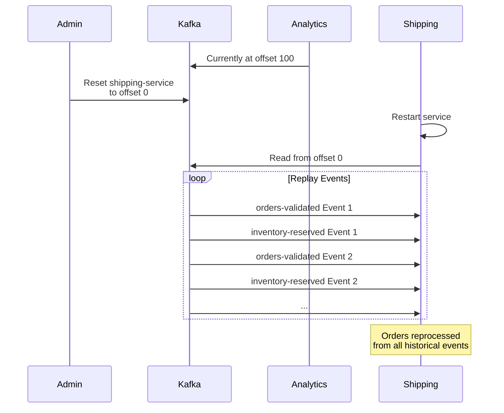

## Step 9: Monitoring

### View Topics in Kafka UI

Open `http://localhost:8080` to see:
- Topics and their configurations
- Partitions and replicas
- Consumer groups and their lag
- Message browser
- Broker health

### Monitoring Consumer Groups

Use Kafka CLI tools or Kafka UI to monitor consumer groups:

```bash
# List all consumer groups
kafka-consumer-groups --bootstrap-server localhost:9092 --list

# Describe a specific consumer group
kafka-consumer-groups --bootstrap-server localhost:9092 \
  --group customer-service --describe

# Show lag for all groups
kafka-consumer-groups --bootstrap-server localhost:9092 \
  --all-groups --describe
```

**Kafka UI** at `http://localhost:8080` provides a visual interface to:
- View all consumer groups
- Monitor lag in real-time
- See partition assignments
- Browse messages in topics

## Performance Testing

### Load Testing

To test the system under load, you can create a load testing tool that sends multiple concurrent order requests to the Order Service API. The [GitHub repository](https://github.com/tomakazoo/kafka-event-driven-architecture/tree/release/examples/04-build-e-commerce) may include load testing examples, or you can create your own using any HTTP client library.

**Load Testing Concepts:**

- Send multiple concurrent requests to the Order Service
- Monitor Kafka consumer lag to see how the system handles load
- Observe event flow through all services
- Measure throughput and latency

**Tools for Load Testing:**

- **C#**: Use `HttpClient` with `Task.WhenAll` for concurrent requests
- **Command Line**: Use `curl` in a loop or `ab` (Apache Bench)
- **Dedicated Tools**: Use tools like k6, JMeter, or Postman for more sophisticated load testing

Watch as:
- Orders are created rapidly
- Events flow through Kafka
- All consumers process in parallel
- Services coordinate events through Kafka topics

## Key Takeaways

✅ **Set up Kafka with Docker Compose (single broker with Schema Registry)**  
✅ **Created topics with partitions (replication-factor 1 for development)**  
✅ **Built a producer (Order Service) publishing `orders-created` events**  
✅ **Built consumer-producer services (Customer, Inventory) that consume from one topic and produce to another**  
✅ **Built a shipping service that consumes from multiple topics and coordinates event dependencies**  
✅ **Understood consumer groups and partitioning for parallel processing**  
✅ **Learned how to handle rejection flows and error scenarios**  
✅ **Tested failure scenarios and recovery**  
✅ **Monitored consumer lag and system health with Kafka UI**  
✅ **Understood event-driven workflows with multiple dependencies**

## What This Example Demonstrates

This complete e-commerce order processing system showcases:

1. **Event-Driven Architecture** - Services communicate through events, not direct calls
2. **Service Decoupling** - Each service operates independently
3. **Event Dependencies** - Shipping service waits for multiple events before acting
4. **Error Handling** - Rejection flows for invalid customers and insufficient inventory
5. **Parallel Processing** - Customer and Inventory services process orders simultaneously
6. **Scalability** - Each service can scale independently based on load

The complete C# implementation is available in the [GitHub repository](https://github.com/tomakazoo/kafka-event-driven-architecture/tree/release/examples/04-build-e-commerce). Follow the README.md for step-by-step instructions to run the system.

## Next Steps

In [Part 5](part-05-advanced-kafka-concepts), we'll dive into advanced Kafka concepts:
- Exactly-once semantics
- Log compaction for state management
- Kafka Streams for real-time processing
- Schema Registry and evolution
- Performance tuning
- Security

You now have a working, production-like Kafka application! 🎉

**Practice exercises:**
1. Add a new consumer service (e.g., notification service for `orders-shipped` events)
2. Implement idempotency in consumers to handle duplicate events
3. Add error handling and dead letter queues for failed processing
4. Implement the outbox pattern for guaranteed event publishing
5. Add distributed tracing with correlation IDs across all services
6. Add retry logic for transient failures
7. Implement event replay for reprocessing orders

Ready for advanced patterns? Let's continue to [Part 5](part-05-advanced-kafka-concepts)! 🚀
