# Part 5: Advanced Kafka Concepts - Mastering Production Kafka

## Introduction

In Part 4, you built a working Kafka application. Now let's dive deep into advanced concepts that separate hobby projects from production systems.

We'll cover:
- Message delivery semantics (exactly-once)
- Log compaction for state management
- Kafka Streams for real-time processing
- Schema Registry for evolution
- Performance tuning
- Security and multi-datacenter replication

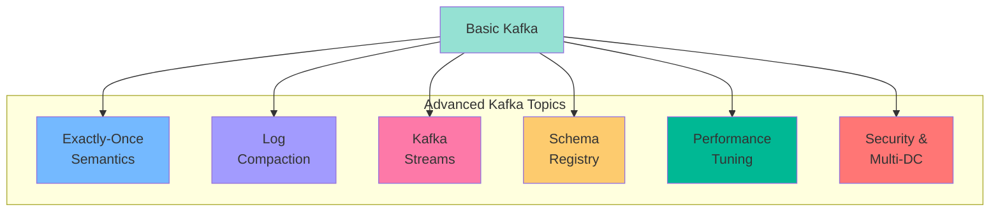

## Message Delivery Semantics

### The Three Guarantees

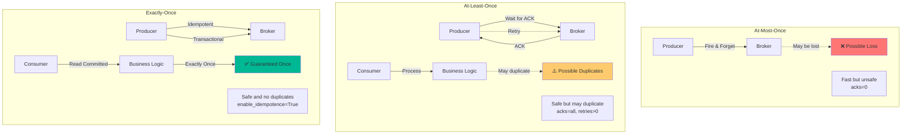

### At-Most-Once (Fire and Forget)

**Configuration:**
```csharp
using Confluent.Kafka;

var config = new ProducerConfig
{
    BootstrapServers = "localhost:9092",
    Acks = Acks.None,  // Don't wait for acknowledgment
    Retries = 0  // Don't retry
};

var producer = new ProducerBuilder<string, string>(config).Build();

// Send message without waiting
await producer.ProduceAsync("orders", new Message<string, string> 
{ 
    Value = "order-data" 
});
// Message might be lost, but we don't care!
```

**Use cases:**
- Metrics collection (losing a few data points is OK)
- Log aggregation (some logs can be lost)
- High-throughput, low-importance data

**Pros:** ⚡ Extremely fast  
**Cons:** ❌ Messages can be lost

### At-Least-Once (Default)

**Producer Configuration:**
```csharp
var config = new ProducerConfig
{
    BootstrapServers = "localhost:9092",
    Acks = Acks.All,  // Wait for all replicas
    Retries = 3,  // Retry on failure
    MaxInFlight = 5
};

var producer = new ProducerBuilder<string, string>(config).Build();

// Message guaranteed to be written
var deliveryResult = await producer.ProduceAsync("orders", 
    new Message<string, string> { Value = orderData },
    cancellationToken: default);
// Block until written with timeout
```

**Consumer Challenge: Duplicates!**

```csharp
// Problem: Consumer might process twice
var consumeResult = consumer.Consume(cancellationToken);
try
{
    ProcessOrder(consumeResult.Message.Value);  // Processes the order
    consumer.Commit(consumeResult);  // Commits offset
}
catch (Exception ex)
{
    // If ProcessOrder succeeds but Commit fails,
    // message will be reprocessed on restart!
    logger.LogError(ex, "Error processing message");
}
```

**Solution 1: Idempotent Consumer**

```csharp
using StackExchange.Redis;

var redis = ConnectionMultiplexer.Connect("localhost");
var db = redis.GetDatabase();

void ProcessMessageIdempotently(ConsumeResult<string, string> message)
{
    var eventData = JsonSerializer.Deserialize<Dictionary<string, object>>(message.Message.Value);
    var eventId = eventData["event_id"].ToString();
    
    // Check if already processed
    if (db.KeyExists($"processed:{eventId}"))
    {
        logger.LogInformation("Skipping duplicate: {EventId}", eventId);
        return;
    }
    
    // Process the event
    ProcessOrder(eventData);
    
    // Mark as processed
    db.StringSet($"processed:{eventId}", "1", TimeSpan.FromHours(24));  // 24 hour TTL
    
    logger.LogInformation("Processed: {EventId}", eventId);
}

// Consumer loop
while (!cancellationToken.IsCancellationRequested)
{
    var consumeResult = consumer.Consume(cancellationToken);
    ProcessMessageIdempotently(consumeResult);
    consumer.Commit(consumeResult);
}
```

**Solution 2: Database Deduplication**

```csharp
using Microsoft.EntityFrameworkCore;
using System.ComponentModel.DataAnnotations;

[Table("processed_events")]
public class ProcessedEvent
{
    [Key]
    [Column("event_id")]
    public string EventId { get; set; }
    
    [Column("processed_at")]
    public DateTime ProcessedAt { get; set; } = DateTime.UtcNow;
    
    [Column("order_id")]
    public string OrderId { get; set; }
}

public class ApplicationDbContext : DbContext
{
    public DbSet<ProcessedEvent> ProcessedEvents { get; set; }
    
    protected override void OnConfiguring(DbContextOptionsBuilder optionsBuilder)
    {
        optionsBuilder.UseNpgsql("Host=localhost;Database=mydb;Username=user;Password=pass");
    }
}

async Task ProcessWithDbDeduplicationAsync(ConsumeResult<string, string> message, ApplicationDbContext context)
{
    var eventData = JsonSerializer.Deserialize<Dictionary<string, object>>(message.Message.Value);
    var eventId = eventData["event_id"].ToString();
    
    using var transaction = await context.Database.BeginTransactionAsync();
    try
    {
        // Check if processed
        if (await context.ProcessedEvents.AnyAsync(e => e.EventId == eventId))
        {
            logger.LogInformation("Duplicate detected: {EventId}", eventId);
            return;
        }
        
        // Process in transaction
        await ProcessOrderAsync(eventData);
        
        // Mark as processed
        context.ProcessedEvents.Add(new ProcessedEvent
        {
            EventId = eventId,
            OrderId = eventData["order_id"].ToString()
        });
        
        await context.SaveChangesAsync();
        await transaction.CommitAsync();
    }
    catch
    {
        await transaction.RollbackAsync();
        throw;
    }
}
```

### Exactly-Once Semantics (EOS)

The holy grail: messages delivered exactly once, no duplicates, no losses.

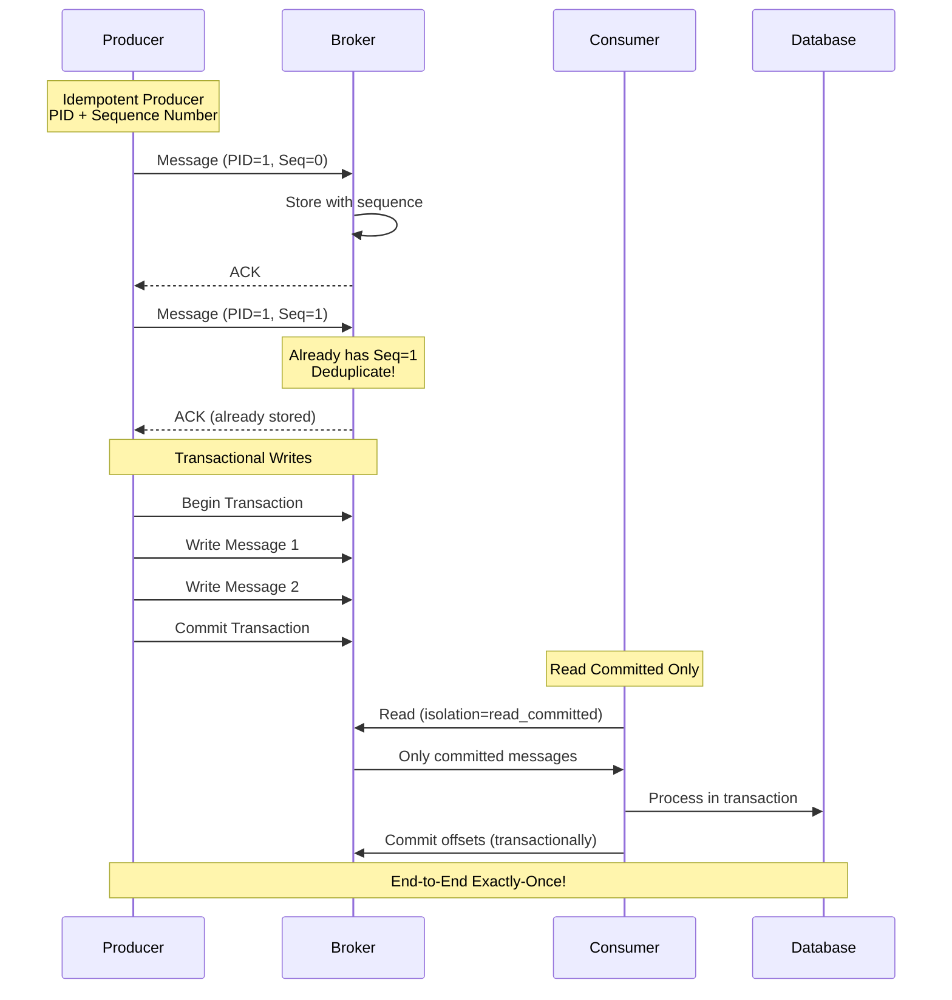

**Idempotent Producer:**

```csharp
var config = new ProducerConfig
{
    BootstrapServers = "localhost:9092",
    
    // Enable idempotence
    EnableIdempotence = true,
    
    // Required for idempotence
    Acks = Acks.All,
    Retries = int.MaxValue,  // Max retries
    MaxInFlight = 5
};

var producer = new ProducerBuilder<string, string>(config).Build();

// Producer automatically handles deduplication
// Each producer instance gets a unique PID (Producer ID)
// Each message gets a sequence number
// Broker deduplicates based on (PID, Sequence)

for (int i = 0; i < 10; i++)
{
    await producer.ProduceAsync("orders", new Message<string, string>
    {
        Value = JsonSerializer.Serialize(new { order_id = $"ORD-{i}" })
    });
}

producer.Flush(TimeSpan.FromSeconds(10));
producer.Dispose();
```

**How it works:**

1. **Producer ID (PID)**: Each producer gets unique ID
2. **Sequence Number**: Messages numbered per partition
3. **Broker Deduplication**: Rejects duplicates

```csharp
// Behind the scenes:
// Message 1: PID=123, Partition=0, Sequence=0
// Message 2: PID=123, Partition=0, Sequence=1
// Message 3: PID=123, Partition=0, Sequence=2

// If network fails and producer retries message 2:
// PID=123, Partition=0, Sequence=1 (again)
// Broker sees: "Already have sequence 1, ignore"
```

**Transactional Producer:**

```csharp
var config = new ProducerConfig
{
    BootstrapServers = "localhost:9092",
    TransactionalId = "my-transactional-producer",  // Must be unique
    EnableIdempotence = true,
    Acks = Acks.All
};

var producer = new ProducerBuilder<string, string>(config).Build();

// Initialize transactions
producer.InitTransactions(TimeSpan.FromSeconds(10));

try
{
    // Begin transaction
    producer.BeginTransaction();
    
    // Send multiple messages atomically
    await producer.ProduceAsync("orders", new Message<string, string>
    {
        Value = JsonSerializer.Serialize(new { order_id = "ORD-1" })
    });
    await producer.ProduceAsync("inventory", new Message<string, string>
    {
        Value = JsonSerializer.Serialize(new { product_id = "PROD-1", qty = -1 })
    });
    await producer.ProduceAsync("analytics", new Message<string, string>
    {
        Value = JsonSerializer.Serialize(new { event = "order_placed" })
    });
    
    // All or nothing - commit transaction
    producer.CommitTransaction(TimeSpan.FromSeconds(10));
    
    Console.WriteLine("✅ Transaction committed - all messages written atomically");
}
catch (Exception ex)
{
    // Rollback on error
    producer.AbortTransaction(TimeSpan.FromSeconds(10));
    Console.WriteLine($"❌ Transaction aborted: {ex.Message}");
}
```

**Transactional Consumer:**

```csharp
var consumerConfig = new ConsumerConfig
{
    BootstrapServers = "localhost:9092",
    GroupId = "order-processor",
    
    // Only read committed transactions
    IsolationLevel = IsolationLevel.ReadCommitted,
    
    // Disable auto-commit for manual control
    EnableAutoCommit = false
};

var consumer = new ConsumerBuilder<string, string>(consumerConfig).Build();
consumer.Subscribe("orders");

while (!cancellationToken.IsCancellationRequested)
{
    var consumeResult = consumer.Consume(cancellationToken);
    var eventData = JsonSerializer.Deserialize<Dictionary<string, object>>(consumeResult.Message.Value);
    
    try
    {
        // Process message
        await ProcessOrderAsync(eventData);
        
        // Manually commit offset
        consumer.Commit(consumeResult);
    }
    catch (Exception ex)
    {
        logger.LogError(ex, "Processing failed");
        // Don't commit - message will be reprocessed
    }
}
```

**End-to-End Exactly-Once:**

```csharp
using Npgsql;

public class ExactlyOnceProcessor
{
    private readonly IConsumer<string, string> _consumer;
    private readonly IProducer<string, string> _producer;
    private readonly NpgsqlConnection _dbConnection;

    public ExactlyOnceProcessor()
    {
        // Consumer
        var consumerConfig = new ConsumerConfig
        {
            BootstrapServers = "localhost:9092",
            GroupId = "processor",
            IsolationLevel = IsolationLevel.ReadCommitted,
            EnableAutoCommit = false
        };
        _consumer = new ConsumerBuilder<string, string>(consumerConfig).Build();
        _consumer.Subscribe("input-topic");
        
        // Producer
        var producerConfig = new ProducerConfig
        {
            BootstrapServers = "localhost:9092",
            TransactionalId = "processor-producer",
            EnableIdempotence = true
        };
        _producer = new ProducerBuilder<string, string>(producerConfig).Build();
        
        // Database
        _dbConnection = new NpgsqlConnection("Host=localhost;Database=mydb;Username=user;Password=pass");
        _dbConnection.Open();
        
        _producer.InitTransactions(TimeSpan.FromSeconds(10));
    }

    public async Task ProcessExactlyOnceAsync(CancellationToken cancellationToken)
    {
        while (!cancellationToken.IsCancellationRequested)
        {
            var message = _consumer.Consume(cancellationToken);
            try
            {
                _producer.BeginTransaction();
                
                // 1. Process message
                var result = await ProcessMessageAsync(message.Message.Value);
                
                // 2. Write to database
                using var cmd = new NpgsqlCommand(
                    "INSERT INTO orders VALUES (@order_id, @amount)",
                    _dbConnection);
                cmd.Parameters.AddWithValue("order_id", result["order_id"].ToString());
                cmd.Parameters.AddWithValue("amount", Convert.ToDecimal(result["amount"]));
                await cmd.ExecuteNonQueryAsync(cancellationToken);
                
                // 3. Produce output event
                await _producer.ProduceAsync("output-topic", new Message<string, string>
                {
                    Value = JsonSerializer.Serialize(result)
                }, cancellationToken);
                
                // 4. Commit consumer offsets (within transaction!)
                var offsets = new TopicPartitionOffset[]
                {
                    new TopicPartitionOffset(
                        new TopicPartition("input-topic", message.Partition),
                        new Offset(message.Offset + 1))
                };
                
                _producer.SendOffsetsToTransaction(
                    offsets,
                    _consumer.ConsumerGroupMetadata,
                    TimeSpan.FromSeconds(10));
                
                // 5. Commit transaction
                _producer.CommitTransaction(TimeSpan.FromSeconds(10));
                
                Console.WriteLine($"✅ Processed exactly once: {result["order_id"]}");
            }
            catch (Exception ex)
            {
                _producer.AbortTransaction(TimeSpan.FromSeconds(10));
                // Note: Npgsql doesn't support explicit rollback for individual commands
                // In a transaction, you'd use NpgsqlTransaction instead
                Console.WriteLine($"❌ Transaction aborted: {ex.Message}");
            }
        }
    }

    private Task<Dictionary<string, object>> ProcessMessageAsync(string messageValue)
    {
        // Process message implementation
        return Task.FromResult(JsonSerializer.Deserialize<Dictionary<string, object>>(messageValue));
    }
}
```

**Performance Impact:**

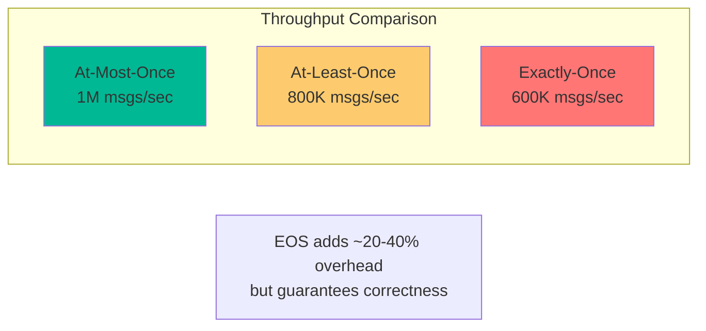

## Log Compaction

Traditional retention deletes old messages after time/size limits. Log compaction keeps the **latest value for each key** indefinitely.

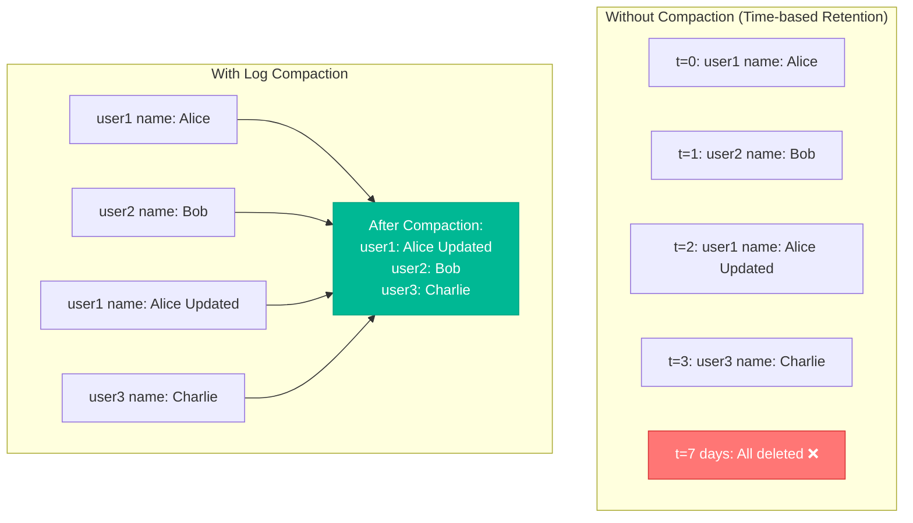

### Creating a Compacted Topic

```bash
kafka-topics --create \
  --bootstrap-server localhost:9092 \
  --topic user-profiles \
  --partitions 3 \
  --replication-factor 3 \
  --config cleanup.policy=compact \
  --config min.cleanable.dirty.ratio=0.5 \
  --config segment.ms=86400000
```

### Using Compacted Topics

**Producer (State Updates):**

```csharp
var config = new ProducerConfig
{
    BootstrapServers = "localhost:9092"
};

var producer = new ProducerBuilder<string, string>(config).Build();

// Update user profile
await producer.ProduceAsync("user-profiles", new Message<string, string>
{
    Key = "user-123",  // Key determines which record to keep
    Value = JsonSerializer.Serialize(new
    {
        user_id = "user-123",
        name = "Alice Smith",
        email = "alice@example.com",
        preferences = new
        {
            theme = "dark",
            notifications = true
        }
    })
});

// Later update
await producer.ProduceAsync("user-profiles", new Message<string, string>
{
    Key = "user-123",
    Value = JsonSerializer.Serialize(new
    {
        user_id = "user-123",
        name = "Alice Smith",
        email = "alice.new@example.com",  // Updated email
        preferences = new
        {
            theme = "light",  // Updated theme
            notifications = true
        }
    })
});

// After compaction, only latest value for 'user-123' remains
producer.Flush(TimeSpan.FromSeconds(10));
```

**Consumer (Rebuild State):**

```csharp
Dictionary<string, Dictionary<string, object>> RebuildUserState()
{
    // Rebuild entire user database from compacted log
    var config = new ConsumerConfig
    {
        BootstrapServers = "localhost:9092",
        AutoOffsetReset = AutoOffsetReset.Earliest  // Read from beginning
    };
    
    var consumer = new ConsumerBuilder<string, string>(config).Build();
    
    // Get all partitions
    var metadata = consumer.GetMetadata(TimeSpan.FromSeconds(10));
    var topic = metadata.Topics.FirstOrDefault(t => t.Topic == "user-profiles");
    var topicPartitions = topic.Partitions
        .Select(p => new TopicPartition("user-profiles", p.PartitionId))
        .ToList();
    
    consumer.Assign(topicPartitions);
    
    // Rebuild state
    var userState = new Dictionary<string, Dictionary<string, object>>();
    var endOffsets = consumer.GetWatermarkOffsets(topicPartitions.Select(tp => 
        new TopicPartitionOffset(tp, Offset.End)).ToList());
    
    while (true)
    {
        var consumeResult = consumer.Consume(TimeSpan.FromSeconds(5));
        
        if (consumeResult == null)
        {
            // Check if we've reached the end
            bool allCaughtUp = topicPartitions.All(tp =>
            {
                var position = consumer.Position(tp);
                var watermark = consumer.GetWatermarkOffsets(tp);
                return position >= watermark.High;
            });
            
            if (allCaughtUp) break;
            continue;
        }
        
        var userId = consumeResult.Message.Key;
        var userData = JsonSerializer.Deserialize<Dictionary<string, object>>(consumeResult.Message.Value);
        
        // Latest value wins
        userState[userId] = userData;
    }
    
    consumer.Close();
    
    Console.WriteLine($"✅ Rebuilt state for {userState.Count} users");
    return userState;
}

// Rebuild user database
var users = RebuildUserState();
```

**Deleting Keys (Tombstone):**

```csharp
// Send null value to delete a key
await producer.ProduceAsync("user-profiles", new Message<string, string>
{
    Key = "user-123",
    Value = null  // Tombstone - deletes the key
});

// After compaction, user-123 is removed from the log
```

### Use Cases for Log Compaction

1. **User Profiles** - Latest profile for each user
2. **Configuration** - Current config for each service
3. **Cache Invalidation** - Latest cache entries
4. **Database Change Data Capture (CDC)** - Latest row state
5. **Materialized Views** - Latest computed results

### Compaction Process

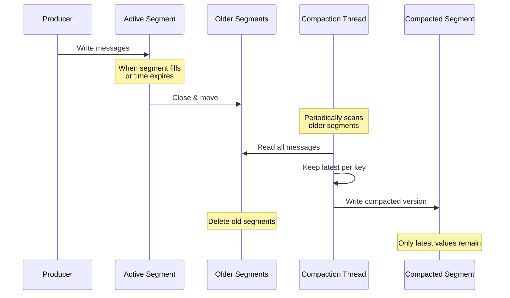

## Kafka Streams

Kafka Streams is a library for building real-time stream processing applications directly on Kafka.

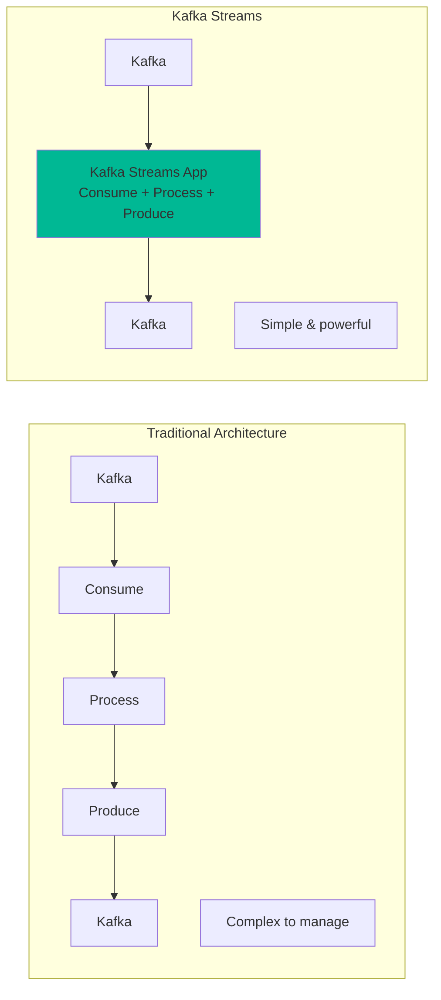

### Simple Kafka Streams Example (Java)

```java
import org.apache.kafka.streams.KafkaStreams;
import org.apache.kafka.streams.StreamsBuilder;
import org.apache.kafka.streams.StreamsConfig;
import org.apache.kafka.streams.kstream.KStream;
import java.util.Properties;

public class OrderProcessingStream {
    public static void main(String[] args) {
        Properties props = new Properties();
        props.put(StreamsConfig.APPLICATION_ID_CONFIG, "order-processor");
        props.put(StreamsConfig.BOOTSTRAP_SERVERS_CONFIG, "localhost:9092");
        
        StreamsBuilder builder = new StreamsBuilder();
        
        // Input stream
        KStream<String, Order> orders = builder.stream("orders");
        
        // Filter high-value orders
        KStream<String, Order> highValueOrders = orders.filter(
            (key, order) -> order.getAmount() > 1000.0
        );
        
        // Transform
        KStream<String, OrderAlert> alerts = highValueOrders.mapValues(
            order -> new OrderAlert(
                order.getOrderId(),
                order.getAmount(),
                "High value order alert!"
            )
        );
        
        // Output stream
        alerts.to("high-value-order-alerts");
        
        KafkaStreams streams = new KafkaStreams(builder.build(), props);
        streams.start();
        
        // Graceful shutdown
        Runtime.getRuntime().addShutdownHook(new Thread(streams::close));
    }
}
```

### Stateless Operations

```java
StreamsBuilder builder = new StreamsBuilder();
KStream<String, Order> orders = builder.stream("orders");

// Filter
orders.filter((key, order) -> order.getStatus().equals("PENDING"));

// Map values
orders.mapValues(order -> order.getAmount());

// FlatMap
orders.flatMapValues(order -> order.getItems());

// Branch (split stream)
KStream<String, Order>[] branches = orders.branch(
    (key, order) -> order.getAmount() < 100,    // Small orders
    (key, order) -> order.getAmount() < 1000,   // Medium orders
    (key, order) -> true                         // Large orders
);
```

### Stateful Operations

**Aggregation:**

```java
// Count orders per customer
KTable<String, Long> orderCountsByCustomer = orders
    .groupBy((key, order) -> order.getCustomerId())
    .count();

// Sum revenue per customer
KTable<String, Double> revenueByCustomer = orders
    .groupBy((key, order) -> order.getCustomerId())
    .aggregate(
        () -> 0.0,  // Initializer
        (customerId, order, aggregate) -> aggregate + order.getAmount()  // Adder
    );
```

**Windowed Aggregation:**

```java
import org.apache.kafka.streams.kstream.TimeWindows;
import java.time.Duration;

// Count orders per customer in 5-minute windows
KTable<Windowed<String>, Long> windowedCounts = orders
    .groupBy((key, order) -> order.getCustomerId())
    .windowedBy(TimeWindows.of(Duration.ofMinutes(5)))
    .count();

// Sum revenue in 1-hour tumbling windows
KTable<Windowed<String>, Double> hourlyRevenue = orders
    .groupBy((key, order) -> order.getCustomerId())
    .windowedBy(TimeWindows.of(Duration.ofHours(1)))
    .aggregate(
        () -> 0.0,
        (customerId, order, sum) -> sum + order.getAmount()
    );
```

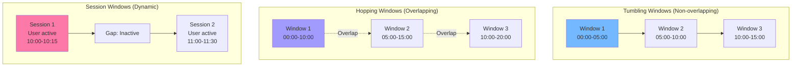

**Joins:**

```java
// Stream-Stream Join
KStream<String, Order> orders = builder.stream("orders");
KStream<String, Payment> payments = builder.stream("payments");

KStream<String, OrderWithPayment> enriched = orders.join(
    payments,
    (order, payment) -> new OrderWithPayment(order, payment),
    JoinWindows.of(Duration.ofMinutes(5))  // Join within 5-minute window
);

// Stream-Table Join (enrichment)
KTable<String, Customer> customers = builder.table("customers");

KStream<String, EnrichedOrder> enrichedOrders = orders.join(
    customers,
    (order, customer) -> new EnrichedOrder(order, customer)
);

// Table-Table Join
KTable<String, Customer> customers = builder.table("customers");
KTable<String, Address> addresses = builder.table("addresses");

KTable<String, CustomerWithAddress> joined = customers.join(
    addresses,
    (customer, address) -> new CustomerWithAddress(customer, address)
);
```

### Complete Kafka Streams Example

```java
import org.apache.kafka.streams.*;
import org.apache.kafka.streams.kstream.*;
import java.time.Duration;
import java.util.Properties;

public class RealTimeAnalytics {
    public static void main(String[] args) {
        Properties props = new Properties();
        props.put(StreamsConfig.APPLICATION_ID_CONFIG, "analytics");
        props.put(StreamsConfig.BOOTSTRAP_SERVERS_CONFIG, "localhost:9092");
        
        StreamsBuilder builder = new StreamsBuilder();
        
        // Input streams
        KStream<String, Order> orders = builder.stream("orders");
        KTable<String, Product> products = builder.table("products");
        
        // 1. Enrich orders with product information
        KStream<String, EnrichedOrder> enrichedOrders = orders
            .selectKey((key, order) -> order.getProductId())  // Rekey by product
            .join(
                products,
                (order, product) -> new EnrichedOrder(order, product)
            );
        
        // 2. Calculate revenue per product in 1-hour windows
        KTable<Windowed<String>, Double> revenueByProduct = enrichedOrders
            .groupBy((key, enrichedOrder) -> enrichedOrder.getProductName())
            .windowedBy(TimeWindows.of(Duration.ofHours(1)))
            .aggregate(
                () -> 0.0,
                (productName, enrichedOrder, total) -> 
                    total + enrichedOrder.getAmount()
            );
        
        // 3. Detect high-value customers (>$10,000 in 24 hours)
        KTable<Windowed<String>, Double> customerSpending = enrichedOrders
            .groupBy((key, enrichedOrder) -> enrichedOrder.getCustomerId())
            .windowedBy(TimeWindows.of(Duration.ofHours(24)))
            .aggregate(
                () -> 0.0,
                (customerId, enrichedOrder, total) -> 
                    total + enrichedOrder.getAmount()
            );
        
        KStream<Windowed<String>, Double> highValueCustomers = customerSpending
            .toStream()
            .filter((windowedCustomerId, spending) -> spending > 10000.0);
        
        // 4. Output results
        revenueByProduct
            .toStream()
            .map((windowedProduct, revenue) -> 
                KeyValue.pair(
                    windowedProduct.key(),
                    new RevenueReport(
                        windowedProduct.key(),
                        windowedProduct.window().start(),
                        windowedProduct.window().end(),
                        revenue
                    )
                )
            )
            .to("product-revenue-reports");
        
        highValueCustomers
            .map((windowedCustomer, spending) -> 
                KeyValue.pair(
                    windowedCustomer.key(),
                    new VIPAlert(windowedCustomer.key(), spending)
                )
            )
            .to("vip-customer-alerts");
        
        KafkaStreams streams = new KafkaStreams(builder.build(), props);
        streams.start();
        
        Runtime.getRuntime().addShutdownHook(new Thread(streams::close));
    }
}
```

### Kafka Streams State Stores

```java
// Create state store for caching
StreamsBuilder builder = new StreamsBuilder();

// Add state store
StoreBuilder<KeyValueStore<String, Long>> storeBuilder = 
    Stores.keyValueStoreBuilder(
        Stores.persistentKeyValueStore("customer-stats"),
        Serdes.String(),
        Serdes.Long()
    );

builder.addStateStore(storeBuilder);

// Use state store in processor
KStream<String, Order> orders = builder.stream("orders");

orders.process(
    () -> new CustomerStatsProcessor("customer-stats"),
    "customer-stats"
);
```

## Schema Registry

Schema Registry manages and validates schemas for Kafka messages.

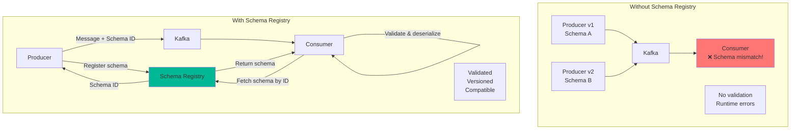

### Setting Up Schema Registry

**Docker Compose:**

```yaml
schema-registry:
  image: confluentinc/cp-schema-registry:7.5.0
  depends_on:
    - kafka-1
    - kafka-2
    - kafka-3
  ports:
    - "8081:8081"
  environment:
    SCHEMA_REGISTRY_HOST_NAME: schema-registry
    SCHEMA_REGISTRY_KAFKASTORE_BOOTSTRAP_SERVERS: 'kafka-1:29092'
    SCHEMA_REGISTRY_LISTENERS: http://0.0.0.0:8081
```

### Avro Schema Example

**Define schema (`order-v1.avsc`):**

```json
{
  "type": "record",
  "name": "Order",
  "namespace": "com.example.ecommerce",
  "fields": [
    {"name": "order_id", "type": "string"},
    {"name": "customer_id", "type": "string"},
    {"name": "amount", "type": "double"},
    {"name": "currency", "type": "string", "default": "USD"},
    {"name": "order_date", "type": "long", "logicalType": "timestamp-millis"}
  ]
}
```

**Producer with Schema Registry:**

```csharp
using Confluent.SchemaRegistry;
using Confluent.SchemaRegistry.Serdes;
using Confluent.Kafka;

// Create schema registry client
var schemaRegistryConfig = new SchemaRegistryConfig
{
    Url = "http://localhost:8081"
};
var schemaRegistry = new CachedSchemaRegistryClient(schemaRegistryConfig);

// Create producer with Avro serializer
var producerConfig = new ProducerConfig
{
    BootstrapServers = "localhost:9092"
};

var producer = new ProducerBuilder<string, Order>(producerConfig)
    .SetValueSerializer(new AvroSerializer<Order>(schemaRegistry))
    .Build();

// Produce message
await producer.ProduceAsync("orders", new Message<string, Order>
{
    Value = new Order
    {
        order_id = "ORD-123",
        customer_id = "CUST-456",
        amount = 99.99,
        currency = "USD",
        order_date = DateTimeOffset.UtcNow.ToUnixTimeMilliseconds()
    }
});

producer.Flush(TimeSpan.FromSeconds(10));
```

**Consumer with Schema Registry:**

```csharp
// Create schema registry client
var schemaRegistryConfig = new SchemaRegistryConfig
{
    Url = "http://localhost:8081"
};
var schemaRegistry = new CachedSchemaRegistryClient(schemaRegistryConfig);

// Create consumer with Avro deserializer
var consumerConfig = new ConsumerConfig
{
    BootstrapServers = "localhost:9092",
    GroupId = "order-processor"
};

var consumer = new ConsumerBuilder<string, Order>(consumerConfig)
    .SetValueDeserializer(new AvroDeserializer<Order>(schemaRegistry).AsSyncOverAsync())
    .Build();

consumer.Subscribe("orders");

while (!cancellationToken.IsCancellationRequested)
{
    var consumeResult = consumer.Consume(cancellationToken);
    
    if (consumeResult.Message == null)
        continue;
    
    // Automatically deserialized using schema from registry
    var order = consumeResult.Message.Value;
    Console.WriteLine($"Order: {order.order_id}, Amount: {order.amount}");
}
```

### Schema Evolution

**Backward Compatible (v2):**

```json
{
  "type": "record",
  "name": "Order",
  "namespace": "com.example.ecommerce",
  "fields": [
    {"name": "order_id", "type": "string"},
    {"name": "customer_id", "type": "string"},
    {"name": "amount", "type": "double"},
    {"name": "currency", "type": "string", "default": "USD"},
    {"name": "order_date", "type": "long", "logicalType": "timestamp-millis"},
    {"name": "customer_email", "type": ["null", "string"], "default": null}
  ]
}
```

New field with default value - old consumers still work!

**Compatibility Modes:**

```csharp
using Confluent.SchemaRegistry;

var schemaRegistryConfig = new SchemaRegistryConfig
{
    Url = "http://localhost:8081"
};
var schemaRegistry = new CachedSchemaRegistryClient(schemaRegistryConfig);

// Set compatibility mode
await schemaRegistry.UpdateCompatibilityAsync(
    "orders-value",
    CompatibilityLevel.Backward
);

// Compatibility modes:
// - Backward: New schema can read old data
// - Forward: Old schema can read new data
// - Full: Both backward and forward compatible
// - None: No compatibility checking
```

## Performance Tuning

### Producer Tuning

```csharp
var config = new ProducerConfig
{
    BootstrapServers = "localhost:9092",
    
    // Batching for throughput
    BatchSize = 32768,      // 32KB batches
    LingerMs = 10,          // Wait up to 10ms to fill batch
    
    // Compression
    CompressionType = CompressionType.Snappy,  // Fast compression
    // Options: CompressionType.Gzip, Snappy, Lz4, Zstd
    
    // Buffer size
    MessageMaxBytes = 1000000,  // 1MB max message size
    
    // Network
    MaxInFlight = 5,
    
    // Reliability
    Acks = Acks.All,
    Retries = 3
};

var producer = new ProducerBuilder<string, string>(config).Build();
```

**Compression Comparison:**

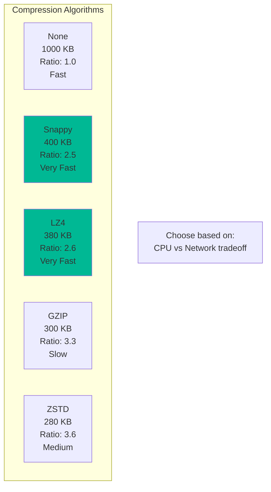

### Consumer Tuning

```csharp
var config = new ConsumerConfig
{
    BootstrapServers = "localhost:9092",
    GroupId = "order-processor",
    
    // Fetch settings
    FetchMinBytes = 1024,           // Wait for 1KB minimum
    FetchMaxWaitMs = 500,           // But no more than 500ms
    MaxPartitionFetchBytes = 1048576,  // 1MB per partition
    
    // Processing
    MaxPollRecords = 500,           // Fetch 500 records per poll
    MaxPollIntervalMs = 300000,     // 5 minutes max processing time
    
    // Session management
    SessionTimeoutMs = 10000,       // 10 second timeout
    HeartbeatIntervalMs = 3000,     // Heartbeat every 3 seconds
    
    // Auto-commit
    EnableAutoCommit = true,
    AutoCommitIntervalMs = 5000
};

var consumer = new ConsumerBuilder<string, string>(config).Build();
consumer.Subscribe("orders");
```

### Parallel Processing

```csharp
using System.Collections.Concurrent;

var consumer = new ConsumerBuilder<string, string>(config).Build();
consumer.Subscribe("orders");

var semaphore = new SemaphoreSlim(10);  // Max 10 concurrent workers
var tasks = new ConcurrentBag<Task>();

async Task ProcessMessageAsync(ConsumeResult<string, string> message)
{
    // Process message in thread pool
    try
    {
        var order = JsonSerializer.Deserialize<Order>(message.Message.Value);
        await ProcessOrderAsync(order);
        return;
    }
    catch (Exception ex)
    {
        logger.LogError(ex, "Processing failed");
    }
}

while (!cancellationToken.IsCancellationRequested)
{
    var message = consumer.Consume(cancellationToken);
    
    // Limit concurrent processing
    await semaphore.WaitAsync(cancellationToken);
    
    var task = Task.Run(async () =>
    {
        try
        {
            await ProcessMessageAsync(message);
        }
        finally
        {
            semaphore.Release();
        }
    }, cancellationToken);
    
    tasks.Add(task);
    
    // Don't wait - continue consuming
}
```

### Broker Tuning

**server.properties:**

```properties
# Network threads
num.network.threads=8

# I/O threads
num.io.threads=16

# Replication
replica.lag.time.max.ms=30000

# Log settings
log.segment.bytes=1073741824  # 1GB segments
log.retention.hours=168  # 7 days

# Compression
compression.type=producer  # Use producer's compression

# Flush settings (usually leave to OS)
log.flush.interval.messages=10000
log.flush.interval.ms=1000
```

## Security

### SSL Encryption

**Generate certificates:**

```bash
# Create CA
openssl req -new -x509 -keyout ca-key -out ca-cert -days 365

# Create broker keystore
keytool -keystore kafka.server.keystore.jks -alias localhost \
  -validity 365 -genkey -keyalg RSA

# Sign certificate
keytool -keystore kafka.server.keystore.jks -alias localhost \
  -certreq -file cert-file

openssl x509 -req -CA ca-cert -CAkey ca-key -in cert-file \
  -out cert-signed -days 365 -CAcreateserial

# Import to keystore
keytool -keystore kafka.server.keystore.jks -alias CARoot \
  -import -file ca-cert

keytool -keystore kafka.server.keystore.jks -alias localhost \
  -import -file cert-signed
```

**Broker configuration:**

```properties
listeners=SSL://localhost:9093
ssl.keystore.location=/var/ssl/kafka.server.keystore.jks
ssl.keystore.password=password
ssl.key.password=password
ssl.truststore.location=/var/ssl/kafka.server.truststore.jks
ssl.truststore.password=password
```

**Producer/Consumer:**

```csharp
var config = new ProducerConfig
{
    BootstrapServers = "localhost:9093",
    SecurityProtocol = SecurityProtocol.Ssl,
    SslCaLocation = "/path/to/ca-cert",
    SslCertificateLocation = "/path/to/client-cert",
    SslKeyLocation = "/path/to/client-key"
};

var producer = new ProducerBuilder<string, string>(config).Build();
```

### SASL Authentication

**Broker:**

```properties
listeners=SASL_SSL://localhost:9093
security.inter.broker.protocol=SASL_SSL
sasl.mechanism.inter.broker.protocol=PLAIN
sasl.enabled.mechanisms=PLAIN
```

**Client:**

```csharp
var config = new ProducerConfig
{
    BootstrapServers = "localhost:9093",
    SecurityProtocol = SecurityProtocol.SaslSsl,
    SaslMechanism = SaslMechanism.Plain,
    SaslUsername = "alice",
    SaslPassword = "password",
    SslCaLocation = "/path/to/ca-cert"
};

var producer = new ProducerBuilder<string, string>(config).Build();
```

### ACLs (Access Control Lists)

```bash
# Grant read access
kafka-acls --bootstrap-server localhost:9092 \
  --add \
  --allow-principal User:alice \
  --operation Read \
  --topic orders

# Grant write access
kafka-acls --bootstrap-server localhost:9092 \
  --add \
  --allow-principal User:bob \
  --operation Write \
  --topic orders

# List ACLs
kafka-acls --bootstrap-server localhost:9092 \
  --list \
  --topic orders
```

## Multi-Datacenter Replication

### MirrorMaker 2

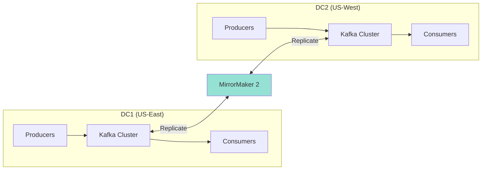

**Configuration:**

```properties
# mm2.properties
clusters = us-east, us-west

us-east.bootstrap.servers = east-kafka:9092
us-west.bootstrap.servers = west-kafka:9092

# Replication flows
us-east->us-west.enabled = true
us-west->us-east.enabled = true

# Topics to replicate
us-east->us-west.topics = orders, payments
us-west->us-east.topics = orders, payments

# Heartbeats and checkpoints
emit.heartbeats.enabled = true
emit.checkpoints.enabled = true
```

**Start MirrorMaker:**

```bash
connect-mirror-maker.sh mm2.properties
```

## Key Takeaways

✅ **Exactly-Once Semantics** - Guaranteed no duplicates with idempotence and transactions  
✅ **Log Compaction** - Keep latest state per key indefinitely  
✅ **Kafka Streams** - Build real-time processing apps with stateful operations  
✅ **Schema Registry** - Manage schema evolution safely  
✅ **Performance Tuning** - Optimize for your workload  
✅ **Security** - SSL, SASL, ACLs for production  
✅ **Multi-DC** - Replicate across datacenters  

## Next Steps

In [Part 6](part-06-advanced-patterns), we'll explore advanced event-driven patterns:
- CQRS (Command Query Responsibility Segregation)
- Event Sourcing implementations
- Saga Pattern for distributed transactions
- Outbox and Inbox patterns
- Building a complete system

You now have the tools for production Kafka! 🚀
