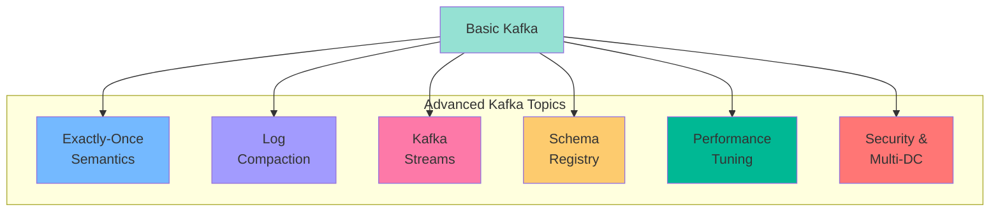
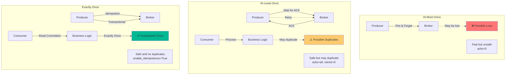
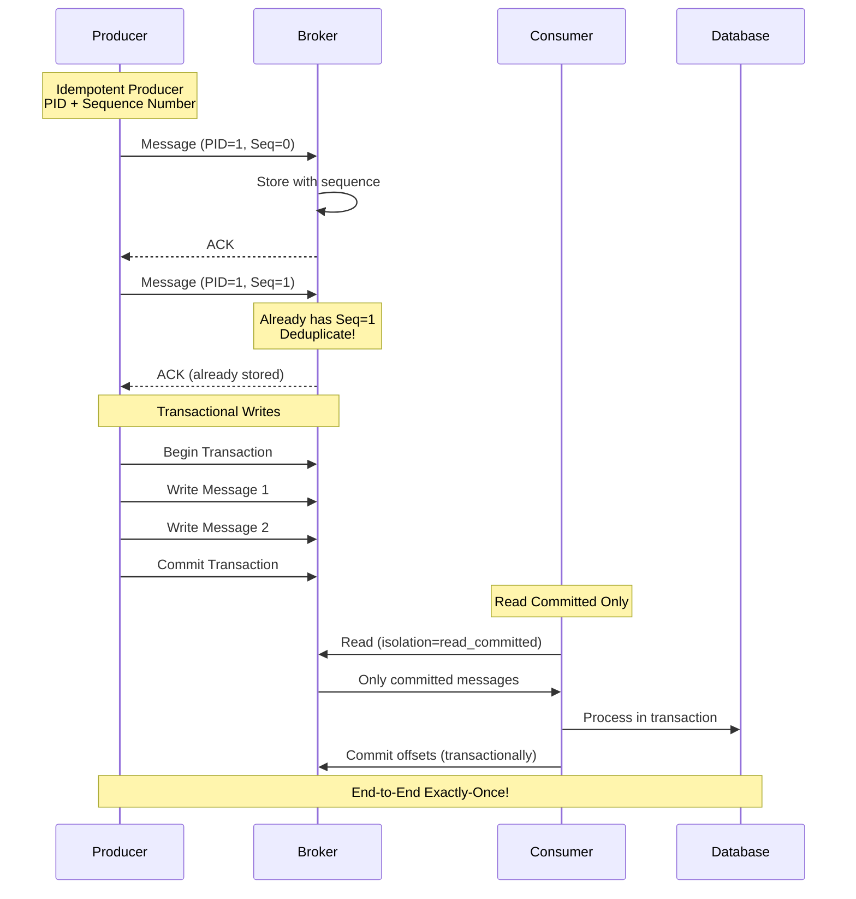
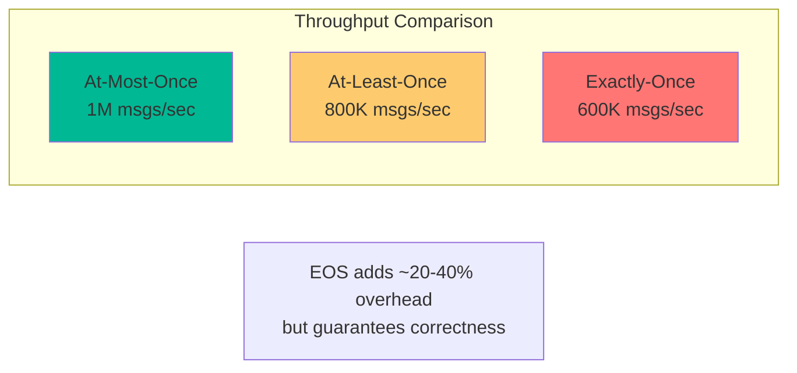
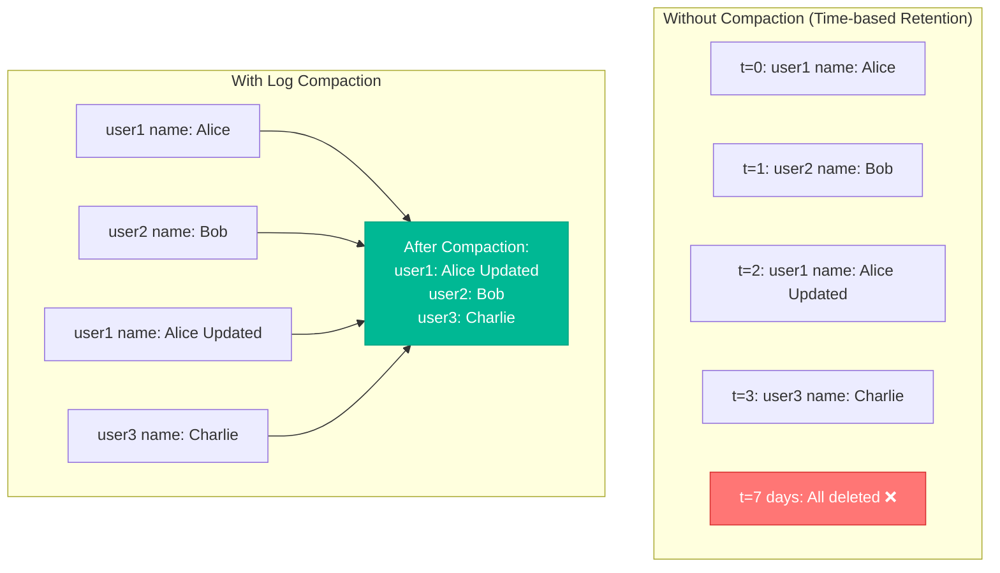
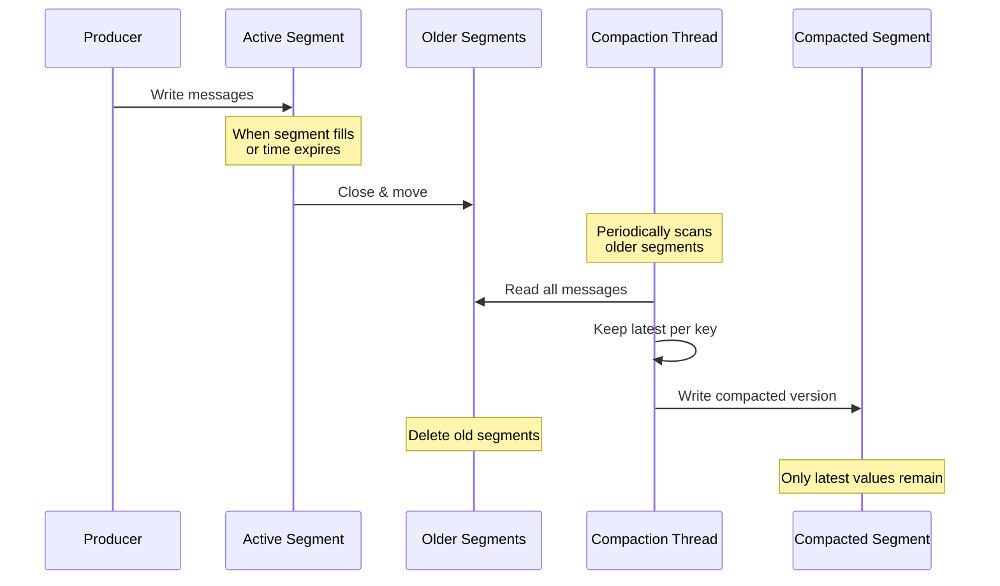
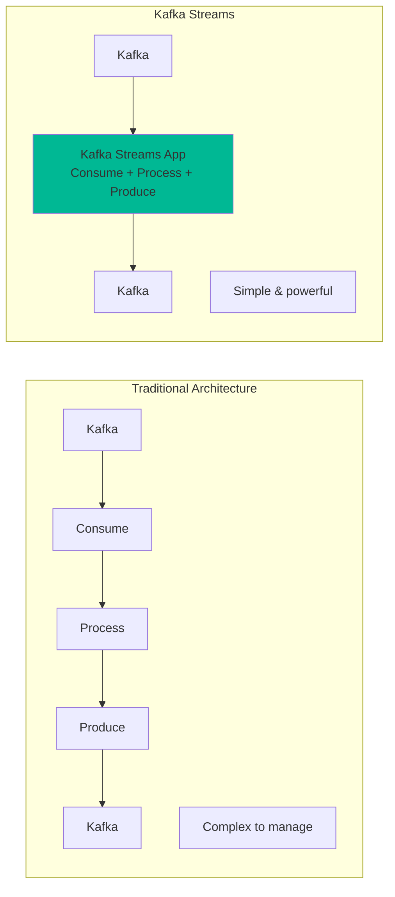
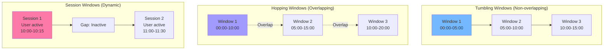
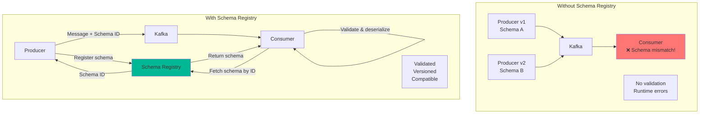
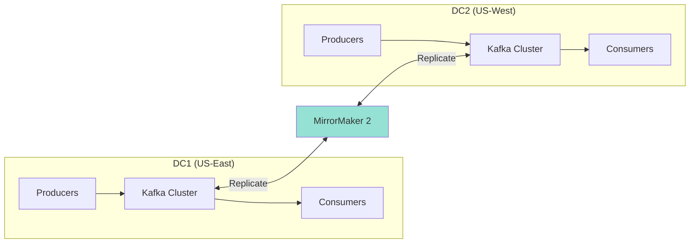

# Part 5: Advanced Kafka Concepts - Mastering Production Kafka

## Introduction

In Part 4, you built a working Kafka application. Now let's dive deep into advanced concepts that separate hobby projects from production systems.

We'll cover:
- Message delivery semantics (exactly-once)
- Log compaction for state management
- Kafka Streams for real-time processing
- Schema Registry for evolution
- Performance tuning
- Security and multi-datacenter replication



## Message Delivery Semantics

When sending messages through Kafka, you have three options for how reliably they get delivered. Think of it like sending a letter:
### The Three Guarantees



### At-Most-Once (Fire and Forget)

**📚 Complete Example:** [01-delivery-semantics/AtMostOnce →](https://github.com/tomakazoo/kafka-event-driven-architecture/tree/main/examples/05-advanced-kafka/dotnet/01-delivery-semantics/AtMostOnce)

This is like dropping a postcard in the mailbox without tracking. You send the message and immediately move on—you don't wait to confirm it arrived. It's the fastest option, but some messages might get lost.

**When to use it:**
- Collecting metrics where losing a few data points doesn't matter
- Log files where some missing entries are acceptable
- Any high-volume, low-importance data

**Tradeoff:** Lightning fast, but you might lose some messages.

**Pros:** ⚡ Extremely fast  
**Cons:** ❌ Messages can be lost

**💡 Try it yourself:**
```bash
cd examples/05-advanced-kafka/dotnet/01-delivery-semantics
dotnet run --project AtMostOnce/AtMostOnce.csproj
```

**📖 Full Documentation:** [README.md](https://github.com/tomakazoo/kafka-event-driven-architecture/blob/main/examples/05-advanced-kafka/dotnet/01-delivery-semantics/README.md) | [HOW-TO-RUN.md](https://github.com/tomakazoo/kafka-event-driven-architecture/blob/main/examples/05-advanced-kafka/dotnet/01-delivery-semantics/HOW-TO-RUN.md)

### At-Least-Once (The Safe Default)

**📚 Complete Example:** [01-delivery-semantics/AtLeastOnce →](https://github.com/tomakazoo/kafka-event-driven-architecture/tree/main/examples/05-advanced-kafka/dotnet/01-delivery-semantics/AtLeastOnce)

This is like sending a certified letter and keeping a receipt. The sender waits for confirmation that the message arrived. If it doesn't get confirmation, it sends again. This guarantees delivery but might result in duplicates if the confirmation gets lost.

**The duplicate problem:**
Imagine you process an order and update the database, but before you can record "I've processed this," your computer crashes. When you restart, you see the same order again and process it twice—now the customer is charged twice!

**Solutions:**

1. **Idempotent Consumer** - [IdempotentConsumer.cs →](https://github.com/tomakazoo/kafka-event-driven-architecture/blob/main/examples/05-advanced-kafka/dotnet/01-delivery-semantics/AtLeastOnce/IdempotentConsumer.cs)
2. **Database Deduplication** - See code comments in example

**💡 Try it yourself:**
```bash
cd examples/05-advanced-kafka/dotnet/01-delivery-semantics
dotnet run --project AtLeastOnce/AtLeastOnce.csproj
```

**Option 1: Remember what you've processed**
Keep a list of message IDs you've already handled (like keeping a logbook). Before processing anything, check: "Have I seen this before?" If yes, skip it. If no, process it and record the ID.

You can store these IDs in a fast database (like Redis) with an expiration time—after 24 hours, old IDs automatically disappear to keep the list manageable.

**Option 2: Make processing repeatable**
Design your system so that doing the same thing twice produces the same result. For example, instead of "add $100 to this account," use "set account balance to $500." Running it twice still results in $500.

**📖 Full Documentation:** [README.md](https://github.com/tomakazoo/kafka-event-driven-architecture/blob/main/examples/05-advanced-kafka/dotnet/01-delivery-semantics/README.md)

### Exactly-Once Semantics (EOS)

**📚 Complete Example:** [01-delivery-semantics/ExactlyOnce →](https://github.com/tomakazoo/kafka-event-driven-architecture/tree/main/examples/05-advanced-kafka/dotnet/01-delivery-semantics/ExactlyOnce)


The holy grail: messages delivered exactly once, no duplicates, no losses.



**How it works:**

**Step 1: Idempotent Producer**
Kafka gives each sender a unique ID and numbers each message. If the sender tries to send message #5 again, Kafka recognizes: "I already have message #5 from this sender" and discards the duplicate automatically.

1. **Producer ID (PID)**: Each producer gets unique ID
2. **Sequence Number**: Messages numbered per partition
3. **Broker Deduplication**: Rejects duplicates

```csharp
// Behind the scenes:
// Message 1: PID=123, Partition=0, Sequence=0
// Message 2: PID=123, Partition=0, Sequence=1
// Message 3: PID=123, Partition=0, Sequence=2

// If network fails and producer retries message 2:
// PID=123, Partition=0, Sequence=1 (again)
// Broker sees: "Already have sequence 1, ignore"
```

**Step 2: Transactional Writes**
When you need to send multiple related messages (like updating an order, inventory, and analytics), you can group them into a single transaction. Either all messages get published, or none do—just like a database transaction.

For example, imagine processing an online order requires:
1. Creating the order record
2. Reducing inventory
3. Sending a notification

With transactions, if step 3 fails, Kafka automatically undoes steps 1 and 2. This prevents partial updates that could leave your system in an inconsistent state.

**Step 3: Reading Only Committed Messages**
Consumers configured for exactly-once will only see messages from completed transactions—they never see partial or rolled-back data.

**The complete picture:**
When everything works together (idempotent producers, transactional writes, and careful consumers), you get end-to-end exactly-once delivery. A message gets processed once and only once, even if computers crash or networks fail.

**Performance impact:** Exactly-once adds about 20-40% overhead compared to at-least-once, but it guarantees data correctness.


**💡 Try it yourself:**
```bash
cd examples/05-advanced-kafka/dotnet/01-delivery-semantics
dotnet run --project ExactlyOnce/ExactlyOnce.csproj
```

**📖 Full Documentation:** [README.md](https://github.com/tomakazoo/kafka-event-driven-architecture/blob/main/examples/05-advanced-kafka/dotnet/01-delivery-semantics/README.md)

## Log Compaction

**📚 Complete Example:** [02-log-compaction →](https://github.com/tomakazoo/kafka-event-driven-architecture/tree/main/examples/05-advanced-kafka/dotnet/02-log-compaction)

Traditional retention deletes old messages after time/size limits. Log compaction keeps the **latest value for each key** indefinitely.


**How it works:**

Think of a phone book. Without compaction, every address change creates a new entry, and eventually, the whole book gets thrown away. With compaction, you only keep each person's current address—when someone moves, you replace their old address with the new one.

For example, with user profiles:
1. Monday: User-123 has email alice@old.com
2. Tuesday: User-123 updates to alice@new.com
3. Wednesday: User-123 changes their theme preference
4. Thursday: User-123 updates their name

Without compaction, after 7 days, all this information disappears.

With compaction, Kafka keeps only the latest record for User-123 with all their current information. Old versions get removed automatically.

**Deleting data:**
To remove a key completely (like deleting a user), you send a special "tombstone" message—a message with the key but no value. After compaction, that key disappears from the log entirely.

**Use cases:**
- User profiles: Keep current profile for each user
- Configuration: Store latest config for each service
- Database change tracking: Maintain current state of each database row
- Cache management: Keep latest cached values

**Rebuilding state:**
A new consumer can read the entire compacted log and quickly rebuild the complete current state. It's like getting a snapshot of "the world as it is now" rather than having to replay every single change that ever happened.


**What it demonstrates:**
- Topic compaction configuration (`cleanup.policy=compact`)
- Latest state per key preservation
- State store reconstruction

**Key Files:**
- [UserStateProducer.cs](https://github.com/tomakazoo/kafka-event-driven-architecture/blob/main/examples/05-advanced-kafka/dotnet/02-log-compaction/Producer/UserStateProducer.cs) - Produces updates with same key
- [UserStateConsumer.cs](https://github.com/tomakazoo/kafka-event-driven-architecture/blob/main/examples/05-advanced-kafka/dotnet/02-log-compaction/Consumer/UserStateConsumer.cs) - Reads compacted log

**💡 Try it yourself:**
```bash
cd examples/05-advanced-kafka/dotnet/02-log-compaction
dotnet run --project Producer/Producer.csproj
dotnet run --project Consumer/Consumer.csproj
```

**📖 Full Documentation:** [README.md](https://github.com/tomakazoo/kafka-event-driven-architecture/blob/main/examples/05-advanced-kafka/dotnet/02-log-compaction/README.md) | [HOW-TO-RUN.md](https://github.com/tomakazoo/kafka-event-driven-architecture/blob/main/examples/05-advanced-kafka/dotnet/02-log-compaction/HOW-TO-RUN.md)

## Kafka Streams

**📚 Complete Example:** [03-kafka-streams →](https://github.com/tomakazoo/kafka-event-driven-architecture/tree/main/examples/05-advanced-kafka/dotnet/03-kafka-streams)

Kafka Streams is a library for building applications that process data in real-time, directly from Kafka topics. Instead of writing separate programs to read from Kafka, process data, and write back to Kafka, Kafka Streams does all three together seamlessly.


**Traditional approach:** Build a consumer, write processing logic, build a producer, handle crashes, manage state—lots of moving parts.

**Kafka Streams approach:** Write your processing logic, and Kafka Streams handles everything else automatically.

### Simple Operations

**Filtering:**
Like using a sieve—only let certain messages through. For example, "only show me orders over $1,000" or "only process messages from premium customers."

**Transforming:**
Change the format or content of messages. For example, convert prices from dollars to euros, extract just the email addresses from user profiles, or calculate totals.

**Splitting:**
Route messages to different paths based on rules. For example, send small orders (under $100) one way, medium orders ($100-$1,000) another way, and large orders (over $1,000) a third way.

### Stateful Operations (Keeping Track of Things)

**Counting and Summing:**
Keep running totals. For example, count how many orders each customer has placed, or calculate each customer's total spending. These values update automatically as new messages arrive.

**Windowed Calculations:**
Track metrics over time periods. There are three types:

1. **Tumbling Windows (Non-overlapping):**
   Like hourly buckets—8am-9am, 9am-10am, 10am-11am. Each message goes into exactly one bucket. Use this for hourly sales reports or daily statistics.

2. **Hopping Windows (Overlapping):**
   Like a sliding window—calculate "last 10 minutes" every 5 minutes. Windows overlap, so some messages appear in multiple windows. Use this for moving averages or trend detection.

3. **Session Windows (Activity-based):**
   Group activity by user behavior. If a user is inactive for 30 minutes, that session closes and a new one starts. Use this for website analytics or detecting user engagement patterns.



## Kafka Streams: Real-Time Processing Made Simple

Kafka Streams is a library for building applications that process data in real-time, directly from Kafka topics. Instead of writing separate programs to read from Kafka, process data, and write back to Kafka, Kafka Streams does all three together seamlessly.

**Traditional approach:** Build a consumer, write processing logic, build a producer, handle crashes, manage state—lots of moving parts.

**Kafka Streams approach:** Write your processing logic, and Kafka Streams handles everything else automatically.

### Simple Operations

**Filtering:**
Like using a sieve—only let certain messages through. For example, "only show me orders over $1,000" or "only process messages from premium customers."

**Transforming:**
Change the format or content of messages. For example, convert prices from dollars to euros, extract just the email addresses from user profiles, or calculate totals.

**Splitting:**
Route messages to different paths based on rules. For example, send small orders (under $100) one way, medium orders ($100-$1,000) another way, and large orders (over $1,000) a third way.

### Stateful Operations (Keeping Track of Things)

**Counting and Summing:**
Keep running totals. For example, count how many orders each customer has placed, or calculate each customer's total spending. These values update automatically as new messages arrive.

**Windowed Calculations:**
Track metrics over time periods. There are three types:

1. **Tumbling Windows (Non-overlapping):**
   Like hourly buckets—8am-9am, 9am-10am, 10am-11am. Each message goes into exactly one bucket. Use this for hourly sales reports or daily statistics.

2. **Hopping Windows (Overlapping):**
   Like a sliding window—calculate "last 10 minutes" every 5 minutes. Windows overlap, so some messages appear in multiple windows. Use this for moving averages or trend detection.

3. **Session Windows (Activity-based):**
   Group activity by user behavior. If a user is inactive for 30 minutes, that session closes and a new one starts. Use this for website analytics or detecting user engagement patterns.

**Joining Data Streams:**

**Stream-Stream Join:**
Combine two related events that happen close in time. For example, match an "order created" event with a "payment received" event that happens within 5 minutes. This creates a complete picture of the transaction.

**Stream-Table Join (Enrichment):**
Add reference data to events. For example, when processing an order, look up customer details (name, address, loyalty status) from a customer table and include that information with the order. The table stays in memory for fast lookups.

**Table-Table Join:**
Combine two reference datasets. For example, join customer information with their addresses to create a complete customer profile. Both tables update independently, and the join result updates automatically.

### Complete Example: Real-Time Analytics

Imagine building a real-time analytics system for an e-commerce platform:

**Step 1: Enrich orders with product details**
When an order comes in, look up the product name, category, and price from the products table and add that information to the order.

**Step 2: Calculate revenue by product**
For each product, add up all sales in one-hour windows. Every hour, you get a report showing which products generated the most revenue.

**Step 3: Identify high-value customers**
Track each customer's total spending over 24-hour rolling windows. When someone spends more than $10,000 in a day, automatically flag them as a VIP customer and trigger special handling.

**Step 4: Generate reports**
Publish the revenue reports and VIP alerts to output topics where other systems can use them—maybe send VIP customers personalized emails or show product rankings on a dashboard.

All this happens automatically in real-time as orders flow through the system. No manual intervention needed.

### State Storage

Kafka Streams automatically maintains state (like running totals or cached lookup data) in persistent storage. If your application crashes and restarts, it automatically recovers its state and continues where it left off. You don't have to manage this—it just works.


**Key Files:**
- [OrderProcessingTopology.cs](https://github.com/tomakazoo/kafka-event-driven-architecture/blob/main/examples/05-advanced-kafka/dotnet/03-kafka-streams/Streams/OrderProcessingTopology.cs) - Stream processing logic
- [OrderProducer.cs](https://github.com/tomakazoo/kafka-event-driven-architecture/blob/main/examples/05-advanced-kafka/dotnet/03-kafka-streams/Examples/OrderProducer.cs) - Produces orders
- [StreamsDemo.cs](https://github.com/tomakazoo/kafka-event-driven-architecture/blob/main/examples/05-advanced-kafka/dotnet/03-kafka-streams/Examples/StreamsDemo.cs) - Runs stream processing

**💡 Try it yourself:**
```bash
cd examples/05-advanced-kafka/dotnet/03-kafka-streams
# Terminal 1: Producer
dotnet run --project Examples/Examples.csproj
# Terminal 2: Stream processor (modify StartupObject to StreamsDemo)
dotnet run --project Examples/Examples.csproj
```

**📖 Full Documentation:** [README.md](https://github.com/tomakazoo/kafka-event-driven-architecture/blob/main/examples/05-advanced-kafka/dotnet/03-kafka-streams/README.md) | [HOW-TO-RUN.md](https://github.com/tomakazoo/kafka-event-driven-architecture/blob/main/examples/05-advanced-kafka/dotnet/03-kafka-streams/HOW-TO-RUN.md)

**💡 Note:** .NET doesn't have native Kafka Streams. This example simulates stream processing concepts. For production, consider Kafka Streams (Java) or ksqlDB.

## Schema Registry: Managing Data Evolution

**📚 Schema Registry Setup:** [01-fundamentals →](https://github.com/tomakazoo/kafka-event-driven-architecture/tree/main/examples/01-fundamentals)

Schema Registry solves a critical problem: how do you change your data format without breaking existing consumers?



**The problem without Schema Registry:**

Imagine you have three applications:
- App A sends orders using version 1 of the order format
- App B sends orders using version 2 with an extra field
- App C reads orders but expects version 1

When App C reads a version 2 message, it crashes because it doesn't understand the new field. You have no way to validate compatibility before deploying.

**How Schema Registry works:**

1. **Registration:** When a producer wants to send data, it first registers its schema (data format) with the Registry. The Registry checks if this schema is compatible with existing schemas and assigns it a unique ID.

2. **Sending messages:** The producer includes the schema ID in each message (not the full schema—just the ID number).

3. **Reading messages:** When a consumer reads a message, it extracts the schema ID, asks the Registry for that schema, then uses it to interpret the data correctly.

4. **Validation:** The Registry enforces compatibility rules, preventing incompatible changes from being deployed.

### Schema Evolution Patterns

**Backward Compatible (Safest):**
New schema can read old data. For example, adding a new optional field with a default value. Old consumers ignore the new field, new consumers use it. Everyone's happy.

Example: Adding "customer_email" as optional. Old data without this field still works because new consumers use a default value (like empty string) when it's missing.

**Forward Compatible:**
Old schema can read new data. For example, removing an optional field. New producers stop sending it, but old consumers don't crash—they just see empty values.

**Full Compatible (Gold Standard):**
Both backward and forward compatible. Changes work in both directions. This is the safest but most restrictive option.

**No Compatibility:**
Anything goes—no validation. Only use this when you're certain consumers and producers will be updated together, or during initial development.

### Using Different Data Formats

While Schema Registry is often associated with Avro (a specific data format), it also supports JSON Schema and Protocol Buffers. The choice depends on your needs:

- **Avro:** Most compact, fastest, excellent for high-volume data
- **JSON Schema:** More readable, easier to debug, familiar to most developers
- **Protocol Buffers:** Strong typing, excellent for cross-language systems

All formats get the same benefits: versioning, validation, and compatibility checking.

## Performance Optimization

**📚 Complete Example:** [04-performance-tuning →](https://github.com/tomakazoo/kafka-event-driven-architecture/tree/main/examples/05-advanced-kafka/dotnet/04-performance-tuning)

Making Kafka fast isn't about one magic setting—it's about understanding tradeoffs and tuning for your specific workload.

### Producer Optimization

**Batching:**
Instead of sending each message individually, group many messages together. It's like carpooling—sending 100 messages in one network trip is much faster than 100 separate trips.

You control two settings:
- **Batch size:** How big should the batch be? (e.g., 32KB)
- **Wait time:** How long should we wait to fill the batch? (e.g., 10 milliseconds)

Larger batches mean better throughput but slightly higher latency.

**Compression:**
Compress messages before sending to reduce network usage. Think of it like zipping files before emailing them.

Options:
- **None:** Fastest CPU, largest network usage
- **Snappy/LZ4:** Very fast compression, good balance
- **GZIP:** Slowest but best compression ratio
- **ZSTD:** Modern option, great compression with reasonable speed

Choose based on whether your bottleneck is CPU or network bandwidth.

**Pipelining:**
Allow multiple requests "in flight" simultaneously. Instead of send-wait-send-wait, you do send-send-send...then collect all the acknowledgments together. This dramatically improves throughput on high-latency networks.


**Key Files:**
- [TunedProducer.cs](https://github.com/tomakazoo/kafka-event-driven-architecture/blob/main/examples/05-advanced-kafka/dotnet/04-performance-tuning/Producer/TunedProducer.cs) - Optimized producer
- [BaselineProducer.cs](https://github.com/tomakazoo/kafka-event-driven-architecture/blob/main/examples/05-advanced-kafka/dotnet/04-performance-tuning/Producer/BaselineProducer.cs) - Baseline for comparison

**Key Optimizations:**
- `BatchSize = 32768` - 32KB batches
- `LingerMs = 10` - Wait up to 10ms to fill batch
- `CompressionType = CompressionType.Snappy` - Fast compression
- `MaxInFlight = 5` - Allow concurrent requests

**Compression Comparison:**

| Algorithm | Speed       | Compression | Use Case                |
|-----------|-------------|-------------|-------------------------|
| None      | Fastest     | 1.0x        | Low bandwidth           |
| Snappy    | Fast        | 2.5x        | **Recommended default** |
| Lz4       | Very Fast   | 2.6x        | High throughput         |
| Gzip      | Slow        | 3.3x        | High compression        |
| Zstd      | Medium      | 3.6x        | Best compression        |

**💡 Try it yourself:**
```bash
cd examples/05-advanced-kafka/dotnet/04-performance-tuning
# Baseline (modify StartupObject to BaselineProducer)
dotnet run --project Producer/Producer.csproj
# Tuned (modify StartupObject to TunedProducer)
dotnet run --project Producer/Producer.csproj
```

**📖 Full Documentation:** [README.md](https://github.com/tomakazoo/kafka-event-driven-architecture/blob/main/examples/05-advanced-kafka/dotnet/04-performance-tuning/README.md) | [HOW-TO-RUN.md](https://github.com/tomakazoo/kafka-event-driven-architecture/blob/main/examples/05-advanced-kafka/dotnet/04-performance-tuning/HOW-TO-RUN.md)


### Consumer Optimization

**Key Files:**
- [ParallelConsumer.cs](https://github.com/tomakazoo/kafka-event-driven-architecture/blob/main/examples/05-advanced-kafka/dotnet/04-performance-tuning/Consumer/ParallelConsumer.cs) - Parallel processing consumer

**Key Optimizations:**
- `FetchMinBytes = 1024` - Wait for 1KB minimum
- `FetchMaxWaitMs = 500` - Max wait time
- `MaxPollRecords = 500` - Fetch 500 records per poll
- Parallel processing with `SemaphoreSlim` (max 10 concurrent workers)

**💡 Try it yourself:**
```bash
cd examples/05-advanced-kafka/dotnet/04-performance-tuning
dotnet run --project Consumer/Consumer.csproj
```

**📖 Full Documentation:** [README.md](https://github.com/tomakazoo/kafka-event-driven-architecture/blob/main/examples/05-advanced-kafka/dotnet/04-performance-tuning/README.md)


**Batch Fetching:**
Instead of reading messages one at a time, fetch a batch (e.g., 500 messages) in one go. This reduces network overhead.

**Prefetching:**
While you're processing current messages, Kafka fetches the next batch in the background. When you finish processing, the next batch is already waiting—no delay.

**Parallel Processing:**
Process multiple messages simultaneously using thread pools. For example, fetch 500 messages, then process them using 10 worker threads in parallel. This keeps your CPU busy and maximizes throughput.

**Important:** Make sure your processing is idempotent if you're doing parallel processing, because crashes might cause some messages to be processed twice.

### When to Tune What

- **High latency network:** Increase batching and pipelining
- **CPU bottleneck:** Disable compression or use faster algorithms
- **Network bottleneck:** Enable compression (GZIP or ZSTD)
- **Small messages:** Increase batch wait time to get fuller batches
- **Large messages:** Reduce batch size to avoid timeouts

The key is measuring your specific bottleneck before tuning. Don't just copy settings from blog posts—profile your actual workload.

---

Schema Registry is configured as part of the Kafka infrastructure setup. See:
- [docker-compose.yml](https://github.com/tomakazoo/kafka-event-driven-architecture/blob/main/docker-compose.yml) - Schema Registry configuration
- [HOW-TO-RUN.md](https://github.com/tomakazoo/kafka-event-driven-architecture/blob/main/examples/01-fundamentals/HOW-TO-RUN.md) - Setup instructions

**Access Schema Registry:**
- URL: http://localhost:8081
- API: http://localhost:8081/subjects

**💡 Schema Registry is automatically started with:**
```bash
./scripts/start-kafka.sh
```

**📖 Full Documentation:** [01-fundamentals/HOW-TO-RUN.md](https://github.com/tomakazoo/kafka-event-driven-architecture/blob/main/examples/01-fundamentals/HOW-TO-RUN.md)

## Security

### SSL Encryption

**📚 Complete Example:** [05-security/SSL →](https://github.com/tomakazoo/kafka-event-driven-architecture/tree/main/examples/05-advanced-kafka/dotnet/05-security/SSL)

**Generate certificates:**

```bash
# Create CA
openssl req -new -x509 -keyout ca-key -out ca-cert -days 365

# Create broker keystore
keytool -keystore kafka.server.keystore.jks -alias localhost \
  -validity 365 -genkey -keyalg RSA

# Sign certificate
keytool -keystore kafka.server.keystore.jks -alias localhost \
  -certreq -file cert-file

openssl x509 -req -CA ca-cert -CAkey ca-key -in cert-file \
  -out cert-signed -days 365 -CAcreateserial

# Import to keystore
keytool -keystore kafka.server.keystore.jks -alias CARoot \
  -import -file ca-cert

keytool -keystore kafka.server.keystore.jks -alias localhost \
  -import -file cert-signed
```

**Broker configuration:**

```properties
listeners=SSL://localhost:9093
ssl.keystore.location=/var/ssl/kafka.server.keystore.jks
ssl.keystore.password=password
ssl.key.password=password
ssl.truststore.location=/var/ssl/kafka.server.truststore.jks
ssl.truststore.password=password
```
**Key Files:**
- [SslProducer.cs](https://github.com/tomakazoo/kafka-event-driven-architecture/blob/main/examples/05-advanced-kafka/dotnet/05-security/SSL/SslProducer.cs) - SSL producer
- [SslConsumer.cs](https://github.com/tomakazoo/kafka-event-driven-architecture/blob/main/examples/05-advanced-kafka/dotnet/05-security/SSL/SslConsumer.cs) - SSL consumer

**Key Configuration:**
- `SecurityProtocol = SecurityProtocol.Ssl`
- `SslCaLocation = "/path/to/ca-cert"`
- `SslCertificateLocation = "/path/to/client-cert"`
- `SslKeyLocation = "/path/to/client-key"`

**⚠️ Note:** Requires broker-side SSL configuration. See [README.md](https://github.com/tomakazoo/kafka-event-driven-architecture/blob/main/examples/05-advanced-kafka/dotnet/05-security/README.md) for setup instructions.


**💡 Try it yourself:**
```bash
cd examples/05-advanced-kafka/dotnet/05-security
dotnet run --project SSL/SSL.csproj
```

**📖 Full Documentation:** [README.md](https://github.com/tomakazoo/kafka-event-driven-architecture/blob/main/examples/05-advanced-kafka/dotnet/05-security/README.md) | [HOW-TO-RUN.md](https://github.com/tomakazoo/kafka-event-driven-architecture/blob/main/examples/05-advanced-kafka/dotnet/05-security/HOW-TO-RUN.md)

### SASL Authentication

**📚 Complete Example:** [05-security/SASL →](https://github.com/tomakazoo/kafka-event-driven-architecture/tree/main/examples/05-advanced-kafka/dotnet/05-security/SASL)

**Key Files:**
- [SaslProducer.cs](https://github.com/tomakazoo/kafka-event-driven-architecture/blob/main/examples/05-advanced-kafka/dotnet/05-security/SASL/SaslProducer.cs) - SASL producer
- [SaslConsumer.cs](https://github.com/tomakazoo/kafka-event-driven-architecture/blob/main/examples/05-advanced-kafka/dotnet/05-security/SASL/SaslConsumer.cs) - SASL consumer

**Key Configuration:**
- `SecurityProtocol = SecurityProtocol.SaslSsl`
- `SaslMechanism = SaslMechanism.Plain`
- `SaslUsername = "alice"`
- `SaslPassword = "password"`

**⚠️ Note:** Requires broker-side SASL configuration. See [README.md](https://github.com/tomakazoo/kafka-event-driven-architecture/blob/main/examples/05-advanced-kafka/dotnet/05-security/README.md) for setup instructions.

**💡 Try it yourself:**
```bash
cd examples/05-advanced-kafka/dotnet/05-security
dotnet run --project SASL/SASL.csproj
```

**📖 Full Documentation:** [README.md](https://github.com/tomakazoo/kafka-event-driven-architecture/blob/main/examples/05-advanced-kafka/dotnet/05-security/README.md)

**Broker:**

```properties
listeners=SASL_SSL://localhost:9093
security.inter.broker.protocol=SASL_SSL
sasl.mechanism.inter.broker.protocol=PLAIN
sasl.enabled.mechanisms=PLAIN
```

**Client:**

```csharp
var config = new ProducerConfig
{
    BootstrapServers = "localhost:9093",
    SecurityProtocol = SecurityProtocol.SaslSsl,
    SaslMechanism = SaslMechanism.Plain,
    SaslUsername = "alice",
    SaslPassword = "password",
    SslCaLocation = "/path/to/ca-cert"
};

var producer = new ProducerBuilder<string, string>(config).Build();
```

### ACLs (Access Control Lists)

```bash
# Grant read access
kafka-acls --bootstrap-server localhost:9092 \
  --add \
  --allow-principal User:alice \
  --operation Read \
  --topic orders

# Grant write access
kafka-acls --bootstrap-server localhost:9092 \
  --add \
  --allow-principal User:bob \
  --operation Write \
  --topic orders

# List ACLs
kafka-acls --bootstrap-server localhost:9092 \
  --list \
  --topic orders
```

## Multi-Datacenter Replication

**📚 Complete Example:** [06-multi-dc-replication →](https://github.com/tomakazoo/kafka-event-driven-architecture/tree/main/examples/05-advanced-kafka/dotnet/06-multi-dc-replication)
**What it demonstrates:**
- MirrorMaker 2 concepts
- Multi-datacenter replication patterns
- Topic replication configuration

### MirrorMaker 2



**Configuration:**

```properties
# mm2.properties
clusters = us-east, us-west

us-east.bootstrap.servers = east-kafka:9092
us-west.bootstrap.servers = west-kafka:9092

# Replication flows
us-east->us-west.enabled = true
us-west->us-east.enabled = true

# Topics to replicate
us-east->us-west.topics = orders, payments
us-west->us-east.topics = orders, payments

# Heartbeats and checkpoints
emit.heartbeats.enabled = true
emit.checkpoints.enabled = true
```

**Start MirrorMaker:**

```bash
connect-mirror-maker.sh mm2.properties
```
**Key Files:**
- [Dc1Producer.cs](https://github.com/tomakazoo/kafka-event-driven-architecture/blob/main/examples/05-advanced-kafka/dotnet/06-multi-dc-replication/Producer/Dc1Producer.cs) - Simulates DC1 producer
- [Dc2Consumer.cs](https://github.com/tomakazoo/kafka-event-driven-architecture/blob/main/examples/05-advanced-kafka/dotnet/06-multi-dc-replication/Consumer/Dc2Consumer.cs) - Simulates DC2 consumer
- [ReplicationDemo.cs](https://github.com/tomakazoo/kafka-event-driven-architecture/blob/main/examples/05-advanced-kafka/dotnet/06-multi-dc-replication/Examples/ReplicationDemo.cs) - Concepts demo

**MirrorMaker 2 Configuration:**

See [HOW-TO-RUN.md](https://github.com/tomakazoo/kafka-event-driven-architecture/blob/main/examples/05-advanced-kafka/dotnet/06-multi-dc-replication/HOW-TO-RUN.md) for complete MirrorMaker 2 configuration example (`mm2.properties`).

**💡 Try it yourself:**
```bash
cd examples/05-advanced-kafka/dotnet/06-multi-dc-replication
dotnet run --project Producer/Producer.csproj
dotnet run --project Consumer/Consumer.csproj
```

**⚠️ Note:** Full replication requires multiple Kafka clusters. This example demonstrates concepts with a single cluster.

**📖 Full Documentation:** [README.md](https://github.com/tomakazoo/kafka-event-driven-architecture/blob/main/examples/05-advanced-kafka/dotnet/06-multi-dc-replication/README.md) | [HOW-TO-RUN.md](https://github.com/tomakazoo/kafka-event-driven-architecture/blob/main/examples/05-advanced-kafka/dotnet/06-multi-dc-replication/HOW-TO-RUN.md)

---

## Key Takeaways

✅ **Exactly-Once Semantics** - Guaranteed no duplicates with idempotence and transactions - [Try Example →](https://github.com/tomakazoo/kafka-event-driven-architecture/tree/main/examples/05-advanced-kafka/dotnet/01-delivery-semantics/ExactlyOnce)

✅ **Log Compaction** - Keep latest state per key indefinitely - [Try Example →](https://github.com/tomakazoo/kafka-event-driven-architecture/tree/main/examples/05-advanced-kafka/dotnet/02-log-compaction)

✅ **Kafka Streams** - Build real-time processing apps with stateful operations - [Try Example →](https://github.com/tomakazoo/kafka-event-driven-architecture/tree/main/examples/05-advanced-kafka/dotnet/03-kafka-streams)

✅ **Schema Registry** - Manage schema evolution safely - [See Setup →](https://github.com/tomakazoo/kafka-event-driven-architecture/tree/main/examples/01-fundamentals)

✅ **Performance Tuning** - Optimize for your workload - [Try Example →](https://github.com/tomakazoo/kafka-event-driven-architecture/tree/main/examples/05-advanced-kafka/dotnet/04-performance-tuning)

✅ **Security** - SSL, SASL, ACLs for production - [Try Examples →](https://github.com/tomakazoo/kafka-event-driven-architecture/tree/main/examples/05-advanced-kafka/dotnet/05-security)

✅ **Multi-DC** - Replicate across datacenters - [Try Example →](https://github.com/tomakazoo/kafka-event-driven-architecture/tree/main/examples/05-advanced-kafka/dotnet/06-multi-dc-replication)

**📚 Complete examples repository:** [kafka-event-driven-architecture →](https://github.com/tomakazoo/kafka-event-driven-architecture) 

## Next Steps

In [Part 6](part-06-advanced-patterns), we'll explore advanced event-driven patterns:
- CQRS (Command Query Responsibility Segregation)
- Event Sourcing implementations
- Saga Pattern for distributed transactions
- Outbox and Inbox patterns
- Building a complete system

You now have the tools for production Kafka! 🚀
