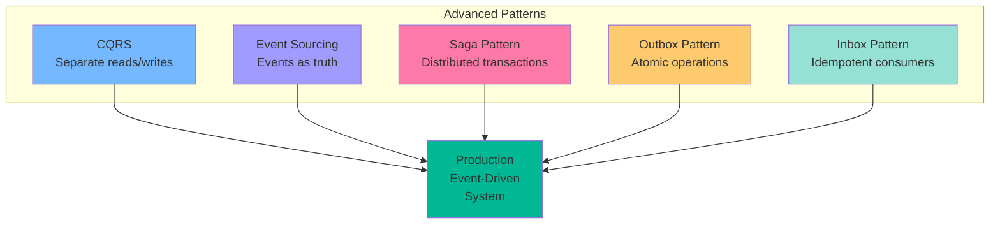
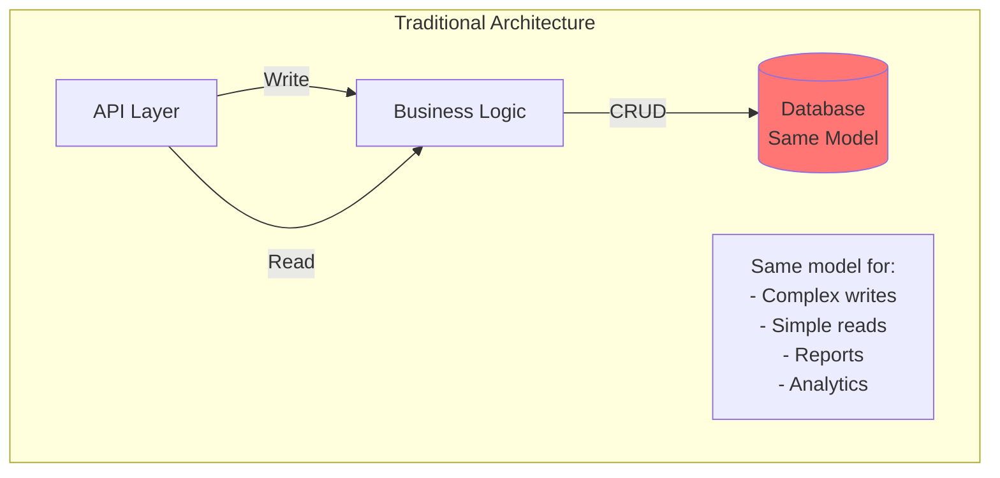
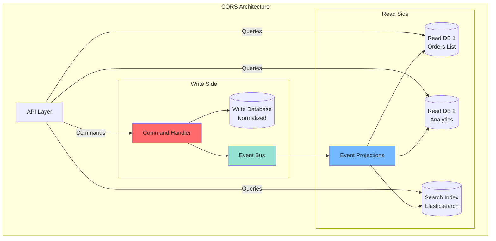
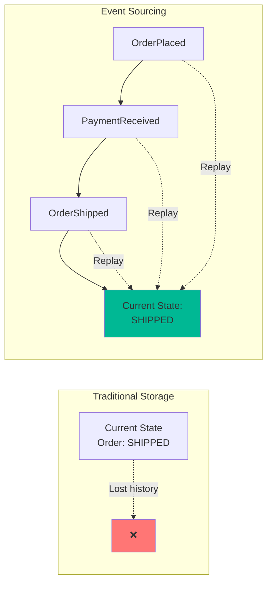
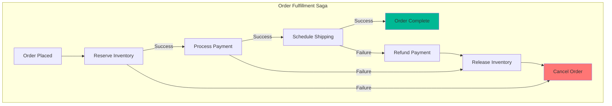
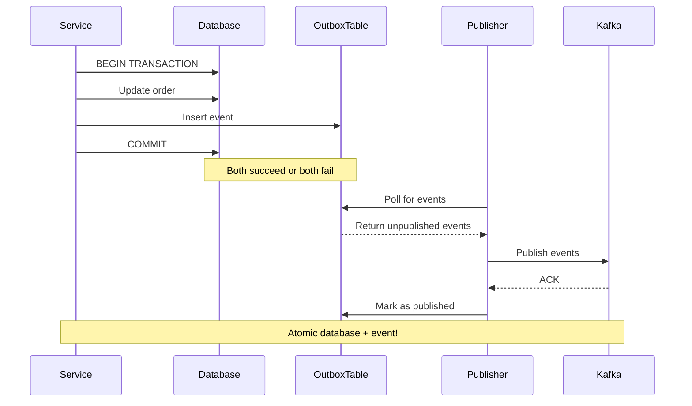

# Part 6: Advanced Event-Driven Patterns - CQRS, Event Sourcing, and Sagas

## Introduction

You've mastered Kafka and built event-driven systems. Now let's explore advanced architectural patterns that leverage events to build sophisticated, scalable applications.

**What we'll cover:**
- CQRS (Command Query Responsibility Segregation)
- Event Sourcing deep dive
- Saga Pattern (Choreography vs Orchestration)
- Outbox Pattern
- Inbox Pattern
- Complete e-commerce implementation



## CQRS (Command Query Responsibility Segregation)

### The Problem

Traditional architecture uses the same model for reads and writes:



**Problems:**
- Write model optimized for business rules
- Read model needs different shapes (joins, denormalization)
- Difficult to scale independently
- Complex queries impact write performance

### CQRS Solution

Separate models for commands (writes) and queries (reads):



### CQRS Implementation

**Write Model (Commands):**

```python
from dataclasses import dataclass
from typing import List
from datetime import datetime
import uuid

# Commands (intent to change state)
@dataclass
class PlaceOrderCommand:
    customer_id: str
    items: List[dict]
    shipping_address: dict

@dataclass
class CancelOrderCommand:
    order_id: str
    reason: str

# Events (state changes that happened)
@dataclass
class OrderPlacedEvent:
    event_id: str
    order_id: str
    customer_id: str
    items: List[dict]
    total_amount: float
    timestamp: datetime

@dataclass
class OrderCancelledEvent:
    event_id: str
    order_id: str
    reason: str
    timestamp: datetime

# Write Model (Command Handler)
class OrderCommandHandler:
    def __init__(self, repository, event_bus):
        self.repository = repository
        self.event_bus = event_bus
    
    def handle_place_order(self, command: PlaceOrderCommand):
        # 1. Validate command
        self._validate_place_order(command)
        
        # 2. Create aggregate
        order = Order.create(
            customer_id=command.customer_id,
            items=command.items,
            shipping_address=command.shipping_address
        )
        
        # 3. Save to write database
        self.repository.save(order)
        
        # 4. Publish events
        for event in order.uncommitted_events:
            self.event_bus.publish('orders', event)
        
        return order.order_id
    
    def handle_cancel_order(self, command: CancelOrderCommand):
        # 1. Load order
        order = self.repository.get(command.order_id)
        
        if not order:
            raise OrderNotFoundError(command.order_id)
        
        # 2. Execute business logic
        order.cancel(command.reason)
        
        # 3. Save changes
        self.repository.save(order)
        
        # 4. Publish events
        for event in order.uncommitted_events:
            self.event_bus.publish('orders', event)

# Domain Model
class Order:
    def __init__(self):
        self.order_id = None
        self.customer_id = None
        self.items = []
        self.status = None
        self.total_amount = 0.0
        self.uncommitted_events = []
    
    @staticmethod
    def create(customer_id, items, shipping_address):
        order = Order()
        order.order_id = f"ORD-{uuid.uuid4().hex[:8]}"
        order.customer_id = customer_id
        order.items = items
        order.status = "PLACED"
        order.total_amount = sum(item['price'] * item['quantity'] for item in items)
        
        # Record event
        event = OrderPlacedEvent(
            event_id=str(uuid.uuid4()),
            order_id=order.order_id,
            customer_id=customer_id,
            items=items,
            total_amount=order.total_amount,
            timestamp=datetime.utcnow()
        )
        order.uncommitted_events.append(event)
        
        return order
    
    def cancel(self, reason):
        if self.status in ['SHIPPED', 'DELIVERED']:
            raise CannotCancelOrderError("Order already shipped")
        
        self.status = "CANCELLED"
        
        # Record event
        event = OrderCancelledEvent(
            event_id=str(uuid.uuid4()),
            order_id=self.order_id,
            reason=reason,
            timestamp=datetime.utcnow()
        )
        self.uncommitted_events.append(event)
```

**Read Model (Queries):**

```python
from kafka import KafkaConsumer
import json
from pymongo import MongoClient

# Read Model 1: Order List View
class OrderListProjection:
    def __init__(self):
        self.consumer = KafkaConsumer(
            'orders',
            group_id='order-list-projection',
            value_deserializer=lambda m: json.loads(m.decode('utf-8'))
        )
        self.db = MongoClient()['ecommerce']['order_list']
    
    def project(self):
        for message in self.consumer:
            event = message.value
            
            if event['event_type'] == 'OrderPlaced':
                self.handle_order_placed(event)
            elif event['event_type'] == 'OrderCancelled':
                self.handle_order_cancelled(event)
    
    def handle_order_placed(self, event):
        # Build denormalized list view
        self.db.insert_one({
            'order_id': event['order_id'],
            'customer_id': event['customer_id'],
            'total_amount': event['total_amount'],
            'item_count': len(event['items']),
            'status': 'PLACED',
            'order_date': event['timestamp']
        })
    
    def handle_order_cancelled(self, event):
        self.db.update_one(
            {'order_id': event['order_id']},
            {'$set': {'status': 'CANCELLED', 'cancel_reason': event['reason']}}
        )

# Read Model 2: Order Details View
class OrderDetailsProjection:
    def __init__(self):
        self.consumer = KafkaConsumer(
            'orders',
            group_id='order-details-projection',
            value_deserializer=lambda m: json.loads(m.decode('utf-8'))
        )
        self.db = MongoClient()['ecommerce']['order_details']
    
    def handle_order_placed(self, event):
        # Build detailed view with all information
        self.db.insert_one({
            'order_id': event['order_id'],
            'customer_id': event['customer_id'],
            'items': event['items'],  # Full item details
            'total_amount': event['total_amount'],
            'status': 'PLACED',
            'order_date': event['timestamp'],
            'events': [event]  # Store event history
        })

# Read Model 3: Analytics View
class OrderAnalyticsProjection:
    def __init__(self):
        self.consumer = KafkaConsumer('orders', group_id='analytics-projection')
        self.db = MongoClient()['ecommerce']['analytics']
    
    def handle_order_placed(self, event):
        # Update daily metrics
        date = event['timestamp'].split('T')[0]
        
        self.db.update_one(
            {'date': date},
            {
                '$inc': {
                    'total_orders': 1,
                    'total_revenue': event['total_amount']
                }
            },
            upsert=True
        )

# Query Service
class OrderQueryService:
    def __init__(self):
        self.mongo = MongoClient()['ecommerce']
    
    def get_order_list(self, customer_id=None, limit=50):
        """Fast list view"""
        query = {'customer_id': customer_id} if customer_id else {}
        return list(self.mongo['order_list'].find(query).limit(limit))
    
    def get_order_details(self, order_id):
        """Detailed view"""
        return self.mongo['order_details'].find_one({'order_id': order_id})
    
    def get_analytics(self, start_date, end_date):
        """Analytics view"""
        return list(self.mongo['analytics'].find({
            'date': {'$gte': start_date, '$lte': end_date}
        }))
```

**API Layer:**

```python
from flask import Flask, request, jsonify

app = Flask(__name__)
command_handler = OrderCommandHandler(repository, event_bus)
query_service = OrderQueryService()

# Commands (writes)
@app.route('/orders', methods=['POST'])
def create_order():
    data = request.json
    
    command = PlaceOrderCommand(
        customer_id=data['customer_id'],
        items=data['items'],
        shipping_address=data['shipping_address']
    )
    
    order_id = command_handler.handle_place_order(command)
    
    return jsonify({'order_id': order_id}), 202  # Accepted

@app.route('/orders/<order_id>/cancel', methods=['POST'])
def cancel_order(order_id):
    data = request.json
    
    command = CancelOrderCommand(
        order_id=order_id,
        reason=data.get('reason', 'Customer requested')
    )
    
    command_handler.handle_cancel_order(command)
    
    return jsonify({'status': 'cancelled'}), 202

# Queries (reads)
@app.route('/orders', methods=['GET'])
def list_orders():
    customer_id = request.args.get('customer_id')
    orders = query_service.get_order_list(customer_id)
    return jsonify(orders)

@app.route('/orders/<order_id>', methods=['GET'])
def get_order(order_id):
    order = query_service.get_order_details(order_id)
    if not order:
        return jsonify({'error': 'Order not found'}), 404
    return jsonify(order)

@app.route('/analytics', methods=['GET'])
def get_analytics():
    start = request.args.get('start_date')
    end = request.args.get('end_date')
    analytics = query_service.get_analytics(start, end)
    return jsonify(analytics)
```

### CQRS Benefits

✅ **Scalability** - Scale reads and writes independently  
✅ **Performance** - Optimize each side separately  
✅ **Flexibility** - Multiple read models for different use cases  
✅ **Simplicity** - Each model focused on its purpose  

### CQRS Challenges

⚠️ **Complexity** - More moving parts  
⚠️ **Eventual Consistency** - Reads lag behind writes  
⚠️ **Data Duplication** - Multiple copies of data  

## Event Sourcing Deep Dive

Event Sourcing: Store all changes as a sequence of events. Current state = replay all events.



### Complete Event Sourcing Implementation

```python
from typing import List, Dict, Any
from dataclasses import dataclass, asdict
from datetime import datetime
import json

# Base Event
@dataclass
class DomainEvent:
    event_id: str
    aggregate_id: str
    event_type: str
    timestamp: datetime
    version: int
    
    def to_dict(self):
        return asdict(self)

# Order Events
@dataclass
class OrderCreated(DomainEvent):
    customer_id: str
    
@dataclass
class ItemAdded(DomainEvent):
    product_id: str
    quantity: int
    price: float

@dataclass
class ItemRemoved(DomainEvent):
    product_id: str

@dataclass
class ShippingAddressSet(DomainEvent):
    address: Dict[str, str]

@dataclass
class OrderSubmitted(DomainEvent):
    pass

@dataclass
class PaymentReceived(DomainEvent):
    payment_id: str
    amount: float

@dataclass
class OrderShipped(DomainEvent):
    tracking_number: str

# Aggregate Root
class Order:
    def __init__(self, order_id: str):
        self.order_id = order_id
        self.customer_id = None
        self.items = []
        self.shipping_address = None
        self.status = None
        self.version = 0
        self.uncommitted_events = []
    
    # Commands
    def create(self, customer_id: str):
        if self.customer_id:
            raise ValueError("Order already created")
        
        event = OrderCreated(
            event_id=str(uuid.uuid4()),
            aggregate_id=self.order_id,
            event_type='OrderCreated',
            timestamp=datetime.utcnow(),
            version=self.version + 1,
            customer_id=customer_id
        )
        
        self._apply(event)
        self.uncommitted_events.append(event)
    
    def add_item(self, product_id: str, quantity: int, price: float):
        if self.status == 'SUBMITTED':
            raise ValueError("Cannot modify submitted order")
        
        event = ItemAdded(
            event_id=str(uuid.uuid4()),
            aggregate_id=self.order_id,
            event_type='ItemAdded',
            timestamp=datetime.utcnow(),
            version=self.version + 1,
            product_id=product_id,
            quantity=quantity,
            price=price
        )
        
        self._apply(event)
        self.uncommitted_events.append(event)
    
    def set_shipping_address(self, address: Dict[str, str]):
        event = ShippingAddressSet(
            event_id=str(uuid.uuid4()),
            aggregate_id=self.order_id,
            event_type='ShippingAddressSet',
            timestamp=datetime.utcnow(),
            version=self.version + 1,
            address=address
        )
        
        self._apply(event)
        self.uncommitted_events.append(event)
    
    def submit(self):
        if not self.items:
            raise ValueError("Cannot submit empty order")
        if not self.shipping_address:
            raise ValueError("Shipping address required")
        
        event = OrderSubmitted(
            event_id=str(uuid.uuid4()),
            aggregate_id=self.order_id,
            event_type='OrderSubmitted',
            timestamp=datetime.utcnow(),
            version=self.version + 1
        )
        
        self._apply(event)
        self.uncommitted_events.append(event)
    
    # Event Handlers (apply events to rebuild state)
    def _apply(self, event: DomainEvent):
        if isinstance(event, OrderCreated):
            self.customer_id = event.customer_id
            self.status = 'CREATED'
        
        elif isinstance(event, ItemAdded):
            self.items.append({
                'product_id': event.product_id,
                'quantity': event.quantity,
                'price': event.price
            })
        
        elif isinstance(event, ItemRemoved):
            self.items = [i for i in self.items if i['product_id'] != event.product_id]
        
        elif isinstance(event, ShippingAddressSet):
            self.shipping_address = event.address
        
        elif isinstance(event, OrderSubmitted):
            self.status = 'SUBMITTED'
        
        elif isinstance(event, PaymentReceived):
            self.status = 'PAID'
        
        elif isinstance(event, OrderShipped):
            self.status = 'SHIPPED'
        
        self.version = event.version
    
    def load_from_history(self, events: List[DomainEvent]):
        """Rebuild state by replaying events"""
        for event in events:
            self._apply(event)

# Event Store
class EventStore:
    def __init__(self):
        self.events = {}  # {aggregate_id: [events]}
        self.snapshots = {}
    
    def save_events(self, aggregate_id: str, events: List[DomainEvent], expected_version: int):
        """Save events with optimistic locking"""
        if aggregate_id not in self.events:
            self.events[aggregate_id] = []
        
        # Check version (optimistic locking)
        current_version = len(self.events[aggregate_id])
        if current_version != expected_version:
            raise ConcurrencyError(
                f"Expected version {expected_version}, but current is {current_version}"
            )
        
        # Append events
        self.events[aggregate_id].extend(events)
        
        # Publish to event bus
        for event in events:
            self._publish_to_kafka(event)
        
        return len(self.events[aggregate_id])
    
    def get_events(self, aggregate_id: str, from_version: int = 0) -> List[DomainEvent]:
        """Get events for an aggregate"""
        events = self.events.get(aggregate_id, [])
        return events[from_version:]
    
    def save_snapshot(self, aggregate_id: str, snapshot: Dict[Any, Any], version: int):
        """Save snapshot for performance"""
        self.snapshots[aggregate_id] = {
            'state': snapshot,
            'version': version,
            'timestamp': datetime.utcnow()
        }
    
    def get_snapshot(self, aggregate_id: str) -> Dict[Any, Any]:
        """Get latest snapshot"""
        return self.snapshots.get(aggregate_id)
    
    def _publish_to_kafka(self, event: DomainEvent):
        """Publish event to Kafka"""
        producer.send('order-events', value=event.to_dict())

# Repository
class OrderRepository:
    def __init__(self, event_store: EventStore):
        self.event_store = event_store
    
    def save(self, order: Order):
        """Save order by storing its events"""
        if not order.uncommitted_events:
            return
        
        self.event_store.save_events(
            order.order_id,
            order.uncommitted_events,
            order.version - len(order.uncommitted_events)
        )
        
        order.uncommitted_events = []
        
        # Save snapshot every 100 events
        if order.version % 100 == 0:
            self.event_store.save_snapshot(
                order.order_id,
                {
                    'customer_id': order.customer_id,
                    'items': order.items,
                    'shipping_address': order.shipping_address,
                    'status': order.status
                },
                order.version
            )
    
    def get(self, order_id: str) -> Order:
        """Load order by replaying events"""
        order = Order(order_id)
        
        # Try to load from snapshot
        snapshot = self.event_store.get_snapshot(order_id)
        
        if snapshot:
            # Load snapshot
            order.customer_id = snapshot['state']['customer_id']
            order.items = snapshot['state']['items']
            order.shipping_address = snapshot['state']['shipping_address']
            order.status = snapshot['state']['status']
            order.version = snapshot['version']
            
            # Load events since snapshot
            events = self.event_store.get_events(order_id, snapshot['version'])
        else:
            # Load all events
            events = self.event_store.get_events(order_id)
        
        # Replay events
        order.load_from_history(events)
        
        return order

# Usage
repository = OrderRepository(event_store)

# Create and modify order
order = Order('ORD-123')
order.create('CUST-456')
order.add_item('PROD-001', 2, 29.99)
order.add_item('PROD-002', 1, 49.99)
order.set_shipping_address({
    'street': '123 Main St',
    'city': 'Boston',
    'state': 'MA'
})
order.submit()

repository.save(order)

# Later, load order (rebuilds from events)
loaded_order = repository.get('ORD-123')
print(f"Status: {loaded_order.status}")  # SUBMITTED
print(f"Items: {len(loaded_order.items)}")  # 2
```

### Time Travel with Event Sourcing

```python
def get_order_at_timestamp(order_id: str, timestamp: datetime) -> Order:
    """See order state at specific point in time"""
    all_events = event_store.get_events(order_id)
    
    # Filter events before timestamp
    historical_events = [
        e for e in all_events 
        if e.timestamp <= timestamp
    ]
    
    # Rebuild historical state
    order = Order(order_id)
    order.load_from_history(historical_events)
    
    return order

# What did the order look like yesterday?
yesterday = datetime.utcnow() - timedelta(days=1)
order_yesterday = get_order_at_timestamp('ORD-123', yesterday)
```

## Saga Pattern

Sagas manage distributed transactions across multiple services.



### Choreography (Event-Driven)

Services react to events independently:

```python
# Order Service
class OrderService:
    def place_order(self, order):
        # 1. Save order
        self.repository.save(order)
        
        # 2. Publish event
        self.publish(OrderPlacedEvent(order))

# Inventory Service
class InventoryService:
    def __init__(self):
        self.consumer = KafkaConsumer('order-events', group_id='inventory')
    
    def consume_events(self):
        for message in self.consumer:
            event = message.value
            
            if event['type'] == 'OrderPlaced':
                self.handle_order_placed(event)
            elif event['type'] == 'PaymentFailed':
                self.handle_payment_failed(event)
    
    def handle_order_placed(self, event):
        try:
            # Reserve inventory
            self.reserve_inventory(event['order_id'], event['items'])
            
            # Publish success
            self.publish(InventoryReservedEvent(event['order_id']))
        except InsufficientInventoryError:
            # Publish failure
            self.publish(InventoryReservationFailedEvent(event['order_id']))
    
    def handle_payment_failed(self, event):
        # Compensating transaction
        self.release_inventory(event['order_id'])

# Payment Service
class PaymentService:
    def consume_events(self):
        for message in self.consumer:
            event = message.value
            
            if event['type'] == 'InventoryReserved':
                self.handle_inventory_reserved(event)
    
    def handle_inventory_reserved(self, event):
        try:
            # Process payment
            self.charge_customer(event['order_id'])
            
            # Publish success
            self.publish(PaymentReceivedEvent(event['order_id']))
        except PaymentError:
            # Publish failure (triggers inventory rollback)
            self.publish(PaymentFailedEvent(event['order_id']))
```

### Orchestration (Centralized)

Central orchestrator manages the saga:

```python
class OrderFulfillmentSaga:
    def __init__(self, order_id):
        self.order_id = order_id
        self.state = 'STARTED'
        self.compensations = []
    
    async def execute(self, order_request):
        try:
            # Step 1: Reserve Inventory
            inventory_result = await self.inventory_service.reserve(
                order_request.items
            )
            self.compensations.append(
                lambda: self.inventory_service.release(inventory_result.reservation_id)
            )
            
            # Step 2: Process Payment
            payment_result = await self.payment_service.charge(
                order_request.customer_id,
                order_request.amount
            )
            self.compensations.append(
                lambda: self.payment_service.refund(payment_result.payment_id)
            )
            
            # Step 3: Schedule Shipping
            shipping_result = await self.shipping_service.schedule(
                order_request.shipping_address
            )
            # No compensation for shipping (can't un-ship)
            
            # Saga succeeded
            self.state = 'COMPLETED'
            await self.publish(OrderFulfilledEvent(self.order_id))
            
            return shipping_result
            
        except Exception as e:
            # Saga failed - run compensations
            await self.compensate()
            self.state = 'FAILED'
            await self.publish(OrderFailedEvent(self.order_id, str(e)))
            raise
    
    async def compensate(self):
        """Run compensating transactions in reverse order"""
        for compensation in reversed(self.compensations):
            try:
                await compensation()
            except Exception as e:
                logger.error(f"Compensation failed: {e}")
                # Continue with other compensations

# Saga Orchestrator
class SagaOrchestrator:
    def __init__(self):
        self.active_sagas = {}
    
    async def start_order_saga(self, order_request):
        saga = OrderFulfillmentSaga(order_request.order_id)
        self.active_sagas[order_request.order_id] = saga
        
        try:
            result = await saga.execute(order_request)
            return result
        finally:
            del self.active_sagas[order_request.order_id]
```

### Saga State Persistence

```python
from enum import Enum

class SagaState(Enum):
    STARTED = "STARTED"
    INVENTORY_RESERVED = "INVENTORY_RESERVED"
    PAYMENT_PROCESSED = "PAYMENT_PROCESSED"
    SHIPPING_SCHEDULED = "SHIPPING_SCHEDULED"
    COMPLETED = "COMPLETED"
    FAILED = "FAILED"
    COMPENSATING = "COMPENSATING"

class PersistentSaga:
    def __init__(self, saga_id, db):
        self.saga_id = saga_id
        self.db = db
        self.state = SagaState.STARTED
        self.steps_completed = []
        self.compensation_data = {}
    
    def transition_to(self, new_state):
        """Persist state transition"""
        self.state = new_state
        self.db.update_saga(self.saga_id, {
            'state': new_state.value,
            'steps_completed': self.steps_completed,
            'compensation_data': self.compensation_data
        })
    
    def record_step(self, step_name, data):
        """Record completed step"""
        self.steps_completed.append(step_name)
        self.compensation_data[step_name] = data
        self.db.update_saga(self.saga_id, {
            'steps_completed': self.steps_completed,
            'compensation_data': self.compensation_data
        })
    
    @classmethod
    def recover(cls, saga_id, db):
        """Recover saga from database"""
        saga_data = db.get_saga(saga_id)
        saga = cls(saga_id, db)
        saga.state = SagaState(saga_data['state'])
        saga.steps_completed = saga_data['steps_completed']
        saga.compensation_data = saga_data['compensation_data']
        return saga
```

## Outbox Pattern

Problem: How to atomically update database AND publish event?



### Implementation

```python
from sqlalchemy import Column, String, DateTime, Boolean, Text, create_engine
from sqlalchemy.ext.declarative import declarative_base
from sqlalchemy.orm import sessionmaker
from datetime import datetime
import json

Base = declarative_base()

class OutboxEvent(Base):
    __tablename__ = 'outbox'
    
    event_id = Column(String(50), primary_key=True)
    aggregate_type = Column(String(50), nullable=False)
    aggregate_id = Column(String(50), nullable=False)
    event_type = Column(String(50), nullable=False)
    payload = Column(Text, nullable=False)
    created_at = Column(DateTime, default=datetime.utcnow)
    published = Column(Boolean, default=False)
    published_at = Column(DateTime, nullable=True)

# Order Service with Outbox
class OrderService:
    def __init__(self, db_session):
        self.session = db_session
    
    def place_order(self, order_data):
        try:
            # Start transaction
            self.session.begin()
            
            # 1. Save order to database
            order = Order(**order_data)
            self.session.add(order)
            
            # 2. Save event to outbox (same transaction!)
            event = OutboxEvent(
                event_id=str(uuid.uuid4()),
                aggregate_type='Order',
                aggregate_id=order.order_id,
                event_type='OrderPlaced',
                payload=json.dumps({
                    'order_id': order.order_id,
                    'customer_id': order.customer_id,
                    'total_amount': order.total_amount
                })
            )
            self.session.add(event)
            
            # 3. Commit transaction (atomic!)
            self.session.commit()
            
            return order.order_id
            
        except Exception as e:
            self.session.rollback()
            raise

# Outbox Publisher (separate process)
class OutboxPublisher:
    def __init__(self, db_session, kafka_producer):
        self.session = db_session
        self.producer = kafka_producer
    
    def run(self):
        """Continuously poll and publish events"""
        while True:
            try:
                # Get unpublished events
                events = self.session.query(OutboxEvent)\
                    .filter(OutboxEvent.published == False)\
                    .order_by(OutboxEvent.created_at)\
                    .limit(100)\
                    .all()
                
                for event in events:
                    self.publish_event(event)
                
                time.sleep(1)  # Poll interval
                
            except Exception as e:
                logger.error(f"Error publishing events: {e}")
                time.sleep(5)
    
    def publish_event(self, event: OutboxEvent):
        try:
            # Publish to Kafka
            self.producer.send(
                topic='orders',
                key=event.aggregate_id,
                value=json.loads(event.payload)
            )
            self.producer.flush()
            
            # Mark as published
            event.published = True
            event.published_at = datetime.utcnow()
            self.session.commit()
            
            logger.info(f"Published event {event.event_id}")
            
        except Exception as e:
            self.session.rollback()
            logger.error(f"Failed to publish {event.event_id}: {e}")
```

## Inbox Pattern (Idempotent Consumer)

Problem: Ensure each event is processed exactly once.

```python
class InboxEvent(Base):
    __tablename__ = 'inbox'
    
    event_id = Column(String(50), primary_key=True)
    received_at = Column(DateTime, default=datetime.utcnow)
    processed_at = Column(DateTime, nullable=True)

class IdempotentConsumer:
    def __init__(self, db_session):
        self.session = db_session
    
    def process_event(self, event):
        event_id = event['event_id']
        
        try:
            self.session.begin()
            
            # Check if already processed
            inbox = self.session.query(InboxEvent)\
                .filter(InboxEvent.event_id == event_id)\
                .first()
            
            if inbox and inbox.processed_at:
                logger.info(f"Event {event_id} already processed")
                self.session.commit()
                return
            
            # Process event
            self.do_business_logic(event)
            
            # Record as processed
            if not inbox:
                inbox = InboxEvent(event_id=event_id)
                self.session.add(inbox)
            
            inbox.processed_at = datetime.utcnow()
            
            self.session.commit()
            
        except Exception as e:
            self.session.rollback()
            raise
```

## Complete E-Commerce System

Putting it all together:

```python
# Architecture combining all patterns

# 1. CQRS: Separate read/write
# 2. Event Sourcing: Orders stored as events
# 3. Saga: Order fulfillment workflow
# 4. Outbox: Atomic writes + events
# 5. Inbox: Idempotent consumers

class ECommerceSystem:
    """Complete event-driven e-commerce system"""
    
    def __init__(self):
        # Write side (CQRS)
        self.command_handler = OrderCommandHandler()
        self.event_store = EventStore()
        self.repository = OrderRepository(self.event_store)
        
        # Read side (CQRS)
        self.query_service = OrderQueryService()
        self.projections = [
            OrderListProjection(),
            OrderDetailsProjection(),
            AnalyticsProjection()
        ]
        
        # Saga orchestrator
        self.saga_orchestrator = SagaOrchestrator()
        
        # Outbox/Inbox
        self.outbox_publisher = OutboxPublisher()
        self.inbox_consumer = IdempotentConsumer()
```

## Key Takeaways

✅ **CQRS** - Separate models for optimal read/write performance  
✅ **Event Sourcing** - Complete audit trail and time travel  
✅ **Sagas** - Manage distributed transactions reliably  
✅ **Outbox** - Atomic database + event publishing  
✅ **Inbox** - Exactly-once event processing  

## Next Steps

In Part 7, we'll cover production operations:
- Monitoring and alerting
- Debugging distributed systems
- Testing strategies
- Deployment patterns
- Incident response

You now have the patterns for production systems! 🚀
