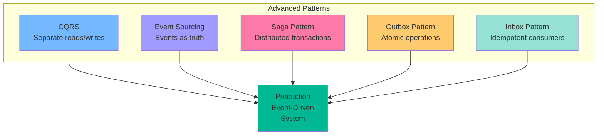
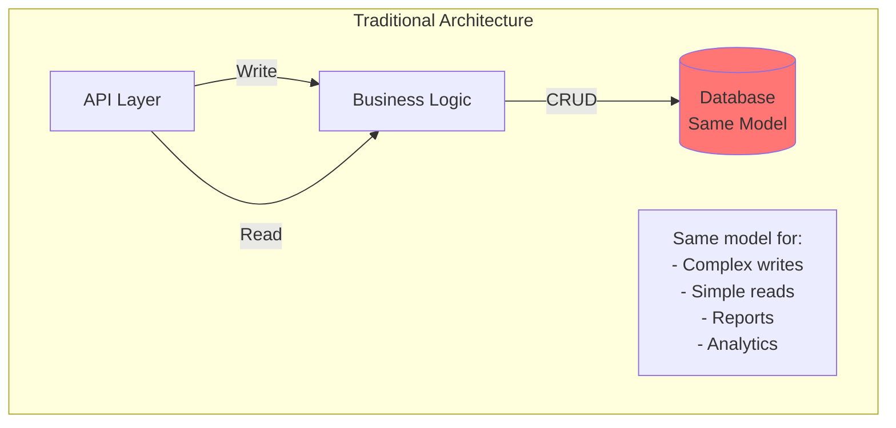
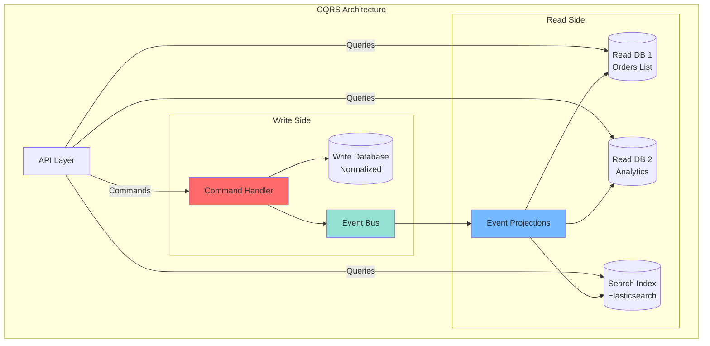
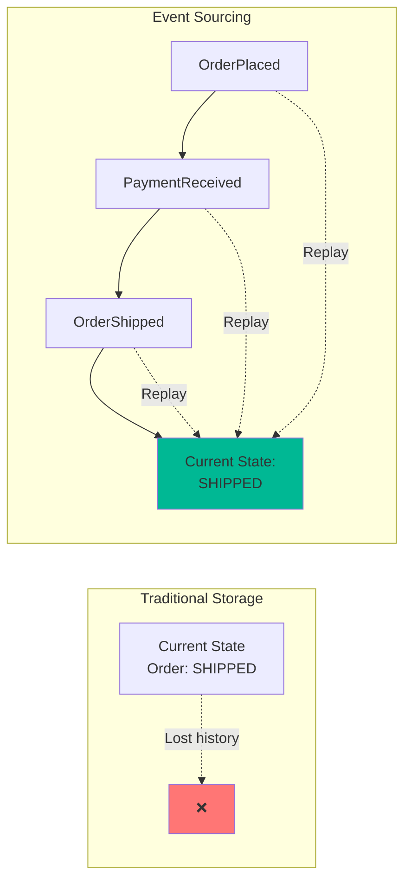
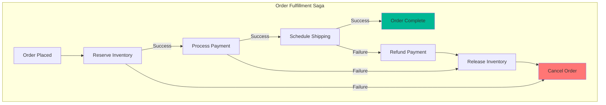
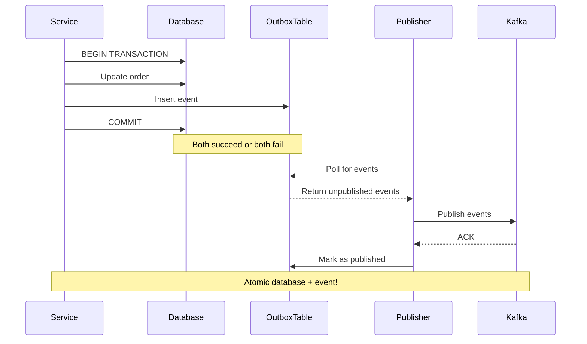

# Part 6: Advanced Event-Driven Patterns - CQRS, Event Sourcing, and Sagas

## Introduction

You've mastered Kafka and built event-driven systems. Now let's explore advanced architectural patterns that leverage events to build sophisticated, scalable applications.

**What we'll cover:**
- CQRS (Command Query Responsibility Segregation)
- Event Sourcing as a paradigm shift
- Saga Pattern for distributed transactions
- Outbox and Inbox patterns for reliability
- How these patterns work together



## CQRS (Command Query Responsibility Segregation)

### The Problem with Single Models

Traditional applications use the same data model for everything - writing new orders, displaying order lists, generating reports, and powering analytics dashboards. This creates a fundamental tension:



**Writes need:**
- Normalized data for consistency
- Business rule enforcement
- Transaction boundaries
- Simple, focused models

**Reads need:**
- Denormalized data for performance
- Pre-joined data to avoid complex queries
- Multiple specialized views for different use cases
- Caching and optimization

Trying to serve both needs with one model is like using a Swiss Army knife for surgery. It can technically work, but you're better off with specialized tools.

### CQRS Solution

**Command Query Responsibility Segregation** means exactly what it says: separate the responsibility for commands (writes) from queries (reads).



### CQRS Implementation

**Write Side (Commands):**
- Receives commands expressing intent: "Place this order", "Cancel that shipment"
- Validates business rules
- Updates the write database (normalized, transactional)
- Publishes events describing what happened

**Read Side (Queries):**
- Listens to events from the write side
- Builds specialized read models optimized for specific queries
- Can use different databases for different needs (MongoDB for documents, Elasticsearch for search, Redis for caching)
- Serves queries fast without impacting writes

### Why This Works

When a customer places an order:

1. **Command Handler** validates the order, saves it to the write database, and publishes "OrderPlaced" event
2. **Multiple Projections** listen to this event:
   - **Order List projection** adds a summary to MongoDB for the customer dashboard
   - **Analytics projection** updates daily sales totals in PostgreSQL
   - **Search projection** indexes the order in Elasticsearch for admin searches
   - **Notification projection** triggers email confirmation

Each read model is purpose-built for its specific use case. Your customer dashboard queries don't compete with your analytics reports. Your search system doesn't slow down order placement.

### The Trade-Off: Eventual Consistency

The catch? Your read models aren't updated instantly. There's a small delay (usually milliseconds to seconds) between writing an order and seeing it in all read views. This is called **eventual consistency**.

For most business cases, this is fine—even preferable. When you click "Place Order" on Amazon, the confirmation page can say "Order received!" before every microservice has finished updating. The order *will* appear in your order history shortly.

**When NOT to use CQRS:**
- Simple CRUD applications
- When you need immediate read-after-write consistency
- Small applications where the complexity outweighs the benefits

### CQRS Benefits

✅ **Scalability** - Scale reads and writes independently  
✅ **Performance** - Optimize each side separately  
✅ **Flexibility** - Multiple read models for different use cases  
✅ **Simplicity** - Each model focused on its purpose  

### CQRS Challenges

⚠️ **Complexity** - More moving parts  
⚠️ **Eventual Consistency** - Reads lag behind writes  
⚠️ **Data Duplication** - Multiple copies of data  

## Event Sourcing Deep Dive

Event Sourcing: Store all changes as a sequence of events. Current state = replay all events.



<a id="a-paradigm-shift-events-before-models"></a>
### A Paradigm Shift: Events Before Models

Event Sourcing is not mainly about objects, aggregates, or persistence tricks. It is about treating software as a system that remembers its experiences as a stream of events, and only then builds whatever models it needs on top.

**Events before models**

Most explanations frame Event Sourcing as "storing every change to state," usually tied to a domain model and a persistence pattern. In this view, events are diffs on objects, and the main benefit is a perfect audit log or the ability to rebuild state. That is useful, but it is not the most interesting part.

A broader view is: events are descriptions of things that happened, independent of any particular object model. They are traces of what the system perceived and did. The system can later construct many different models from those experiences, instead of betting everything on a single "correct" domain model decided up front.

**The single-model trap**

Traditional software design tries to squeeze reality into one coherent, durable data model that should work now and stay flexible for an unknown future. This "single model fallacy" feels efficient at first but tends to calcify; changing the model becomes harder with every feature and migration.

This mirrors a more "platonic" mindset: assuming there is one true model of the world to discover and encode. Constructivist thinking instead says that each observer builds its own models from experience, and those models are always partial and revisable. Event Sourcing fits this: first collect experiences (events), then build and rebuild models as needed.

**ES as a first worldview**

Imagine if developers learned from day one that a system is an organism reacting to stimuli, recording its experiences as events, and deriving temporary, replaceable models from that history. CRUD databases, aggregates, projections, microservices, and specialized data models would then be optimizations on top of the event stream, not the foundation.

In that worldview, pluralism is normal: one event stream, many read models, many ways of looking at the same history. Software becomes more about evolving behavior in a changing environment, less about defending a single schema.

**What "ES-first" really means**

"ES-first" does not mean throwing away OOP, FP, SQL, NoSQL, or monoliths. It means:

- Events are the primary source of truth; models are secondary, derived, and disposable.
- The system expects to build new models from the same events as requirements, insights, and environments change.
- Your main job is to create valuable behavior, not to freeze the world into one perfect schema.

That is why Event Sourcing feels less like a persistence pattern and more like a paradigm shift: from monolithic models to, experience-first software.

### How It Works

Instead of storing your order as:
```
Order #123: Status = SHIPPED, Total = $299, Items = 3
```

You store the history:
```
Event 1: OrderCreated (customer: Alice, items: [laptop, mouse])
Event 2: ItemAdded (item: keyboard, price: $49)
Event 3: PaymentReceived (amount: $299, method: credit_card)
Event 4: OrderShipped (tracking: 1Z999AA1)
```

Your current state? Replay all the events. Want to see what the order looked like yesterday? Replay events up to yesterday. Need a new report? Build a new projection from the same events.

### The Power: Time Travel and Flexibility

**Time Travel:** "Show me what this customer's order history looked like on Black Friday" → Replay events up to that date.

**New Insights:** "We need a report of all cancelled orders with reasons" → Build a new projection from existing events, no database migration needed.

**Complete Audit Trail:** Every change is recorded with who, what, when, and why. Perfect for regulated industries.

**Debugging:** "What happened to order #123?" → Read the event stream: created, payment failed, customer added new card, payment succeeded, shipped.

### Events Before Models: The Real Insight

The traditional approach asks: "What's the right data model?" Event Sourcing asks: "What happened?"

Models are temporary. Business needs change. Reports evolve. Event Sourcing lets you rebuild models as needed while keeping the raw truth: the events themselves.

**This is why Event Sourcing feels less like a persistence pattern and more like a paradigm shift.** You're not just changing how you store data—you're changing how you think about state, time, and truth in your system.

### The Practical Side: Snapshots

Replaying 10 million events every time you load an order? That's slow. Solution: **snapshots**.

Every 100 (or 1000) events, save a snapshot of the current state. Then replay only events since the last snapshot. Like bookmarks in a long book.

### When to Use Event Sourcing

**Great for:**
- Audit-heavy domains (finance, healthcare, legal)
- Complex business domains where history matters
- Systems that need time-travel queries
- Applications with evolving reporting needs

**Avoid when:**
- Simple CRUD is enough
- You can't tolerate the complexity
- Your team isn't ready for the mindset shift

### Complete Event Sourcing Implementation

> **📚 Hands-On Guide:** For a complete step-by-step walkthrough demonstrating event sourcing with Kafka, see the [Event Sourcing Pattern Demonstration](https://github.com/tomakazoo/kafka-event-driven-architecture/blob/release/examples/06-event-sourcing/dotnet/STEP-BY-STEP.md) guide. This practical tutorial walks you through:
> - **OrderService**: Creating orders and watching events flow to Kafka
> - **EventReplay**: Observing state rebuilding by replaying events step-by-step
> - **TimeTravel**: Querying historical order state at any point in time
> - **Kafka UI**: Visualizing events stored in Kafka with complete audit trails
> 
> The guide demonstrates key concepts: events as the source of truth, state rebuilding through event replay, version tracking for concurrency control, and time-travel queries. You'll see exactly how Kafka stores immutable events and how aggregates rebuild their state by replaying the event stream.

## Sagas: Distributed Transactions That Actually Work

### The Distributed Transaction Problem

Sagas manage distributed transactions across multiple services.


You have three microservices: Inventory, Payment, and Shipping. A customer places an order. You need to:

1. Reserve inventory
2. Charge payment
3. Schedule shipping

Each step must succeed for the order to complete. If payment fails after you've reserved inventory, you need to release that inventory back.

Traditional solution? A distributed transaction with two-phase commit. Reality? That doesn't scale and creates tight coupling.

### The Saga Solution

A **Saga** is a sequence of local transactions, where each transaction updates one service and publishes an event. If a step fails, **compensating transactions** undo the previous steps.

Think of it like planning a trip:
1. Book flight ✓
2. Book hotel ✓
3. Book rental car ✗ (failed!)
4. **Compensation:** Cancel hotel
5. **Compensation:** Cancel flight

> **📚 Hands-On Guide:** For complete working examples of both Choreography and Orchestration patterns, see the [Saga Pattern Examples Guide](https://github.com/tomakazoo/kafka-event-driven-architecture/blob/release/examples/06-saga/dotnet/HOW-TO-RUN.md). The guide includes:
> - **Choreography Example**: Services coordinating autonomously via events (Order → Inventory → Payment flow)
> - **Orchestration Example**: Central saga orchestrator managing all steps and compensations
> - **Persistence Example**: Saga state persistence for recovery after crashes
> 
> Each example demonstrates compensating transactions, state tracking, and how to handle failures gracefully. You'll see the complete flow from order placement through inventory reservation, payment processing, and shipping scheduling.

### Two Approaches: Choreography vs Orchestration
**Choreography (Event-Driven):** Each service knows what to do when it sees an event. No central coordinator.

```
OrderService: Publishes "OrderPlaced"
  ↓
InventoryService: Hears "OrderPlaced" → Reserves items → Publishes "InventoryReserved"
  ↓
PaymentService: Hears "InventoryReserved" → Charges customer → Publishes "PaymentReceived"
  ↓
ShippingService: Hears "PaymentReceived" → Schedules delivery
```

**If payment fails:**
```
PaymentService: Publishes "PaymentFailed"
  ↓
InventoryService: Hears "PaymentFailed" → Releases inventory
```

**Pros:** Loose coupling, no single point of failure  
**Cons:** Hard to understand the full workflow, difficult to track saga state

Services react to events independently:

**Orchestration (Centralized):** One orchestrator tells each service what to do.

```
SagaOrchestrator for Order #123:
  Step 1: Call InventoryService.Reserve() → Success
  Step 2: Call PaymentService.Charge() → Failed!
  Compensation: Call InventoryService.Release()
  Result: Saga failed, order cancelled
```

**Pros:** Clear workflow, easy to track, easier to debug  
**Cons:** Orchestrator is a single point of failure, more coupling

### Choosing Your Approach

**Use Choreography when:**
- Services need to remain highly independent
- Multiple sagas might be triggered by the same event
- You want maximum scalability and resilience

**Use Orchestration when:**
- You need clear visibility into saga state
- The workflow is complex with many steps
- You need timeout handling and retry logic

### The Critical Detail: Saga State

Sagas aren't fire-and-forget. You need to track state:
- Which steps completed?
- Which compensations to run if something fails?
- Is the saga still running or stuck?

Store saga state in a database. If your orchestrator crashes mid-saga, you can recover and continue or compensate.

---

## Outbox Pattern: Atomic Database + Events

Problem: How to atomically update database AND publish event?


### The Dual-Write Problem

You need to do two things atomically:
1. Save an order to the database
2. Publish "OrderPlaced" event to Kafka

**The naive approach:**
```
db.Save(order);
kafka.Publish("OrderPlaced", order);
```

**What goes wrong:**
- Database succeeds, Kafka fails → Event is lost, other services never see the order
- Kafka succeeds, database fails → Event published for an order that doesn't exist

You can't use a database transaction to cover both—Kafka isn't transactional.

### The Outbox Solution

**Use your database to remember what to publish.**

1. **In a single database transaction:**
   - Save the order to the `orders` table
   - Save the event to the `outbox` table

2. **A separate process (Outbox Publisher):**
   - Polls the outbox table
   - Publishes unpublished events to Kafka
   - Marks them as published

**Now it's atomic:** Either both the order and outbox event are saved, or neither is. Even if Kafka is down, the event sits safely in your outbox until you can publish it.

### Why This Works

The outbox table is in your database, so it participates in your database transaction. Publishing to Kafka happens outside the transaction, which is fine—if it fails, the event remains in the outbox for retry.

**Bonus:** The outbox pattern naturally provides event ordering and retry logic.

---


## Inbox Pattern (Idempotent Consumer) read: Exactly-Once Processing

Problem: Ensure each event is processed exactly once.

### The Duplicate Event Problem

You're consuming events from Kafka. Your consumer processes "OrderPlaced", updates inventory, then crashes before committing the Kafka offset.

Kafka redelivers the event. Now you've updated inventory twice for one order.

### The Inbox Solution

**Track which events you've processed in your database.**

```
In a single database transaction:
  1. Check inbox table: Have we processed event #xyz?
  2. If yes → Skip
  3. If no → Process the event
  4. Save event ID to inbox table
```

Even if Kafka redelivers the event a hundred times, you process it exactly once.

### Why This Works

The inbox check and your business logic are in the same database transaction. Either both happen or neither happens.

**Combined with Outbox:** You get end-to-end exactly-once processing:
- Producer uses Outbox → Guarantees each event is published at least once
- Consumer uses Inbox → Guarantees each event is processed at most once
- Result: Exactly-once semantics across systems

---

## Putting It All Together: E-Commerce System

Here's how these patterns work together in a real system:

**Order Service (Write Side):**
- Uses **Event Sourcing** to track order history as events
- Uses **Outbox Pattern** to atomically save events and publish to Kafka
- Handles commands: PlaceOrder, CancelOrder, UpdateOrder

**Read Services (Query Side via CQRS):**
- **Order List Projection:** Builds a denormalized view of all orders for customer dashboard
- **Analytics Projection:** Maintains daily/weekly sales totals
- **Search Projection:** Keeps Elasticsearch index up-to-date for admin search
- All use **Inbox Pattern** to ensure exactly-once processing

**Order Fulfillment Saga:**
- Coordinates Inventory, Payment, and Shipping services
- Uses **Orchestration** for visibility and control
- Persists saga state for recovery after failures
- Implements compensating transactions for rollback

**The Flow:**

1. Customer clicks "Place Order"
2. Order Service saves event to outbox, returns confirmation
3. Outbox Publisher sends "OrderPlaced" to Kafka
4. Saga Orchestrator starts order fulfillment workflow
5. Read projections update their views (eventual consistency)
6. Each service uses Inbox to ensure exactly-once processing

**The Result:** A resilient, scalable system where:
- No event is lost (Outbox)
- No event is processed twice (Inbox)
- Complete audit trail (Event Sourcing)
- Optimized reads (CQRS)
- Distributed transactions work (Saga)

---

## Key Takeaways

1. ✅ **CQRS**: Separates models for optimal read/write performance—use when you have complex queries or need independent scaling.
2. ✅ **Event Sourcing**: Stores history as events, enabling time travel and flexible model evolution—use for audit-heavy or complex domains.
3. ✅ **Sagas**: Manage distributed transactions with compensating actions—use Choreography for loose coupling, Orchestration for control.
4. ✅ **Outbox Pattern**: Guarantees atomic database writes and event publishing—use whenever you publish events.
5. ✅ **Inbox Pattern**: Ensures exactly-once event processing—use in all consumers handling critical business logic.

These aren't just academic patterns. They're battle-tested solutions to real problems in distributed systems. Understanding when and how to apply them separates production-ready systems from prototypes.

---

## Next Steps

In [Part 7](part-07-production-operations),  we tackle the hardest part: running these systems reliably in production.
- Monitoring distributed systems
- Debugging when things go wrong
- Testing strategies for complex workflows
- Deployment patterns that minimize risk
- Incident response and recovery

You now have the patterns. Next, we learn to operate them. 🚀

