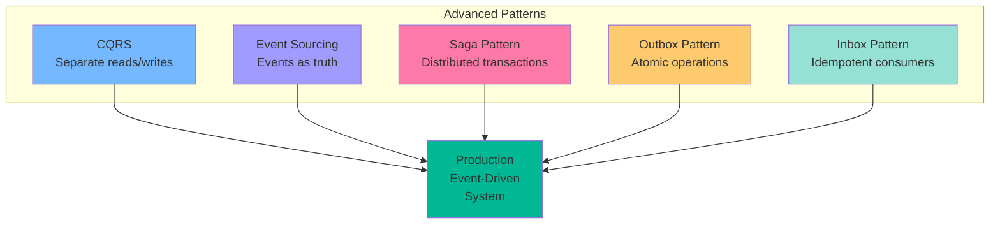
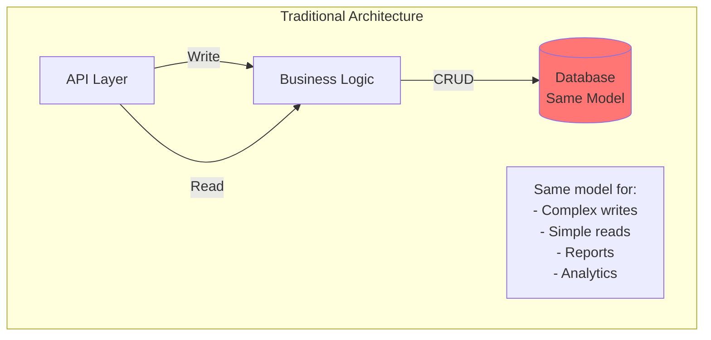
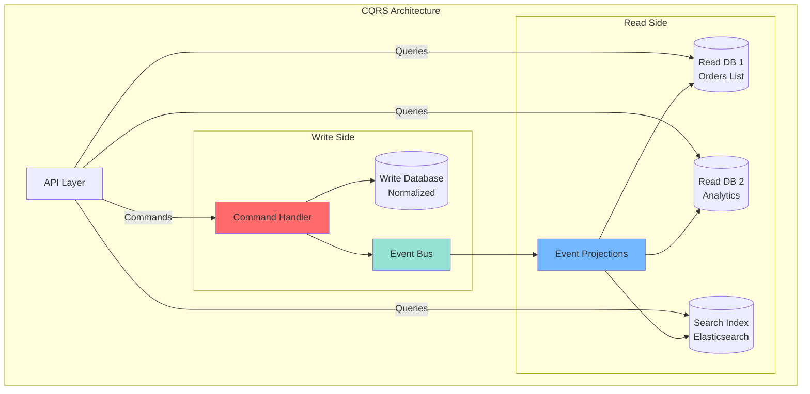
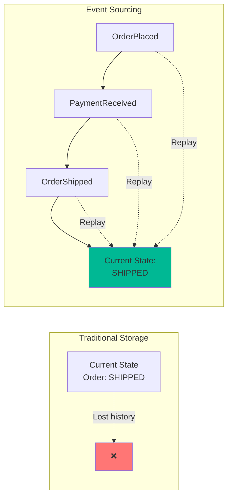
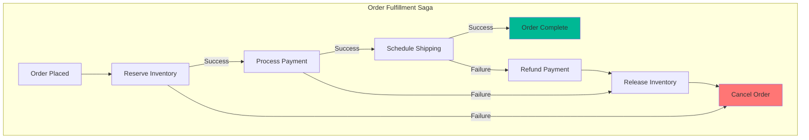
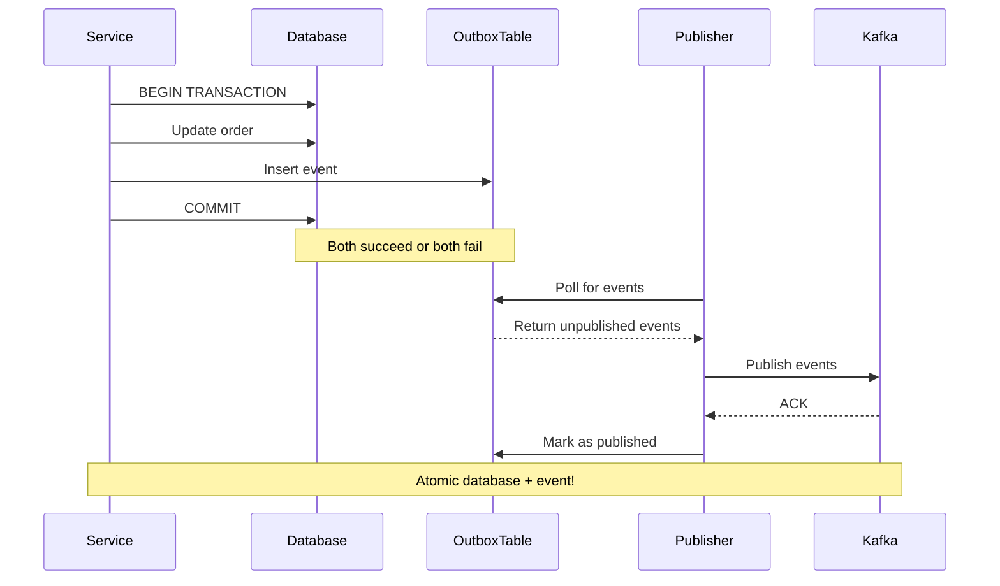

# Part 6: Advanced Event-Driven Patterns - CQRS, Event Sourcing, and Sagas

## Introduction

You've mastered Kafka and built event-driven systems. Now let's explore advanced architectural patterns that leverage events to build sophisticated, scalable applications.

**What we'll cover:**
- CQRS (Command Query Responsibility Segregation)
- Event Sourcing deep dive
- Saga Pattern (Choreography vs Orchestration)
- Outbox Pattern
- Inbox Pattern
- Complete e-commerce implementation



## CQRS (Command Query Responsibility Segregation)

### The Problem

Traditional architecture uses the same model for reads and writes:



**Problems:**
- Write model optimized for business rules
- Read model needs different shapes (joins, denormalization)
- Difficult to scale independently
- Complex queries impact write performance

### CQRS Solution

Separate models for commands (writes) and queries (reads):



### CQRS Implementation

**Write Model (Commands):**

```csharp
using System;
using System.Collections.Generic;
using System.Linq;

// Commands (intent to change state)
public record PlaceOrderCommand(
    string CustomerId,
    List<OrderItem> Items,
    ShippingAddress ShippingAddress
);

public record CancelOrderCommand(
    string OrderId,
    string Reason
);

// Events (state changes that happened)
public record OrderPlacedEvent(
    string EventId,
    string OrderId,
    string CustomerId,
    List<OrderItem> Items,
    decimal TotalAmount,
    DateTime Timestamp
);

public record OrderCancelledEvent(
    string EventId,
    string OrderId,
    string Reason,
    DateTime Timestamp
);

// Write Model (Command Handler)
public class OrderCommandHandler
{
    private readonly IOrderRepository _repository;
    private readonly IEventBus _eventBus;

    public OrderCommandHandler(IOrderRepository repository, IEventBus eventBus)
    {
        _repository = repository;
        _eventBus = eventBus;
    }

    public string HandlePlaceOrder(PlaceOrderCommand command)
    {
        // 1. Validate command
        ValidatePlaceOrder(command);
        
        // 2. Create aggregate
        var order = Order.Create(
            command.CustomerId,
            command.Items,
            command.ShippingAddress
        );
        
        // 3. Save to write database
        _repository.Save(order);
        
        // 4. Publish events
        foreach (var evt in order.UncommittedEvents)
        {
            _eventBus.Publish("orders", evt);
        }
        
        return order.OrderId;
    }

    public void HandleCancelOrder(CancelOrderCommand command)
    {
        // 1. Load order
        var order = _repository.Get(command.OrderId);
        
        if (order == null)
            throw new OrderNotFoundException(command.OrderId);
        
        // 2. Execute business logic
        order.Cancel(command.Reason);
        
        // 3. Save changes
        _repository.Save(order);
        
        // 4. Publish events
        foreach (var evt in order.UncommittedEvents)
        {
            _eventBus.Publish("orders", evt);
        }
    }

    private void ValidatePlaceOrder(PlaceOrderCommand command)
    {
        // Validation logic
    }
}

// Domain Model
public class Order
{
    public string OrderId { get; private set; }
    public string CustomerId { get; private set; }
    public List<OrderItem> Items { get; private set; }
    public string Status { get; private set; }
    public decimal TotalAmount { get; private set; }
    public List<object> UncommittedEvents { get; private set; }

    private Order()
    {
        UncommittedEvents = new List<object>();
    }

    public static Order Create(string customerId, List<OrderItem> items, ShippingAddress shippingAddress)
    {
        var order = new Order();
        order.OrderId = $"ORD-{Guid.NewGuid():N}";
        order.CustomerId = customerId;
        order.Items = items;
        order.Status = "PLACED";
        order.TotalAmount = items.Sum(item => item.Price * item.Quantity);
        
        // Record event
        var evt = new OrderPlacedEvent(
            EventId: Guid.NewGuid().ToString(),
            OrderId: order.OrderId,
            CustomerId: customerId,
            Items: items,
            TotalAmount: order.TotalAmount,
            Timestamp: DateTime.UtcNow
        );
        order.UncommittedEvents.Add(evt);
        
        return order;
    }

    public void Cancel(string reason)
    {
        if (Status == "SHIPPED" || Status == "DELIVERED")
            throw new CannotCancelOrderException("Order already shipped");
        
        Status = "CANCELLED";
        
        // Record event
        var evt = new OrderCancelledEvent(
            EventId: Guid.NewGuid().ToString(),
            OrderId: OrderId,
            Reason: reason,
            Timestamp: DateTime.UtcNow
        );
        UncommittedEvents.Add(evt);
    }
}

// Supporting types
public record OrderItem(string ProductId, int Quantity, decimal Price);
public record ShippingAddress(string Street, string City, string State, string ZipCode);
```

**Read Model (Queries):**

```csharp
using System;
using System.Collections.Generic;
using System.Linq;
using System.Threading.Tasks;
using Confluent.Kafka;
using MongoDB.Driver;
using System.Text.Json;

// Read Model 1: Order List View
public class OrderListProjection
{
    private readonly IConsumer<string, string> _consumer;
    private readonly IMongoCollection<OrderListView> _collection;

    public OrderListProjection(IConsumer<string, string> consumer, IMongoDatabase database)
    {
        _consumer = consumer;
        _consumer.Subscribe("orders");
        _collection = database.GetCollection<OrderListView>("order_list");
    }

    public async Task ProjectAsync(CancellationToken cancellationToken)
    {
        while (!cancellationToken.IsCancellationRequested)
        {
            var result = _consumer.Consume(cancellationToken);
            var eventData = JsonSerializer.Deserialize<Dictionary<string, object>>(result.Message.Value);
            
            var eventType = eventData["event_type"].ToString();
            
            if (eventType == "OrderPlaced")
            {
                await HandleOrderPlacedAsync(eventData);
            }
            else if (eventType == "OrderCancelled")
            {
                await HandleOrderCancelledAsync(eventData);
            }
        }
    }

    private async Task HandleOrderPlacedAsync(Dictionary<string, object> eventData)
    {
        var items = JsonSerializer.Deserialize<List<OrderItem>>(eventData["items"].ToString());
        
        var view = new OrderListView
        {
            OrderId = eventData["order_id"].ToString(),
            CustomerId = eventData["customer_id"].ToString(),
            TotalAmount = Convert.ToDecimal(eventData["total_amount"]),
            ItemCount = items.Count,
            Status = "PLACED",
            OrderDate = DateTime.Parse(eventData["timestamp"].ToString())
        };
        
        await _collection.InsertOneAsync(view);
    }

    private async Task HandleOrderCancelledAsync(Dictionary<string, object> eventData)
    {
        var filter = Builders<OrderListView>.Filter.Eq(o => o.OrderId, eventData["order_id"].ToString());
        var update = Builders<OrderListView>.Update
            .Set(o => o.Status, "CANCELLED")
            .Set(o => o.CancelReason, eventData["reason"].ToString());
        
        await _collection.UpdateOneAsync(filter, update);
    }
}

// Read Model 2: Order Details View
public class OrderDetailsProjection
{
    private readonly IConsumer<string, string> _consumer;
    private readonly IMongoCollection<OrderDetailsView> _collection;

    public OrderDetailsProjection(IConsumer<string, string> consumer, IMongoDatabase database)
    {
        _consumer = consumer;
        _consumer.Subscribe("orders");
        _collection = database.GetCollection<OrderDetailsView>("order_details");
    }

    public async Task HandleOrderPlacedAsync(Dictionary<string, object> eventData)
    {
        var items = JsonSerializer.Deserialize<List<OrderItem>>(eventData["items"].ToString());
        
        var view = new OrderDetailsView
        {
            OrderId = eventData["order_id"].ToString(),
            CustomerId = eventData["customer_id"].ToString(),
            Items = items,
            TotalAmount = Convert.ToDecimal(eventData["total_amount"]),
            Status = "PLACED",
            OrderDate = DateTime.Parse(eventData["timestamp"].ToString()),
            Events = new List<Dictionary<string, object>> { eventData }
        };
        
        await _collection.InsertOneAsync(view);
    }
}

// Read Model 3: Analytics View
public class OrderAnalyticsProjection
{
    private readonly IConsumer<string, string> _consumer;
    private readonly IMongoCollection<DailyAnalytics> _collection;

    public OrderAnalyticsProjection(IConsumer<string, string> consumer, IMongoDatabase database)
    {
        _consumer = consumer;
        _consumer.Subscribe("orders");
        _collection = database.GetCollection<DailyAnalytics>("analytics");
    }

    public async Task HandleOrderPlacedAsync(Dictionary<string, object> eventData)
    {
        var timestamp = DateTime.Parse(eventData["timestamp"].ToString());
        var date = timestamp.Date;
        
        var filter = Builders<DailyAnalytics>.Filter.Eq(a => a.Date, date);
        var update = Builders<DailyAnalytics>.Update
            .Inc(a => a.TotalOrders, 1)
            .Inc(a => a.TotalRevenue, Convert.ToDecimal(eventData["total_amount"]));
        
        await _collection.UpdateOneAsync(
            filter,
            update,
            new UpdateOptions { IsUpsert = true }
        );
    }
}

// Query Service
public class OrderQueryService
{
    private readonly IMongoDatabase _database;

    public OrderQueryService(IMongoDatabase database)
    {
        _database = database;
    }

    public async Task<List<OrderListView>> GetOrderListAsync(string customerId = null, int limit = 50)
    {
        var collection = _database.GetCollection<OrderListView>("order_list");
        var filter = customerId != null
            ? Builders<OrderListView>.Filter.Eq(o => o.CustomerId, customerId)
            : Builders<OrderListView>.Filter.Empty;
        
        return await collection.Find(filter)
            .Limit(limit)
            .ToListAsync();
    }

    public async Task<OrderDetailsView> GetOrderDetailsAsync(string orderId)
    {
        var collection = _database.GetCollection<OrderDetailsView>("order_details");
        var filter = Builders<OrderDetailsView>.Filter.Eq(o => o.OrderId, orderId);
        return await collection.Find(filter).FirstOrDefaultAsync();
    }

    public async Task<List<DailyAnalytics>> GetAnalyticsAsync(DateTime startDate, DateTime endDate)
    {
        var collection = _database.GetCollection<DailyAnalytics>("analytics");
        var filter = Builders<DailyAnalytics>.Filter
            .And(
                Builders<DailyAnalytics>.Filter.Gte(a => a.Date, startDate),
                Builders<DailyAnalytics>.Filter.Lte(a => a.Date, endDate)
            );
        
        return await collection.Find(filter).ToListAsync();
    }
}

// View Models
public class OrderListView
{
    public string OrderId { get; set; }
    public string CustomerId { get; set; }
    public decimal TotalAmount { get; set; }
    public int ItemCount { get; set; }
    public string Status { get; set; }
    public DateTime OrderDate { get; set; }
    public string CancelReason { get; set; }
}

public class OrderDetailsView
{
    public string OrderId { get; set; }
    public string CustomerId { get; set; }
    public List<OrderItem> Items { get; set; }
    public decimal TotalAmount { get; set; }
    public string Status { get; set; }
    public DateTime OrderDate { get; set; }
    public List<Dictionary<string, object>> Events { get; set; }
}

public class DailyAnalytics
{
    public DateTime Date { get; set; }
    public int TotalOrders { get; set; }
    public decimal TotalRevenue { get; set; }
}
```

**API Layer:**

```csharp
using Microsoft.AspNetCore.Mvc;
using System.Threading.Tasks;

[ApiController]
[Route("api/[controller]")]
public class OrdersController : ControllerBase
{
    private readonly OrderCommandHandler _commandHandler;
    private readonly OrderQueryService _queryService;

    public OrdersController(OrderCommandHandler commandHandler, OrderQueryService queryService)
    {
        _commandHandler = commandHandler;
        _queryService = queryService;
    }

    // Commands (writes)
    [HttpPost]
    public async Task<ActionResult<OrderCreatedResponse>> CreateOrder([FromBody] CreateOrderRequest request)
    {
        var command = new PlaceOrderCommand(
            CustomerId: request.CustomerId,
            Items: request.Items,
            ShippingAddress: request.ShippingAddress
        );
        
        var orderId = _commandHandler.HandlePlaceOrder(command);
        
        return Accepted(new OrderCreatedResponse { OrderId = orderId });
    }

    [HttpPost("{orderId}/cancel")]
    public async Task<ActionResult> CancelOrder(string orderId, [FromBody] CancelOrderRequest request)
    {
        var command = new CancelOrderCommand(
            OrderId: orderId,
            Reason: request.Reason ?? "Customer requested"
        );
        
        _commandHandler.HandleCancelOrder(command);
        
        return Accepted(new { status = "cancelled" });
    }

    // Queries (reads)
    [HttpGet]
    public async Task<ActionResult<List<OrderListView>>> ListOrders([FromQuery] string customerId = null)
    {
        var orders = await _queryService.GetOrderListAsync(customerId);
        return Ok(orders);
    }

    [HttpGet("{orderId}")]
    public async Task<ActionResult<OrderDetailsView>> GetOrder(string orderId)
    {
        var order = await _queryService.GetOrderDetailsAsync(orderId);
        if (order == null)
            return NotFound(new { error = "Order not found" });
        
        return Ok(order);
    }

    [HttpGet("analytics")]
    public async Task<ActionResult<List<DailyAnalytics>>> GetAnalytics(
        [FromQuery] DateTime startDate,
        [FromQuery] DateTime endDate)
    {
        var analytics = await _queryService.GetAnalyticsAsync(startDate, endDate);
        return Ok(analytics);
    }
}

// Request/Response DTOs
public record CreateOrderRequest(
    string CustomerId,
    List<OrderItem> Items,
    ShippingAddress ShippingAddress
);

public record CancelOrderRequest(string Reason);

public record OrderCreatedResponse(string OrderId);
```

### CQRS Benefits

✅ **Scalability** - Scale reads and writes independently  
✅ **Performance** - Optimize each side separately  
✅ **Flexibility** - Multiple read models for different use cases  
✅ **Simplicity** - Each model focused on its purpose  

### CQRS Challenges

⚠️ **Complexity** - More moving parts  
⚠️ **Eventual Consistency** - Reads lag behind writes  
⚠️ **Data Duplication** - Multiple copies of data  

## Event Sourcing Deep Dive

Event Sourcing: Store all changes as a sequence of events. Current state = replay all events.



### Complete Event Sourcing Implementation

```csharp
using System;
using System.Collections.Generic;
using System.Text.Json.Serialization;

// Base Event
public abstract record DomainEvent(
    string EventId,
    string AggregateId,
    string EventType,
    DateTime Timestamp,
    int Version
);

// Order Events
public record OrderCreated(
    string EventId,
    string AggregateId,
    string EventType,
    DateTime Timestamp,
    int Version,
    string CustomerId
) : DomainEvent(EventId, AggregateId, EventType, Timestamp, Version);

public record ItemAdded(
    string EventId,
    string AggregateId,
    string EventType,
    DateTime Timestamp,
    int Version,
    string ProductId,
    int Quantity,
    decimal Price
) : DomainEvent(EventId, AggregateId, EventType, Timestamp, Version);

public record ItemRemoved(
    string EventId,
    string AggregateId,
    string EventType,
    DateTime Timestamp,
    int Version,
    string ProductId
) : DomainEvent(EventId, AggregateId, EventType, Timestamp, Version);

public record ShippingAddressSet(
    string EventId,
    string AggregateId,
    string EventType,
    DateTime Timestamp,
    int Version,
    Dictionary<string, string> Address
) : DomainEvent(EventId, AggregateId, EventType, Timestamp, Version);

public record OrderSubmitted(
    string EventId,
    string AggregateId,
    string EventType,
    DateTime Timestamp,
    int Version
) : DomainEvent(EventId, AggregateId, EventType, Timestamp, Version);

public record PaymentReceived(
    string EventId,
    string AggregateId,
    string EventType,
    DateTime Timestamp,
    int Version,
    string PaymentId,
    decimal Amount
) : DomainEvent(EventId, AggregateId, EventType, Timestamp, Version);

public record OrderShipped(
    string EventId,
    string AggregateId,
    string EventType,
    DateTime Timestamp,
    int Version,
    string TrackingNumber
) : DomainEvent(EventId, AggregateId, EventType, Timestamp, Version);

// Aggregate Root
public class Order
{
    public string OrderId { get; private set; }
    public string CustomerId { get; private set; }
    public List<OrderItem> Items { get; private set; }
    public Dictionary<string, string> ShippingAddress { get; private set; }
    public string Status { get; private set; }
    public int Version { get; private set; }
    public List<DomainEvent> UncommittedEvents { get; private set; }

    private Order(string orderId)
    {
        OrderId = orderId;
        Items = new List<OrderItem>();
        UncommittedEvents = new List<DomainEvent>();
        Version = 0;
    }

    // Commands
    public static Order Create(string orderId, string customerId)
    {
        var order = new Order(orderId);
        var evt = new OrderCreated(
            EventId: Guid.NewGuid().ToString(),
            AggregateId: orderId,
            EventType: "OrderCreated",
            Timestamp: DateTime.UtcNow,
            Version: 1,
            CustomerId: customerId
        );
        
        order.Apply(evt);
        order.UncommittedEvents.Add(evt);
        
        return order;
    }

    public void AddItem(string productId, int quantity, decimal price)
    {
        if (Status == "SUBMITTED")
            throw new InvalidOperationException("Cannot modify submitted order");
        
        var evt = new ItemAdded(
            EventId: Guid.NewGuid().ToString(),
            AggregateId: OrderId,
            EventType: "ItemAdded",
            Timestamp: DateTime.UtcNow,
            Version: Version + 1,
            ProductId: productId,
            Quantity: quantity,
            Price: price
        );
        
        Apply(evt);
        UncommittedEvents.Add(evt);
    }

    public void SetShippingAddress(Dictionary<string, string> address)
    {
        var evt = new ShippingAddressSet(
            EventId: Guid.NewGuid().ToString(),
            AggregateId: OrderId,
            EventType: "ShippingAddressSet",
            Timestamp: DateTime.UtcNow,
            Version: Version + 1,
            Address: address
        );
        
        Apply(evt);
        UncommittedEvents.Add(evt);
    }

    public void Submit()
    {
        if (!Items.Any())
            throw new InvalidOperationException("Cannot submit empty order");
        if (ShippingAddress == null)
            throw new InvalidOperationException("Shipping address required");
        
        var evt = new OrderSubmitted(
            EventId: Guid.NewGuid().ToString(),
            AggregateId: OrderId,
            EventType: "OrderSubmitted",
            Timestamp: DateTime.UtcNow,
            Version: Version + 1
        );
        
        Apply(evt);
        UncommittedEvents.Add(evt);
    }

    // Event Handlers (apply events to rebuild state)
    private void Apply(DomainEvent evt)
    {
        switch (evt)
        {
            case OrderCreated e:
                CustomerId = e.CustomerId;
                Status = "CREATED";
                break;
            
            case ItemAdded e:
                Items.Add(new OrderItem(e.ProductId, e.Quantity, e.Price));
                break;
            
            case ItemRemoved e:
                Items.RemoveAll(i => i.ProductId == e.ProductId);
                break;
            
            case ShippingAddressSet e:
                ShippingAddress = e.Address;
                break;
            
            case OrderSubmitted:
                Status = "SUBMITTED";
                break;
            
            case PaymentReceived:
                Status = "PAID";
                break;
            
            case OrderShipped:
                Status = "SHIPPED";
                break;
        }
        
        Version = evt.Version;
    }

    public void LoadFromHistory(IEnumerable<DomainEvent> events)
    {
        foreach (var evt in events)
        {
            Apply(evt);
        }
    }
}

// Event Store
public class EventStore
{
    private readonly Dictionary<string, List<DomainEvent>> _events = new();
    private readonly Dictionary<string, Snapshot> _snapshots = new();
    private readonly IEventPublisher _publisher;

    public EventStore(IEventPublisher publisher)
    {
        _publisher = publisher;
    }

    public int SaveEvents(string aggregateId, List<DomainEvent> events, int expectedVersion)
    {
        if (!_events.ContainsKey(aggregateId))
            _events[aggregateId] = new List<DomainEvent>();
        
        // Check version (optimistic locking)
        var currentVersion = _events[aggregateId].Count;
        if (currentVersion != expectedVersion)
            throw new ConcurrencyException(
                $"Expected version {expectedVersion}, but current is {currentVersion}"
            );
        
        // Append events
        _events[aggregateId].AddRange(events);
        
        // Publish to event bus
        foreach (var evt in events)
        {
            _publisher.PublishAsync("order-events", evt);
        }
        
        return _events[aggregateId].Count;
    }

    public List<DomainEvent> GetEvents(string aggregateId, int fromVersion = 0)
    {
        if (!_events.ContainsKey(aggregateId))
            return new List<DomainEvent>();
        
        return _events[aggregateId].Skip(fromVersion).ToList();
    }

    public void SaveSnapshot(string aggregateId, Dictionary<string, object> snapshot, int version)
    {
        _snapshots[aggregateId] = new Snapshot
        {
            State = snapshot,
            Version = version,
            Timestamp = DateTime.UtcNow
        };
    }

    public Snapshot GetSnapshot(string aggregateId)
    {
        return _snapshots.ContainsKey(aggregateId) ? _snapshots[aggregateId] : null;
    }
}

public class Snapshot
{
    public Dictionary<string, object> State { get; set; }
    public int Version { get; set; }
    public DateTime Timestamp { get; set; }
}

// Repository
public class OrderRepository
{
    private readonly EventStore _eventStore;

    public OrderRepository(EventStore eventStore)
    {
        _eventStore = eventStore;
    }

    public void Save(Order order)
    {
        if (!order.UncommittedEvents.Any())
            return;
        
        _eventStore.SaveEvents(
            order.OrderId,
            order.UncommittedEvents,
            order.Version - order.UncommittedEvents.Count
        );
        
        order.UncommittedEvents.Clear();
        
        // Save snapshot every 100 events
        if (order.Version % 100 == 0)
        {
            _eventStore.SaveSnapshot(
                order.OrderId,
                new Dictionary<string, object>
                {
                    ["customer_id"] = order.CustomerId,
                    ["items"] = order.Items,
                    ["shipping_address"] = order.ShippingAddress,
                    ["status"] = order.Status
                },
                order.Version
            );
        }
    }

    public Order Get(string orderId)
    {
        var order = new Order(orderId);
        
        // Try to load from snapshot
        var snapshot = _eventStore.GetSnapshot(orderId);
        
        List<DomainEvent> events;
        if (snapshot != null)
        {
            // Load snapshot state (in a real implementation, you'd restore properties properly)
            var items = ((List<object>)snapshot.State["items"])
                .Cast<Dictionary<string, object>>()
                .Select(i => new OrderItem(
                    i["product_id"].ToString(),
                    Convert.ToInt32(i["quantity"]),
                    Convert.ToDecimal(i["price"])
                ))
                .ToList();
            
            order.Items = items;
            order.CustomerId = snapshot.State["customer_id"].ToString();
            order.ShippingAddress = (Dictionary<string, string>)snapshot.State["shipping_address"];
            order.Status = snapshot.State["status"].ToString();
            order.Version = snapshot.Version;
            
            // Load events since snapshot
            events = _eventStore.GetEvents(orderId, snapshot.Version);
        }
        else
        {
            // Load all events
            events = _eventStore.GetEvents(orderId);
        }
        
        // Replay events
        order.LoadFromHistory(events);
        
        return order;
    }
}

// Usage
var eventStore = new EventStore(publisher);
var repository = new OrderRepository(eventStore);

// Create and modify order
var order = Order.Create("ORD-123", "CUST-456");
order.AddItem("PROD-001", 2, 29.99m);
order.AddItem("PROD-002", 1, 49.99m);
order.SetShippingAddress(new Dictionary<string, string>
{
    ["street"] = "123 Main St",
    ["city"] = "Boston",
    ["state"] = "MA"
});
order.Submit();

repository.Save(order);

// Later, load order (rebuilds from events)
var loadedOrder = repository.Get("ORD-123");
Console.WriteLine($"Status: {loadedOrder.Status}");  // SUBMITTED
Console.WriteLine($"Items: {loadedOrder.Items.Count}");  // 2
```

### Time Travel with Event Sourcing

```csharp
public Order GetOrderAtTimestamp(string orderId, DateTime timestamp)
{
    // See order state at specific point in time
    var allEvents = _eventStore.GetEvents(orderId);
    
    // Filter events before timestamp
    var historicalEvents = allEvents
        .Where(e => e.Timestamp <= timestamp)
        .ToList();
    
    // Rebuild historical state
    var order = new Order(orderId);
    order.LoadFromHistory(historicalEvents);
    
    return order;
}

// What did the order look like yesterday?
var yesterday = DateTime.UtcNow.AddDays(-1);
var orderYesterday = GetOrderAtTimestamp("ORD-123", yesterday);
```

## Saga Pattern

Sagas manage distributed transactions across multiple services.



### Choreography (Event-Driven)

Services react to events independently:

```csharp
// Order Service
public class OrderService
{
    private readonly IOrderRepository _repository;
    private readonly IEventPublisher _eventPublisher;

    public OrderService(IOrderRepository repository, IEventPublisher eventPublisher)
    {
        _repository = repository;
        _eventPublisher = eventPublisher;
    }

    public void PlaceOrder(Order order)
    {
        // 1. Save order
        _repository.Save(order);
        
        // 2. Publish event
        _eventPublisher.PublishAsync("order-events", new OrderPlacedEvent(order));
    }
}

// Inventory Service
public class InventoryService
{
    private readonly IConsumer<string, string> _consumer;
    private readonly IEventPublisher _eventPublisher;

    public InventoryService(IConsumer<string, string> consumer, IEventPublisher eventPublisher)
    {
        _consumer = consumer;
        _consumer.Subscribe("order-events");
        _eventPublisher = eventPublisher;
    }

    public async Task ConsumeEventsAsync(CancellationToken cancellationToken)
    {
        while (!cancellationToken.IsCancellationRequested)
        {
            var result = _consumer.Consume(cancellationToken);
            var eventData = JsonSerializer.Deserialize<Dictionary<string, object>>(result.Message.Value);
            var eventType = eventData["type"].ToString();
            
            if (eventType == "OrderPlaced")
            {
                await HandleOrderPlacedAsync(eventData);
            }
            else if (eventType == "PaymentFailed")
            {
                await HandlePaymentFailedAsync(eventData);
            }
        }
    }

    private async Task HandleOrderPlacedAsync(Dictionary<string, object> eventData)
    {
        try
        {
            // Reserve inventory
            var orderId = eventData["order_id"].ToString();
            var items = JsonSerializer.Deserialize<List<OrderItem>>(eventData["items"].ToString());
            await ReserveInventoryAsync(orderId, items);
            
            // Publish success
            await _eventPublisher.PublishAsync("order-events", new InventoryReservedEvent(orderId));
        }
        catch (InsufficientInventoryException)
        {
            // Publish failure
            await _eventPublisher.PublishAsync("order-events", 
                new InventoryReservationFailedEvent(eventData["order_id"].ToString()));
        }
    }

    private async Task HandlePaymentFailedAsync(Dictionary<string, object> eventData)
    {
        // Compensating transaction
        await ReleaseInventoryAsync(eventData["order_id"].ToString());
    }

    private Task ReserveInventoryAsync(string orderId, List<OrderItem> items) => Task.CompletedTask;
    private Task ReleaseInventoryAsync(string orderId) => Task.CompletedTask;
}

// Payment Service
public class PaymentService
{
    private readonly IConsumer<string, string> _consumer;
    private readonly IEventPublisher _eventPublisher;

    public PaymentService(IConsumer<string, string> consumer, IEventPublisher eventPublisher)
    {
        _consumer = consumer;
        _consumer.Subscribe("order-events");
        _eventPublisher = eventPublisher;
    }

    public async Task ConsumeEventsAsync(CancellationToken cancellationToken)
    {
        while (!cancellationToken.IsCancellationRequested)
        {
            var result = _consumer.Consume(cancellationToken);
            var eventData = JsonSerializer.Deserialize<Dictionary<string, object>>(result.Message.Value);
            var eventType = eventData["type"].ToString();
            
            if (eventType == "InventoryReserved")
            {
                await HandleInventoryReservedAsync(eventData);
            }
        }
    }

    private async Task HandleInventoryReservedAsync(Dictionary<string, object> eventData)
    {
        try
        {
            // Process payment
            var orderId = eventData["order_id"].ToString();
            await ChargeCustomerAsync(orderId);
            
            // Publish success
            await _eventPublisher.PublishAsync("order-events", new PaymentReceivedEvent(orderId));
        }
        catch (PaymentException)
        {
            // Publish failure (triggers inventory rollback)
            await _eventPublisher.PublishAsync("order-events", 
                new PaymentFailedEvent(eventData["order_id"].ToString()));
        }
    }

    private Task ChargeCustomerAsync(string orderId) => Task.CompletedTask;
}

// Event records
public record OrderPlacedEvent(Order Order);
public record InventoryReservedEvent(string OrderId);
public record InventoryReservationFailedEvent(string OrderId);
public record PaymentReceivedEvent(string OrderId);
public record PaymentFailedEvent(string OrderId);
```

### Orchestration (Centralized)

Central orchestrator manages the saga:

```csharp
public class OrderFulfillmentSaga
{
    private readonly string _orderId;
    private readonly IInventoryService _inventoryService;
    private readonly IPaymentService _paymentService;
    private readonly IShippingService _shippingService;
    private readonly IEventPublisher _eventPublisher;
    
    private string _state = "STARTED";
    private readonly List<Func<Task>> _compensations = new();

    public OrderFulfillmentSaga(
        string orderId,
        IInventoryService inventoryService,
        IPaymentService paymentService,
        IShippingService shippingService,
        IEventPublisher eventPublisher)
    {
        _orderId = orderId;
        _inventoryService = inventoryService;
        _paymentService = paymentService;
        _shippingService = shippingService;
        _eventPublisher = eventPublisher;
    }

    public async Task<ShippingResult> ExecuteAsync(OrderRequest orderRequest)
    {
        try
        {
            // Step 1: Reserve Inventory
            var inventoryResult = await _inventoryService.ReserveAsync(orderRequest.Items);
            _compensations.Add(() => _inventoryService.ReleaseAsync(inventoryResult.ReservationId));
            
            // Step 2: Process Payment
            var paymentResult = await _paymentService.ChargeAsync(
                orderRequest.CustomerId,
                orderRequest.Amount
            );
            _compensations.Add(() => _paymentService.RefundAsync(paymentResult.PaymentId));
            
            // Step 3: Schedule Shipping
            var shippingResult = await _shippingService.ScheduleAsync(orderRequest.ShippingAddress);
            // No compensation for shipping (can't un-ship)
            
            // Saga succeeded
            _state = "COMPLETED";
            await _eventPublisher.PublishAsync("order-events", new OrderFulfilledEvent(_orderId));
            
            return shippingResult;
        }
        catch (Exception ex)
        {
            // Saga failed - run compensations
            await CompensateAsync();
            _state = "FAILED";
            await _eventPublisher.PublishAsync("order-events", 
                new OrderFailedEvent(_orderId, ex.Message));
            throw;
        }
    }

    private async Task CompensateAsync()
    {
        // Run compensating transactions in reverse order
        for (int i = _compensations.Count - 1; i >= 0; i--)
        {
            try
            {
                await _compensations[i]();
            }
            catch (Exception ex)
            {
                // Log and continue with other compensations
                Console.WriteLine($"Compensation failed: {ex.Message}");
            }
        }
    }
}

// Saga Orchestrator
public class SagaOrchestrator
{
    private readonly Dictionary<string, OrderFulfillmentSaga> _activeSagas = new();

    public async Task<ShippingResult> StartOrderSagaAsync(OrderRequest orderRequest)
    {
        var saga = new OrderFulfillmentSaga(
            orderRequest.OrderId,
            inventoryService,
            paymentService,
            shippingService,
            eventPublisher
        );
        
        _activeSagas[orderRequest.OrderId] = saga;
        
        try
        {
            return await saga.ExecuteAsync(orderRequest);
        }
        finally
        {
            _activeSagas.Remove(orderRequest.OrderId);
        }
    }
}

// Supporting types
public record OrderRequest(string OrderId, string CustomerId, List<OrderItem> Items, 
    decimal Amount, ShippingAddress ShippingAddress);
public record InventoryResult(string ReservationId);
public record PaymentResult(string PaymentId);
public record ShippingResult(string TrackingNumber);
public record OrderFulfilledEvent(string OrderId);
public record OrderFailedEvent(string OrderId, string Reason);
```

### Saga State Persistence

```csharp
public enum SagaState
{
    Started,
    InventoryReserved,
    PaymentProcessed,
    ShippingScheduled,
    Completed,
    Failed,
    Compensating
}

public class PersistentSaga
{
    private readonly string _sagaId;
    private readonly ISagaRepository _repository;
    
    public SagaState State { get; private set; }
    public List<string> StepsCompleted { get; private set; }
    public Dictionary<string, object> CompensationData { get; private set; }

    public PersistentSaga(string sagaId, ISagaRepository repository)
    {
        _sagaId = sagaId;
        _repository = repository;
        State = SagaState.Started;
        StepsCompleted = new List<string>();
        CompensationData = new Dictionary<string, object>();
    }

    public void TransitionTo(SagaState newState)
    {
        // Persist state transition
        State = newState;
        _repository.UpdateSaga(_sagaId, new SagaData
        {
            State = newState.ToString(),
            StepsCompleted = StepsCompleted,
            CompensationData = CompensationData
        });
    }

    public void RecordStep(string stepName, object data)
    {
        // Record completed step
        StepsCompleted.Add(stepName);
        CompensationData[stepName] = data;
        _repository.UpdateSaga(_sagaId, new SagaData
        {
            State = State.ToString(),
            StepsCompleted = StepsCompleted,
            CompensationData = CompensationData
        });
    }

    public static PersistentSaga Recover(string sagaId, ISagaRepository repository)
    {
        // Recover saga from database
        var sagaData = repository.GetSaga(sagaId);
        var saga = new PersistentSaga(sagaId, repository);
        saga.State = Enum.Parse<SagaState>(sagaData.State);
        saga.StepsCompleted = sagaData.StepsCompleted;
        saga.CompensationData = sagaData.CompensationData;
        return saga;
    }
}

public class SagaData
{
    public string State { get; set; }
    public List<string> StepsCompleted { get; set; }
    public Dictionary<string, object> CompensationData { get; set; }
}

public interface ISagaRepository
{
    SagaData GetSaga(string sagaId);
    void UpdateSaga(string sagaId, SagaData data);
}
```

## Outbox Pattern

Problem: How to atomically update database AND publish event?



### Implementation

```csharp
using Microsoft.EntityFrameworkCore;
using System.ComponentModel.DataAnnotations;
using System.ComponentModel.DataAnnotations.Schema;

[Table("outbox")]
public class OutboxEvent
{
    [Key]
    [Column("event_id")]
    public string EventId { get; set; }
    
    [Required]
    [Column("aggregate_type")]
    public string AggregateType { get; set; }
    
    [Required]
    [Column("aggregate_id")]
    public string AggregateId { get; set; }
    
    [Required]
    [Column("event_type")]
    public string EventType { get; set; }
    
    [Required]
    [Column("payload")]
    public string Payload { get; set; }
    
    [Column("created_at")]
    public DateTime CreatedAt { get; set; } = DateTime.UtcNow;
    
    [Column("published")]
    public bool Published { get; set; } = false;
    
    [Column("published_at")]
    public DateTime? PublishedAt { get; set; }
}

// Order Service with Outbox
public class OrderService
{
    private readonly ApplicationDbContext _context;

    public OrderService(ApplicationDbContext context)
    {
        _context = context;
    }

    public async Task<string> PlaceOrderAsync(OrderData orderData)
    {
        using var transaction = await _context.Database.BeginTransactionAsync();
        try
        {
            // 1. Save order to database
            var order = new Order
            {
                OrderId = Guid.NewGuid().ToString(),
                CustomerId = orderData.CustomerId,
                TotalAmount = orderData.TotalAmount
            };
            _context.Orders.Add(order);
            
            // 2. Save event to outbox (same transaction!)
            var outboxEvent = new OutboxEvent
            {
                EventId = Guid.NewGuid().ToString(),
                AggregateType = "Order",
                AggregateId = order.OrderId,
                EventType = "OrderPlaced",
                Payload = JsonSerializer.Serialize(new
                {
                    order_id = order.OrderId,
                    customer_id = order.CustomerId,
                    total_amount = order.TotalAmount
                })
            };
            _context.Set<OutboxEvent>().Add(outboxEvent);
            
            // 3. Commit transaction (atomic!)
            await _context.SaveChangesAsync();
            await transaction.CommitAsync();
            
            return order.OrderId;
        }
        catch
        {
            await transaction.RollbackAsync();
            throw;
        }
    }
}

// Outbox Publisher (separate process)
public class OutboxPublisher : BackgroundService
{
    private readonly IServiceProvider _serviceProvider;
    private readonly IProducer<string, string> _producer;

    public OutboxPublisher(IServiceProvider serviceProvider, IProducer<string, string> producer)
    {
        _serviceProvider = serviceProvider;
        _producer = producer;
    }

    protected override async Task ExecuteAsync(CancellationToken stoppingToken)
    {
        while (!stoppingToken.IsCancellationRequested)
        {
            try
            {
                using var scope = _serviceProvider.CreateScope();
                var context = scope.ServiceProvider.GetRequiredService<ApplicationDbContext>();
                
                // Get unpublished events
                var events = await context.Set<OutboxEvent>()
                    .Where(e => !e.Published)
                    .OrderBy(e => e.CreatedAt)
                    .Take(100)
                    .ToListAsync(stoppingToken);
                
                foreach (var evt in events)
                {
                    await PublishEventAsync(context, evt, stoppingToken);
                }
                
                await Task.Delay(TimeSpan.FromSeconds(1), stoppingToken);
            }
            catch (Exception ex)
            {
                // Log error and continue
                Console.WriteLine($"Error publishing events: {ex.Message}");
                await Task.Delay(TimeSpan.FromSeconds(5), stoppingToken);
            }
        }
    }

    private async Task PublishEventAsync(ApplicationDbContext context, OutboxEvent evt, CancellationToken cancellationToken)
    {
        try
        {
            // Publish to Kafka
            await _producer.ProduceAsync(
                "orders",
                new Message<string, string>
                {
                    Key = evt.AggregateId,
                    Value = evt.Payload
                },
                cancellationToken
            );
            
            // Mark as published
            evt.Published = true;
            evt.PublishedAt = DateTime.UtcNow;
            await context.SaveChangesAsync(cancellationToken);
            
            Console.WriteLine($"Published event {evt.EventId}");
        }
        catch (Exception ex)
        {
            Console.WriteLine($"Failed to publish {evt.EventId}: {ex.Message}");
            throw;
        }
    }
}
```

## Inbox Pattern (Idempotent Consumer)

Problem: Ensure each event is processed exactly once.

```csharp
[Table("inbox")]
public class InboxEvent
{
    [Key]
    [Column("event_id")]
    public string EventId { get; set; }
    
    [Column("received_at")]
    public DateTime ReceivedAt { get; set; } = DateTime.UtcNow;
    
    [Column("processed_at")]
    public DateTime? ProcessedAt { get; set; }
}

public class IdempotentConsumer
{
    private readonly ApplicationDbContext _context;

    public IdempotentConsumer(ApplicationDbContext context)
    {
        _context = context;
    }

    public async Task ProcessEventAsync(Dictionary<string, object> eventData)
    {
        var eventId = eventData["event_id"].ToString();
        
        using var transaction = await _context.Database.BeginTransactionAsync();
        try
        {
            // Check if already processed
            var inbox = await _context.Set<InboxEvent>()
                .FirstOrDefaultAsync(e => e.EventId == eventId);
            
            if (inbox != null && inbox.ProcessedAt.HasValue)
            {
                Console.WriteLine($"Event {eventId} already processed");
                await transaction.CommitAsync();
                return;
            }
            
            // Process event
            await DoBusinessLogicAsync(eventData);
            
            // Record as processed
            if (inbox == null)
            {
                inbox = new InboxEvent { EventId = eventId };
                _context.Set<InboxEvent>().Add(inbox);
            }
            
            inbox.ProcessedAt = DateTime.UtcNow;
            
            await _context.SaveChangesAsync();
            await transaction.CommitAsync();
        }
        catch
        {
            await transaction.RollbackAsync();
            throw;
        }
    }

    private Task DoBusinessLogicAsync(Dictionary<string, object> eventData)
    {
        // Business logic implementation
        return Task.CompletedTask;
    }
}
```

## Complete E-Commerce System

Putting it all together:

```csharp
// Architecture combining all patterns

// 1. CQRS: Separate read/write
// 2. Event Sourcing: Orders stored as events
// 3. Saga: Order fulfillment workflow
// 4. Outbox: Atomic writes + events
// 5. Inbox: Idempotent consumers

public class ECommerceSystem
{
    // Write side (CQRS)
    public OrderCommandHandler CommandHandler { get; }
    public EventStore EventStore { get; }
    public OrderRepository Repository { get; }
    
    // Read side (CQRS)
    public OrderQueryService QueryService { get; }
    public List<IProjection> Projections { get; }
    
    // Saga orchestrator
    public SagaOrchestrator SagaOrchestrator { get; }
    
    // Outbox/Inbox
    public OutboxPublisher OutboxPublisher { get; }
    public IdempotentConsumer InboxConsumer { get; }

    public ECommerceSystem(
        OrderCommandHandler commandHandler,
        EventStore eventStore,
        OrderRepository repository,
        OrderQueryService queryService,
        List<IProjection> projections,
        SagaOrchestrator sagaOrchestrator,
        OutboxPublisher outboxPublisher,
        IdempotentConsumer inboxConsumer)
    {
        CommandHandler = commandHandler;
        EventStore = eventStore;
        Repository = repository;
        QueryService = queryService;
        Projections = projections;
        SagaOrchestrator = sagaOrchestrator;
        OutboxPublisher = outboxPublisher;
        InboxConsumer = inboxConsumer;
    }
}
```

## Key Takeaways

✅ **CQRS** - Separate models for optimal read/write performance  
✅ **Event Sourcing** - Complete audit trail and time travel  
✅ **Sagas** - Manage distributed transactions reliably  
✅ **Outbox** - Atomic database + event publishing  
✅ **Inbox** - Exactly-once event processing  

## Next Steps

In Part 7, we'll cover production operations:
- Monitoring and alerting
- Debugging distributed systems
- Testing strategies
- Deployment patterns
- Incident response

You now have the patterns for production systems! 🚀
