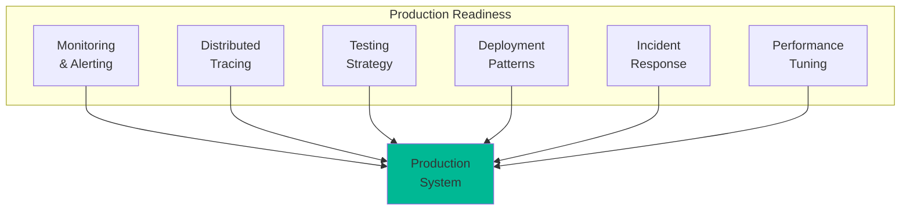
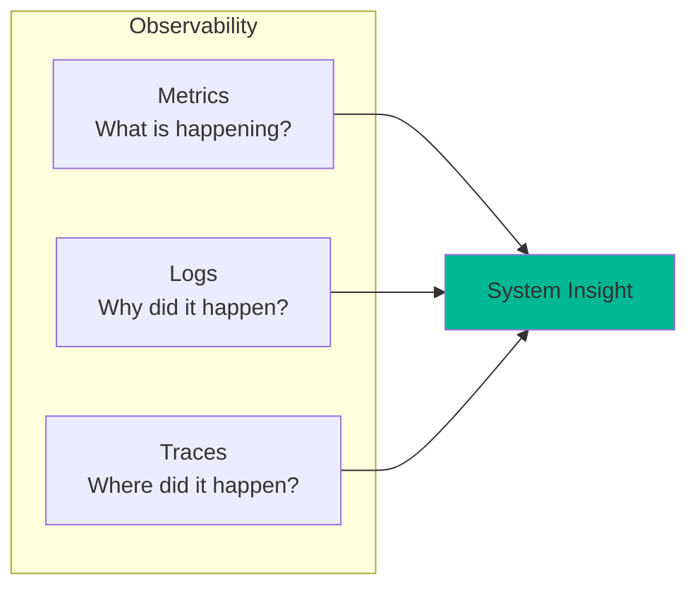
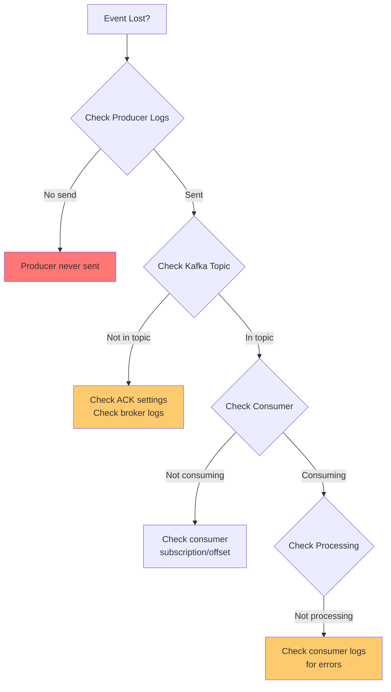
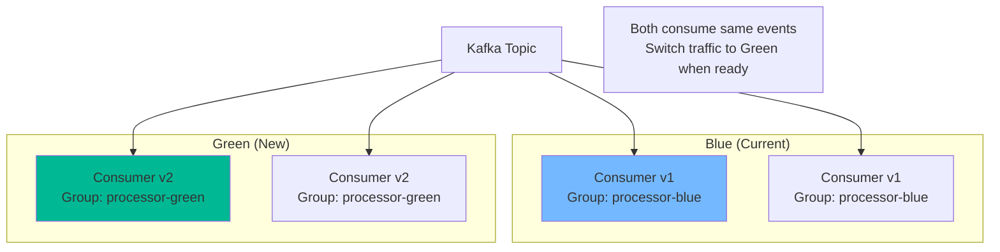

# Part 7: Operating Event-Driven Systems in Production

## Introduction

You've built a sophisticated event-driven system. Now comes the hard part: running it reliably in production. This part covers everything you need to operate event-driven systems at scale.

**What we'll cover:**
- Monitoring and observability
- Debugging distributed systems
- Testing strategies
- Deployment patterns
- Incident response
- Best practices



## Monitoring and Observability

### The Three Pillars



### Key Metrics to Track

**Producer Metrics:**
```python
from prometheus_client import Counter, Histogram, Gauge, start_http_server

# Define metrics
events_produced_total = Counter(
    'events_produced_total',
    'Total events produced',
    ['topic', 'event_type']
)

events_failed_total = Counter(
    'events_failed_total',
    'Total failed event productions',
    ['topic', 'error_type']
)

event_production_duration = Histogram(
    'event_production_duration_seconds',
    'Time to produce event',
    ['topic']
)

kafka_batch_size = Histogram(
    'kafka_batch_size_bytes',
    'Kafka batch size in bytes',
    ['topic']
)

# In producer code
with event_production_duration.labels(topic='orders').time():
    producer.send('orders', event)
    events_produced_total.labels(topic='orders', event_type='OrderPlaced').inc()
```

**Consumer Metrics:**
```python
consumer_lag = Gauge(
    'consumer_lag',
    'Consumer lag in messages',
    ['consumer_group', 'topic', 'partition']
)

events_consumed_total = Counter(
    'events_consumed_total',
    'Total events consumed',
    ['consumer_group', 'topic', 'event_type']
)

event_processing_duration = Histogram(
    'event_processing_duration_seconds',
    'Time to process event',
    ['consumer_group', 'event_type']
)

processing_errors_total = Counter(
    'processing_errors_total',
    'Total processing errors',
    ['consumer_group', 'error_type']
)

rebalances_total = Counter(
    'consumer_rebalances_total',
    'Total consumer rebalances',
    ['consumer_group']
)

# In consumer code
with event_processing_duration.labels(
    consumer_group='order-processor',
    event_type='OrderPlaced'
).time():
    try:
        process_event(event)
        events_consumed_total.labels(
            consumer_group='order-processor',
            topic='orders',
            event_type='OrderPlaced'
        ).inc()
    except Exception as e:
        processing_errors_total.labels(
            consumer_group='order-processor',
            error_type=type(e).__name__
        ).inc()
        raise
```

**Business Metrics:**
```python
orders_placed_total = Counter(
    'orders_placed_total',
    'Total orders placed',
    ['status']
)

order_value = Histogram(
    'order_value_dollars',
    'Order value in dollars',
    buckets=[10, 50, 100, 500, 1000, 5000]
)

saga_duration = Histogram(
    'saga_duration_seconds',
    'Saga execution time',
    ['saga_type', 'status']
)

saga_failures_total = Counter(
    'saga_failures_total',
    'Total saga failures',
    ['saga_type', 'failure_reason']
)
```

### Prometheus Setup

**docker-compose.yml:**
```yaml
prometheus:
  image: prom/prometheus:latest
  ports:
    - "9090:9090"
  volumes:
    - ./prometheus.yml:/etc/prometheus/prometheus.yml
    - prometheus-data:/prometheus
  command:
    - '--config.file=/etc/prometheus/prometheus.yml'

grafana:
  image: grafana/grafana:latest
  ports:
    - "3000:3000"
  volumes:
    - grafana-data:/var/lib/grafana
  environment:
    - GF_SECURITY_ADMIN_PASSWORD=admin
  depends_on:
    - prometheus
```

**prometheus.yml:**
```yaml
global:
  scrape_interval: 15s

scrape_configs:
  - job_name: 'order-service'
    static_configs:
      - targets: ['order-service:8000']
  
  - job_name: 'email-service'
    static_configs:
      - targets: ['email-service:8000']
  
  - job_name: 'kafka'
    static_configs:
      - targets: ['kafka-exporter:9308']
```

### Alert Rules

**alerts.yml:**
```yaml
groups:
  - name: consumer_lag
    interval: 30s
    rules:
      - alert: HighConsumerLag
        expr: consumer_lag > 10000
        for: 5m
        labels:
          severity: warning
        annotations:
          summary: "High consumer lag detected"
          description: "Consumer group {{ $labels.consumer_group }} has lag of {{ $value }} messages"
      
      - alert: CriticalConsumerLag
        expr: consumer_lag > 50000
        for: 2m
        labels:
          severity: critical
        annotations:
          summary: "Critical consumer lag"
          description: "Consumer group {{ $labels.consumer_group }} is severely behind"
  
  - name: processing_errors
    interval: 30s
    rules:
      - alert: HighErrorRate
        expr: rate(processing_errors_total[5m]) > 0.05
        for: 5m
        labels:
          severity: warning
        annotations:
          summary: "High error rate in event processing"
          description: "Error rate is {{ $value }} errors/sec for {{ $labels.consumer_group }}"
  
  - name: saga_failures
    interval: 30s
    rules:
      - alert: SagaFailureSpike
        expr: rate(saga_failures_total[5m]) > 10
        for: 3m
        labels:
          severity: critical
        annotations:
          summary: "Spike in saga failures"
          description: "{{ $labels.saga_type }} failing at {{ $value }}/sec"
  
  - name: kafka_health
    interval: 30s
    rules:
      - alert: UnderReplicatedPartitions
        expr: kafka_server_replicamanager_underreplicatedpartitions > 0
        for: 5m
        labels:
          severity: critical
        annotations:
          summary: "Under-replicated partitions detected"
          description: "{{ $value }} partitions are under-replicated"
      
      - alert: OfflinePartitions
        expr: kafka_controller_kafkacontroller_offlinepartitionscount > 0
        for: 1m
        labels:
          severity: critical
        annotations:
          summary: "Offline partitions detected"
          description: "{{ $value }} partitions are offline"
```

### Grafana Dashboards

**Key Dashboard Panels:**

1. **Consumer Lag Over Time**
```promql
consumer_lag{consumer_group="order-processor"}
```

2. **Event Processing Rate**
```promql
rate(events_consumed_total[5m])
```

3. **Error Rate**
```promql
rate(processing_errors_total[5m]) / rate(events_consumed_total[5m])
```

4. **P95 Processing Latency**
```promql
histogram_quantile(0.95, rate(event_processing_duration_seconds_bucket[5m]))
```

5. **Kafka Throughput**
```promql
rate(kafka_server_brokertopicmetrics_bytesinpersec[5m])
```

## Distributed Tracing

### OpenTelemetry Setup

```python
from opentelemetry import trace
from opentelemetry.sdk.trace import TracerProvider
from opentelemetry.sdk.trace.export import BatchSpanProcessor
from opentelemetry.exporter.jaeger.thrift import JaegerExporter
from opentelemetry.instrumentation.kafka import KafkaInstrumentor

# Initialize tracer
trace.set_tracer_provider(TracerProvider())
tracer = trace.get_tracer(__name__)

# Jaeger exporter
jaeger_exporter = JaegerExporter(
    agent_host_name="localhost",
    agent_port=6831,
)

trace.get_tracer_provider().add_span_processor(
    BatchSpanProcessor(jaeger_exporter)
)

# Auto-instrument Kafka
KafkaInstrumentor().instrument()

# Producer with tracing
def produce_order_event(order):
    with tracer.start_as_current_span("produce_order_event") as span:
        span.set_attribute("order.id", order.order_id)
        span.set_attribute("order.amount", order.total_amount)
        span.set_attribute("order.customer_id", order.customer_id)
        
        # Add correlation ID to event
        correlation_id = span.get_span_context().trace_id
        
        event = {
            'event_id': str(uuid.uuid4()),
            'correlation_id': str(correlation_id),
            'order_id': order.order_id,
            # ... rest of event
        }
        
        producer.send('orders', value=event)
        span.add_event("Event published to Kafka")

# Consumer with tracing
def consume_events():
    for message in consumer:
        event = message.value
        correlation_id = event.get('correlation_id')
        
        # Continue trace from correlation ID
        with tracer.start_as_current_span(
            "process_order_event",
            links=[trace.Link(trace.SpanContext(
                trace_id=int(correlation_id),
                span_id=0,
                is_remote=True,
                trace_flags=trace.TraceFlags(0x01)
            ))]
        ) as span:
            span.set_attribute("event.type", event['event_type'])
            span.set_attribute("order.id", event['order_id'])
            
            try:
                process_order(event)
                span.set_status(trace.Status(trace.StatusCode.OK))
            except Exception as e:
                span.set_status(trace.Status(
                    trace.StatusCode.ERROR,
                    str(e)
                ))
                span.record_exception(e)
                raise
```

### Correlation IDs

```python
import uuid
from contextvars import ContextVar

# Thread-safe correlation ID storage
correlation_id_ctx = ContextVar('correlation_id', default=None)

class CorrelationMiddleware:
    """Flask middleware for correlation IDs"""
    
    def __init__(self, app):
        self.app = app
        app.before_request(self.before_request)
        app.after_request(self.after_request)
    
    def before_request(self):
        # Get correlation ID from header or generate new one
        correlation_id = request.headers.get('X-Correlation-ID', str(uuid.uuid4()))
        correlation_id_ctx.set(correlation_id)
    
    def after_request(self, response):
        # Add correlation ID to response
        correlation_id = correlation_id_ctx.get()
        response.headers['X-Correlation-ID'] = correlation_id
        return response

# Structured logging with correlation ID
import logging
import json

class CorrelationFormatter(logging.Formatter):
    def format(self, record):
        correlation_id = correlation_id_ctx.get()
        
        log_data = {
            'timestamp': self.formatTime(record),
            'level': record.levelname,
            'logger': record.name,
            'message': record.getMessage(),
            'correlation_id': correlation_id
        }
        
        if record.exc_info:
            log_data['exception'] = self.formatException(record.exc_info)
        
        return json.dumps(log_data)

# Use in producer
def produce_event(event_data):
    correlation_id = correlation_id_ctx.get() or str(uuid.uuid4())
    
    event = {
        'correlation_id': correlation_id,
        'event_id': str(uuid.uuid4()),
        **event_data
    }
    
    logger.info(f"Publishing event", extra={
        'event_type': event['event_type'],
        'event_id': event['event_id']
    })
    
    producer.send('orders', value=event)
```

## Debugging Distributed Systems

### Common Issues and Solutions

**Issue 1: Event Lost**



**Debug script:**
```python
def debug_lost_event(event_id):
    """Debug where an event went"""
    
    print(f"🔍 Debugging event: {event_id}")
    
    # 1. Check producer logs
    producer_logs = search_logs('order-service', event_id)
    if not producer_logs:
        print("❌ Event never produced")
        return
    print("✅ Event was produced")
    
    # 2. Check Kafka topic
    found_in_kafka = search_kafka_topic('orders', event_id)
    if not found_in_kafka:
        print("❌ Event not in Kafka - check producer ACK settings")
        print("   Broker logs:", get_broker_logs(time_range=producer_logs['timestamp']))
        return
    print(f"✅ Event in Kafka at offset {found_in_kafka['offset']}")
    
    # 3. Check consumer offset
    consumer_offset = get_consumer_offset('email-service', 'orders', found_in_kafka['partition'])
    if consumer_offset < found_in_kafka['offset']:
        print(f"⚠️  Consumer hasn't reached this offset yet (lag: {found_in_kafka['offset'] - consumer_offset})")
        return
    print("✅ Consumer should have processed this event")
    
    # 4. Check consumer logs
    consumer_logs = search_logs('email-service', event_id)
    if not consumer_logs:
        print("❌ Consumer didn't process event - check for errors")
        print("   Recent errors:", get_consumer_errors('email-service'))
        return
    print("✅ Consumer processed event")
```

**Issue 2: High Consumer Lag**

```python
def diagnose_consumer_lag(consumer_group, topic):
    """Diagnose why consumer is lagging"""
    
    lag_info = get_consumer_lag(consumer_group, topic)
    
    print(f"📊 Consumer Lag Analysis for {consumer_group}")
    print(f"Total Lag: {lag_info['total_lag']} messages")
    print(f"Partitions: {lag_info['partition_count']}")
    print(f"Consumers: {lag_info['consumer_count']}")
    
    # Check 1: Not enough consumers?
    if lag_info['consumer_count'] < lag_info['partition_count']:
        print(f"⚠️  Only {lag_info['consumer_count']} consumers for {lag_info['partition_count']} partitions")
        print("   Recommendation: Add more consumers")
    
    # Check 2: Slow processing?
    processing_time = get_avg_processing_time(consumer_group)
    if processing_time > 1.0:  # More than 1 second
        print(f"⚠️  Slow processing: {processing_time:.2f}s average")
        print("   Recommendations:")
        print("   - Optimize processing logic")
        print("   - Add parallelism")
        print("   - Check external dependencies")
    
    # Check 3: Frequent rebalancing?
    rebalance_count = get_rebalance_count(consumer_group, hours=1)
    if rebalance_count > 5:
        print(f"⚠️  Frequent rebalancing: {rebalance_count} times in last hour")
        print("   Check:")
        print("   - session.timeout.ms")
        print("   - max.poll.interval.ms")
        print("   - Consumer stability")
    
    # Check 4: Production rate spike?
    production_rate = get_production_rate(topic, minutes=5)
    consumption_rate = get_consumption_rate(consumer_group, topic, minutes=5)
    
    if production_rate > consumption_rate * 1.5:
        print(f"⚠️  Production outpacing consumption")
        print(f"   Production: {production_rate:.0f} msgs/sec")
        print(f"   Consumption: {consumption_rate:.0f} msgs/sec")
        print("   Recommendation: Scale consumers")
```

**Issue 3: Out-of-Order Events**

```python
def detect_ordering_issues(topic, partition, count=100):
    """Detect out-of-order events"""
    
    messages = consume_recent_messages(topic, partition, count)
    
    # Check ordering by timestamp
    timestamps = [msg.value['timestamp'] for msg in messages]
    
    out_of_order = []
    for i in range(1, len(timestamps)):
        if timestamps[i] < timestamps[i-1]:
            out_of_order.append({
                'offset': messages[i].offset,
                'timestamp': timestamps[i],
                'previous_timestamp': timestamps[i-1]
            })
    
    if out_of_order:
        print(f"❌ Found {len(out_of_order)} out-of-order events")
        print("Causes:")
        print("- Events sent to different partitions")
        print("- Clock skew between producers")
        print("- Events sent without keys (round-robin distribution)")
        print("\nFix:")
        print("- Use consistent keys for related events")
        print("- Ensure related events go to same partition")
    else:
        print("✅ No ordering issues detected")
```

## Testing Strategies

### Unit Testing

```python
import pytest
from unittest.mock import Mock, patch

def test_order_command_handler():
    # Arrange
    mock_repository = Mock()
    mock_event_bus = Mock()
    handler = OrderCommandHandler(mock_repository, mock_event_bus)
    
    command = PlaceOrderCommand(
        customer_id='CUST-123',
        items=[{'product_id': 'PROD-001', 'quantity': 2, 'price': 29.99}],
        shipping_address={'street': '123 Main St'}
    )
    
    # Act
    order_id = handler.handle_place_order(command)
    
    # Assert
    assert order_id is not None
    mock_repository.save.assert_called_once()
    mock_event_bus.publish.assert_called()
    
    # Verify event content
    published_event = mock_event_bus.publish.call_args[0][1]
    assert published_event.order_id == order_id
    assert published_event.customer_id == 'CUST-123'

def test_event_projection():
    # Arrange
    projection = OrderListProjection()
    event = {
        'event_type': 'OrderPlaced',
        'order_id': 'ORD-123',
        'customer_id': 'CUST-456',
        'total_amount': 99.99
    }
    
    # Act
    projection.handle_order_placed(event)
    
    # Assert
    order = projection.db.find_one({'order_id': 'ORD-123'})
    assert order is not None
    assert order['customer_id'] == 'CUST-456'
    assert order['total_amount'] == 99.99
```

### Integration Testing

```python
from testcontainers.kafka import KafkaContainer
import pytest

@pytest.fixture(scope='module')
def kafka_container():
    with KafkaContainer() as kafka:
        yield kafka

def test_end_to_end_flow(kafka_container):
    # Setup
    bootstrap_servers = kafka_container.get_bootstrap_server()
    
    producer = KafkaProducer(bootstrap_servers=bootstrap_servers)
    consumer = KafkaConsumer(
        'test-topic',
        bootstrap_servers=bootstrap_servers,
        auto_offset_reset='earliest',
        consumer_timeout_ms=5000
    )
    
    # Produce event
    event = {'order_id': 'ORD-123', 'amount': 99.99}
    producer.send('test-topic', value=json.dumps(event).encode())
    producer.flush()
    
    # Consume and verify
    messages = list(consumer)
    assert len(messages) == 1
    
    received_event = json.loads(messages[0].value.decode())
    assert received_event['order_id'] == 'ORD-123'
```

### Contract Testing

```python
from pact import Consumer, Provider, Like

def test_order_placed_event_contract():
    """Define expected event structure"""
    pact = Consumer('email-service').has_pact_with(Provider('order-service'))
    
    expected_event = {
        'event_type': 'OrderPlaced',
        'event_id': Like('evt_123'),
        'order_id': Like('ORD-123'),
        'customer_id': Like('CUST-456'),
        'customer_email': Like('customer@example.com'),
        'total_amount': Like(99.99),
        'items': [
            {
                'product_id': Like('PROD-001'),
                'quantity': Like(2),
                'price': Like(29.99)
            }
        ]
    }
    
    # Verify producer creates compatible events
    # Verify consumer can handle events
```

### Chaos Testing

```python
import random
import time
from chaos import kill_random_broker, inject_network_delay

def test_resilience_to_broker_failure():
    """Test system handles broker failures"""
    
    # Start normal operation
    start_producing_events()
    start_consuming_events()
    
    # Kill random broker
    killed_broker = kill_random_broker()
    print(f"Killed broker: {killed_broker}")
    
    # System should continue with remaining brokers
    time.sleep(30)
    
    # Verify events still flowing
    assert get_production_rate() > 0
    assert get_consumption_rate() > 0
    
    # Verify no data loss
    assert get_consumer_lag() < 1000

def test_slow_consumer():
    """Test system handles slow consumers"""
    
    # Inject processing delay
    with inject_processing_delay(seconds=5):
        produce_events(count=1000)
        
        # Consumer lag should increase
        time.sleep(10)
        assert get_consumer_lag() > 500
        
        # Alert should trigger
        assert check_alert_fired('HighConsumerLag')
    
    # After delay removed, should catch up
    time.sleep(60)
    assert get_consumer_lag() < 100
```

## Deployment Strategies

### Blue-Green Deployment



**Process:**
```bash
# 1. Deploy new version (green)
kubectl apply -f consumer-v2-deployment.yml

# 2. Monitor green deployment
kubectl logs -f deployment/consumer-v2

# 3. Verify processing
curl http://consumer-v2/health
curl http://consumer-v2/metrics

# 4. Compare metrics blue vs green
# If green looks good...

# 5. Stop blue deployment
kubectl scale deployment/consumer-v1 --replicas=0

# 6. Monitor for issues
# If issues: kubectl scale deployment/consumer-v1 --replicas=3
```

### Canary Deployment

```python
# Route small percentage to new version
class CanaryRouter:
    def __init__(self, canary_percentage=10):
        self.canary_percentage = canary_percentage
    
    def get_consumer_group(self, message):
        """Route message to canary or stable group"""
        
        # Hash message key for consistent routing
        key_hash = hash(message.key) % 100
        
        if key_hash < self.canary_percentage:
            return 'processor-canary'
        else:
            return 'processor-stable'

# Gradually increase canary percentage
# 5% -> 10% -> 25% -> 50% -> 100%
```

### Schema Evolution Deployment

```bash
# Step 1: Deploy consumers that handle both old and new schemas
kubectl apply -f consumer-v2-backward-compatible.yml

# Step 2: Wait for all consumers to update
kubectl rollout status deployment/consumer-v2

# Step 3: Deploy producers with new schema
kubectl apply -f producer-v2.yml

# Step 4: Monitor for schema errors
kubectl logs -f deployment/consumer-v2 | grep "schema error"

# Step 5: Remove old schema handling (later)
# After confirming all events use new schema
```

## Incident Response

### Runbook: High Consumer Lag

```markdown
# Runbook: High Consumer Lag Alert

## Symptoms
- Alert: HighConsumerLag
- Consumer group falling behind
- Increasing lag metric

## Impact
- Events processed with delay
- Real-time features degraded
- Potential data loss if retention expires

## Investigation Steps

1. Check current lag:
   ```bash
   kafka-consumer-groups --bootstrap-server localhost:9092 \
     --group order-processor --describe
   ```

2. Check consumer health:
   ```bash
   kubectl get pods -l app=order-processor
   kubectl logs -l app=order-processor --tail=100
   ```

3. Check processing time:
   ```promql
   rate(event_processing_duration_seconds_sum[5m]) / 
   rate(event_processing_duration_seconds_count[5m])
   ```

4. Check rebalancing:
   ```promql
   rate(consumer_rebalances_total[5m])
   ```

## Resolution

### If: Not enough consumers
```bash
kubectl scale deployment/order-processor --replicas=6
```

### If: Slow processing
- Check external dependencies (database, APIs)
- Look for slow queries
- Consider adding caching

### If: Frequent rebalancing
- Increase session timeout
- Increase max poll interval
- Fix consumer stability issues

### If: Production spike
- Temporary: Pause non-critical consumers
- Long-term: Scale consumers permanently

## Prevention
- Set up auto-scaling based on lag
- Monitor processing time trends
- Load test regularly
```

### Runbook: Event Loss

```markdown
# Runbook: Suspected Event Loss

## Symptoms
- Expected event never processed
- Missing data in read models
- Customer reports missing notification

## Investigation

1. Get event details from user:
   - Order ID / Entity ID
   - Expected event type
   - Timestamp

2. Check producer logs:
   ```bash
   kubectl logs -l app=order-service --since=2h | grep "ORDER-123"
   ```

3. Search Kafka topic:
   ```bash
   kafka-console-consumer --bootstrap-server localhost:9092 \
     --topic orders --from-beginning | grep "ORDER-123"
   ```

4. Check consumer offset:
   ```bash
   kafka-consumer-groups --bootstrap-server localhost:9092 \
     --group email-service --describe
   ```

5. Check consumer logs:
   ```bash
   kubectl logs -l app=email-service --since=2h | grep "ORDER-123"
   ```

## Resolution

### If: Event never produced
- Check producer errors
- Verify outbox table
- Check database transaction logs

### If: Event in Kafka but not consumed
- Check consumer offset
- Look for processing errors
- Check dead letter queue

### If: Event processed but failed
- Retry from DLQ
- Manual intervention if needed

## Prevention
- Enable idempotent producer
- Use outbox pattern
- Monitor producer success rate
- Alert on processing errors
```

## Best Practices Checklist

### Development
- ✅ Use correlation IDs for tracing
- ✅ Implement idempotent consumers
- ✅ Use outbox pattern for atomic writes
- ✅ Version all events
- ✅ Make events self-contained
- ✅ Use meaningful event names (past tense)

### Operations
- ✅ Monitor consumer lag
- ✅ Alert on high error rates
- ✅ Track end-to-end latency
- ✅ Set up distributed tracing
- ✅ Implement health checks
- ✅ Use circuit breakers for external calls

### Reliability
- ✅ Enable producer idempotence
- ✅ Use appropriate ACK level (acks=all)
- ✅ Set proper replication factor (3+)
- ✅ Configure retry policies
- ✅ Implement dead letter queues
- ✅ Regular backup and disaster recovery tests

### Performance
- ✅ Tune batch sizes
- ✅ Enable compression
- ✅ Use appropriate partition count
- ✅ Monitor and optimize processing time
- ✅ Scale consumers based on lag
- ✅ Use connection pooling

### Security
- ✅ Enable SSL/TLS
- ✅ Implement authentication (SASL)
- ✅ Set up ACLs
- ✅ Encrypt sensitive data
- ✅ Regular security audits
- ✅ Rotate credentials

## Capacity Planning

```python
def calculate_capacity_requirements(
    messages_per_day,
    avg_message_size_kb,
    retention_days,
    replication_factor=3
):
    """Calculate Kafka cluster capacity needs"""
    
    # Daily throughput
    daily_data_gb = (messages_per_day * avg_message_size_kb) / (1024 * 1024)
    
    # Storage needed
    storage_gb = daily_data_gb * retention_days * replication_factor
    
    # Add 20% buffer
    storage_gb *= 1.2
    
    # Peak throughput (assume 10x average for peak hour)
    peak_msgs_per_sec = (messages_per_day / 86400) * 10
    peak_mb_per_sec = (peak_msgs_per_sec * avg_message_size_kb) / 1024
    
    # Partitions needed (assume 10MB/sec per partition)
    partitions_needed = int(peak_mb_per_sec / 10) + 1
    
    # Brokers needed (for redundancy and load distribution)
    brokers_needed = max(replication_factor, partitions_needed // 3)
    
    print(f"📊 Capacity Requirements")
    print(f"Daily Data: {daily_data_gb:.2f} GB")
    print(f"Storage Needed: {storage_gb:.2f} GB")
    print(f"Peak Throughput: {peak_mb_per_sec:.2f} MB/sec")
    print(f"Recommended Partitions: {partitions_needed}")
    print(f"Recommended Brokers: {brokers_needed}")
    
    return {
        'storage_gb': storage_gb,
        'partitions': partitions_needed,
        'brokers': brokers_needed
    }

# Example
calculate_capacity_requirements(
    messages_per_day=10_000_000,  # 10M messages/day
    avg_message_size_kb=5,         # 5KB per message
    retention_days=7,              # 1 week retention
    replication_factor=3
)
```

## Key Takeaways

✅ **Monitor Everything** - Metrics, logs, traces  
✅ **Debug Systematically** - Follow the data flow  
✅ **Test Comprehensively** - Unit, integration, chaos  
✅ **Deploy Safely** - Blue-green, canary, gradual rollout  
✅ **Respond Quickly** - Clear runbooks, practiced procedures  
✅ **Plan Capacity** - Know your limits before hitting them  

## Conclusion

You now have everything needed to build and operate production event-driven systems:

**Parts 1-3:** Fundamentals, patterns, and Kafka basics  
**Part 4:** Hands-on implementation  
**Part 5:** Advanced Kafka features  
**Part 6:** Advanced architectural patterns  
**Part 7:** Production operations  

**You're ready to build scalable, reliable, event-driven systems!** 🚀

Remember:
- Start simple, add complexity as needed
- Monitor from day one
- Test failure scenarios
- Document everything
- Learn from incidents

Good luck with your event-driven journey!
